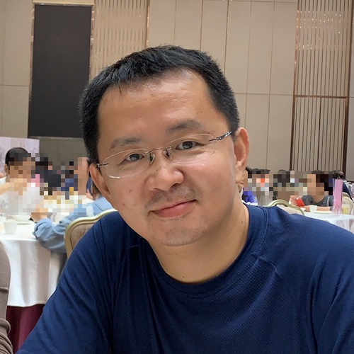
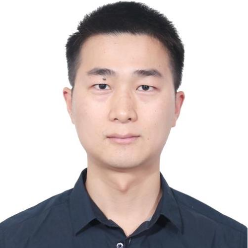
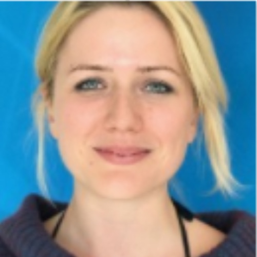
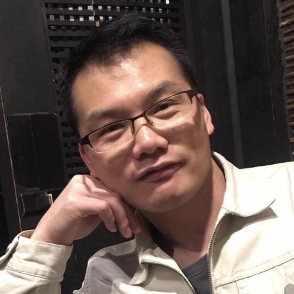
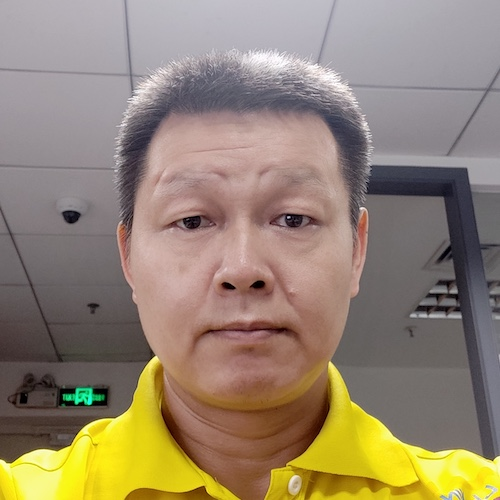

# Author Intro
## The path of image should be included "files/Author/"
## 以下是各个作者的简介，为了方便预览这里没有添加 files/Author路径 

# The Author of the Article
<table border="1">
  <tr>
    <th></th>
    <th>Mark Ding, IoT Developer live in Shenzhen. He is extremely interested on how to deliver the complicate knowledge to IoT developer in a simple way.  He and his partners seutp the TorchIoTBootCamp group, contributed a large amount of articles and video courses of Zigbee, Bluetooth, Z-Wave, Wireless hardware on GitHub,Zhihu, Bilibili and YouTube</th>
  </tr>
</table>

# 本篇作者
<table border="1">
  <tr>
    <th></th>
    <th> Mark Ding，现居住在深圳的物联网开发者。 他对于如何把复杂的技术问题通过简单的方式传递给物联网开发者充满浓厚的兴趣。他和他的小伙伴们建立了TorchIoTBootCamp小组，贡献了大量关于Zigbee, Bluetooth, Z-Wave, 无线硬件等文章和培训课程视频，发表到GitHub，Zhihu，Bilibili网站。</th>
  </tr>
</table>

# 本篇作者
<table border="1">
  <tr>
    <th></th>
    <th> Cheng Yuan，物联网领域从业人员。目前主要关注于低功耗蓝牙，蓝牙mesh网络，蓝牙定位技术在IoT领域的应用，同时对于MCU, Zigbee等也有少量的涉猎。作为TorchIoTBootCamp小组成员之一，不断致力于IoT相关知识的分享，以让更多人了解IoT。</th>
  </tr>
</table>

# 本篇作者
<table border="1">
  <tr>
    <th></th>
    <th> Victor Hu，物联网半导体技术工程师。专注于物联网智能家居领域，熟悉市场主流的物联网无线协议，包括BLE ，Zigbee，Wi-Fi，Z-Wave等。</th>
  </tr>
</table>

# 本篇作者
<table border="1">
  <tr>
    <th></th>
    <th> Jessica Zheng，物联网应用工程师，2020年毕业于南特大学综合理工学院，同年加入Silicon Labs，专注于物联网技术中的BLE和Z-Wave协议，对行业动态与最新技术充满兴趣。在业余时间，Jessica喜欢看电影，跑步和打篮球。</th>
  </tr>
</table>

# 本篇作者
<table border="1">
  <tr>
    <th></th>
    <th> Andrea Nagy，现居住于布达佩斯的物联网硬件应用工程师，Andrea还在工作之余到大学里教授无线通讯课程。</th>
  </tr>
</table>

# 本篇作者
<table border="1">
  <tr>
    <th></th>
    <th> Eric Su，现居住于深圳的物联网应用工程师，专注IoT领域多年，熟悉蓝牙与subG私有协议。</th>
  </tr>
</table>

# 本篇作者
<table border="1">
  <tr>
    <th></th>
    <th> Jun Fan，现居住于深圳的物联网硬件应用工程师，在无线通讯领域耕耘近20年，业内人士都称他为范大哥。</th>
  </tr>
</table>

# 本篇作者
<table border="1">
  <tr>
    <th></th>
    <th> Patrik Toth，现居住于布达佩斯的物联网应用工程师，专注于Zigbee无线协议，对BLE和Z-Wave都有涉猎。</th>
  </tr>
</table>