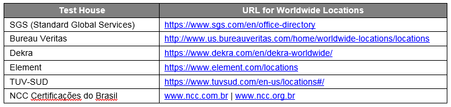
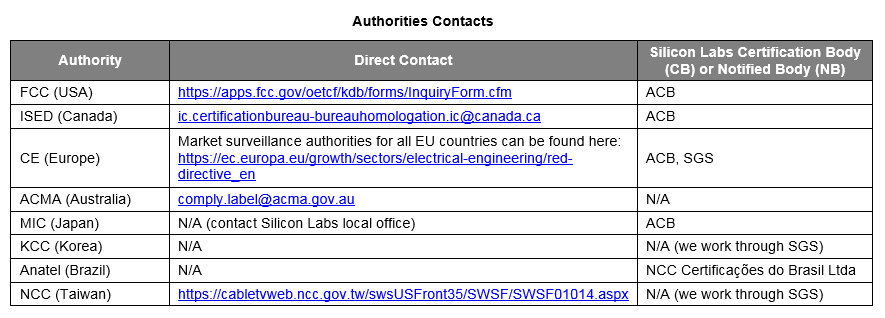
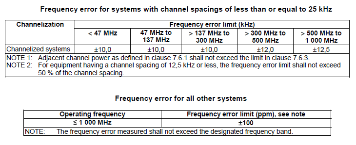
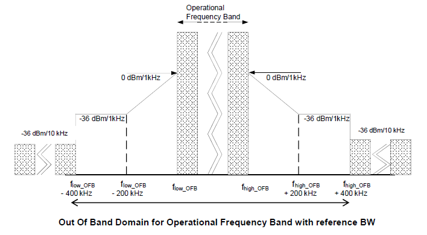
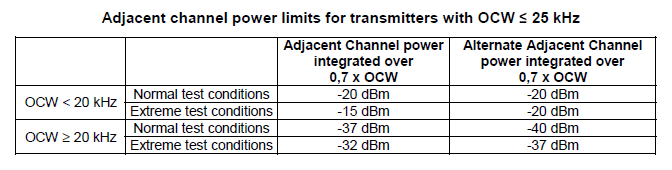
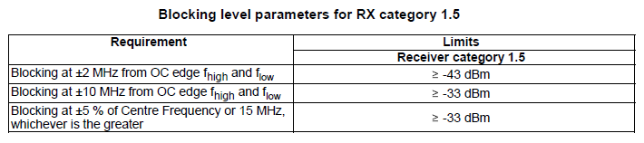
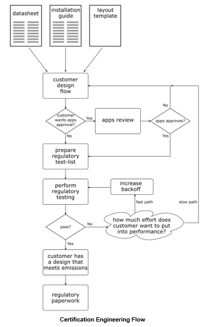
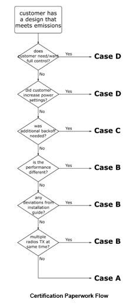
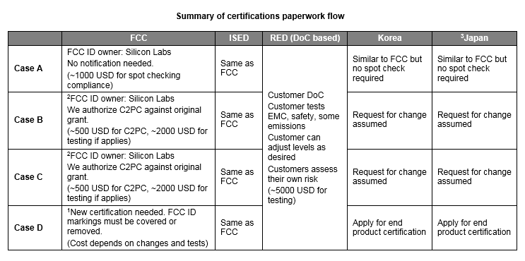

Table of Contents 

- [1. Introduction](#1-introduction)
- [2. Typical regulatory certification regions](#2-Typical-regulatory-certification-regions)
- [3. Key region regulatories introduction](#3-Key-region-regulatories-introduction)
  - [3.1 FCC Regulation](#31-FCC-Regulation)
  - [3.2 CE Regulation](#32-CE-Regulation)
- [4. Basic RF test items and limits for complying the regulations](#4-Basic-RF-test-items-and-limits-for-complying-the-regulations)
  - [4.1 FCC requirements in Sub-GHz bands](#41-FCC-requirements-in-Sub-GHz-bands)
  - [4.2 FCC requirements in 2.4GHz band](#42-FCC-requirements-in-2.4GHz-band)
  - [4.3 CE requirements in Sub-GHz bands](#43-CE-requirements-in-Sub-GHz-bands)
  - [4.4 CE requirements in 2.4GHz band](#44-CE-requirements-in-2.4GHz-band)
- [5. Customer regulatory cerfitication flow](#5-Customer-regulatory-cerfitication-flow)
  - [5.1 Silabs provides documents for certification](#51-Silabs-provides-documents-for-certification)
  - [5.2 Process flow in certifications](#52-Process-flow-in-certifications)
  - [5.3 Engineering flow](#53-Engineering-flow)
  - [5.4 Paperwork flow](#54-Paperwork-flow)

# 1. Introduction
After the customer finishes the product design, it should consider how to test the product and let it comply to the RF regulations. RF conducted or Radiated measurements should pass the regulation limits or requirements for product intended to be sold in regions. It is called complying to the regulations or certifications. The regulations depend on different regions or countries. There are chips/modules, Sub-GHz/2.4GHz solutions in Silabs' production catalog, and there are many protocols related product such as proprietary,Zigbee/thread,BLE, and Z-Wave should be classified. Thus the detail regulatory certifications maybe different from application to application and from country to country. 

# 2. Typical regulatory certification regions
Silabs has many products such as chips, SiP modules, and PCB modules. And the products support main sub-GHz bands(169MHz,434MHz,868MHz and 915MHz) and 2.4GHz frequenc band. These different products and frequency bands almost comply to regulations from any region in the world. There are many region regulations such as [CE](http://ec.europa.eu/growth/sectors/electrical-engineering/red-directive_fi) (Europe), [FCC](https://www.fcc.gov/)(USA), [ISED](https://www.canada.ca/en/innovation-science-economic-development.html)(Canada), [MIC](http://www.soumu.go.jp/english/)(Japan), [KC](http://eng.kcc.go.kr/user/ehpMain.do)(South Korea) and other regions. 

And there are some test houses provide certification service for the regions as following:

For the certification activeties, you can directly contact the region Authorities:

In the following introduction, it will mainly focus on EC and FCC regulations. For Other region regulatory certifications, please check [AN1048](https://www.silabs.com/documents/public/application-notes/an1048-regulatory-certifications.pdf) for more details.
Though there are RF, EMC and Safety separate categories to be certified.  RF certification is mainly introduced here.

# 3. Key region regulatories introduction
In this chapter, it will introduces FCC and CE regulations for both sub-GHz and 2.4GHz frequency bands. 
  
  ## 3.1. FCC Regulation 

   FCC radio certification includes the standards such as intentional radiators 47 CFR FCC Part 15C and Unintentional radiators 47 CFR FCC Part 15B. And it can certificates an end product or radio module. For certificating modules, it includes limit modular approval(LMA) and full modular approval(FMA).
   - FMA
     
     FMA is defined as: a completely self-contained RF transmitter that is missing only an input signal and power source to make it functional. It can be used in any host, its compliance is ensured independent of the host board typically. A full modular needs to meet all 8 criteria sets below: 
     - 1. Transmitter / RF portion must have its own metallic shield.
     - 2. Buffered data input.
     - 3. Own power supply regulation.
     - 4. Embedded antenna or unique antenna coupler (RF pin is a unique antenna coupler).
     - 5. Module tested in a stand-alone configuration.
     - 6. FCC ID label.
     - 7. Must comply with all applicable rules applicable to the transmitter.
     - 8. Must comply with any applicable RF   exposure requirements.

     FMA is tested in standalone configuration. Full module integrator must follow module’s grant limitations.Full module integrator can use the module without additional testing or permissive changes provided that the restrictions listed in the FCC grant (e.g. co-location or RF exposure) are not a problem with the new host. However it requires the installation guide. For more information, please visit the following [KDB 996369]( https://apps.fcc.gov/oetcf/kdb/forms/AdvancedExternalSearch.cfm)

   - LMA
     
     Limit module doesn't meet all 8 criteria sets above for a full module. And it should be used in a known host or known environment. For a licensed limited module, the manufacturer must state how control of the end product into which the module will be installed. It will be maintained that full compliance of the end product is always assured. LMA is not tested as standalone, but instead it will be tested inside a specific host. The certification is valid only for the specific host.

     If the host or end environment is known, Limited Modular Approval may be possible:
     - Limited to application.
     - Limited to host.
     - Limited to installer (typically Grantee or partner).

   - Permissive Changes

     It describes the modifications that may be made to an RF device without new authorization.

     - Class 1 Permissive Change (C1PC);
       - Changes that do not increase emissions or change RF characteristics. 
       - Modifications which do not degrade the characteristics reported.  
       - Does not need application to FCC, i.e. no filing to FCC is required. 
     Typical C1PC changes: equivalent antenna change or small BOM change.
     - Class 2 Permissive Change (C2PC); 
       - Changes that increase emissions or any changes to remove particular restrictions mentioned in the grant. 
       - Includes those modifications which degrade the performance characteristics as reported however still meet the minimum requirements of the applicable rules.
       - Official test report required, must be filed with FCC. 
       Silicon Labs will provide an authorization letter so that the customer can apply for the C2PC on behalf of Silicon Labs. Typical C2PC changes: antenna change with higher gain, antenna type change, co-location of radios, small RF layout changes that result in an electrically equivalent device (can be confirmed by FCC).
     - Class 3 Permissive Change  (C3PC);
       - Includes modifications to the software of a software defined radio transmitter that change the frequency range, modulation type or maximum output power(either radiated or conducted) outside the parameters previously ap-proved, or that change the circumstances under which the transmitter operates in accordance with FCC rules

   - New FCC ID and a new equipment authorization application to the FCC required for the following changes:
     - Frequency multiplication stages;
     - Basic modulator circuit;
     - Maximum power or field strength ratings;
     - Modifications to the RF path / layout that result in a non-electrically equivalent device will require completely new certification. particular change can be confirmed by FCC by submitting a ticket here: https://apps.fcc.gov/oetcf/kdb/forms/InquiryForm.cfm to check what change can be considered as electrically equivalent and thus approved under C2PC;
     - Basic frequency determining and stabilizing circuitry (including clock and data rates);
     - Changes described in Section 2.1043(a) that result in a non-electrically equivalent device;
     - Different internal active hardware components (e.g. amplifiers and crystals) that result in different radio parameters (e.g. output power, frequency);
     - Adding or subtracting an on-board amplifier component;
     - Depopulated versions of a transmitter require authorization under separate FCC IDs for each version;
     - Minor circuitry for non-transmitter portions (such as receiver or peripheral circuits) can be depopulated, and may be ap-proved under one FCC ID.

 ## 3.2 CE Regulation
 Unlike FCC, CE is a “self-declaration” and not a certification. Since there is no certification, there is no modular approval / certification either. CE requires a declaration from the manufacturer that the products meet the requirements of the R&TTE or [RED](https://ec.europa.eu/docsroom/documents/23321/attachments/1/translations/en/renditions/native) directive. 
 - A module manufacturer is responsible that the module is compliant and the end product manufacturer is responsible that the end product is compliant.Test reports of Silicon Labs modules are available and show compliance, but any end product needs its own evidence;
 - The manufacturer of the end product (OEM) is responsible for the product being compliant.Silicon Labs strongly recommends to the OEM to perform radiated testing on the end product. The conducted test results can be inherited from Silicon Labs modules’ test reports. Typically, test evidence (reports) must be presented Optionally, NB (Notified Body) opinion can be asked as a formal “certificate”; 
 - A product is tested according to harmonized standards: A harmonized standard is a European standard developed by a recognized European Standards Organization: CEN, CENELEC, or ETSI. It is created following a request from the European Commission to one of these organizations. Manufacturers, other economic operators, or conformity assessment bodies can use harmonized standards to demonstrate that products, services, or processes comply with relevant EU legislation.
 There are RF, EMC, and Safety relevant standards for radio products. All harmonized standards with status [information](https://portal.etsi.org/webapp/WorkProgram/Frame_WorkItemList.asp?qSORT=DIRECTIVES&qHARMONIZED=True&butPredefined=Search&qDIRECTIVE=2014%2F53%2FEU&optDisplay=ALL&butHarmonized=Search);
 - If harmonized standards are not followed, it is mandatory to use Notified Body;
 - Manufacturer can use Notified Body also just to get more confidence about the compliance;
 - Manufacturer maintains Technical Construction File (TCF)
   - Test reports
   - Description of the device (schematic, layout, BOM, photos, etc.)
   - DoC
   - NB opinion letter (if applied)
 
# 4. Basic RF test items and limits for complying the regulations 
Allthough there are RF, EMC and Safety categories need to be certified for regional regulations. It only cares about the RF category in this chapter. And Silabs has SoCs,SiP,and PCB module products, the certification procedure or items are different among them. In this chapter, it only describes the test items and limits base on the end product with SoCs. For end products with SiP/PCB-Module, the finnal test items maybe reduced due to pre-certificated SiP/PCB-Module as described in previous section. As Silabs' products contain sub-G frequency bands and 2.4GHz bands, it will introduce the test items and limits seperately in frequency bands due to the difference regulation requirements.
## 4.1. FCC requirements in Sub-GHz bands
Silabs' products can be mainly applied to FCC-Part-15.231 and FCC-Part-15.247 regulations for sub-G bands. It regulates 260~470MHz frequency band in Part-15.231, and 902~928MHz frequency band in Part-15.247.
- Part-15.231
  Typical applications are Door openers, Alarm systems, Remote Switches, and Control links in this regulation. There are severy typical frequency bands as 315MHz, 433MHz, and 470MHz.
  - Tx power limits
    The power limits are listed in field strength(dBuV/m) in 3 meters distance. The power is measured with average detector, and it means that the maxium power can be relaxed by using duty-cycle-factor(DCF).And it limits vary as a function of frequency: 3,750 uV/m at 260 MHz, to 12,500 uV/m at 470 MHz. And these field strength can be converted into dBm(in EIRP):
    - -19.6 dBm at 315 MHz
    - -14.4 dBm at 433 MHz
    - -13.3 dBm at 470 MHz

  - Tx bandwidth requirement

    The 20dB emission bandwidth should be no wider than 0.25% of the center operation frequency.

  - Spurs emission limits
    General requirement is very loose in this part, the limit is -20dBc everywhere. But for the spurs lie in restrict bands defined in Part-15.205, the spurs including harmonics will be less than -49dBm for frequency < 960MHz, and be less than -41dBm for frequency >960MHz.
    Since the fundamental power is very low, the harmonics limits can be achieved very easy by only adding a 3-order low pass filter in the RF path.

  - Rx requirements
    
    No sensitivity requirement. But the limits for harmonics or spurs in a restricted band is defined in “FCC Part 15.109 Unintentional Radiators” as following:
    - Spurious falls below 960 MHz = -49.2 dBm EIRP (max) (15.209.a);
    - Spurious falls above 960 MHz = -41.2 dBm EIRP (max) (15.209.a).

- Part-15.247
  Typical applications are Weather station reporting, Automatic meter reading, and long range communication in this part. It covers wide bandwidth applications in 902~928MHz frequency band:
  a)Frequency Hopping Spread Spectrum (FHSS);
  b)Wideband digital modulation (BWMOD_6dB > 500 kHz);
  c)Direct Sequence Spread Spectrum; 

  - Tx power limits
    Since it is a wide band appliction in this regulation. The maximum output power can be high since the band "spread out" effection. The fundamental output power should be a Peak measurement.
     - Wideband digital modulation → 1 watt (+30 dBm) max;
     - FHSS (> 50 hopping channels) → 1 watt (+30 dBm) max;
     - FHSS (> 25 hopping channels) → 0.25 watt (+24 dBm) max.

  - Tx bandwidth requirement
     For FHSS operation system, the maximum allowed 20dB bandwidth of hopping channel is 500KHz. But for using digital modulation techniques, the minimum 6dB bandwidth shall be at least 500KHz.
   

  - Power spectral density(PSD) limit
    This requirement is for digitally modulated system. The PSD should not be greater than 8dBm in any 3KHz band during any time interval of continuous transmission.

  - Spurs emission limits
    General requirement is very loose in this part, the limit is -20dBc everywhere. But for the spurs lie in restrict bands defined in Part-15.205, the spurs including harmonics will be less than -49dBm for frequency < 960MHz, and be less than -41dBm for frequency >960MHz. For the harmonics limits, the strength limit can be relax by using DCF factor. Because radiated spurious emissions above 1 GHz are AVERAGE measurements covered by FCC Part 15.35.
    Basically it needs higher order(5-order) low pass filter since the fundamental power is very high(+30dBm).

  - Rx requirements
    
    No sensitivity requirement. But the limits for harmonics or spurs in a restricted band is defined in “FCC Part 15.209 Unintentional Radiators” as following:
    - Spurious falls below 960 MHz = -49.2 dBm EIRP (max) (15.209.a);
    - Spurious falls above 960 MHz = -41.2 dBm EIRP (max) (15.209.a).

## 4.2. FCC requirements in 2.4GHz band
For 2.4GHz band regulation, it is defined in the FCC-Part-15.247 and FCC-Part-15.249. FCC-Part-15.247 defined high power application, and FCC-Part-15.249 defined low power application. 
- Part-15.247
  Typical applications are Weather station reporting, Automatic meter reading, and long range communication in this regulation. It covers wide bandwidth applications in 2.4GHz band:
  a)Frequency Hopping Spread Spectrum (FHSS);
  b)Wideband digital modulation (BWMOD_6dB > 500 kHz);
  c)Direct Sequence Spread Spectrum; 
  - Tx power limits
    Since it is a wide band appliction in this regulation. The maximum output power can be high since the band "spread out" effection. The fundamental output power should be a Peak measurement.
     - Wideband digital modulation → 1 watt (+30 dBm) max;
     - FHSS (> 75 hopping channels) → 1 watt (+30 dBm) max;
     - FHSS (> 15 hopping channels) → 0.125 watt (+21 dBm) max.

  - Tx bandwidth requirement
     For FHSS operation system, the maximum allowed 20dB bandwidth of hopping channel is 500KHz. But for using digital modulation techniques, the minimum 6dB bandwidth shall be at least 500KHz.
   
  - Power spectral density(PSD) limit
    This requirement is for digitally modulated system. The PSD should not be greater than 8dBm in any 3KHz band during any time interval of continuous transmission.

  - Spurs emission limits
    General requirement is very loose in this part, the limit is -20dBc everywhere. But for the spurs lie in restrict bands defined in Part-15.205, the spurs including harmonics will be less than -49dBm for frequency < 960MHz, and be less than -41dBm for frequency >960MHz. 2nd, 3rd, 5th, 6th, 8th, 9th and 10th harmonics of 2.4 GHz is in the restrict bands. For the harmonics limits, the strength limit can be relax by using DCF factor.Because radiated spurious emissions above 1 GHz are AVERAGE measurements covered by FCC Part 15.35.
    Basically it needs higher order(5-order) low pass filter since the fundamental power is very high(+30dBm).

  - Rx requirements
    
    No sensitivity requirement. But the limits for harmonics or spurs in a restricted band is defined in “FCC Part 15.209 Unintentional Radiators” as following:
    - Spurious falls below 960 MHz = -49.2 dBm EIRP (max) (15.209.a);
    - Spurious falls above 960 MHz = -41.2 dBm EIRP (max) (15.209.a).

- Part-15.249
  It is for proprietary application. It covers 2.4GHz band.
  - Tx power limits
   50 mV/meter @ 3 meters → -1.2 dBm EIRP (max) (15.249.a); It is measured by using an averaging detector above 1 GHz (15.35.b)

  - Tx bandwidth requirement
   For such low power, FCC doesn’t care if energy isn’t “spread out”. so there is no band limit.
   
  - Spurs emission limits
    For all harmonics, allowed 500 uV/meter @ 3 meters → -41.2 dBm EIRP (max) (15.249.a); the other spurs should not be greater than -50dBc of fundamental or -41.2dBm, which ever is the lesser attenuation. All the spurs strength limits can be relax by using DCF factor.Because radiated spurious emissions above 1 GHz are AVERAGE measurements covered by FCC Part 15.35.
    Basically it doesn't need higher order(5-order) low pass filter for attenuating harmonicssince since the fundamental power is low. A 3-order low pass filter is enough.

  - Rx requirements
    
    No sensitivity requirement. But the limits for harmonics or spurs in a restricted band is defined in “FCC Part 15.109 Unintentional Radiators” as following:
    - Spurious falls below 960 MHz = -49.2 dBm EIRP (max) (15.209.a);
    - Spurious falls above 960 MHz = -41.2 dBm EIRP (max) (15.209.a).

## 4.3. CE requirements in Sub-GHz bands
  ETSI(European Telecommunications Standards Institute) [EN300220-01](https://www.etsi.org/deliver/etsi_en/300200_300299/30022001/03.01.01_60/en_30022001v030101p.pdf) mainly defines the sub-GHz regulation for CE certification. And it regulates the 25 MHz to 1000 MHz Frequency Range with Power Levels up to 500mW. Silabs' product mainly focus in 169MHz, 434MHz, and 868MHz operating bands. The typical applications are Control links, Alarms, and Metering in these sub-GHz bands. 
 - Tx power limits
   Tx power can be conducted measurement for devices with antenna connectors, and radiated measurement for devices with integral antennas. The power limits are listed in radiation ERP. 
    - +27dBm at 169.4~169.475MHz(Meter Reading)
    - +10dBm at 434.04~434.79MHz
    - +27dBm at 869.4~869.65MHz(Narrow band)

 - Frequency error
  Frequency error is the frequency difference between the measured unmodulated carrier frequency and the manufacturer stated normal frequency. The frequency error shall not exceed the following table under normal and extreme conditions:
  

 - Tx out of band emissions
   Two out of band(OOB) domains are defined, one for operating channel(OC) and one for operational frequency band(OFB):
   
   Unwanted emissions limit in OC in out of band domain is shown in above picture.

   

   Unwanted emissions limit in OFB in out of band domain is shown in above picture. flow_OFB is the lower edge of operational frequency band, and  fhigh_OFB is the upper edge of operational frequency band.

 - Unwanted emissions in spurious domain
   Spurious emissions are unwanted emission in spurious domain at frequencies other than those of operating channel and its out of band domain. The following picture and table show the spurs limits:
   
   The power of any unwanted emission in spurious domain should not exceed the values given in following table:
   

 - Adjacent channel power 
   Adjacent channel power is power incidental to proper operation of a transmitter falling into the neighbouring channels. It only defines the limits for narrow band which is less than or equal to 25KHz. The power in adjacent channel should not exceed the values given in following table:
   

 - Rx sensitivity level
   The receiver sensitivity is minimum signal power input to the receiver which produces the general performance criterion. 
   The sensitivity should be below or equal to:

           Sp=10logRB-117dBm

    RB is the usually 3dB receiver bandwidth selectivity in KHz. For example, the sensitivity is -105dBm with a 16KHz RB.

 - Blocking
   Blocking is a measurement of the capability of the receiver to receive a wanted modulated signal without exceeding a given degradation due to the presence of an unwanted input signal at any frequencies other than those of the spurious responses or the adjacent channels or bands. Usually EN300220 divides the receiver into 4 categories as category 1, category 1.5, category 2, category 3. The most tough requirement is in category 1. Silabs' sub-GHz products can comply category 1.5 regulation.
   The blocking requirement for category 1.5 is shown in following table:
    
 - RX Spurious Emissions
   In the Rx and other operation modes, The power of any unwanted emission in spurious domain should not exceed the values given in following table:
   

## 4.4. CE requirements in 2.4GHz band
ETSI [EN300328](https://ec.europa.eu/growth/single-market/european-standards/harmonised-standards/red_en) mainly defines the 2.4GHz ISM band and using wide band modulation regulation for CE certification. It applies to wide band data transmission equipment in 2400MHz to 2483.5MHz band.

 - Tx power limits
   The RF output power is defined as the mean equivalent isotropically radiated power(EIRP) of the equipment during a transmission burst. 
   The maximum allowed output power is +20dBm.

 - Occupied Channel Bandwidth
   It is defined as bandwidth containing 99% energy of the output power.
   For FHSS systems:
   - For equipment with EIRP ≤ +10 dBm, OCBW is simply declared by the supplier (Section 4.3.1.7.2)
   - For equipment with EIRP > +10 dBm, OCBW is declared by the supplier, but it should be less than 5 MHz (Section 4.3.1.7.2)
   For wideband digital modulation systems:
   - For equipment with EIRP > +10 dBm, OCBW declared by the supplier, but less than 20 MHz (Section 4.3.2.6.2)

 - TX Power Spectral Density
   - Applies only to wideband digital modulation systems, and not FHSS systems
   - PSD(max) ≤ +10 dBm / MHz (Section 4.3.2.2.2)

 - TX Unwanted Emissions in Out-of-Band Domain
   - OOB Domain defined for “near-by” signals (relative to edges of frequency band)
   - Within 2*BW of 2.400-2.4835 GHz band edges, where BW = Occupied Channel Bandwidth
   - At greater frequency offsets, the Spurious Domain limits apply
   - OOB Domain Limits:
     - -10 dBm/MHz EIRP, within 1*BW offset from band edge (Section 4.3.1.8.2)
     - -20 dBm/MHz EIRP, within 1*BW to 2*BW offset from band edge (Section 4.3.1.8.2)

 - TX Unwanted Emissions in Spurious Domain
   - Spurious Domain defined for “far-away” signals (relative to edges of frequency band)
   - More than 2*BW away from band edges,Where “BW” is the Occupied Channel Bandwidth (but minimum value of 1 MHz)
   - At lesser frequency offsets, the Out-of-Band Domain limits apply
   - Spurious Domain Limits: (Section 4.3.1.9.2): 1-12.75 GHz, -30 dBm EIRP, RBW=1MHz

 - Rx sensitivity level
   No general requirements. But it is defined in Zigbee and BLE protocols respectively.

 - Blocking
   - Desired signal at -30 dBm, Interferer at -30 dBm (CW) (Section 4.3.1.11.2)
     - Relative blocking level much easier than BTLE spec
     - Absolute blocking level slightly harder than BTLE spec
   - But not applicable for systems with TX EIRP < +10dBm. I.e., not applicable to BTLE

 - RX Spurious Emissions
   - 30-1000 MHz, -57 dBm ERP, BW=100kHz (Section 4.3.1.10.2)
   - 1-12.75 GHz, -47 dBm EIRP, BW=1MHz (Section 4.3.1.10.2)

# 5. Customer regulatory cerfitication flow
Since there are SoCs, SiP modules, and PCB modules in Silabs product catalog. The cerfification work may different among them. It only lists the basical certification flows in this chapter.
## 5.1. Silabs provides documents for certification
Before the certification process, Silabs can provides a very exclusive documents for customer adoption. The documents are:
- Datasheet
  - Minimal regulatory information except that which is required by regulatory bodies
  - Highlights the modular approval type
- Test Reports 
  - Zip packages for region or authority containing various PDF reports for customer reference
  - Find these in Technical Resource Search under miscellaneous category
- Installation Guide
  - Detailed layout guidelines, including dimensions
  - Possibly includes FCC “test list” help
  - Possibly includes other general regulatory advice
- Layout Template 
  - File that is importable into a CAD design on a non-printable layer that shows outlines and dimensions that would help OEMs
  - It would also greatly aid in Apps reviews of customer designs
- Design Files for Modules: Module design files are Silicon Labs IP so cannot be shared with customers in general. But if it is required for certification purposes, Silicon Labs can share the design files with the certification test house under NDA in-placed with. 

## 5.2. Process flow in certifications
- For FCC:
  1. Prepare samples and book a test slot from an accredited test lab
  2. Test lab will test according to the test instructions given by the module manufacturer
  3. Test lab provides the test reports
  4. Module manufacturer submits test reports and a certification application to a Certification Body
  5. The Certification Body reviews the application and admits the certificate to the manufacturer
  6. The CB uploads the certification listing to the specific database
- For CE:
  1. Prepare samples and book a test slot from an accredited test lab
  2. Test lab will test according to the test instructions given by the module manufacturer
  3. Test lab provides the test reports
  4. a. If all testing was done according to harmonized standards
     - Manufacture files the test evidence and all technical material to Technical Construction File (TCF).
     - Manufacturer will sign a Declaration of Conformity in which the manufacturer states all the standards that the product is found to be compliant with.

    b. If all testing was not done according to harmonized standards
     - Manufacturer submits a NB application to a NB (Notified Body) 
     - The NB will review the test reports and all technical material and user manuals
     - If the NB approves, he will provide the manufacturer with a letter in which he states that he has found the product to be compliant with all applicable standards
     - Manufacture files the NB letter, test evidence and all technical material to Technical Construction File (TCF).
     - Manufacturer will sign a Declaration of Conformity in which the manufacturer states all the standards that the product is found to be compliant with.

## 5.3. Engineering flow
The following flow-chart is designed for customer to certificate its design that can pass emissions requirements. It is a typical engineer flow for whatever the regulation region cared about. Customer will need to design its own system and test it according to this flow even when using a fully certified module.

## 5.4. Paperwork flow
The flowing flow chart is only provided as a guideline.Customers should consult a TCB(Telecommunication Certification Body) to get answers of questions specific to their situations.  

Remarks: 

1, A new certification is more work for a customer, but they are allowed to reuse applicable materials from us such as block diagrams, schematics and test reports. 

2, For xGM SiP Modules, all are FMA except BGM12x is LMA due to lack of shielding. This slightly changes the Class 2 Permissive Change (CP2C) paperwork. WFM200 is even FMA with the lack of label.

3, Japan requires only conducted testing of the module. Antennas are added based on antenna specification only.

