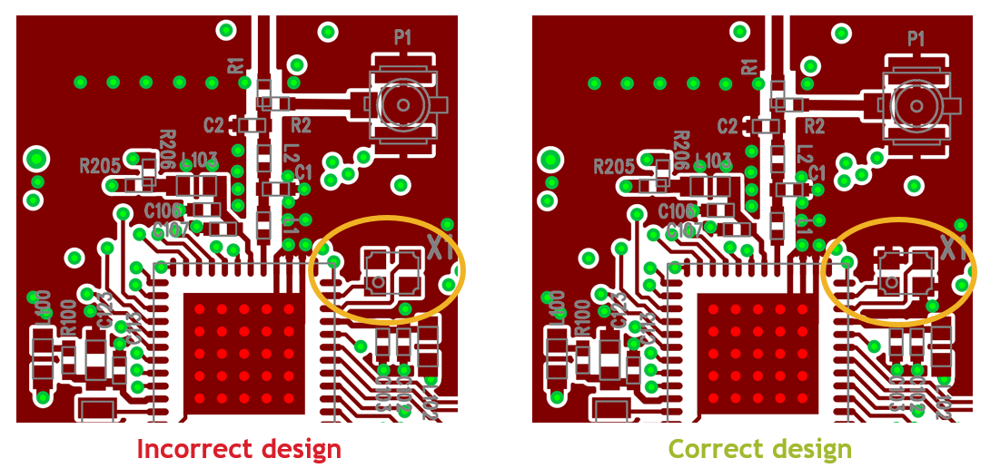
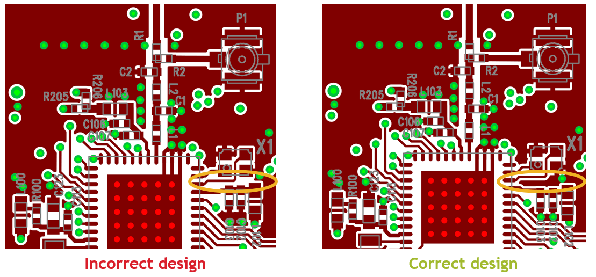

English | [中文](PCB-Layout-Design-Guide-CN)

Table of Contents 

 
 
 - [1. Why is the proper layout design important?](#1.-why-is-the-proper-layout-design-important?)
 - [2. RF section](#2.-rF-section)
    - [2.1. Different parts of RF section](#2.1.-Different-parts-of-RF-section)
      - [2.1.1. Function of RF matching  and filtering network](#2.1.1.-Function-of-RF-matching-and-filtering-network)
      - [2.1.2. Function of VDD filterings](#2.1.2.-Function-of-VDD-filterings)
    - [2.2. Layout of RF section](#2.2.-Layout-of-RF-section)  
      - [2.2.1. Layout of the matching network](#2.2.1.-Layout-of-the-matching-network)
  - [3. Layout Design Practices](#3.-Layout-Design-Practices)
    - [3.1. Layout Design Practices - 2.4 GHz matching network](#3.1.-Layout-Design-Practices---2.4-GHz-matching-network)
    - [3.2. Layout Design Practices - Sub-GHz matching network](#3.2.-Layout-Design-Practices---Sub-GHz-matching-network)
    - [3.3. Layout Design Practices - HFXO](#3.3.-Layout-Design-Practices---HFXO)
    - [3.4. Layout Design Practices - VDD filtering](#3.4.-Layout-Design-Practices---VDD-filtering)
    - [3.5  Layout Design Practices - General](#3.5.-Layout-Design-Practices---General)
  - [4. Quiz](#4.-Quiz)

# Introduction
The purpose of this material is to help users design PCBs
for the EFR32 Wireless Gecko Portfolio using design practices
that allow for good RF performance.

PCB layout requirements are described in the application note, [AN928.1: EFR32 Series 1 Layout Design Guide](https://www.silabs.com/documents/public/application-notes/an928.1-efr32-series1-layout-design-guide.pdf),  and the layout design process for EFR32 Series 1 Modules is discussed in [the datasheet of each module](https://www.silabs.com/support/resources.ct-data-sheets.ct-miscellaneous.p-wireless_bluetooth-low-energy_blue-gecko-bluetooth-low-energy-modules.p-wireless_bluetooth-low-energy_blue-gecko-bluetooth-low-energy-modules_bgm11s12f256ga-v2.p-wireless_bluetooth-low-energy_efr32bg1-series-1-modules.p-wireless_bluetooth-low-energy_efr32bg13-series-1-modules.sort=2,asc).  Besides that EFR32 reference design files are available in Simplicity Studio.

# 1. Why is the proper layout design important? 

If the layout is not designed appropriately, that can cause
+ Degradation in the communication distance (range)
+ The unit can violate the relevant EMC regulation (high harmonics, spur) 
+ The battery life can be reduced

# 2. RF section 

## 2.1. Different parts of RF section
The most important part of the proper layout design is the RF circuitry itself.

In the case of dual band RFIC, this RF part includes the following:
1. Sub-GHz and 2.4 GHz RF matching newtork  
2. Power supply filterings 
3. High frequency crystal  

  "

<b>Figure 1. RF section</b> 

     

### 2.1.1. Function of RF matching  and filtering network

The RF transmitter ICs can synthesize high frequency and high power signals at their TX output: the fundamental, its harmonics and additional spurious content.
On the Silicon Labs reference design boards the function of the TX matching is to drive most of the fundamental power into the antenna, thus to provide the required impedance transformation between the RFIC and the load. Besides that, a proper filtering network should be used between the matching network and the antenna design which is able to suppress harmonics and spurs. RX matching network is able to provide impedance tuning between IC and the load. 

> **TX matching:** 
> + Deliver the required TX RF power
> + Impedance transformation
> + Harmonic/spur suppression 

> **RX matching:**  
> + Impedance match  

### 2.1.2. Function of VDD filterings

Power supplies, high speed blocks and converters mounted on the board can cause extra spurs in the RF spectrum or sensitivity degradation.
So, the filtering and the isolation of these blocks from the RF part are important. The lowest value capacitors filter out the fundamental frequency. The capacitor with the value around 100nF filters the several tenths of MHz frequency range, thus the leaking clock spurs. Filtering these spurs is important as they can be upconverted inside the chip causing unwanted spurs at several 10MHz offset around the carrier. The largest value capacitor filters the several hundred kHz interferences typically coming from a switching power supply. 

****
 
## 2.2. Layout of RF section    

Silicon Labs suggests copying the RF part of the reference PCB design, or if it is not possible, applying the layout design rules and guidelines described in [AN928.1](https://www.silabs.com/documents/public/application-notes/an928.1-efr32-series1-layout-design-guide.pdf).

  

<b>Figure 2. RF part</b> 

### 2.2.1. Layout of the matching network   

The layout design of the match is critical to achieve the targeted power, the optimum sensitivity and efficiency. 
This is especially true for the RX path, which can be easily detuned by the PCB parasitics.   
 
Although the size of a matching network is relatively small, due to the high frequency the matching is sensitive to the physical parameters of the matching layout (besides the component values, of course).  
Compared to a reference layout design:
> - Different component distances and trace lengths introduce different parasitic inductances
> - Different substrate thickness, dielectric constant and gaps between traces introduce different parasitic capacitances
> - Different component distance/orientation/relative orientation introduce different coupling between components
> - Different component types/sizes introduce different component parasitics

These can cause detuning of the reference matching or filtering and/or detuning of the load of the RF crystal. The possible effects can be:
> - Decreased TX output power of the fundamental
> - Decreased RX sensitivity
> - Increased spurious emission levels  
> - Increased current consumption
> - Frequency offset between different boards

# 3. Layout Design Practices 
## 3.1. Layout Design Practices - 2.4 GHz matching network  

1. Minimize distance between neighboring components. Matching network components should be close to each other and to the RF IC. For nearby components use the width of the pads for trace width.

  

<b>Figure 3.</b> 

2. The first component of the matching network should be placed as close to the 2G4RF_IOP pin of the RF IC as possible to reduce the series parasitic inductance and to avoid any detuning effects.

  

<b>Figure 4.</b> 

3. Couplings through the ground pads can occur between the nearby filtering capacitors (especially at high harmonics). This can decrease the effectiveness of the low-pass filtering and can cause higher harmonics that can be observed both conducted and radiated.
 To avoid the possible high harmonic levels, it is recommended to connect the nearby filtering capacitors to ground planes on different sides of the transmission line.

  

<b>Figure 5.</b> 

**Note:** It is true only in the case of EFR32xG1x Series 1 chips. In the case of EFR32xG2x Series 2 chips  chips the capacitors should be connected on same sides of the transmission line. 

4. Use at least 0.5 mm separation between traces/pads to the adjacent GND pours in the area of the matching network. This technique will minimize the parasitic capacitance and reduce the detuning effects.

  

<b>Figure 6.</b> 

5. The area under the RF chip and the matching network (in 4-layer PCBs, this is the first inner layer beneath the top layer) should be filled with continuous ground metal as it will show good ground reference for the matching network and will ensure a good, low impedance return path to the RF chip’s ground as well. Board routing and wiring should not be placed in this region to prevent coupling effects with the matching network. It is also recommended that the GND return path between the GND vias of the TX/RX matching network and the GND vias of the RFIC paddle should not be blocked by anything; the return currents should see a clear, unhindered pathway through the GND plane to the back of the RFIC.

  

<b>Figure 7.</b>

 

6. Use 50 Ω grounded coplanar lines where possible for connecting the antenna or the U.FL connector to the matching to reduce sensitivity to PCB thickness variation. This will also reduce radiation and coupling effects. Use many GND vias near the coplanar lines in order to further reduce radiation.

  

<b>Figure 8.</b> 

 

***
## 3.2. Layout Design Practices - Sub-GHz matching network

The layout consistency for the 4-layer dual-band EFR32 PCB is shown in the following figure. The individual layers will be marked with the currently presented colours during this presentation. Let’s see the sub-GHz EFR32 layout design practices one by one.

  

<b>Figure 9.</b> 

1. Use the shortest traces possible to connect the first RX matching network component with the RX input pins of the chip. The RX matching network is very sensitive to any extra parasitic inductance and parasitic capacitance. Doing this way is important to minimize the detuning effects by using as short traces as possible.

  

<b>Figure 10.</b> 

2. In order to decrease the parasitic capacitance towards the ground, it is recommended to apply a keepout on all inner layers beneath the area of the RX matching network.

  

<b>Figure 11.</b> 

3. The traces, which connect the first TX components with the TX pins of the chip, must be routed on different layer.  
The figure below shows one example. The RX inputs of the chip are connected to the first RX matching components on the Top layer. But the traces, between first TX components and TX outputs, are routed on the inner layer 2.

  

<b>Figure 12.</b> 

4. On the first inner layer, the area beneath the remainder sub-GHz matching network (balun and low-pass filter) should be filled with ground metal.
Traces can be routed beneath the area of the balun and low-pass filter sections on all other inner layers.

  

<b>Figure 13.</b> 

5. No traces should be routed on the layer beneath the traces that connect the first TX matching components with TX pins.

  

<b>Figure 14.</b> 

6. It is recommended to add an isolating ground metal with many vias between the 2.4 GHz and sub-GHz matching networks.

  

<b>Figure 15.</b> 

7. Use at least 0.5 mm separation between traces/pads to the adjacent GND pours in the area of the matching network. This technique will minimize the parasitic capacitance and reduce the detuning effects.

  

<b>Figure 16.</b> 

8. Use 50 Ω grounded coplanar lines where possible for connecting the antenna or the U.FL connector to the matching, it will reduce sensitivity variation related to PCB thickness. This will also reduce radiation and coupling effects. Use many GND vias near the coplanar lines in order to further reduce radiation.

  

<b>Figure 17.</b> 

 

****

## 3.3. Layout Design Practices - HFXO

1. The crystal should be placed as close to the RFIC as possible to ensure that wire parasitic capacitances are kept as low as possible; this will reduce any frequency offsets. Avoid leading supply traces close or beneath the crystal or parallel with a crystal signal or clock trace. 

  

<b>Figure 18.</b> 

2. Connect the crystal case to the ground using many vias to avoid radiation of the ungrounded parts. Do not leave any metal unconnected and floating that may be an unwanted radiator. 

  

<b>Figure 19.</b> 

3. Use an isolating ground metal between the crystal and VDD traces to avoid any detuning effects on the crystal caused by the nearby power supply, and to avoid the leakage of the crystal or clock signal and its harmonics to the supply lines.

  

<b>Figure 20.</b> 

****
## 3.4. Layout Design Practices - VDD filtering

1. The lowest value capacitors have to be placed the closest to the VDD pins. Besides that, they need good grounding (with many close vias) at the ground side. The largest value capacitor filters can be placed far away from the VDD pins and is not required in case of battery operation.

  

<b>Figure 21.</b> 

***

## 3.5. Layout Design Practices - General

1. Use 50 Ohm grounded coplanar transmission lines to connect distant RF components. Online impedance calculators can be used to get the necessary trace width and gap to ground copper,  as figure below shows the typical values for 50 Ohm grounded coplanar lines. 

  

<b>Figure 22.</b> 

  

<b>Figure 23.</b> 

2. The grounding effect in the thermal straps used with capacitors should be improved. In addition, the trace near the GND pin of these capacitors should be thickened, this will minimize series parasitic inductance between the ground pour and the GND pins. Additional vias placed close to the GND pin of capacitors (thus connecting it to the bottom or inner layer GND plane) will further help reduce these effects.

  

<b>Figure 24.</b> 

3. The exposed pad footprint for the paddle of the EFR32 IC should use as many vias as possible to ensure good grounding and heat sink capability. In the reference designs there are 25 vias for the 7x7 mm sized package ICs, each with 10 mil diameter. 

  

<b>Figure 25.</b> 

4. Use as many grounding vias at the GND metal edges (especially at the edge of the PCB and along the VDD traces) as possible in order to reduce their harmonic radiation caused by the fringing field.

  

<b>Figure 26.</b> 

5. In a design with more than two layers, all of the wires/traces should be placed in one of the inner layers, especially the VDD trace. Also avoid putting it close to the edge of the PCB. The whole top and bottom layers should contain as much continuous GND metallization as possible in order to reduce harmonics/spurs radiations from the signal traces.

  

<b>Figure 27.</b> 

# 4. Quiz 

There are some mistakes in the following design. Please try to find all the problems, which can cause detuning of the fundamental frequency, lower power level, higher current consumption, degraded sensitivity and higher harmonic power level as well. (tip: 7 mistakes)

  

<b>Figure 28.</b> 

