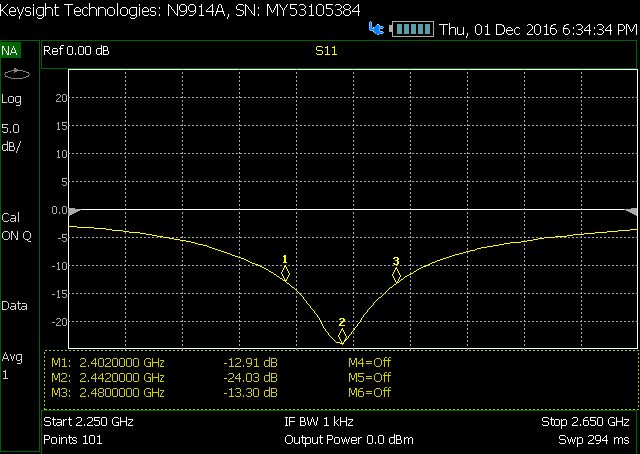
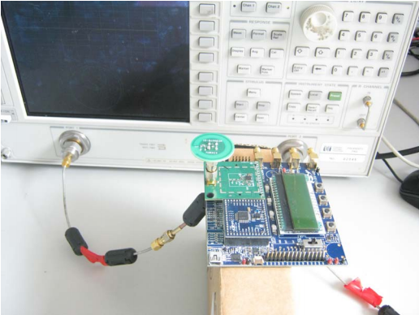
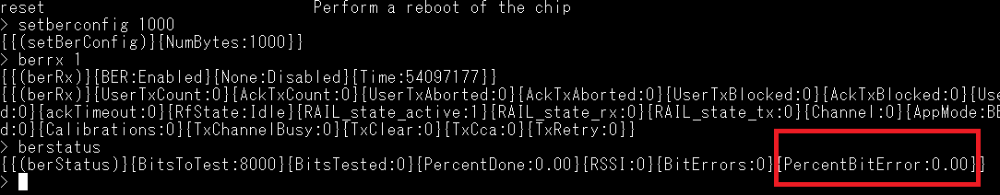
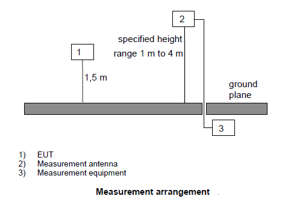

[English](RF-Test-Guide) | 中文

目录 

- [1. 简介](#1-简介)

- [2. 射频规范认证地区](#2-射频规范认证地区)

- [3. 确定天线匹配网络](#3-确定天线匹配网络)
  - [3.1 为什么天线匹配调试重要?](#31-为什么天线匹配调试重要?)
  - [3.2 调试及测量](#32-调试及测量)

- [4. 频率误差与HFXO电容库（CTune）校准](#4-频率误差与HFXO电容库（CTune）校准)
  - [4.1 为什么CTune校准重要?](#41-为什么CTune校准重要?)
  - [4.2 创建用于测试的Railtest工具](#42-创建用于测试的Railtest工具)
  - [4.3 调试及测量](#43-调试及测量)

- [5. Tx基波和谐波的传导测量](#5-Tx基波和谐波的传导测量)
  - [5.1 产生Tx连续单音信号的RailTest命令](#51-产生Tx连续单音信号的RailTest命令)
  - [5.2 信号分析仪的设置与测试例子](#52-信号分析仪的设置与测试例子)

- [6. Rx灵敏度的传导测量](#6-Rx灵敏度的传导测量)
  - [6.1 信号发生器的设置](#61-信号发生器的设置)
  - [6.2 RailTest的命令与测试结果](#62-RailTest的命令与测试结果)
  
- [7. 辐射测试环境](#7-辐射测试环境)
  - [7.1 典型的半波测试暗室-SAR](#71-典型的半波测试暗室-SAR)
  - [7.2 辐射测试步骤](#72-辐射测试步骤)

# 1. 简介
如[AN1048](https://www.silabs.com/documents/public/application-notes/an1048-regulatory-certifications.pdf)所述, 无线产品必须通过其售卖地区的射频规范认证。正常情况下如果客户按照Silicon Labs的参考板来设计其产品，通过射频规范是没有问题的。但当客户需修改设计以适应其最终的应用时，就需要做一些基于客户设计的预规范测试。如果有些测试条款通过不了，就需要做些微调和校准了。本文将先简要介绍射频规范认证地区，以及一些具体的调试，校准和测试方法供客户参考。

# 2. 射频规范认证地区
Silicon Labs有很多诸于SOC芯片，SiP模块和PCB模块的产品。这些产品支持主要的sub-GHz频段(169MHz，434MHz，868MHz和915MHz)和2.4GHz频段。这些不同频段的产品几乎支持世界上任意地区的射频规范。
有如下很多地区规范：[CE](http://ec.europa.eu/growth/sectors/electrical-engineering/red-directive_fi) (欧洲)，[FCC](https://www.fcc.gov/) (美国)，[ISED](https://www.canada.ca/en/innovation-science-economic-development.html) (加拿大)，[MIC](http://www.soumu.go.jp/english/) (日本)，[KC](http://eng.kcc.go.kr/user/ehpMain.do) (韩国) 和其它地区。

也有以下一些测试实验室提供如下地区的测试认证服务：

    

 

你可以直接联系以下地区的授权机构进行认证测试：

    

总的来讲，这些地区有RF，EMC和安规的不同认证条款，这里主要介绍RF认证。更多详情请参考[AN1048](https://www.silabs.com/documents/public/application-notes/an1048-regulatory-certifications.pdf).

# 3. 确定天线匹配网络

## 3.1. 为什么天线匹配调试重要?

一些类型（如印刷倒F天线）的天线可不用任何外部器件固有地匹配到设计地阻抗（典型的单端50欧姆）。然而板子大小，塑料壳子，金属屏蔽罩和天线附近的器件会引起天线的失调。也即引起高的谐波辐射，减少辐射功率和降低灵敏度。为了得到优化的辐射性能，天线可能需要两种方法来优化：
- 改变天线走线结构的尺寸；
- 使用外部调谐器件。

一般倾向于不要在客户的设计中改变布线的方法。为此，Silicon Labs建议保留天线匹配器件的焊盘做匹配预留, 下图推荐的就是外部3元件PI型网络的天线匹配结构。可以用PI型网络中最多2个器件（一个串联和一个并联器件）来得到很好的匹配。任何未知的阻抗都可以通过PI型网络匹配到50欧姆。全部L，C，L-C，C-L的组合都可以在PI型网络上实现，因此任何形式的失配都可以纠正。
注意，每个天线的设计可能需要电感电容的不同组合。
推荐的外部3元件PI型天线匹配网络如下：

  

## 3.2. 调试及测量

推荐为天线匹配加上图一所示的PI型匹配网络。寻找天线匹配网络中器件的合适值是一个迭代的过程。通常使用如下图的网络分析仪（VNA）来调试和测量天线匹配网络。

   

可用如下的匹配步骤和技巧：

- 在一个比天线带宽大的频率范围内校准VNA。
- 将射频同轴线连接到射频线上（如连接一个猪尾巴到射频电路上)。连接同轴线的另一端到VNA以测量反射系数S11，通过匹配网络观察天线。

  a. 确保与地平面的连接良好，以在测量过程中获得最佳的电气性能和最高的机械强度。

  b. 确保猪尾巴朝向PCB中心，并且垂直离开PCB中心。这将最大程度的限制射频同轴线对测量数据的影响。下图详细说明了：
  

      
  

- 首先测量图1中不带元器件的天线匹配网络。
  a. 并联元件不焊；

  b. 串联元件也不焊。

- 用VNA的端口延申功能移动参考点到R1和R2的公共焊盘。VNA上S参数的轨迹在Smith圆图的右边形成一个点才算完成校准。如下图所示：
 

    
 

- 在图一R2位置上焊0欧电阻。

- 测量感兴趣频段中心点的反射系数（感兴趣频段最低频率和最高频率的中间位置）。

- 用在线Smith圆图工具，计算在同轴线上达到50欧姆的串联和并联器件的值。这将为供初次尝试提供一个好的起点和合理的结果。在线Smith工具链接如下[smith chart tool](https://www.will-kelsey.com/smith_chart/) 。

- 重复迭代元器件的值直到达到可接受的S11的值为止。

  a. 匹配标准是在整个带宽内S11在-6 dB或-10 dB以下。

  b. 实现目标值后，推荐在一小批板子上用相同的元器件值来做匹配，以保证这个匹配在整个批量生产误差内是可接受的。

# 4. 频率误差与HFXO电容库（CTune）校准 

## 4.1. 为什么CTune校准重要?
推荐校准器件的HFXO频率以保证射频载波频率误差最小。如果两个通信节点间的频率偏差（误差）太大，它们就会连接不上或连接质量下降。CTune是一个内部片上电容器组，用于调节HFXO频率，因HFXO时钟用来合成射频载波频率，也即它就负责调节射频载波的频率。大部分Silicon Labs的模块和射频板都经过出厂校准了，CTune的值存在于器件信息的flash页面上，客户可以读取相关信息确认。有些Silicon Labs的射频板上装备了外部EEPROM，里面存有CTune值。
对于客户自己的板子，频率误差或晶振校准对于窄带通信来说是必要做的。通常对一个设计来说最好校准10-20个HFXO频率，然后得到可用于该设计的平均值。当然客户在时间和成本上允许的话可在它的生产线上对每块板子进行校准。

## 4.2. 创建用于测试的Railtest工具
首先应该在Simplicity Studio里面产生Rail Test工具来做接下来的测试项。可以按以下步骤来产生测试工具：
- 连接带有客户板子的调试接口板（BRD4001A母板）到Simplicity Studio平台。
- 选择合适的射频SoC或模块和队应的参考板。
- 设置Debug Mode为“Debug Out”
- 选择new project 
- 选择RAIL: Rail Test
- 定义一个Rail Test工程名
- 选择Finish
- 配置如下射频参数 
  - Modulation Type: FSK2
  - Shaping Filter: Gaussian
  - Shaping Filter Parameter: 0.5
  - Bitrate [bps] / Deviation [Hz]: 125k/?, 500k/125k , 1M/250k, 2M/500k
  - Modulation index: 0.5 基于蓝牙标准
  - 勾选"Reconfigure for BER testing”选框
  - 其它的都用缺省值
- Generate 
- Build

   

   

产生Rail Test工具后，可用Commander工具来编程器件。器件就准备用来测试了。
关于Simplicity Studio更多用法的信息，请参考应用报告[AN0822](https://www.Silabs.com/documents/public/application-notes/AN0822-simplicity-studio-user-guide.pdf)。

## 4.3. 调试及测量
频率可以用频率计数器或频谱仪（SA）来测量。下面的方法就是用频谱仪来调试最优CTune值：
- 执行传导测量；
- 连接客户板的射频口到SA；
- 如下图用SA测试基波频率：
  

    
  

- 确保将SA设置合适的跨度和分辨率带宽（RBW）。请用几MHz频率范围内的跨度和几KHz的RBW。
- 调节CTune的值直到基波频率达到最优为止。
- 用Rail Test工具来调节CTune之值。Rail Test命令如下：
  - ->rx 0  
  - ->SetPower [decidBm]  
  - ->setdebugmode 1  
  - ->freqoverride 868000000  
  - ->GetCTune  
  - ->SetCTune 0x[hex-value] or [desimal value] 
  - ->SetTxtone 1  
  - ->SetTxtone 0

Rail Test命令解释：
- Rail Test命令从“rx 0”开始。
- 实际输出功率可用“SetPower”命令来设置。
- 实际输出频率可用“setdebugmode 1”和“freqoverride”命令来设置。
- 实际CTune变量可用“GetCtune”命令来读取。
- 可以设计一个新值给Ctune，这可通过“SetCTune”命令来做。 
- 以上配置之后，“SetTxTone 1”命令设置无线到发射模式。此种情况下，无线发射连续单音信号。
- “SetTxTone 0”命令可以停止发射信号。 

Rail Test命令的更多信息请参见[KBA](https://www.Silabs.com/community/wireless/proprietary/forum.topic.html/railtest_-_more_info-66AE)。

CTune详细校准步骤在这个[KBA.](https://www.Silabs.com/community/wireless/proprietary/knowledge-base.entry.html/2019/03/18/hfxo_capacitor_bank-7uRt)里面讨论了。

# 5. Tx基波和谐波的传导测量
基波和谐波测试是发射性能的基本测试项目。通常测试需用最大功率状态的单音信号来测量，这个信号用RF同轴电缆注入到SA进行测量。射频电缆的接触点必须搭到50欧的参考点，需从电缆搭接点处移除天线及其匹配电路。为获得所需单音信号，可用Railtest tool控制无线板来实现。在第3节中创建的Railtest tool工具可直接用于测试。
## 5.1. 产生Tx连续单音信号的RailTest命令
Railtest tool命令如下：
  - ->rx 0
  - ->Setchannel 0 
  - ->SetPower [max]  
  - ->SetTxtone 1  
  - ->SetTxtone 0
  - ->setchannel 1
  - ->SetTxtone 1  
  - ->SetTxtone 0

Rail Test命令解释：
- Rail Test命令从“rx 0”开始。
- “Setchannel 0” 将选择一个频点进行测试，也可以改变信道号来选择其它频点来测试；
- 可用“SetPower [max]”来设置最大功率；
- “SetTxTone 1”命令设置无线到发射模式，无线发射连续单音信号。
- “SetTxTone 0”命令可以停止发射信号。Setchannel命令在无线空闲的时候使用。

## 5.2. 信号分析仪的设置与测试例子
与CTune校准不同，基波及其谐波的测量需要大的频率跨度和大的RBW来实现快速扫描测量。
- 为测试设置合适的参考电平。比如说，如果需要测试的最大功率是+20dBm，参考电平可设成+23dBm，参考电平比测试最大功率大2-3dB；
- 设置频率跨度包含谐波及其想要测试的谐波。通常希望包含5次谐波。但有时根据规范，最大测试到10次谐波；
- 尽可能设置大的RBW,只要SA的噪底在限值3到10dB以下即可；
- 设置VBW为RBW的3倍；
- 设置迹线模式为Max Hold；
- 设置检波器模式为Peak Detector；
- 可以在基波及其谐波处设置线损，这样显示结果里面就考虑到线损了；
- 可以设置标记点，这样就能显示基波及其谐波的信号强度表。

下图是一个测试实例：

    

# 6. Rx灵敏度的传导测量
灵敏度是接收性能的基本测试项目。通常用信号发生器（SG）产生一个调制信号并注入到无线芯片中。无线芯片可以将信号解调成数据，Railtest tool用这些数据计算误码率（BER）。一旦达到了BER值，此时的SG信号强度就称为灵敏度。

## 6.1. 信号发生器的设置
测试之初，需配置SA来产生正确的调制信号。以下步骤将产生一个GFSK调制信号：
- 设置SG为Custom Mode；
- 设置IQ数据为PN9；
- 设置调制形式为2-level的FSK；
- 设置高斯滤波器的滤波系数为0.5Bt；
- 设置符号率为希望的数据速率，对2GFSK调制信号来说符号率等于数据速率；
- 设置频频为希望的频频；
- 设置频率为希望的操作频率；
- RF按键: ON
- MOD按键: ON
- 调节信号强度；

    

## 6.2. RailTest的命令与测试结果
以下Railtest tool命令用来接收BER灵敏度测试：
  - ->rx 0
  - ->Setchannel 0 
  - ->SetBerconfig 1000
  - ->BerRx 1
  - 等几秒种到希望的比特数接收完成；
  - ->Berstatus

Rail Test命令解释：
- Rail Test命令从“rx 0”开始。
- “Setchannel 0” 将选择一个频点进行测试，也可以改变信道号来选择其它频点来测试；
- “SetBerconfig 1000”设置1000字节(8000比特)的数据来计算BER；
- “BerRx 1”设置无线到BER接收模式；
- 等待一会儿后。“Berstatus”命令将显示BER测试结果。

    

当PercentBitError上升到0.10时，此时的SA信号强度减除电缆插损后的数据就是0.1% BER下的灵敏度。

# 7. 辐射测试环境
辐射测试需在射频微波暗室里面进行。几乎所有的规范测试条目都可用暗室里的辐射测试来完成。另外一些天线辐射参数TRP（总发射功率）,TIS（总等效全向灵敏度）,2维截面和3维的方向图等也用到辐射测试。
## 7.1. 典型的半波测试暗室-SAR 
总体来说有三种形式的测试场地（环境）用来做辐射测试：
- 全开放场地（OATS）；
- 半波暗室（SAR）；
- 全波暗室（FAR）。

倾向于用开放场地做辐射测试。绝对和相对的测量都可以在此场地中做测试。
最常用的测试场地是半波暗室（SAR）。测试场地配置如下图所示：

    

半波暗室有导电地平面，它是一个四周墙壁和天花板带无线吸波材料的封闭屏蔽的房间。地面是金属的，不铺吸波材料以形成地平面。通常在暗室一头有一个天线支撑架，另一头有转台。天线支架提供可变（从1m到4m）的高度，以便优化测试天线来接收DUT和测试天线之间的最大的耦合信号。旋转台可以在水平面360度旋转，它用来在特定的高度支撑起被测器件（DUT），通常支撑的高度离地平面1.5m。测试的距离是3m或10m。实际的测试距离应记录在测试报告里。

## 7.2. 辐射测试步骤 
在测试场地的图片里，辐射测试应当在测量天线和一个替代天线的辅助下进行。被测器件和测试天线需对齐来获得最大的发射功率水平。此时的位置需记录在测试报告里：
- 测试天线（下图2设备）除非特别说明需先在垂直极化的方向放置，EUT (下图1设备) 应按标准位置放在转台上，并打开电源使其工作。
- 测试设备（下图3设备）需连接到测试天线并按照测试规格设置。

  

  

- DUT需在水平面旋转360度直到测试设备接收到最强的信号为止。
- 且应在规定的高度范围内升高或降低测试天线直到接收设备收到最大值。这个最大值需记录下来。
- 在测试天线水平极化方向重复做此测试。

注：测试结果依赖于测试场地，因此在测试前需要校准测试场地。