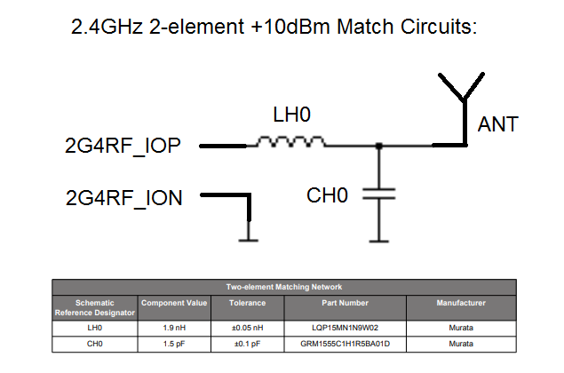

[English](Schematic-Design-Guide) | 中文

目录 

- [1. 简介](#1-简介)
- [2. 从Silicon Labs网站寻找相关的参考设计](#2-从Silicon-Labs网站寻找相关的参考设计)
- [3. 硬件设计要点](#3-硬件设计要点)
- [4. 射频电路匹配指导](#4-射频电路匹配指导)
- [5. 定制适合自己应用的原理图](#5-定制适合自己应用的原理图)

# 1. 简介
 客户如果想设计自己项目的原理图，首先需在Silicon Labs网站找到参考设计。然后学习原理图硬件设计要点和RF电路匹配指导，客户可以根据参考设计和最终应用情况来画自己的原理图。

# 2. 从Silicon Labs网站寻找相关的参考设计
 Silicon Labs网站上有各种方案的相关参考设计。参考设计因频段，输出功率，DC-DC配置和器件封装的不同而有些差异。
- 频段：

  2.4GHz频段主要适用于：私有协议, BLE和Zigbee;

  Sub-G频段主要适用于：私有协议和Z-Wave。

- 输出功率：

  0dBm, +8dBm, +10dBm, +13~14dBm, +20dBm.

- DC-DC配置: 

  用它来提高电源效率； 
 
  不用它可以节省一些成本。

- 器件封装：

  对于EFR32芯片有32/40/48/68脚的QFN封装和125脚的BGA封装。

举个例子，如果想搜索私有协议芯片的参考原理图，你可以去以下[网页](https://www.Silabs.com/):

    

 

在此页面，可移动鼠标到"Products"选项，然后带有私有协议条目的无线产品的下拉菜单将会自动弹出，用鼠标左键点击它后，将会进入到如下的私有协议产品目录的[网页](https://www.Silabs.com/wireless/proprietary)：

    

可以在底部的表格中找到私有协议产品代。选择"EFR32FG1 series 1 sub-GHz and 2.4GHz SoCs"第一代产品, [详情](https://www.Silabs.com/wireless/proprietary/efr32fg1-series-1-sub-ghz-2-4-ghz-socs) 如下：

    

在此页中，可以找到第一代私有协议芯片的主要介绍和每个芯片的参数表。先不管芯片列表，直接点击此页中"View Document"按钮进入文件列表[页面](https://www.Silabs.com/support/resources.p-wireless_proprietary_efr32fg1-series-1-sub-ghz-and-2-4-ghz-socs)：

    

 例如，想要找434MHz的+10dBm输出功率的参考设计，就可点击"EFR32FG1 BRD4251B 2400/433 MHz 10dBm Radio Board Full Design Package"项，下载参考设计到本地。例如BRD4251B板子的原理图就在[这里](https://www.Silabs.com/documents/public/schematic-files/EFR32FG1-BRD4251B-B00-schematic.pdf)。
须知参考设计对于不同封装和频段配置的一簇芯片都是适用的。只需替换为感兴趣的不同封装和频段的芯片即可。
# 3. 硬件设计要点
 找到参考设计后，你也许会考虑为什么参考设计成这个样子。Silicon Labs提供许多应用报告和参考手册供用户参考。对于基本的硬件设计要点，更多详细信息, 第一代EFR32xG1x系列芯片客户可参考[AN0002.1](https://www.Silabs.com/documents/public/application-notes/an0002.1-efr32-efm32-series-1-hardware-design-considerations.pdf)，第二代EFR32xG2x系列芯片客户可参考[AN0002.2](https://www.silabs.com/documents/public/application-notes/an0002.2-efr32-efm32-series-2-hardware-design-considerations.pdf)。

下面有几种不同部分的硬件设计要点：
- 电源配置： 
  - 总体要求：VREGVDD = AVDD, 必须是EFR32芯片的最高电压；DVDD,IOVDD,RFVDD,PAVDD =< AVDD； DECOUPLE < DVDD。
  - 如果不用内部DC-DC，则需将所有的电源管脚连至系统电源。
  - 如果使用内部，VREGVDD, AVDD, IOVDD典型的连到主电源；DVDD, RFVDD需连到DC-DC(VREGSW管脚)的输出；如果输出功率小于+13dBm，连接PAVDD到DC-DC(VREGSW管脚)的输出, 如果输出功率大于等于+13dBm，连接PAVDD到3.3V的VMU主电源。

  更多参考信息，对于EFR32xG1x一代芯片，请参考[AN0948](https://www.Silabs.com/documents/public/application-notes/an0948-power-configurations-and-dcdc.pdf)；对于EFR32xG2x二代芯片，请参考[AN0948.2](https://www.silabs.com/documents/public/application-notes/an0948.2-efr32-series-2-power-configurations-and-dcdc.pdf)。

- 调试接口和复位引脚:
  - 串行调试口：
    所有EFR32无线器件支持串行调试接口(SWD)，包括SWCLK(输入时钟)和SWDIO(数据输入/输出)信号，还有可选的SWO(串口输出)。SWO信号用来做仪器跟踪和编程计数采样，对于烧程序和常规调试来说是不需要的。然而它对于高级调试来说是非常有用的，强烈推荐设计者将此信号连同其他的SWD信号整合到调试接口中。还有VCOM口和PTI跟踪口也连到了10-pin Mini SimplicSity Studio调试口，这能带来强大的编程，控制和跟踪功能。

    这个10-pin Mini 调试口的管脚图和功能描述如下：
    

      
    

    为了方便调试和测试，通常推荐客户在其板子中保留此调试口。

  - JTAG调试口
    EFR32无线器件选择性地支持JTAG调试接口，其使用TCLK（时钟），TDI（数据输入），TDO（数据输出）和TMS（输入模式选择）等信号。TCLK是JTAG接口时钟，TDI在TCLK上升沿采样输入数据，TDO在TCLK下降沿输出数据，最后TMS是输入模式选择信号，它通过TAP状态机来导航。
    10-pin Cortex调试口定义如下:
    

       
    

    想要更多的调试接口信息，请参考[AN0958](https://www.Silabs.com/documents/public/application-notes/an958-mcu-stk-wstk-guide.pdf)。

  - 复位管脚

    芯片内部复位管脚上有一个弱上拉电阻和一个低通滤波器。这将容许复位管脚悬空且能抑制外面的噪声干扰。复位管脚不可连接外部电源上拉电阻，否则高电平驱动将损坏芯片。

- 外部时钟源:

  EFR32无线器件支持不同的外部时钟源来产生高频和低频时钟信号，而且内部带有高频和低频阻容（RC）振荡器。对于高频和低频区域，可能的外部时钟源配置包括外部振荡器（方波或正弦波）或晶振/陶瓷谐振器。
  
  - 低频时钟源

    外部时钟源或晶振/陶瓷谐振器可提供外部低频时钟。它也可以接受如TCXO或VCXO外部时钟源。
    

       
    

  
  - 高频时钟源

    外部方波/正弦波时钟源或晶振/陶瓷谐振器可提供外部高频时钟。它也可以接受如TCXO或VCXO外部高频时钟源。
    

       
    

更多参考信息，对于EFR32xG1x一代芯片，请参考[AN0016.1](https://www.Silabs.com/documents/public/application-notes/an0016.1-efm32-series-1-oscillator-design-considerations.pdf)；对于EFR32xG2x二代芯片，请参考[AN0016.2](https://www.silabs.com/documents/public/application-notes/an0016.2-efr32-series-2-oscillator-design-considerations.pdf)。

# 4. 射频电路匹配指导 
EFR32无线器件包括提供单2.4GHz频段的，单sub-GHz频段的，或2.4GHz和sub-GHz双频段的芯片选型。对于这些频段的射频匹配电路有两个应用指南讲述匹配方法。一是对于EFR32xG1x一代系列的芯片的sub-GHz频段[AN923](https://www.Silabs.com/documents/public/application-notes/AN923-subGHz-Matching.pdf)，EFR32xG2x二代系列芯片目前还没有sub-GHz频段；二是对于EFR32xG1x一代系列的芯片的2.4GHz频段[AN930](https://www.Silabs.com/documents/public/application-notes/an930-efr32-matching-guide.pdf)，对于EFR32xG2x二代系列的芯片的2.4GHz频段[AN930.2](https://www.silabs.com/documents/public/application-notes/an930.2-efr32-series-2.pdf)。

匹配电路努力同时达到以下的几个目标：
- 在RFIC外部把Tx和Rx信号通路连在一起。
- 提供希望正常的Tx发射功率水平（在天线或负载连接处测量的）。
- 得到在正常电源电压下正常的Tx输出功率。
- 提供优化的Rx接收灵敏度。
- 最小化电流消耗(也即最大电源效率)。
- 杂散发射遵从相关标准要求。

- Sub-GHz频段的匹配电路设计

  EFR32的RFIC芯片里面的LNA和PA是全差分结构并且没有连接在一起，这就要求有4个管脚提供使用内部LNA和PA电路：发射用到SUBGRF_OP/ON管脚，接收用到SUBGRF_IP/IN管脚。

  AN923详细描述了匹配方法。

  如下图所示匹配电路包括阻抗变换部分，平衡非平衡转换（BALUN）和低通滤波器：
   

      
   

  
  匹配电路因平衡非平衡转换（BALUN）的不同分为两种形式。一种是为低于500MH频段在的电路设计的，另外一种是为高于500MH频段在的电路设计的。

  

     
  

  

    
  

  而且因不同输出功率和频段有不同的元器件值，匹配电路也不同：

  匹配元件表：
  

     
  

  性能表：
  

     
  

- EFR32xG1x一代芯片的2.4GHz频段匹配电路设计
  AN930详细描述了匹配方法。2.4GHz前端有一个统一的单端收发管脚（2G4RF_IOP），因此接收和发射通路内部连接在一起了。2G4RF_ION管脚必须接地。外部需要单端匹配电路和谐波滤波器。

  2个主要的匹配网络如下：

  对于+10dBm以下的输出功率用2元件的梯形匹配结构：
  
  

     
  

 
  对于+20dBm的输出功率用4元件的梯形匹配结构：
  

     
  

  
  性能：
   发射功率与谐波：
  

     
  

  
   接收灵敏度：
   

      
   

  
- EFR32xG2x二代芯片的2.4GHz频段匹配电路设计
  AN930.2详细描述了匹配方法。对于EFR32xG21芯片，有RF2G4-IO1和RF2G4-IO2两个管脚负责射频信号发射和接收。内部开关可以使任意两个管脚其中只有接地形成单端的输出输入功能。而且芯片内部有3个PA要求不同的优化阻抗负载。因此下面就有几种形式的匹配网络：
  
  -  0dBm PA的匹配网络
  
   

     
   

 
  - +10dBm PA的匹配网络
   
   

     
   

  

  - 0/+10dBm PA的匹配网络

  

     
  

  - +20dBm PA的匹配网络

  

     
  

  
  - 这些EFR32xG21系列芯片匹配网络的射频性能：

  

     
  

  对于EFR32xG22芯片，只有一个RF2G4-IO管脚用来射频输入输出。而且内部有2个PA需要类似的优化阻抗负载。因此对0dBm和+6dBm的PA只有一种匹配网络，但当使用+6dBm的PA时DC-block电容可以不要。因只有一种匹配网络，元器件值可以根据不同的PCB堆叠来调整，以下是不同的匹配电路：

  - 在4层PCB上的0/+6dBm PA的综合匹配网络

   

     
   

  - 在4层薄PCB上的0/+6dBm PA的综合匹配网络

   

     
   

  - 在2层PCB上的0/+6dBm PA的综合匹配网络

   

     
   

  
  - 这些EFR32xG22系列芯片匹配网络的射频性能：
  
  

     
  

# 5. 定制适合自己应用的原理图
  在开始原理图设计之前有几点要考虑的事情如下：
  - 你想用那种通信协议？

    私有协议提供最为灵活的通信协议。Zigbee和BLE对于网络通信和控制来说最专业。Z-Wave对门锁控制最为安全。
  - 你的产品关新能源效率吗？你的产品是电池供电吗？

    如果电源效率比较重要，请考虑使用内部DC-DC电源。
  - 你的产品工作在什么频段呢？

    2.4GHz频段基本用在Zigbee，BLE和有些私有协议的场合；Sub-G频段主要用在私有协议和Z-wave.
  - 你的产品对输出功率的要求是多少？

    基于通信距离，射频规范和功耗的限制来确定输出功率。
    
  基于以上的考虑要点，客户可以通过改造参考设计来设计自己的应用原理图。

