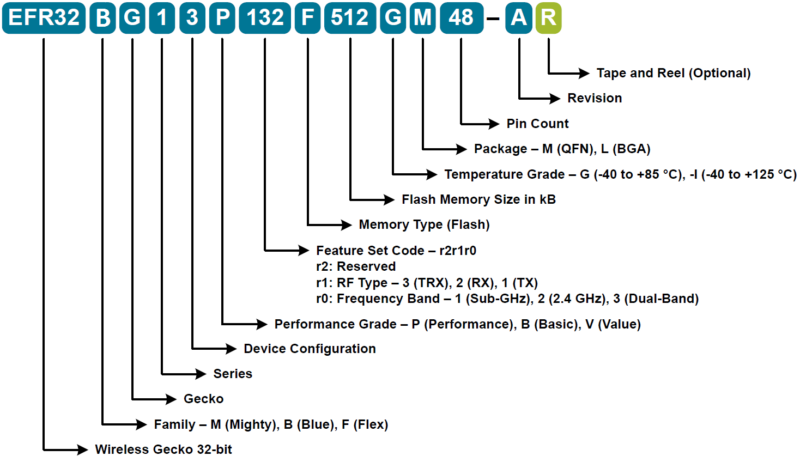

# Wireless Products, Protocols and Applications
## General Topics Outline

  * [Proprietary products and applications](#proprietary-products-and-applications)
  * [Zigbee/Thread products and applications](#zigbeethread-products-and-applications)
  * [BLE products and applications](#ble-products-and-applications)
  * [Z-Wave products and applications](#z-wave-products-and-applications)

## Proprietary products and applications
- Introduction: 

  Silicon Labs' proprietary wireless devices provide high-performance wireless connectivity and ultra-low power 32-bit microcontroller options. With support for major frequency bands in the 142 to 1050 MHz range and 2.4 GHz, these devices can be used to develop many wireless communication systems.
- Chip name conventions:

  For proprietary products, there are many FG type chips which are classified with generations, packages, flash size, temperature grades, output power levels, and frequency bands. The general name convention likes:

  

  As you can see from the name convention, the proprietary chips include four series such as FG1,FG12,FG13,and FG14. The chips are classified with  P (Performance), B (Basic), and V (Value) performance grades. The chips are Tx/Rx type which include sub-G band, 2.4GHz band, and sub-G& 2.4GHz bands. The chips are classified with 2 temperature range as -40°-+85° and -40°-+125°. And there are many packages(QFN32, QFN48, QFN68, and BGA125) to select. 
- Applications:

  Meters(Gas, water, electricity), Door lockers, Electronic lables, Wireless toy, Wireless ranch, Remote controllers, etc.
## Zigbee/Thread products and applications
- Introduction: 

  Silicon Labs is the vendor of choice for OEMs developing Zigbee networking into their products. The Silicon Labs Zigbee platform is the most integrated, complete and feature rich Zigbee solution available — a family of Wireless SoCs, based on Arm® Cortex® processor and 2.4 GHz transceiver, together the most reliable, scalable and advanced Zigbee software and supported by best-in-class development tools.
- Chip name conventions:

  For Zigbee/Thread products, there are also many MG type chips which are classified with generations, packages, flash size, temperature grades, output power levels, and frequency bands. The general name convention likes:

  As you can see from the name convention, the Zigbee/Thread chips include 2 series such as MG12 and MG13. The Zigbee/Thread chips only have  P performance grade. The chips are Tx/Rx type which include sub-G band, 2.4GHz band, and sub-G& 2.4GHz bands. The chips are classified with 2 temperature range as -40°-+85° and -40°-+125°. And there are many packages(QFN32, QFN48, QFN68, and BGA125) to select. 
- Applications:

  Home and Building Automation, Beaconing, Lighting and Switching, Asset Tracking, Remote Control via Internet, etc.

## BLE products and applications
- Introduction: 

  Add Bluetooth® 5, Bluetooth 5.1 or Bluetooth mesh connectivity into sports and fitness, consumer electronics, beacons, and smart home applications with Bluetooth SoCs, certified modules and software from Silicon Labs. Take advantage of the latest Bluetooth low energy technologies including Bluetooth 5 and Bluetooth mesh with Silicon Labs wireless stacks and advanced development tools, and explore pre-programmed module solutions with Bluetooth Xpress.
- Chip name conventions:

  For BLE products, there are many BG type chips which are classified with generations, packages, flash size, temperature grades, output power levels, and frequency bands. The general name convention likes:

  As you can see from the name convention, the BLE chips include 3 series such as FG1,FG12, and FG13. The BLE chips are classified with  P (Performance), B (Basic), and V (Value) performance grades. The BLE chips are Tx/Rx type which include sub-G band, 2.4GHz band, and sub-G& 2.4GHz bands. The BLE chips are classified with 2 temperature range as -40°-+85° and -40°-+125°. And there are many packages(QFN32, QFN48, QFN68, and BGA125) to select. 
- Applications:

  Home Automation, Beaconing, Sport and Fitness, Asset Tracking, AoA/AoD, etc.

## Z-Wave products and applications
- Introduction: 

  The Z-Wave ecosystem is comprised of the world’s largest selection of interoperable smart product for home and business. It provides the most advance security for home devices and controllers. It will Unlocks the Full Potential of the Smart Home.

- Chip name conventions:

  For Z-Wave products, it will also comply the name conventions above. But now, there is only one type chip called EFR32ZG14P231F256GM32. It is ZG14 serie chip, and it has P performance grade with +13dBm maximum output power. And it only works at sub-G band and at -40°-+85° temperature range. There is only 32 pin package available.
- Applications:

  Secure door locks with battery powered, Smart Thermostats, Control panels , And many other home automation applications.
