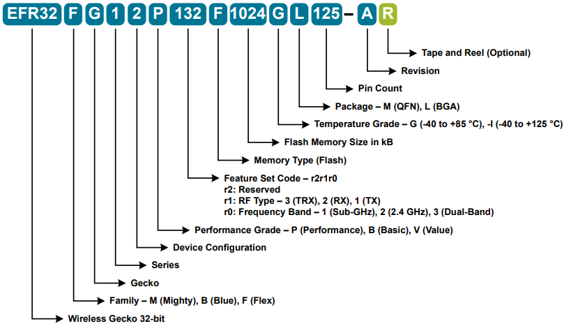

[English](Wireless-Products-Protocols-and-Applications) | 中文

目录 

- [1. 私有协议产品与应用](#1-私有协议产品与应用)
- [2. Zigbee-Thread协议产品与应用](#2-Zigbee-Thread协议产品与应用)
- [3. Bluetooth协议产品与应用](#3-Bluetooth协议产品与应用)
- [4. Z-Wave协议产品与应用](#4-Z-Wave协议产品与应用)

# 1. 私有协议产品与应用

- 简介: 

  Silicon Labs私有协议无线器件提供高性能无线连接与超低功耗32位微控制器的选择。这些器件可用来开发很多无线通信系统，支持在142MHz到1050MHz，以及2.4GHz的主要频段。
- 器件命名规则:

  私有协议产品有代，封装，flash大小，温度等级，输出功率水平，和频段分类的FG型号的芯片。总体命名规则如下：
  

    
  

  
  可从命名规则看出，私有协议第一代芯片有FG1, FG12, FG13, 和FG14四个系列。芯片分为P(性能)，B(基本)和V(经济)等性能等级。芯片有包括sub-G频段，2.4GHz频段和sub-G&2.4GHz频段的收发型产品。芯片有-40°-+85°和-40°-+125°两个温度等级。同时提供QFN32，QFN40，QFN48，QFN68，和BGA125等封装选择。 
- 应用:
  表类（气表，水表，电表），门锁，电子标签，无线玩具，无线牧场，遥控器等应用。

# 2. Zigbee-Thread协议产品与应用
- 简介: 

  Silicon Labs是开发Zigbee网络到它产品中的OEM们选择的供应商。Silicon Labs的Zigbee平台是集成度最高，最完整和富有很多特性的可用的Zigbee方案。是一个基于ARM Cortex处理器，2.4GHz收发器，并以最高可靠性，可扩展性，高级Zigbee软件和业界顶级开发工具支持的无线SoC族。
- 器件命名规则:

  Zigbee/Thread协议产品也有代，封装，flash大小，温度等级，输出功率水平，和频段分类的MG型号的芯片。总体命名规则如下：
  

    
  

  
  可从命名规则看出，Zigbee/Thread协议第一代EFR32MG1x芯片有MG12和MG13两个系列，第二代EFR32MG2x芯片有MG21和MG22两个系列。Zigbee/Thread芯片仅有P(性能)等级。Zigbee/Thread芯片有包括sub-G频段，2.4GHz频段和sub-G&2.4GHz频段的收发型产品。芯片有-40°-+85°和-40°-+125°两个温度等级。同时提供QFN32，QFN40，QFN48，QFN68，和BGA125等封装选择。
  另外也有MGM12P，MGM13P/S，MGM210P/L等SiP和PCB模块供客户选用。
- 应用:

  家居及楼宇自动化，信标，灯和开关，资产标签，通过因特网的远程控制等。

# 3. Bluetooth协议产品与应用
- 简介: 

  利用Silicon Labs公司的蓝牙SoC，认证过的模组和软件，可以快速的把蓝牙5.0， 蓝牙5.1以及蓝牙Mesh技术应用到运动与健身，消费电子，信标和智能家居等应用中。基于最新的低功耗蓝牙技术，包括蓝牙5.0和蓝牙Mesh, 结合Silicon Labs公司的蓝牙协议栈和高级开发工具，探索集成软件的蓝牙Xpress解决方案。
- 器件命名规则:

  BLE协议产品也有代，封装，flash大小，温度等级，输出功率水平，和频段分类的BG型号的芯片。总体命名规则如下：
  
  

    
  

  可从命名规则看出，BLE协议第一代EFR32BG1x芯片有BG1,BG12,和BG13三个系列，第二代EFR32BG2x芯片有BG21和BG22两个系列。BLE芯片也分为P(性能)，B(基本)和V(经济)等性能等级。芯片有包括sub-G频段，2.4GHz频段和sub-G&2.4GHz频段的收发型产品。BLE芯片也有-40°-+85°和-40°-+125°两个温度等级。同时提供QFN32，QFN40，QFN48，QFN68，和BGA125等封装选择。

  另外也有BGX13P/S, BGM121/3, BGM111/3/S, BGM13P/S, BGM210P/L等SiP和PCB模块供客户选用。

- 应用:
  家居自动化，信标，运动与健身，资产标签，AoA/AoD等。

# 4. Z-Wave协议产品与应用
- 简介: 

  Z-Wave生态系统是由家用和商用的智能产品组成的，是世界上最大的产品组合。它提供为家庭控制器件最为安全的系统。它将解锁智能家居丰富的潜能。

- 器件命名规则:

  Z-Wave产品也将有以上类似的命名规则。不过现在只有EFR32ZG14P231F256GM32一种型号的芯片。它是ZG14系列芯片，是+13dBm输出功率的P(性能)级性能芯片。它只工作在Sub-G频段，工作温度范围为-40°-+85°。它只有QFN32封装可提供。也有ZGM130S的SiP模块供客户选用。

- 应用:
  电池供电的安全门锁，智能温湿度计，控制面板，和其它的智能家居应用。