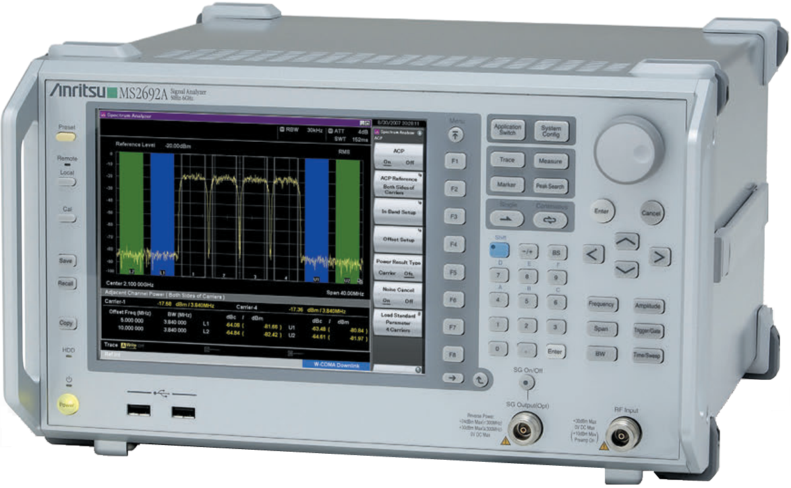
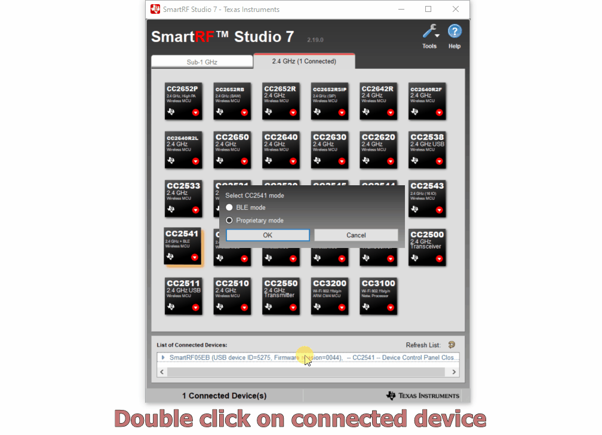
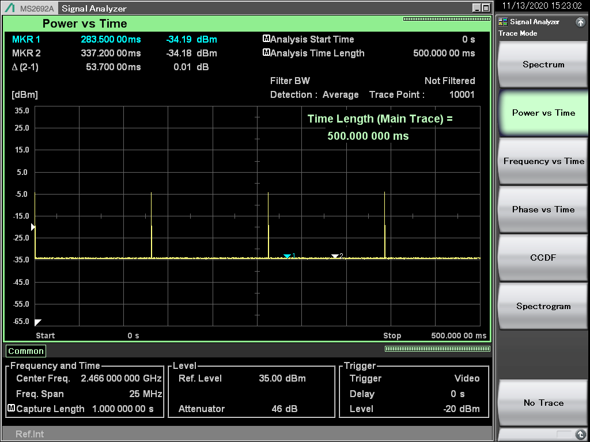
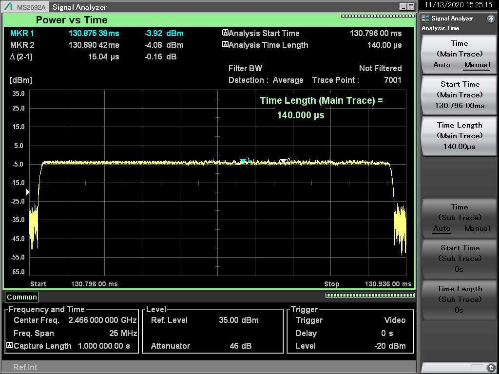
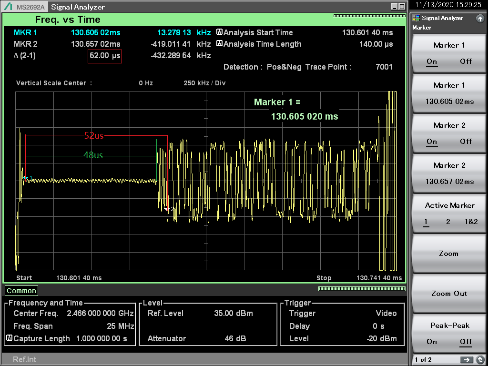
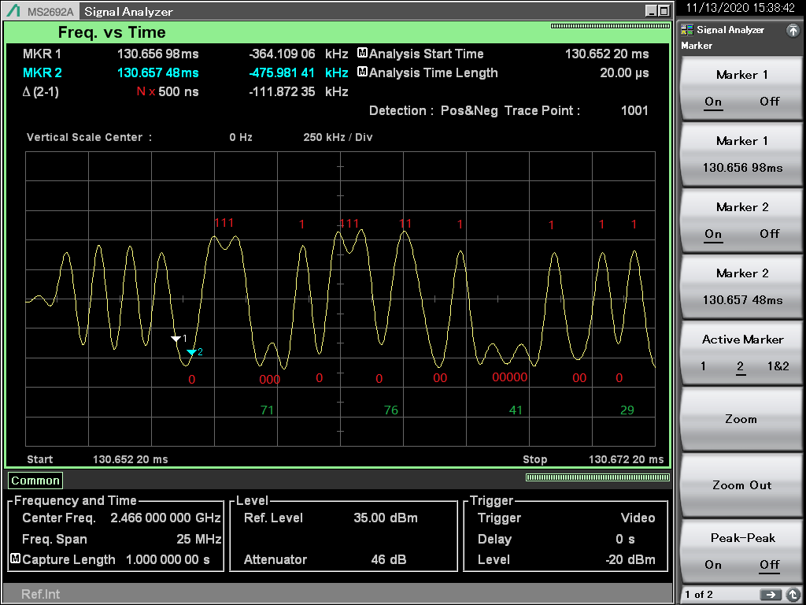
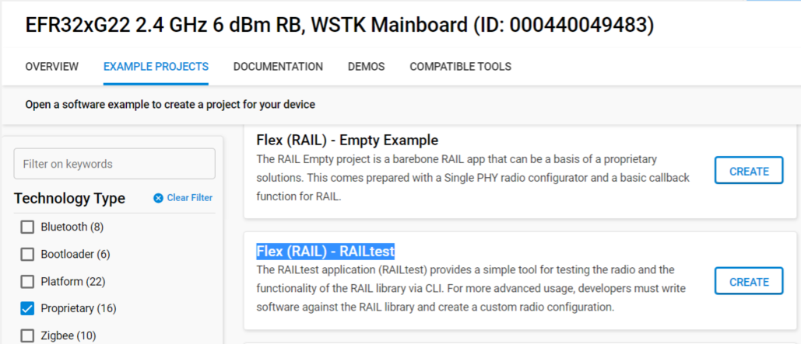
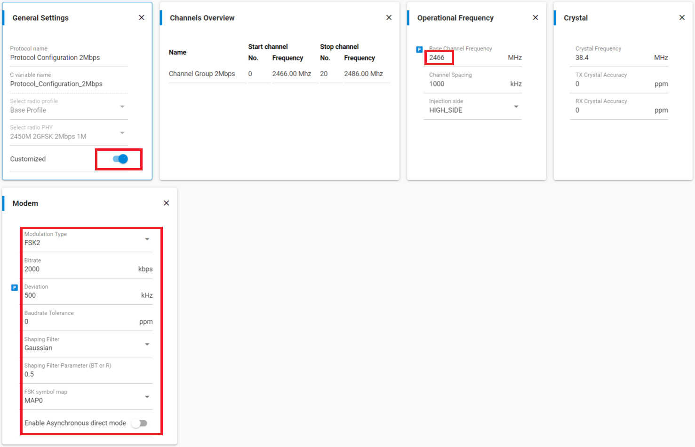
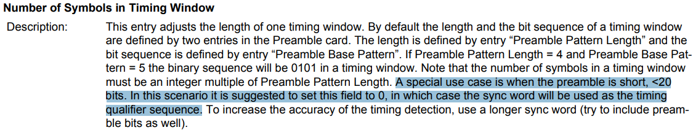

[English](Configure-TI-CC2541-compatible-proprietary-PHY) | Chinese

目录 

- [1. 介绍](#1-介绍)
- [2. 先决条件](#2-先决条件)
- [3. PHY 确认](#3-PHY-确认)
- [4. EFR32xG22 工程](#4-EFR32xG22-工程)
- [5. 结论](#5-结论)

# 1. 介绍
有时会收到这样的需求, 配置与其他供应商的设备兼容的 PHY(Physical Layer / 物理层), 以便两者进行通信. 这里分享配置EFR32xG22 PHY 与 TI CC2541 [Proprietary(专有协议) 2.4G PHY](files/PR-Configure-TI-CC2541-compatible-proprietary-PHY/2M_BS-TX_2.xml) 通信的经验. 要在两个RF设备之间进行通信, 频率, 调制, 数据速率, 频偏, 前导码, 同步字, 数据包结构等参数必须相同. 要为 EFR32xG22 配置PHY, 需要知道 radio configurator 上需要的详细参数.

# 2. 先决条件 
## 2.1. 硬件要求
* 1 [WSTK 与 EFR32xG22 radio boards(BRD4182A)](https://www.silabs.com/development-tools/wireless/efr32xg22-wireless-starter-kit)
* 1 SmartRF05 EB 与 [CC2541EMK](https://www.ti.com/tool/CC2541EMK)
* 1 [Anritsu MS2692A](https://www.anritsu.com/en-US/test-measurement/products/ms2692a)

BRD4182A radio 板支持三种无线协议, Bluetooth LE/Mesh, Zigbee 与 Proprietary, 这里将用到 Proprietary.

    

 
CC2541EMK 与 BRD4182A一样, 支持 Proprietary, 可以与BRD4182A进行通信. 通过信号分析仪 MS2692A 可以从它的空中信号获得一些未知的特性或参数.

    

 
功能强大的射频工具信号分析仪 Anritsu MS2692A, 用来确认 EFR32xG22 或 CC2541 的空中数据.

    

 

## 2.2. 软件要求
**Simplicity Studio** 是一个免费的基于 Eclipse 的集成开发环境(IDE), Silicon Labs 在此基础提供了一系列的非常有用的工具. 开发人员可以使用 Simplicity Studio 来开发, 调试并分析其应用程序. 最近发布了 [Simplicity Studio 5](https://www.silabs.com/products/development-tools/software/simplicity-studio/simplicity-studio-5), 这个 IDE 基于最新版本的 Eclipse 和 C/C++ 开发工具. 以先前版本的功能为基础, 包含先进的 SecureVault 技术, 新的 Web 形式界面以及可靠的性能改进.  

**SmartRF™ Studio** 是一个 Windows 应用, 可用于评估和配置德州仪器 (TI) 的低功耗射频器件. 该应用可帮助射频系统的设计人员在设计过程的早期阶段轻松评估无线电. 它特别适用于生成配置寄存器值和命令, 以及实际测试和调试射频系统. 这里使用 [SmartRF Studio 7](https://www.ti.com/tool/SMARTRFTM-STUDIO).

## 2.3. 所给的要求参数
这个案例中有些参数是已提供的, 有些是通过 [xml 文件](files/PR-Configure-TI-CC2541-compatible-proprietary-PHY/2M_BS-TX_2.xml)读取的, 这个 xml 是 CC2541 带有详细寄存器设置的配置文件. 最终以下参数是已知的.
* 调试方式: 2GFSK
* 数据速率: 2Mbps
* 频偏: 500KHz
* 前导码: 10101010 (13 字节)
* 同步字: 0x29417671
* 数据包结构: 64 字节, 可变包长
* 数据大小端: MSB_FIRST
* CRC 多项式: CCITT_16(0x1021)
* CRC 种子: 0xFFFF
* 白化多项式: PN9_BYTE
* 白化种子: 0xFF

# 3. PHY 确认
根据已知参数配置了一个 PHY, 没工作起来, 甚至连前导码都没检测到, 这就有必要去抓取并分析从 CC2541 发出来的空中数据包了.

## 3.1. 通过 SmartRF Studio 7 发送数据
下面动态图演示了如何通过 SmartRF Studio 7 打开配置文件并发送射频数据.

    

 
为了能更快更好的找到相应的数据帧, 有必要禁用数据白化与设置一些特殊的数据, 如加 0x00/0xFF 到数据包里.

    

 

## 3.2. 在信号分析仪 MS2692A 获取空中数据
需要根据实际用例配置相应的中心频率, 参考电平等, 以使得 MS2692 抓到可读的数据帧.
### 3.2.1 使用 "Power vs Time" 模式抓取TX 脉冲

    

 

### 3.2.2 改变 "Start Time" 来定位一个脉冲

    

 

### 3.2.3 放大

    

 

### 3.2.4 切换到 "Frequency vs Time" 模式显现出整个数据帧
如图, Marker1 与 Marker2 之间的间隔时间是 52us. 13字节的前导码, 2Mbps 意味着第个比特占 0.5us, 13 x 8 x 0.5us = 52us, 所以可以判断这个是前导码. 信号分析仪 MS2692A 检测到 1 字节的前导码与 48us 载波信号. 检查了 TI BLE PHY等其他 GFSK 2Mbps PHY, 也存在这样的问题, 由此可知, CC2541 仅发送了 1 字节的前导码及 48us 载波信号, 而非完整的 13 字节前导码. 之前提到按已知参数配置 EFR32xG22 PHY 连前导码都没检测到, 就是这个原因导致的.

    

 

### 3.2.5 解读数据帧
前导码定位到之后, 这个帧的数据就可读了, 因为知道每个比特位之间的间隔, 只要按 0.5us 间隔采样读取数据就可以了.

    

 

# 4. EFR32xG22 工程
确认 CC2541 数据帧后, 得到了 radio configurator 需要的具体参数设定, 现在可以创建与配置 EFR32xG22 工程, 这里用 SSv5 的 "Flex (RAIL) - RAILtest".

    

 

## 4.1. PHY 定制化
双击射频配置文件 -- "radio_settings.radioconf", 选一个预设 PHY(2450M 2GFSK 2Mbps 1M), 点击 "Customized", 目标 PHY 中心频率是 2466MHz, 先把频率改到 2466MHz.

    

 
根据目标 PHY 配置其他参数. 2Mbps 数据速率, 500KHz 频偏, 配置可变包长, 用 CCITT_16(0x1021) CRC 多项式 与 0xFFFF CRC 种子. 使能数据白化, 其白化种子是 0xFF. 这里要注意的是根据实验结果, radio configurator 要使用 0x01FF 做白化种子. 还有其前导码设成8位.

    

 

只有 8 位的前导码, 根据[AN1253](https://www.silabs.com/documents/public/application-notes/an1253-efr32-radio-configurator-guide-for-ssv5.pdf), 基于前导码的 timing detect 应该要禁用.

    

 
不勾选 "Number of Symbols in Timing Window" 禁用 RX 端前导码检测, 用同步字做 timing dectection.

    

 

其他未提及参数保留其默认设置, 这样 PHY 就配好了. 保存并编译, 这样软件就准备好了.  
如需要 radio configurator 相关更多信息, 请参考 [AN1253](https://www.silabs.com/documents/public/application-notes/an1253-efr32-radio-configurator-guide-for-ssv5.pdf). 

## 4.2. 结果确认
TI CC2541 RX, EFR32xG22 TX, 20 个数据包.

    

 
TI CC2541 TX, EFR32xG22 RX, 20 个数据包.

    

 

如需要CLI command相关更多信息, 请参考 [UG409](https://www.silabs.com/documents/public/user-guides/ug409-railtest-users-guide.pdf).

# 5. 结论
通过在信号分析仪 MS2692A 确认 CC2541 的 TX PHY 参数, 在 CRC 与白化设置上做了几次试验, 得到了相应的配置参数, 可以配出使得 EFR32xG22 能与 CC2541 通信的兼容的 PHY.
