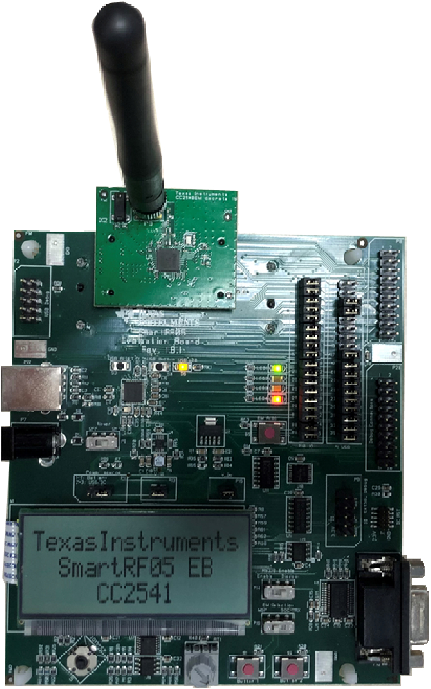
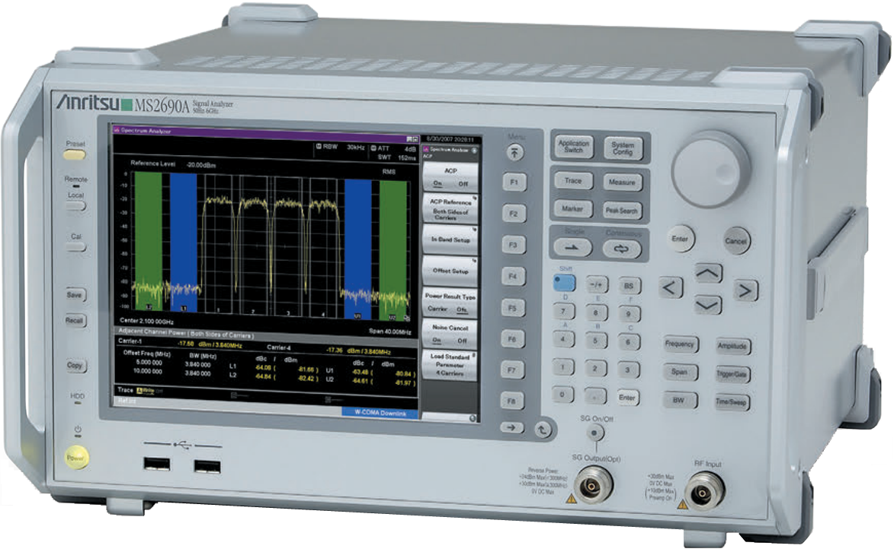
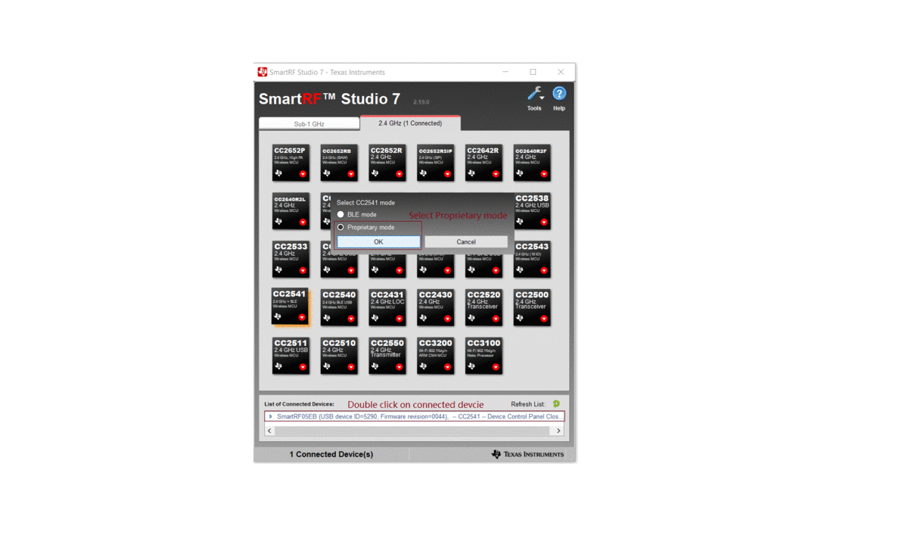
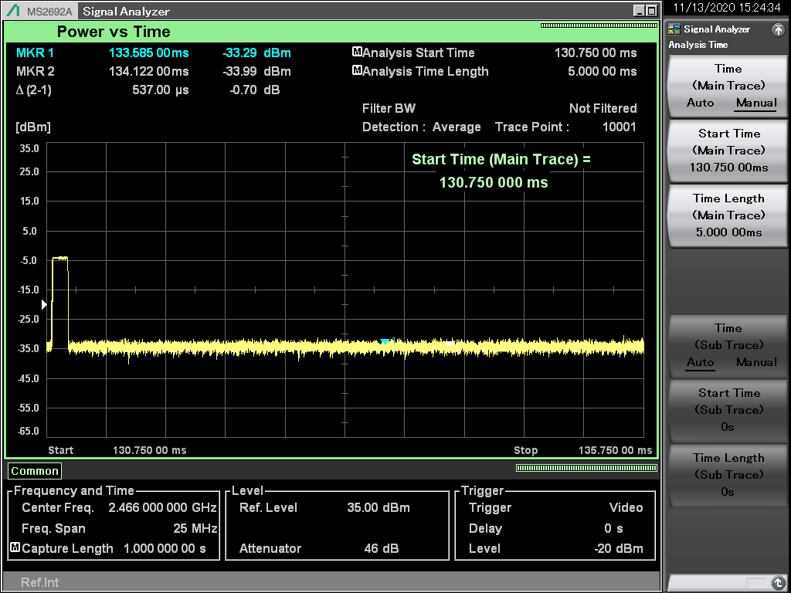
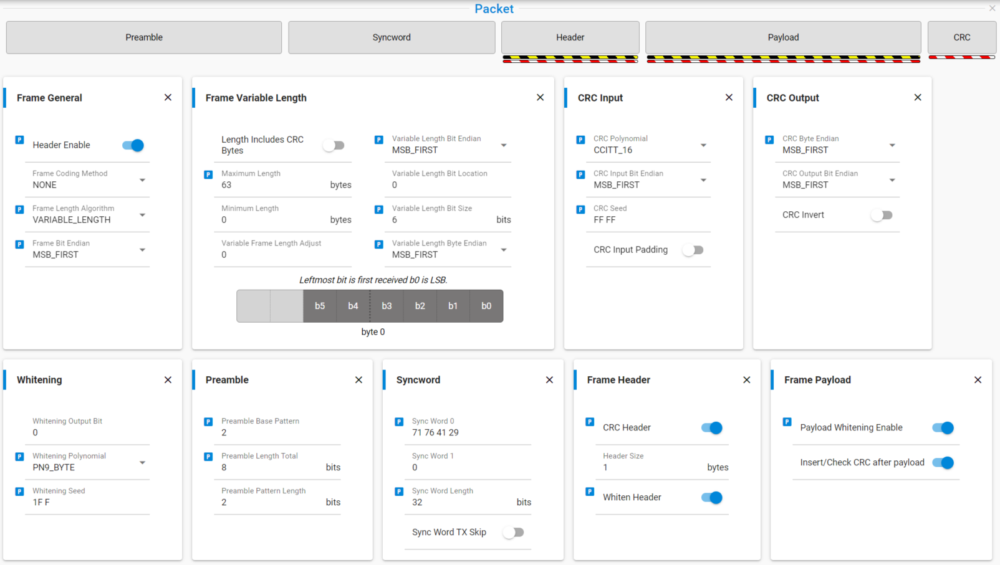
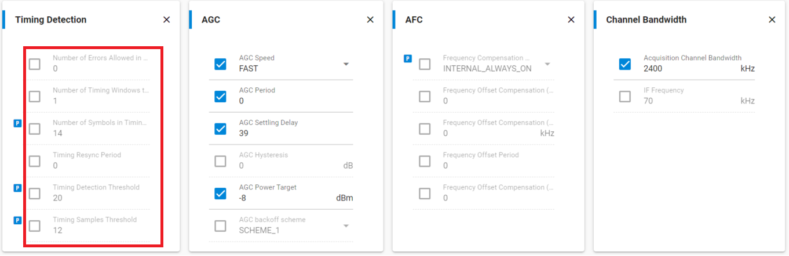
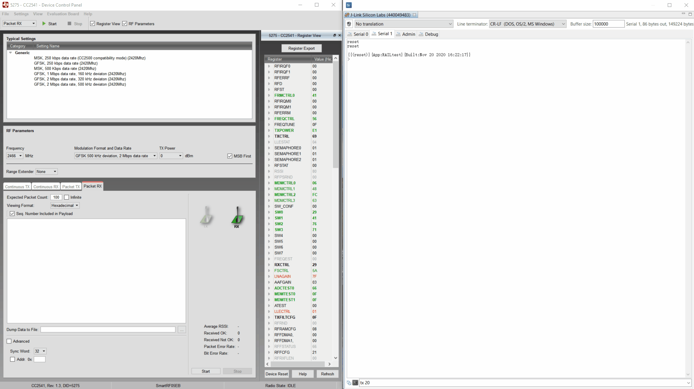
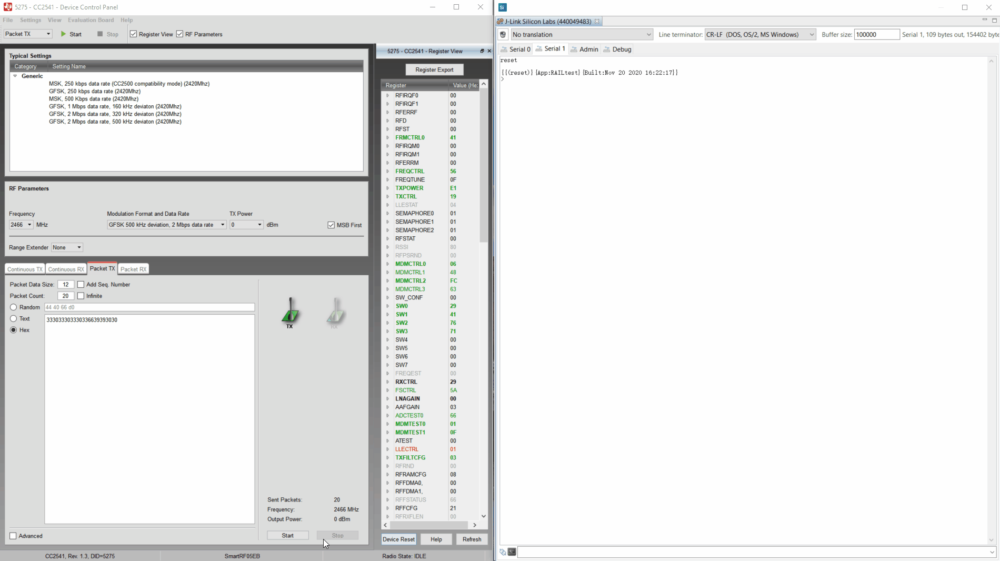

Table of Contents 

- [1. Introduction](#1-introduction)
- [2. Prerequiesite](#2-Prerequisite)
- [3. PHY Confirm](#3-PHY-Confirm)
- [4. EFR32xG22 project](#4-EFR32xG22-project)
- [5. Conclusion](#5-Conclusion)

# 1. Introduction
Sometime it has request on configure compatiable PHY for communicate with device from other vendor. Here share the experiece on configure an EFR32xG22 PHY communicate with TI CC2541 [proprietary 2.4G PHY](files/CM-Configure-TI-CC2541-compatible-proprietary-PHY/2M_BS-TX_2.xml). To communicate between 2 RF devices, the frequency, modulation, datarate, deviation, preamble, syncwork, packet format etc. must be the same.
To configure the PHY for EFR32xG22, it needs to know the detail parameters on radio configurator.

# 2. Prerequisite 

## 2.1. Hardware Requirement
* 1 [WSTK with EFR32MG22 radio boards(BRD4182A)](https://www.silabs.com/development-tools/wireless/efr32xg22-wireless-starter-kit)
* 1 SmartRF05 EB plus [CC2541EMK](https://www.ti.com/tool/CC2541EMK)
* 1 [Anritsu MS2692A](https://www.anritsu.com/en-US/test-measurement/products/ms2692a)

The BRD4182A radio board supports three wireless protocols. Bluetooth LE/Mesh, Zigbee and Proprietary. Here use it on Proprietary protocol.

    

 
CC2541EMK is same as BRD4182A, supports the Proprietary protocol to communicate with the BRD4182A, it is needed to establish the communication. And get some unknown feature from its air data.

    

 
Anritsu MS2692A, powerful tool use for checking the air data on both EFR32xG22 and CC2541.

    

 

## 2.2. Software Requirement
**Simplicity Studio** is a free Eclipse-based Integrated Development Environment (IDE) and a collection of value-add tools provided by Silicon Labs. Developers can use Simplicity Studio to develop, debug and analyze their applications. Silicon Labs recently released the [Simplicity Studio 5](https://www.silabs.com/products/development-tools/software/simplicity-studio/simplicity-studio-5) which is based on the latest versions of Eclipse and the C/C++ Development Tooling. Builds off the features of the previous version and includes advanced SecureVault technology, a new web-like interface, and solid performance improvements.  

**SmartRF™ Studio** SmartRF™ is a Windows application that helps designers of RF systems to easily evaluate the radio at an early stage in the design process for CC2xxx low-power RF devices. It simplifies generation of the configuration register values and commands, as well as practical testing and debugging of the RF system. Here use [SmartRF Studio 7](https://www.ti.com/tool/SMARTRFTM-STUDIO).

## 2.3. Given parameters
Some parameters are provided and some are get from the [xml file](files/CM-Configure-TI-CC2541-compatible-proprietary-PHY/2M_BS-TX_2.xml), the CC2541 config file that contain detail register setting. Finally it got below known parameters.
* Modulation: 2GFSK
* Datarate: 2Mbps
* Deviation 500KHz
* Preamble: 10101010 (13 bytes)
* Syncword: 0x29417671
* Payload: 64 bytes variable length
* Endian: MSB_FIRST
* CRC polynomial: CCITT_16(0x1021)
* CRC seed: 0xFFFF
* Whitening polynomial: PN9_BYTE
* Whitening seed: 0xFF

# 3. PHY Confirm
Try to configure a PHY according to above known parameters. The PHY doesn't work, even can not detect the preamble, so it is worth to analyze data transmit from CC2541.

## 3.1. Transmit data by SmartRF Studio 7
Below GIF file show how to open a config file and transmit RF data on SmartRF Studio 7.

    

 
For easier figure out the frame, it is worth to disable the whitening and set some special data bit on the frame, like add 0x00/0xFF.

    

 

## 3.2. Capture data on MS2692A
To get a readable frame data on MS2692A, it needs to configure the frequency, reference power level etc. accordingly.
### 3.2.1 Use "Power vs Time" trace mode to get the TX pluse

    

 

### 3.2.2 Change the "Start Time" to locate one pluse

    

 

### 3.2.3 Zoom in

    

 

### 3.2.4 Use "Frequency vs Time" trace mode, the whole frame will be show up.
Time between Marker1 and Marker2 is 52us. This should be the preamble time. 13bytes preamble, 2Mbps means one bit take 0.5us, 13x8x0.5us=52us. The MS2629A only detect 1 byte preamble and got 48us CW signal. Still not know the reason, but checking only TI BLE PHY, it got the same issue. This's why it has configured according to given parameters but our EFR32 device can not detect the preamble.

    

 

### 3.2.5 Read the frame data.
Once the Preamble can be located, the frame data should be readable, just try to sampling the data bit for each 0.5us interval.

    

 

# 4. EFR32xG22 Project
After checking the CC2541 frame data, knon detail parameters setting on radio configurator, now it can create and configure on our EFR32xG22 project, here use "Flex (RAIL) - RAILtest" example on SSv5.

    

 

## 4.1. Customize the PHY
Double click radio config file -- "radio_settings.radioconf", select one preset PHY(2450M 2GFSK 2Mbps 1M), then check on "Customized", target PHY's center frequency is 2466MHz, first change frequency to 2466MHz.

    

 
Configure according to target PHY. 2Mbps data rate, 500KHz deviation. Configure flexible payload length, use CCITT_16(0x1021) CRC polynomial and 0xFFFF CRC seed. Enable whitening, the given whitening seed is 0xFF, but according to test result it shoulds use 0x01FF on our radio configurator. The Preamble set 8 bit here.

    

 

It only got 8 bits preamble, according to [AN1253](https://www.silabs.com/documents/public/application-notes/an1253-efr32-radio-configurator-guide-for-ssv5.pdf), timing detect on preamble should be disable.

    

 
Uncheck "Number of Symbols in Timing Window" for disable RX side preamble detection, use syncword for timing dectection.

    

 

Left the other parameter as default, the PHY is done. Save and build, now then software is ready.  
For more infromation on radio configurator, refer to [AN1253](https://www.silabs.com/documents/public/application-notes/an1253-efr32-radio-configurator-guide-for-ssv5.pdf). 

## 4.2. Confirm the PHY
TI CC2541 RX, EFR32 TX, 20 packets.

    

 
TI CC2541 TX, EFR32 RX, 20 packets.

    

 

For more information on CLI command, refer to [UG409](https://www.silabs.com/documents/public/user-guides/ug409-railtest-users-guide.pdf).

# 5. Conclusion
By checking PHY configuration from CC2541 TX on MS2692A, and tried several times on its CRC and Whitening configuration, know the parameters on radio configurator, it can get a compatible PHY for both sides.
