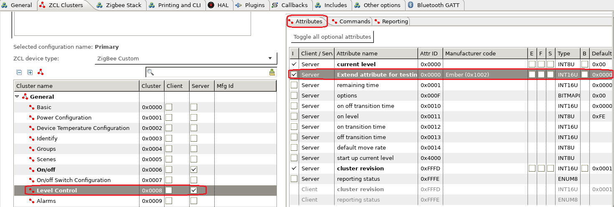
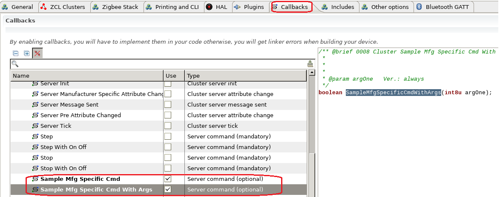
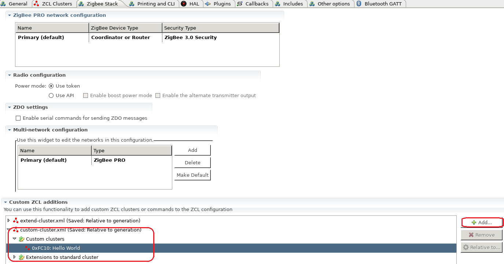
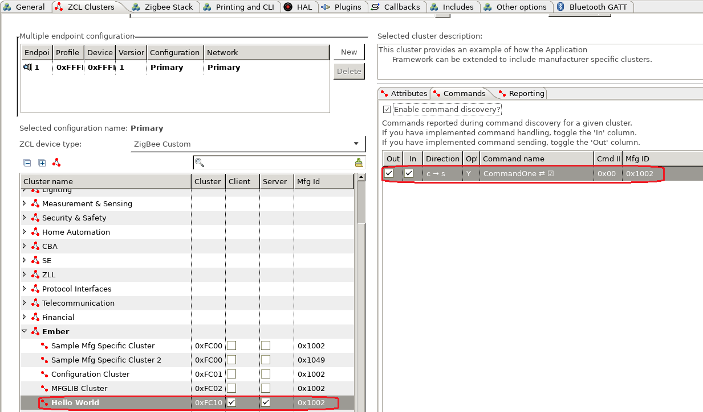

English | [中文](Zigbee-Custom-Clusters-CN)  

<details>
<summary><font size=5>Table of Contents</font> </summary>
&nbsp;  

- [1. Introduction](#1-introduction)
  - [1.1. Extensibility of Zigbee Clusters](#11-extensibility-of-zigbee-clusters)
  - [1.2. Clusters in EmberZnet SDK](#12-clusters-in-emberznet-sdk)
- [2. Extend the Standard Clusters](#2-extend-the-standard-clusters)
  - [2.1. Define the Extended Attributes and Commands](#21-define-the-extended-attributes-and-commands)
    - [2.1.1. Understanding the XML file](#211-understanding-the-xml-file)
    - [2.1.2. Create XML File to Extend Standard Clusters](#212-create-xml-file-to-extend-standard-clusters)
  - [2.2. Add the xml of the Extended Cluster into the Project](#22-add-the-xml-of-the-extended-cluster-into-the-project)
  - [2.3. Test](#23-test)
- [3. Add a Custom Cluster](#3-add-a-custom-cluster)
  - [3.1. Define the Custom Cluster](#31-define-the-custom-cluster)
  - [3.2. Add the xml of the Custom Cluster into the Project](#32-add-the-xml-of-the-custom-cluster-into-the-project)
  - [3.3. Test](#33-test)
- [4. Reference](#4-reference)
</details>
&nbsp; 

## 1. Introduction
### 1.1. Extensibility of Zigbee Clusters
Zigbee Alliance has defined a lot a standard clusters. It also allow manufactures to customize their own clusters if needed. In this guide, we will introduce how we extend clusters in EmberZnet. The are two scenarios of extending the clusters:  
- Extend the attributes or commands on a standard cluster
- Create a completely new custom cluster

**Please keep in mind that in either scenario, the functionalities based on the custom clusters can only inter-operate with products with these custom clusters, which means your products can only inter-operate with your own products. We recommend you use custom clusters only when you have to.**

&nbsp;

As defined in [ZCL Spec](https://zigbeealliance.org/wp-content/uploads/2019/12/07-5123-06-zigbee-cluster-library-specification.pdf), some values of the cluster ID are reserved for manufactures.  

|Cluster Identifier|Descripton|
|:-|:-|
|0x0000 – 0x7fff|Standard cluster|
|0xfc00 – 0xffff|Manufacturer specific cluster|
|all other values|Reserved|

### 1.2. Clusters in EmberZnet SDK
Zibgee clusters are defined in xml files in EmberZnet. The xml files can be found at **app\zcl** directory under the root directory of your SDK.  
e.g.  
```
C:\SiliconLabs\SimplicityStudio\v4\developer\sdks\gecko_sdk_suite\v2.7\app\zcl
```

You may take one of them as an example. e.g, the xml file **general.xml** defines the general clusters, like basic, identify, groups, scenes, on/off, etc.  

&nbsp; 

## 2. Extend the Standard Clusters
Extending standard clusters means we are going to add custom attributes or commands to the standard clusters.  

### 2.1. Define the Extended Attributes and Commands
First, you need to create a xml file. Edit this file to define the attributes and commands which you are going to customize. 

#### 2.1.1. Understanding the XML file
We already have an example which is **sample-extensions.xml** in the **app\zcl** directory. 
``` xml
  <!-- Use the cluster extension Extend the on/off cluster -->
  <clusterExtension code="0x0006"> 
    <attribute side="server" code="0x0000" 
      define="SAMPLE_MFG_SPECIFIC_TRANSITION_TIME" 
      type="INT16U" min="0x0000" max="0xFFFF" writable="true" 
      default="0x0000" optional="true" 
      manufacturerCode="0x1002">Sample Mfg Specific Attribute: 0x0000 0x1002</attribute>
    <attribute side="server" code="0x0000" 
      define="SAMPLE_MFG_SPECIFIC_TRANSITION_TIME_2" 
      type="INT8U" min="0x0000" max="0xFFFF" writable="true" 
      default="0x0000" optional="true" 
      manufacturerCode="0x1049">Sample Mfg Specific Attribute: 0x0000 0x1049</attribute>
    <attribute side="server" code="0x0001" 
      define="SAMPLE_MFG_SPECIFIC_TRANSITION_TIME_3" 
      type="INT8U" min="0x0000" max="0xFFFF" writable="true" 
      default="0x00" optional="true" 
      manufacturerCode="0x1002">Sample Mfg Specific Attribute: 0x0001 0x1002</attribute>
    <attribute side="server" code="0x0001" 
      define="SAMPLE_MFG_SPECIFIC_TRANSITION_TIME_4" 
      type="INT16U" min="0x0000" max="0xFFFF" writable="true" 
      default="0x0000" optional="true" 
      manufacturerCode="0x1049">Sample Mfg Specific Attribute: 0x0001 0x1040</attribute>

    <command source="client" code="0x00" 
      name="SampleMfgSpecificOffWithTransition" optional="true" manufacturerCode="0x1002">
      <description>Client command that turns the device off with a transition given
        by the transition time in the Ember Sample transition time attribute.</description>
    </command>
    <command source="client" code="0x01" 
      name="SampleMfgSpecificOnWithTransition" optional="true" manufacturerCode="0x1002">
      <description>Client command that turns the device on with a transition given
        by the transition time in the Ember Sample transition time attribute.</description>
    </command>
    <command source="client" code="0x02" 
      name="SampleMfgSpecificToggleWithTransition" optional="true" manufacturerCode="0x1002">
      <description>Client command that toggles the device with a transition given
        by the transition time in the Ember Sample transition time attribute.</description>
    </command>
        <command source="client" code="0x01" 
      name="SampleMfgSpecificOnWithTransition2" optional="true" manufacturerCode="0x1049">
      <description>Client command that turns the device on with a transition given
        by the transition time in the Ember Sample transition time attribute.</description>
    </command>
    <command source="client" code="0x02" 
      name="SampleMfgSpecificToggleWithTransition2" optional="true" manufacturerCode="0x1049">
      <description>Client command that toggles the device with a transition given
        by the transition time in the Ember Sample transition time attribute.</description>
    </command>
  </clusterExtension>
```
In this sample, we extend the standard on/off clusters by adding some attribtues and commands. 
The attributes below is customized:  
<div align="center">
  
</div>
</br>

The commands below is customized:
<div align="center">
  
</div>
</br>

**Notes:**
- The extended attribute ID and command ID can be the same with the standard ones as these extended attributes and commands are only applicable to the products with the specified manufacture code. 
- The extended attribute ID and command ID from different manufactures can be the same.
- All extended attributes and commands must be optional.

#### 2.1.2. Create XML File to Extend Standard Clusters
As a test, we extend an attribute and a command of the "level" control cluster. Below is the content of the xml:  
``` xml
<configurator>
  <domain name="Test" />
  
  <!-- Use the cluster extension Extend the on/off cluster -->
  <clusterExtension code="0x0008"> 
    <attribute side="server" code="0x0000" 
      define="SAMPLE_MFG_SPECIFIC_ATTRIBUTE" 
      type="INT16U" min="0x0000" max="0xFFFF" writable="true" 
      default="0x0000" optional="true" 
      manufacturerCode="0x1002">Extend attribute for testing.</attribute>

    <command source="client" code="0x00" 
      name="SampleMfgSpecificCmd" optional="true" manufacturerCode="0x1002">
      <description>Extend command for testing.</description>
    </command>
    <command source="client" code="0x01" 
      name="SampleMfgSpecificCmdWithArgs" optional="true" manufacturerCode="0x1002">
      <description>Extend command with args for testing.</description>
	  <arg name="argOne" type="INT8U" />
    </command>	
  </clusterExtension>
  
</configurator>
```

### 2.2. Add the xml of the Extended Cluster into the Project
Put the xml file of your customization to the project folder, then turn to "Zigbee Stack" tab, in the bottom, there is a panel about "Custom ZCL additions". Click the button "Add" and then select the xml file to add it into the project.
<div align="center">
  
</div>
</br>

After that, check if you can find the extended attribute and the extended command in "ZCL Clusters" tab.
<div align="center">
  
</div>
</br>

<div align="center">
  
</div>
</br>

### 2.3. Test
Build a project with the server side of cluster "level control" enabled, and another project with the client side of cluster "level control" enabled. On the server project, check the callback "Sample Mfg Specific Cmd" and "Sample Mfg Specific Cmd With Args" to test.
<div align="center">
  
</div>
</br>

In \<projectname\>_callbacks.c, add the implementation of the two callbacks:
``` C
boolean emberAfLevelControlClusterSampleMfgSpecificCmdCallback(void)
{
	emberAfCorePrintln("[%s] called", __func__);
	return true;
}

boolean emberAfLevelControlClusterSampleMfgSpecificCmdWithArgsCallback(int8u argOne)
{
	emberAfCorePrintln("[%s] called argOne=%X", __func__, argOne);
	return true;
}
```

**Note:** Pay attention that the name of callback function of the extended clusters might not be exactly the same with the command name. This depends on the Simplicity Studio version you are using now. It's recommended to read the source code of the generated file "call-command-handler.c", then in function "emberAfClusterSpecificCommandParse", find the cluster you extended, and the command you added, then you will find the callback function name here. The callbacks will be called here. 

In this test, we use the coordinator as the server side. We add a custom command to send the two extended commands of "level control" cluster. (You can refer to [Customizing CLI Command](Zigbee-Custom-CLI-Commands) if you don't know how to add custom commands.)  
``` C
static void custom_test_noargcmd()
{
	EmberStatus status;

	emberAfFillCommandLevelControlClusterSampleMfgSpecificCmd();
    emberAfSetCommandEndpoints(1, 1);
	status = emberAfSendCommandUnicast(EMBER_OUTGOING_DIRECT, 0x0000);
	emberAfCorePrintln("send custom level control cmd with no args, status=%X", status);
}

static void custom_test_1argcmd()
{
	EmberStatus status;
	int8_t arg = emberSignedCommandArgument(0);

	emberAfFillCommandLevelControlClusterSampleMfgSpecificCmdWithArgs(arg);
    emberAfSetCommandEndpoints(1, 1);
	status = emberAfSendCommandUnicast(EMBER_OUTGOING_DIRECT, 0x0000);
	emberAfCorePrintln("send custom level control cmd with 1 arg=%X, status=%X", arg, status);
}

EmberCommandEntry emberAfCustomCommands[] = {
  emberCommandEntryAction("test_cmd_noarg", custom_test_noargcmd, "", ""),
  emberCommandEntryAction("test_cmd_1arg", custom_test_1argcmd, "s", ""),
  emberCommandEntryTerminator()
};
```

Join the client and the server into a network. 
On the client side, run the following commands:
```
custom test_cmd_noarg
custom test_cmd_1arg 100
```

Then on the server side, you will see the following output:
```
T00000000:RX len 5, ep 01, clus 0x0008 (Level Control) mfgId 1002 FC 05 seq 03 cmd 00 payload[]
[emberAfLevelControlClusterSampleMfgSpecificCmdCallback] called
Processing message: len=6 profile=FFFF cluster=0008

T00000000:RX len 6, ep 01, clus 0x0008 (Level Control) mfgId 1002 FC 05 seq 04 cmd 01 payload[64 ]
[emberAfLevelControlClusterSampleMfgSpecificCmdWithArgsCallback] called argOne=64
```

In the sniffer, you can find the detail info about these two commands.
<div align="center">
  
</div>
</br>

## 3. Add a Custom Cluster
### 3.1. Define the Custom Cluster
To add a custom cluster, we need to define it in xml first. We also have an example which is **sample-extensions.xml** in the **app\zcl** directory. 
``` xml
  <cluster manufacturerCode="0x1002">
    <name>Sample Mfg Specific Cluster</name>
    <domain>Ember</domain>
    <description>This cluster provides an example of how the Application 
      Framework can be extended to include manufacturer specific clusters.
      </description>
    <!-- Cluster Id must be within the mfg spec range 0xfc00 - 0xffff -->
    <code>0xFC00</code> 
    <define>SAMPLE_MFG_SPECIFIC_CLUSTER</define>
    <client init="false" tick="false">true</client>
    <server init="false" tick="false">true</server>
    <attribute side="server" code="0x0000" define="ATTRIBUTE_ONE" 
      type="INT8U"  min="0x00"   max="0xFF"   writable="true"  
      default="0x00" optional="true">ember sample attribute</attribute>

    <attribute side="server" code="0x0001" define="ATTRIBUTE_TWO" 
      type="INT8U"  min="0x00"   max="0xFF"   writable="true"  
      default="0x00" optional="true">ember sample attribute 2</attribute>
    <command source="client" code="0x00" 
      name="CommandOne" 
      optional="true">
      <description>
        A sample manufacturer specific command within the sample manufacturer specific
        cluster.
      </description>
      <arg name="argOne" type="INT8U" />
    </command>
  </cluster>
```
In this sample, we defined a custom cluster with the manufacture code 0x1002. The cluster ID is 0xFC00 and there are two attributes and one command defined in it.  

As a test, we can define a custom cluster like below:
``` xml
<configurator>
  <domain name="Test" />
  
  <cluster manufacturerCode="0x1002">
    <name>Hello World</name>
    <domain>Ember</domain>
    <description>This cluster provides an example of how the Application 
      Framework can be extended to include manufacturer specific clusters.
      </description>
    <!-- Cluster Id must be within the mfg spec range 0xfc00 - 0xffff -->
    <code>0xFC10</code> 
    <define>SAMPLE_MFG_SPECIFIC_HELLOWORLD_CLUSTER</define>
    <client init="false" tick="false">true</client>
    <server init="false" tick="false">true</server>
    <attribute side="server" code="0x0000" define="ATTRIBUTE_ONE" 
      type="CHAR_STRING"  min="0x00"   max="0xFF"   writable="true"  
      default="" optional="true">ember sample attribute</attribute>
    <command source="client" code="0x00" 
      name="CommandOne" 
      optional="true">
      <description>
        A sample manufacturer specific command within the sample manufacturer specific
        cluster.
      </description>
      <arg name="argOne" type="CHAR_STRING" />
    </command>
  </cluster>
  
</configurator>
```

### 3.2. Add the xml of the Custom Cluster into the Project
Put the xml file of your customization to the project folder, then turn to "Zigbee Stack" tab, in the bottom, there is a panel about "Custom ZCL additions". Click the button "Add" and then select the xml file to add it into the project.
<div align="center">
  
</div>
</br>

After that, check if you can find the custom cluster as well as the attribute and  command in "ZCL Clusters" tab.
<div align="center">
  
</div>
</br>

<div align="center">
  
</div>
</br>

### 3.3. Test
Build a project with the server side of the custom cluster "Hello World" enabled, and another project with the client side of the custom cluster "Hello World" enabled. On the server project, check the callback "Command One" to test. 
<div align="center">
  
</div>
</br>

In \<projectname\>_callbacks.c, add the implementation of the callback:
``` C
boolean emberAfSampleMfgSpecificHelloworldClusterCommandOneCallback(int8u* argOne)
{
	emberAfCorePrintln("[%s] called argOne=%s", __func__, argOne);
	return true;
}
```

In this test, we use the coordinator as the server side. We add a custom command on the client side to send the command of customized cluster. (You can refer to [Customizing CLI Command](Zigbee-Custom-CLI-Commands) if you don't know how to add custom commands.)  
``` C
static void custom_helloworld_cmd()
{
	EmberStatus status;
	uint8_t length;
  char buffer[128];
	uint8_t *arg = emberStringCommandArgument(0, &length);

  if (length >= sizeof(buffer)) {
    emberAfCorePrintln("input string too long, length=%d", length);
    return;
  }

  //for string arguments, first byte is the length
  buffer[0] = length;
  memcpy(&buffer[1], arg, length);
    
	emberAfFillCommandSampleMfgSpecificHelloworldClusterCommandOne(buffer);
  emberAfSetCommandEndpoints(1, 1);
	status = emberAfSendCommandUnicast(EMBER_OUTGOING_DIRECT, 0x0000);
	emberAfCorePrintln("send custom helloworld cmd with 1 status=%X", status);
}

EmberCommandEntry emberAfCustomCommands[] = {
  emberCommandEntryAction("helloworld_cmd", custom_helloworld_cmd, "b", ""),
  emberCommandEntryTerminator()
};
```

Join the client and the server into a network. 
On the client side, run the following commands:
```
custom helloworld_cmd "hello world"
```

Then on the server side, you will see the following output:
```
T00000000:RX len 17, ep 01, clus 0xFC10 (Hello World) mfgId 1002 FC 05 seq 00 cmd 00 payload[0B 68 65 6C 6C 6F 20 77 6F 72 6C 64 ]
[emberAfSampleMfgSpecificHelloworldClusterCommandOneCallback] called argOne=hello world
```

In the sniffer, you can find the detail info about the custom command.
<div align="center">
  
</div>
</br>

## 4. Reference
- [Zigbee Cluster Library Specification](https://zigbeealliance.org/wp-content/uploads/2019/12/07-5123-06-zigbee-cluster-library-specification.pdf)
