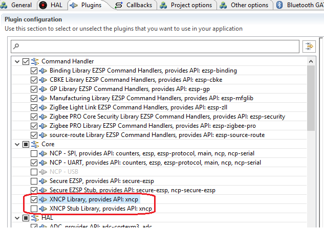
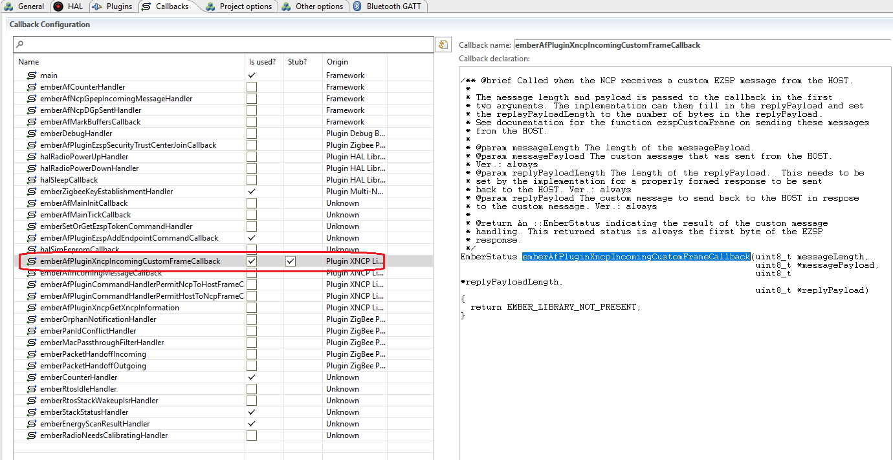
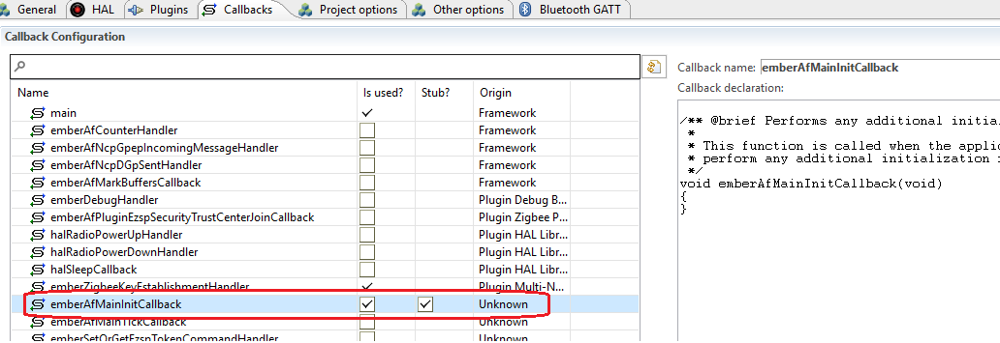
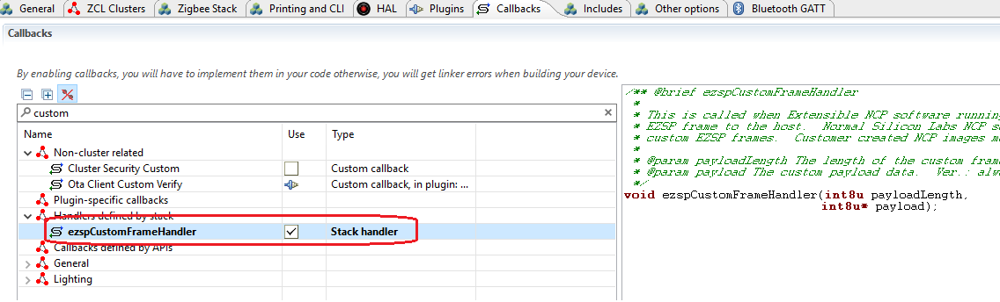

<details>
<summary><font size=5>Table of Contents</font> </summary>
&nbsp;  

- [Customize EZSP Command](#customize-ezsp-command)
  - [1. Introduction](#1-introduction)
  - [2. Custom EZSP Command](#2-custom-ezsp-command)
    - [2.1. Custom EZSP Command from Host to NCP.](#21-custom-ezsp-command-from-host-to-ncp)
      - [2.1.1. Setup the Host Side](#211-setup-the-host-side)
      - [2.1.2. Setup the NCP Side](#212-setup-the-ncp-side)
    - [2.2. Custom EZSP report from NCP to Host.](#22-custom-ezsp-report-from-ncp-to-host)
      - [2.2.1 Setup the NCP](#221-setup-the-ncp)
      - [2.2.2 Setup the Host](#222-setup-the-host)
  - [3. Reference](#3-reference)
</details>
&nbsp; 

# Customize EZSP Command

## 1. Introduction
As we know, host processor communicates with NCP through EZSP (EmberZnet Serial Protocol). The EZSP protocol is detailly introduced in [UG100](https://www.silabs.com/documents/public/user-guides/ug100-ezsp-reference-guide.pdf). Sometimes, customers will need to add their own EZSP command to implement manufacture specific functions. In this page, we will introduce how to achieve that.

## 2. Custom EZSP Command
### 2.1. Custom EZSP Command from Host to NCP.
In most case, we will initiate a get/set command from the host side.

#### 2.1.1. Setup the Host Side
On the host side, we will use the API function `ezspCustomFrame` to send the custom EZSP command. It's prototype is like this:
``` C
// Provides the customer a custom EZSP frame. On the NCP, these frames are only
// handled if the XNCP library is included. On the NCP side these frames are
// handled in the emberXNcpIncomingCustomEzspMessageCallback() callback
// function.
// Return: The status returned by the custom command.
EmberStatus ezspCustomFrame(
  // The length of the custom frame payload (maximum 119 bytes).
  uint8_t payloadLength,
  // The payload of the custom frame.
  uint8_t *payload,
  // Return: The length of the response.
  uint8_t *replyLength,
  // Return: The response.
  uint8_t *reply);
```

Below is an example on the host side:
``` C
typedef enum
{
  XNCP_CMD_SET_LED_STATE  = 0x0,
  XNCP_CMD_GET_GPIO_STATE = 0x1,
}CUSTOM_EZSP_CMD;

static void custom_cmd_setled()
{
  EmberStatus status;
  uint8_t     commandLength = 0;
  uint8_t     commandpayload[16] = {0};
  uint8_t     replyPayload[16] = {0};
  uint8_t     replyLength = sizeof(replyPayload);
  uint8_t     led = (uint8_t)emberSignedCommandArgument(0);
  uint8_t     state = (uint8_t)emberSignedCommandArgument(1);

  commandpayload[commandLength++] = XNCP_CMD_SET_LED_STATE;
  commandpayload[commandLength++] = led;
  commandpayload[commandLength++] = state;

  status = ezspCustomFrame(commandLength, commandpayload, &replyLength, replyPayload);
  emberAfCorePrintln("Send custom ezsp 0x%X status=0x%X", XNCP_CMD_SET_LED_STATE, status);
}

static void custom_cmd_getgpio()
{
  EmberStatus status;
  uint8_t     commandLength = 0;
  uint8_t     commandpayload[16] = {0};
  uint8_t     replyPayload[16] = {0};
  uint8_t     replyLength = sizeof(replyPayload);
  uint8_t     gpioPort = (uint8_t)emberSignedCommandArgument(0);
  uint8_t     gpioPin = (uint8_t)emberSignedCommandArgument(1);

  commandpayload[commandLength++] = XNCP_CMD_GET_GPIO_STATE;
  commandpayload[commandLength++] = gpioPort;
  commandpayload[commandLength++] = gpioPin;

  status = ezspCustomFrame(commandLength, commandpayload, &replyLength, replyPayload);
  uint8_t state = replyPayload[0];
  emberAfCorePrintln("Send custom ezsp 0x%X status=0x%X state=%d", XNCP_CMD_GET_GPIO_STATE, status, state);
}

EmberCommandEntry emberAfCustomCommands[] = {
  emberCommandEntryAction("setled", custom_cmd_setled, "uu", ""),
  emberCommandEntryAction("getgpio", custom_cmd_getgpio, "uu", ""),
  emberCommandEntryTerminator()
};
```

You can define the custom data format by yourself. 

#### 2.1.2. Setup the NCP Side
On the NCP side, the custom command will be handled only if the plugin `XNCP Library` is enabled. 
<div align="center">
  
</div>
</br>

The custom EZSP command will be handled in the callback `emberAfPluginXncpIncomingCustomFrameCallback`. You have to enable this callback first.
<div align="center">
  
</div>
</br>

Below is an example about the callback implementation:
``` C

typedef enum
{
  XNCP_CMD_SET_LED_STATE  = 0x0,
  XNCP_CMD_GET_GPIO_STATE = 0x1,
}CUSTOM_EZSP_CMD;


/** @brief Called when the NCP receives a custom EZSP message from the HOST.
 *
 * The message length and payload is passed to the callback in the first
 * two arguments. The implementation can then fill in the replyPayload and set
 * the replayPayloadLength to the number of bytes in the replyPayload.
 * See documentation for the function ezspCustomFrame on sending these messages
 * from the HOST.
 *
 * @param messageLength The length of the messagePayload.
 * @param messagePayload The custom message that was sent from the HOST.
 * Ver.: always
 * @param replyPayloadLength The length of the replyPayload.  This needs to be
 * set by the implementation for a properly formed response to be sent
 * back to the HOST. Ver.: always
 * @param replyPayload The custom message to send back to the HOST in respose
 * to the custom message. Ver.: always
 *
 * @return An ::EmberStatus indicating the result of the custom message
 * handling. This returned status is always the first byte of the EZSP
 * response.
 */
EmberStatus emberAfPluginXncpIncomingCustomFrameCallback(uint8_t messageLength,
                                                         uint8_t *messagePayload,
                                                         uint8_t *replyPayloadLength,
                                                         uint8_t *replyPayload) {
  // First byte is the command ID.
  uint8_t commandId = messagePayload[0];

  *replyPayloadLength = 0;

  switch (commandId) {
    case XNCP_CMD_SET_LED_STATE:
      {
        uint8_t led = messagePayload[1];
        uint8_t state = messagePayload[2];
        if (state) {
            halSetLed(led);
        } else {
            halClearLed(led);
        }

        replyPayload[0] = 0;
        *replyPayloadLength += 1;
      }
      break;

    case XNCP_CMD_GET_GPIO_STATE:
      {
        uint8_t gpioPort = messagePayload[1];
        uint8_t gpioPin = messagePayload[2];
        uint8_t state = GPIO_PinOutGet(gpioPort, gpioPin);
        replyPayload[0] = state;
        *replyPayloadLength += sizeof(state);
      }
      break;

    default:
      break;
  }
}
```

### 2.2. Custom EZSP report from NCP to Host.
Sometimes, we will need to send data actively from NCP to host. In this case, we will use a different approach. In this case, the NCP will initiate the command.

#### 2.2.1 Setup the NCP
We will use the API function `emberAfPluginXncpSendCustomEzspMessage` to send custom message from NCP to host side. This API function is provided by the plugin `XNCP Library`, so you have to enable this plugin first.

We will add a custom event to send a custom message from NCP to host periodically. 
<div align="center">
  
</div>
</br>

We will activate this event in the callback `emberAfMainInitCallback`, so you will need to enable this callback as well.
<div align="center">
  
</div>
</br>

Implement the callback and the event handler like below:
``` C
typedef enum
{
  XNCP_CMD_SET_LED_STATE  = 0x0,
  XNCP_CMD_GET_GPIO_STATE = 0x1,
  XNCP_CMD_REPORT_MSG     = 0x2,
}CUSTOM_EZSP_CMD;

EmberEventControl customEventData;

void customEventHandler()
{
  uint8_t msg[16];

  emberEventControlSetInactive(customEventData);

  msg[0] = XNCP_CMD_REPORT_MSG;
  snprintf(&msg[1], sizeof(msg)-2, "Hello host!");
  emberAfPluginXncpSendCustomEzspMessage(sizeof(msg), msg);

  emberEventControlSetDelayMS(customEventData, 5000);
}

void emberAfMainInitCallback(void)
{
  emberEventControlSetDelayMS(customEventData, 5000);
}
```

#### 2.2.2 Setup the Host
On the host side, we will handle the custom EZSP report in callback `ezspCustomFrameHandler`. You have to enable this callback first. 
<div align="center">
  
</div>
</br>

Below is an example of the implementation of this callback:
``` C
void ezspCustomFrameHandler(int8u payloadLength, int8u* payload)
{
      int8u cmd = payload[0];
      if (XNCP_CUSTOM_REPORT_HELLO_CMD == cmd) {
            emberAfCorePrintln("Ncp report:%s", &payload[1]);
      }
}
```

## 3. Reference
- [UG100: EZSP Reference Guide](https://www.silabs.com/documents/public/user-guides/ug100-ezsp-reference-guide.pdf)
- [AN1010: Customized NCP](https://www.silabs.com/documents/public/application-notes/an1010-customized-ncp.pdf)
