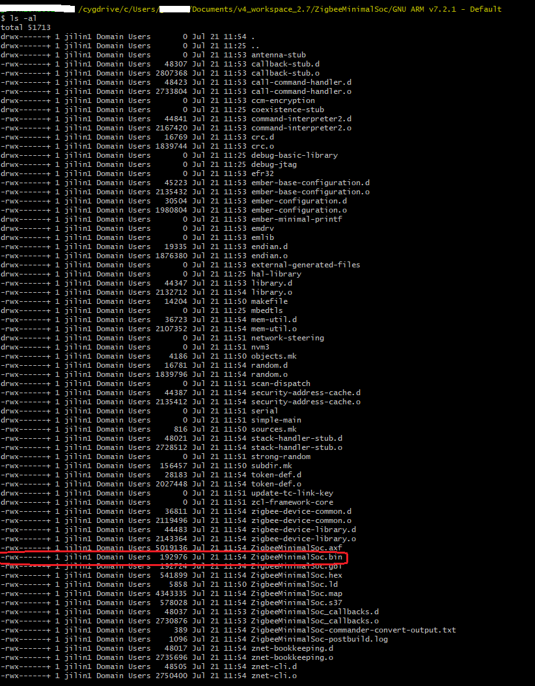
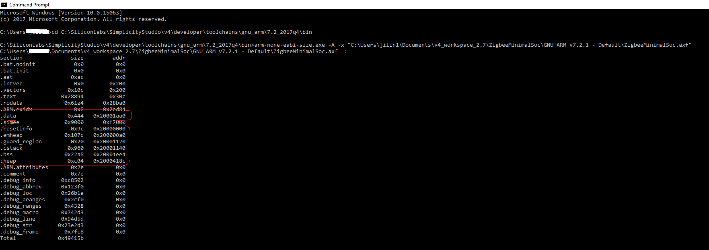

<details>
<summary><font size=5>Table of Contents</font> </summary>
&nbsp;  

- [1. Introduction](#1-introduction)
- [2. Flash Ultilization](#2-flash-ultilization)
- [3. RAM Ultilization](#3-ram-ultilization)

</details>
&nbsp; 

# 1. Introduction
It's important to make it clear about how much flash or RAM is used in the application. This page will introduce the approaches of getting the flash and RAM ultilization of a common Zigbee application.

# 2. Flash Ultilization
It's quite simple to get the flash ultilization of a Zigbee application. When your project is built, a .bin file will be generated. This .bin file is the application binary and it will be flashed into the device. So the file size is the used flash size.

<div align="center">
    
</div>  
</br>

# 3. RAM Ultilization
At the end of the compiling log, there is a info about the size of each section of the built object file.
```
arm-none-eabi-size "ZigbeeMinimalSoc.axf" -A
ZigbeeMinimalSoc.axf  :
section              size        addr
.bat.noinit             0           0
.bat.init               0           0
.aat                  172           0
.intvec                 0         512
.vectors              268         512
.text              166036         780
.rodata             25060      166816
.ARM.exidx              8      191876
.data                1092   536877728
.simee              36864     1011712
.resetinfo            156   536870912
.emheap              4220   536871072
.guard_region          32   536875296
.cstack              2400   536875328
.bss                 8872   536878820
.heap                3076   536887692
.ARM.attributes        46           0
.comment              126           0
.debug_info        820482           0
.debug_abbrev       74736           0
.debug_loc         158490           0
.debug_aranges      11504           0
.debug_ranges       17192           0
.debug_macro       475859           0
.debug_line        609629           0
.debug_str        2351827           0
.debug_frame        32712           0
Total             4800859
```

As we know, the flash space starts from address 0x0 and the RAM space starts from address 0x20000000. Therefore, we can know which sections will be placed in RAM by the address of the elf sections. Those sections whose address are above 0x20000000 are located in RAM. The sum of the size of these sections are the total RAM ultilization.

If the compiling log is missed, you can analyze the built elf file (.axf file is built with GCC or .out file if built with IAR). Below are the steps:
1. Start a CMD window, change to directory **C:\SiliconLabs\SimplicityStudio\v4\developer\toolchains\gnu_arm\7.2_2017q4\bin**

2. Run **arm-none-eabi-size.exe** to analyze the sections of the elf file.
e.g

<div align="center">
    
</div>  
</br>

