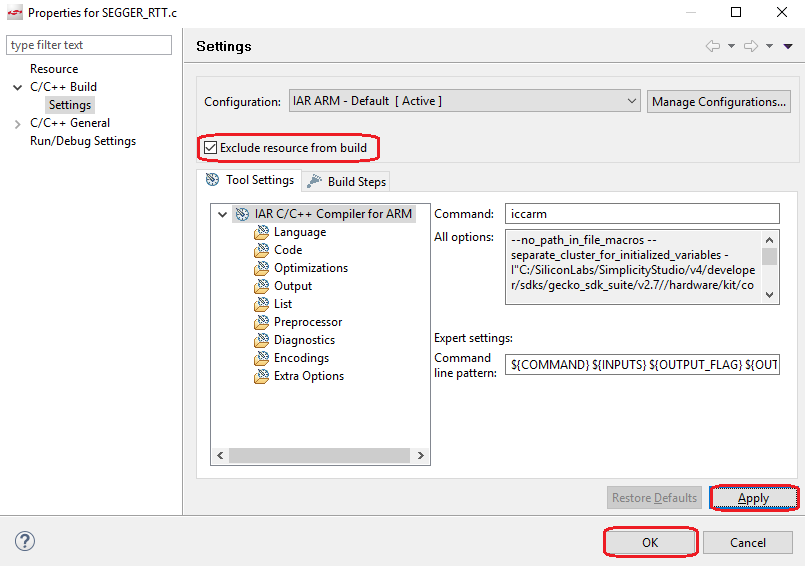
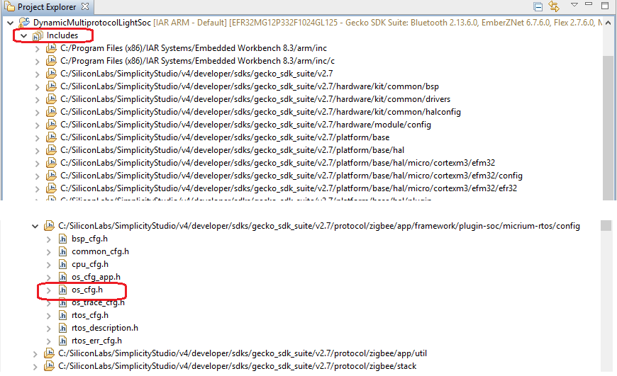
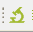
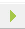
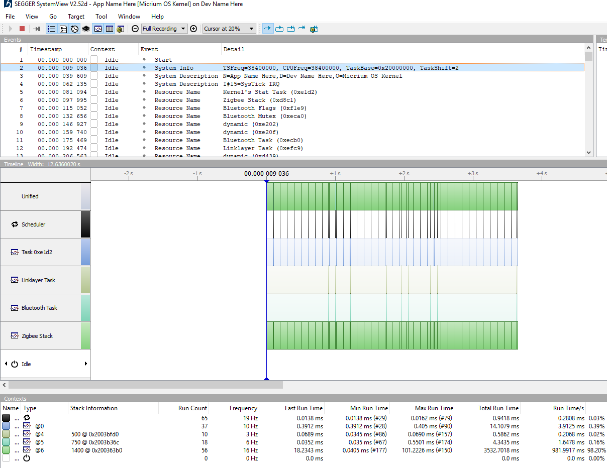

<details>
<summary><font size=5>Table of Contents</font> </summary>
&nbsp;  

- [1. Introduction](#1-introduction)
- [2. Project Settings](#2-project-settings)
  - [2.1. Create DMP Sample Project](#21-create-dmp-sample-project)
  - [2.2. Add SystemView Support](#22-add-systemview-support)
- [3. Run and Test](#3-run-and-test)

</details>
&nbsp; 

# 1. Introduction
Segger SystemView is a very useful debugging tool, especially in debugging an application with RTOS. We can use it to trace the track of the tasking switching info. Below is a overview.

<div align="center">
    
</div>  
</br>

EmberZnet has provided some DMP (Dynamic Multi-Protocol) sample projects which are based on Micrium OS. When we developing DMP projects, we will need to use SystemView. In this page, we will introduce how to use SystemView in DMP projects.

# 2. Project Settings
## 2.1. Create DMP Sample Project
1. Go to **File** -> **New** -> **Project**, this will bring up the New Project Wizard.
2. Select “Silicon Labs AppBuilder Project”. Click Next.
3. Select “Silicon Labs Zigbee”. Click Next.
4. Select our latest EmberZNet stack for SoC (It's "EmberZNet 6.7.6 GA SoC" when this document is written). Click Next.
5. On the bottom, select “DynamicMultiprotocolLight”. Click Next.
6. Name your project or keep it as is. Click Next.
7. In next window (Project Setup), select board to BRD4162A.  
    <div align="center">
        
    </div>  
    </br>
    At the time when this document is written, only IAR is supported in Dynamic Multiprotocol sample projects. Please make sure you have installed IAR 8.30.1 or higher version and you need to get a valid license as well.  

8. Save and generate your project.

## 2.2. Add SystemView Support
Adding SystemView component to your project can be done by the following steps:  

1. Select your project in "Project Explorer", right click and select **New** -> **Folder**, click **Advanced**, choose **link to alternate location**, then click **Browse** to select the systemview folder in the SDK (`C:\SiliconLabs\SimplicityStudio\v4\developer\sdks\gecko_sdk_suite\v2.7\util\third_party\segger\systemview`), after that, click **Finish**.

    <div align="center">
        
    </div>  
    </br>

2. There are some conflicted files. We need to resolve these conflicted files. In **Project Explorer**, find the file **debug-basic-library/EFR32/SEGGER_RTT.c**. Select this file, right click and select "Properties". In the pop dialog, exclude it from build. 

    <div align="center">
        
    </div>  
    </br>

    Another conflicted file is **systemview/SEGGER/SEGGER_RTT_ASM_ARMv7M.s**. Please exlcude it with the approach above.

3. Edit config file of Micrium OS. First find the file in included files, then edit it. 

    <div align="center">
        
    </div>  
    </br>

    When you see the **warning** dialog like below, please always choose **Make a Copy**.  

    <div align="center">
        
    </div>  
    </br>

    In this step, you need to modify the macro **OS_CFG_TRACE_EN** from **DEF_DISABLED** to **DEF_ENABLED**.  

4. Add the path of **systemview** to the include file path list. Select the project in **Project Explorer**, right click and select "properties", add the following two directories into the included list.  

    ```
    ${StudioSdkPath}/util/third_party/segger/systemview/Sample/MicriumOSKernel
    ${StudioSdkPath}/util/third_party/segger/systemview/Sample/MicriumOSKernel/Config
    ```

    <div align="center">
        
    </div>  
    </br>

5. Build the project and flash it into your device.

# 3. Run and Test
1. Press  in tool bar to start Segger SystemView. Press the icon  to start.

    <div align="center">
        
    </div>  
    </br>
    &nbsp;   

2. Find the address of the global variable `_SEGGER_RTT` in map file, and fill it in the **RTT Control Block Field**. Open the map file, search the symbol `_SEGGER_RTT`, you will get the address of the `RTT Control Block`:
    ```
    _SEGGER_RTT             0x2003'3688    0xa8  Data  Gb  SEGGER_RTT.o [49]
    ```

    <div align="center">
        
    </div>  
    </br>
    &nbsp;   

3. Select OK, then select the J-Link debugger. You will see the task switching trace.  

    <div align="center">
        
    </div>  
    </br>

