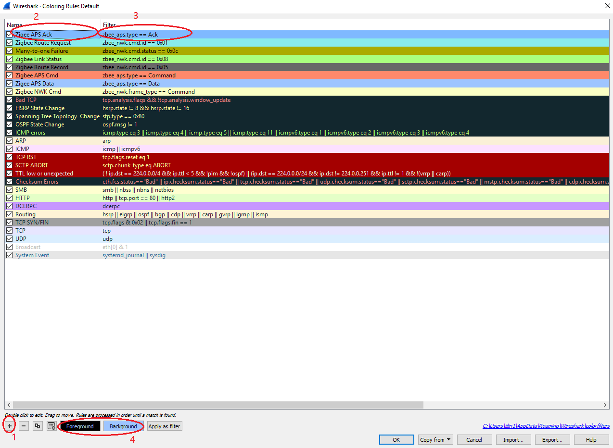

Table of Contents 
  

- [1. Overview](#1-overview)
- [2. Sniffer File Format](#2-sniffer-file-format)
  - [2.1. CUBX File](#21-cubx-file)
  - [2.2. ISD File](#22-isd-file)
- [3. Using Wireshark](#3-using-wireshark)
  - [3.1. Frequently Used Zigbee Filters](#31-frequently-used-zigbee-filters)
    - [3.1.1. MAC Layer Filter](#311-mac-layer-filter)
    - [3.1.2. NWK Layer Filter](#312-nwk-layer-filter)
    - [3.1.3. APS Layer Filter](#313-aps-layer-filter)
  - [3.2. Customize Color](#32-customize-color)

********

# 1. Overview
Sniffer is a useful tool to analyze Zigbee network issues. Currently, there are three typical sniffer tool in the industry: 
- Ubiqua Protocol Analyzer
- Wireshark
- Network Analyzer in Simplicity Studio

Ubiqua Protocol Analyzer is a commercial software and it's pretty expensive. Network Analyzer can only be used in Simplicity Studio. Furthermore, Network Analyzer is pretty slow when analyzing big sniffer files. Wireshark is an open-sourced software and free to everyone, and it's also possible to add plugins to decode custom file format. It's much much faster than Network Analyzer to analyze big files.

In this page, we will introduce how to analyze Zigbee network issues with Wireshark.

# 2. Sniffer File Format
Usually we met three files types of sniffer file:  
- .cubx file
- .dcf file
- .isd file

Currently, Wireshark can open .dcf file directly. 

## 2.1. CUBX File
.cubx file is the capture file format used by Ubiqua Protocol Analyzer. There is a Wireshark plugin which can be used to decode .cubx file in Wireshark. Below is the steps of using this plugin:  
1. Download Wireshark 3.2.5 of newer version from [Wireshark download page](https://www.wireshark.org/#download), then install it.
2. Download [Wireshark cubx plugin](files/ZB-Zigbee-Tools-Wireshark/cubx.rar), copy the DLL file to the plugin directory of your Wireshark installation. e.g. `C:\Program Files\Wireshark\plugins\3.2\wiretap`.
3. Start Wireshark and you can open the .cubx file with it.

## 2.2. ISD File
ISD file is not supported by Wireshark right now, but it's possible to write a Wireshark plugin to support it.

# 3. Using Wireshark
## 3.1. Frequently Used Zigbee Filters
### 3.1.1. MAC Layer Filter
|Filter|Value|Description|
|:-|:-|:-|
|wpan.frame_type|<ul><li>Beacon</li><li>Command</li><li>Data</li><li>Beacon</li></ul>||
|wpan.dst_pan|16-bit number||
|wpan.dst16|16-bit number||
|wpan.src16|16-bit number||

### 3.1.2. NWK Layer Filter
|Filter|Value|Description|
|:-|:-|:-|
|zbee_nwk.frame_type|<ul><li>Data</li><li>Command</li></ul>||
|zbee_nwk.dst|16-bit number|only filter dest Node ID|
|zbee_nwk.src|16-bit number|only filter src Node ID|
|zbee_nwk.addr|16-bit number|filter both dest and src Node ID|
|zbee_nwk.dst64|64-bit hex|filter dest Eui64|
|zbee_nwk.src64|64-bit hex|filter src Eui64|
|zbee_nwk.addr64|64-bit hex|filter both dest and src Eui64|
|zbee_nwk.cmd.id|8-bit number|<ul><li>1 - Route Request</li><li>2 - Route Reply</li><li>3 - Network Status</li><li>4 - Leave</li><li>5 - Route Record</li><li>6 - Rejoin Request</li><li>7 - Rejoin Response</li><li>8 - Link Status</li><li>9 - Network Report</li><li>10 - Network Update</li><li>11 - End Device Timeout Request</li><li>12 - End Device Timeout Response</li></ul>|
|zbee_nwk.cmd.status|8-bit number|<ul><li>0x0D - Address Conflict</li><li>0x0F - PAN ID Update</li></ul>|

### 3.1.3. APS Layer Filter
|Filter|Value|Description|
|:-|:-|:-|
|zbee_aps.type|<ul><li>Data</li><li>Command</li></ul>||
|zbee_aps.dst|8-bit number|Destination Endpoint|
|zbee_aps.src|8-bit number|Source Endpoint|
|zbee_aps.cluster|16-bit number|Cluster|
|zbee_aps.profile|16-bit number|Profile|
|zbee_aps.cmd.id|8-bit number|<ul><li>0x05 - Transport Key</li><li>0x06 - Update Device</li><li>0x07 - Remove Device</li><li>0x08 - Request Key</li><li>0x09 - Switch Key</li><li>0x0E - Tunnel</li><li>0x0F - Verify Key</li><li>0x10 - Confirm Key</li></ul>|

## 3.2. Customize Color
Wireshark allows users to customize the display specific packets with a specific color. Below are the steps of customizing color:  
1. In menu "View", select "Coloring Rules", you will see a dialog about coloring. First add a rule, set its name and filter, then pickup a color you want.
    

      
    

     
2. In menu "View", toggle the item "Colorize Packet list" to toggle whether you want to show the color or not.

