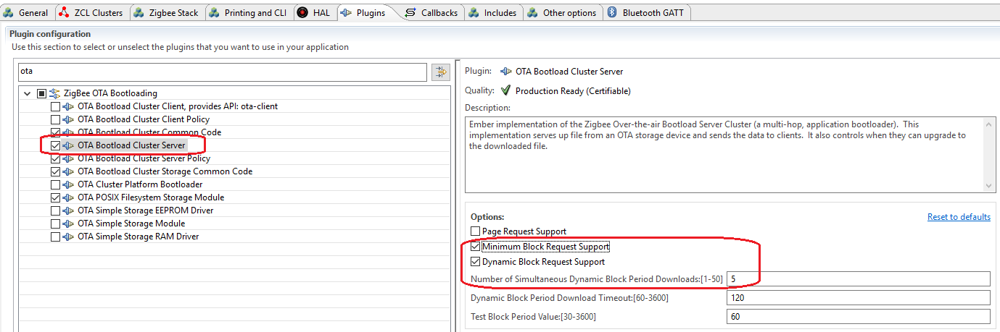
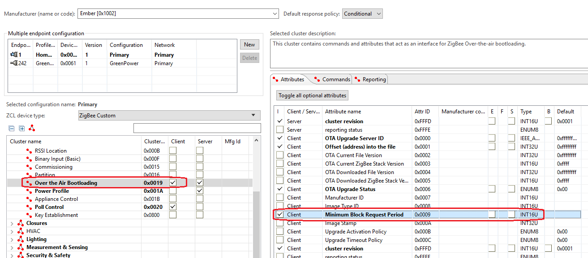

Table of Contents 
  

- [Waking BRD4180A/BRD4181A with Buttons](#waking-brd4180abrd4181a-with-buttons)
	- [1. Overview](#1-overview)
	- [2. Setup](#2-setup)

********

# Waking BRD4180A/BRD4181A with Buttons

## 1. Overview
As you know, multiple OTA clients can start the OTA upgrading at the same time, but when too many OTA clients are downloading at the same time, there could be many timeout and retries over the air. The server could also be overload in that case. It's better to have an approach to limit the concurrency of the OTA upgrading.

In this page, we will introduce how we limit the OTA concurrency in EmberZnet.

## 2. Setup
On OTA server side, there is an option in plugin `OTA Bootload Cluster Server`:

	

 

With this option enabled, you can limit the OTA concurrency. The option `Number of Simultaneous Block Period Downloads` is the maximum client number which can download at the same time.

To enable this option, you have to enable the attribute `Minimal Block Request Period` on the client side.

	

 
