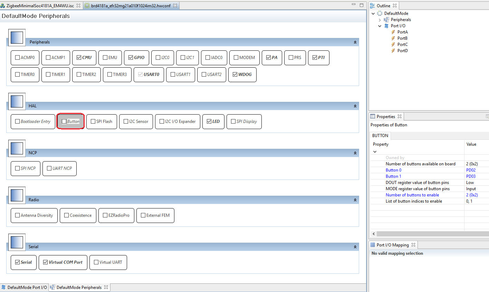
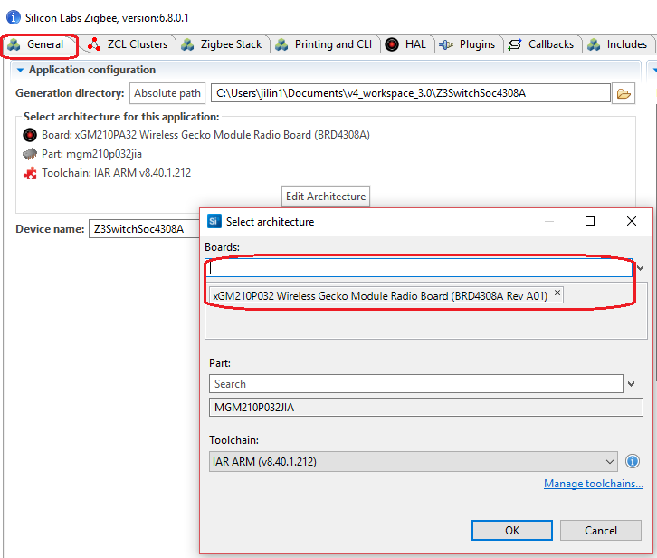

<details>
<summary><font size=5>Table of Contents</font> </summary>  

- [Waking BRD4180A/BRD4181A with Buttons](#waking-brd4180abrd4181a-with-buttons)
	- [1. Overview](#1-overview)
	- [2. Gecko SDK version](#2-gecko-sdk-version)
	- [3. Hardware Required](#3-hardware-required)
	- [4. Connections Required](#4-connections-required)
	- [5. Setup](#5-setup)
	- [6. How It Works](#6-how-it-works)
	- [7. .sls Projects Used](#7-sls-projects-used)
	- [8. How to Port to Another Part](#8-how-to-port-to-another-part)
	- [9. Special Notes](#9-special-notes)
</details>

********

# Waking BRD4180A/BRD4181A with Buttons

## 1. Overview
On series 2, only the pins of GPIO port A and B remain full fuctional in sleep mode. In other words, only pins from GPIO port A and B are capable of waking the chip from sleep mode. Besides that, the GPIO_EM4WUx pins are also capable of waking the chip from sleep mode, but they need extra settings.

Unfortunately, on our radio board BRD4180A/BRD4181A, PD2 and PD3 is used as the buttons, so we can't use the two buttons of BRD4180A/BRD4181A to wake up the device.

In this page, we will introduce the changes you need to wake up BRD4180A/BRD4181A with the buttons.

## 2. Gecko SDK version
Gecko SDK Suite 2.7

## 3. Hardware Required
- BRD4181A

## 4. Connections Required
Connect the WSTK to PC through USB cable

## 5. Setup
Below are the steps of setting up the projects:
1. Create the sample `ZigbeeMinimal`;
2. Turn to `HAL` tab, hit the button `Open Hardware Configurator`, then disable `button`.
	<div align="center">
		
	</div>
	</br>
3. Turn to `Callbacks` tab, select the following callbacks:
	- [x] emberAfMainInitCallback
4. Save and generate.
5. Edit the source file `ZigbeeMinimalSoc4181A_EM4WU_callbacks.c`, add the following source code:
	``` C
	extern bool emAfForceEndDeviceToStayAwake;
	void hal_EM4WU_Isr(uint8_t pin)

	{
		halToggleLed(1);
		emAfForceEndDeviceToStayAwake = !emAfForceEndDeviceToStayAwake;
	}

	void emberAfMainInitCallback(void)
	{
		CMU_ClockEnable(cmuClock_GPIO, true);

		GPIO_PinModeSet(gpioPortD, 2, gpioModeInput, 1);
		GPIO_EM4EnablePinWakeup(1 << 25, 0); //PD2 is EM4WU9

		GPIOINT_Init();
		GPIO->IEN = 1<<25; //25=9+16 EM4UIEN is in the higher 16bit
		GPIO->EM4WUEN = 1<<25;
		GPIO_IntClear(1<<25);

		GPIOINT_CallbackRegister(25, hal_EM4WU_Isr);
	}
	```

6. Modify the source file `emdrv/gpiointerrupt.c`, here we need the following changes:
	- Change the size of the array `gpioCallbacks` from 16 to 32, as the interrupt of GPIO_EM4WU is in the high 16bit.
	- Change the bit mask in function `GPIO_ODD_IRQHandler` and `GPIO_EVEN_IRQHandler`, from `0x0000AAAA` and `0x00005555` to `0xAAAAAAAA` and `0x55555555` respectively.
7. Save and build.

## 6. How It Works
The GPIO_EM4WUx pins are capable of waking up the chip, but they need extra settings. We need to call API `GPIO_EM4EnablePinWakeup` to enable these functions. After that, enable the interrupt of GPIO_EM4WU and register a handler for that interrupt.

## 7. .sls Projects Used
- [ZigbeeMinimalSoc4181A_EM4WU](files/ZB-Zigbee-FAQ-Waking-BRD4180A-BRD4181A-with-Buttons/ZigbeeMinimalSoc4181A_EM4WU.sls)

## 8. How to Port to Another Part
Start Simplicity Studio, import the project and then open the `.isc` file. Turn to "General" tab, hit the button `Edit Architecture`, change the board type or compiler.
<div align="center">
	
</div>
</br>

## 9. Special Notes
NA
