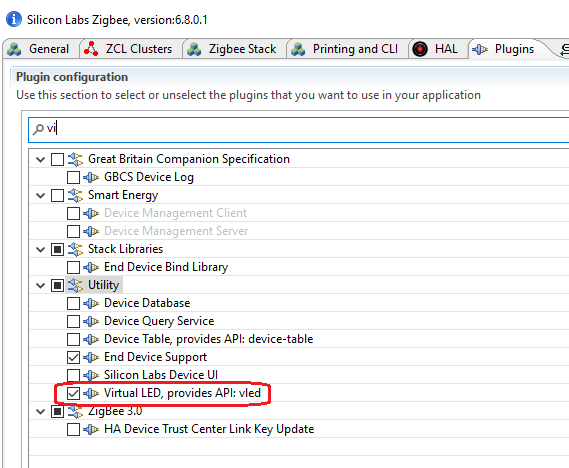
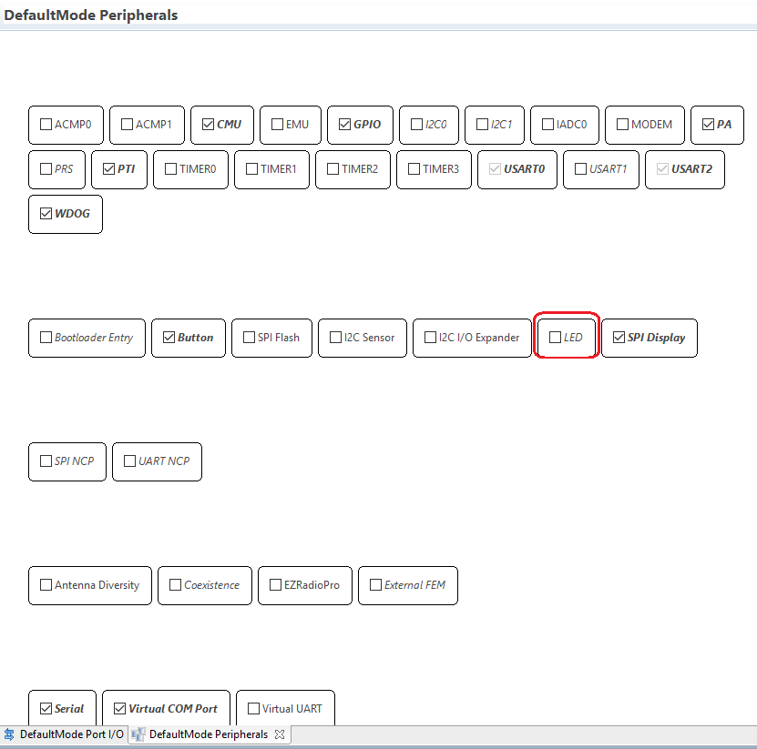
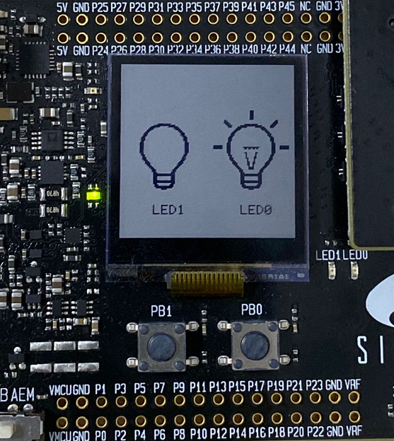
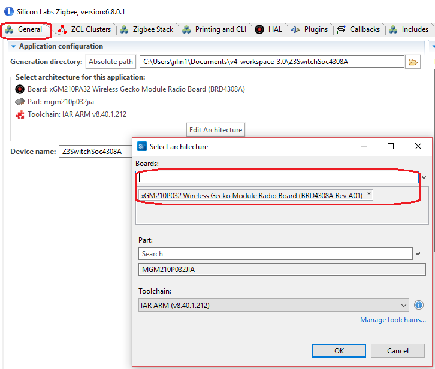

Table of Contents 
  

- [Z3Light/Z3Switch on Module Based Kits](#z3lightz3switch-on-module-based-kits)
	- [1. Overview](#1-overview)
	- [2. Gecko SDK version](#2-gecko-sdk-version)
	- [3. Hardware Required](#3-hardware-required)
	- [4. Connections Required](#4-connections-required)
	- [5. Setup](#5-setup)
	- [6. How It Works](#6-how-it-works)
	- [7. .sls Projects Used](#7-sls-projects-used)
	- [8. How to Port to Another Part](#8-how-to-port-to-another-part)
	- [9. Special Notes](#9-special-notes)

********

# Z3Light/Z3Switch on Module Based Kits

## 1. Overview
Z3Light and Z3Switch is the most commonly used sample projects for Zigbee beginners. Most of the Zigbee tutorials are based on these two sample projects. However, it's not easy to use them on a module based radio boards, such as BRD43xx series. All these radio boards are based on a Zigbee module instead of SoC, and there are only 32-pins on all of the Zigbee modules. As inherited from the beginning, all module based radio board use the same pin for LEDs and buttons, which makes it difficult to run Z3Light and Z3Switch on them.

In this article, we will introduce an approach to make the Z3Light and Z3Switch sample projects run on these module based radio boards.

## 2. Gecko SDK version
Gecko SDK Suite 3.0

## 3. Hardware Required
- BRD4308A

## 4. Connections Required
Connect the WSTK to PC through USB cable

## 5. Setup
In this demo, we will use a custom plugin named "virtual LED". With this plugin, we will draw two LEDs on the LCD screen. Please download [this plugin](files/ZB-Zigbee-FAQ-Z3Light-Z3Switch-On-Module-Based-Kits/vled.rar) first, and then extract it to the folder `protocol\zigbee\app\framework\plugin` of your SDK. After that, please restart Simplicity Studio. If the plugin place correctly, you would see this plugin in the plugin list:

	

 

Below are the steps of setting up the projects:
1. Create the sample `Z3Light`/`Z3Switch`;
2. Turn to `HAL` tab, hit the button `Open Hardware Configurator`, then disable `LED`.
	

		
	

	 
3. Turn to `Plugins` tab, select the following plugins:
	- [x] WSTK Display Driver
	- [x] Graphics Library
	- [x] Virtual LED
4. Save and generate.
5. Edit the source file `Z3Light_callbacks.c`, replace the hal function of controlling the LEDs to the functions of controlling vleds.

	|HAL LED|Virtual LED|
	|:-|:-|
	|halSetLed|vled_On|
	|halClearLed|vled_Off|
	|halToggleLed|vled_Toggle|

6. Save and build.

## 6. How It Works
Follow instructions in [QSG106](https://www.silabs.com/documents/public/quick-start-guides/qsg106-efr32-zigbee-pro.pdf) to test. When you need to check the LED status, check the picture on the screen instead of the physical LED.

	

 

## 7. .sls Projects Used
- [Z3Light](files/ZB-Zigbee-FAQ-Z3Light-Z3Switch-On-Module-Based-Kits/Z3LightSoc4308A.sls)
- [Z3Switch](files/ZB-Zigbee-FAQ-Z3Light-Z3Switch-On-Module-Based-Kits/Z3SwitchSoc4308A.sls)

## 8. How to Port to Another Part
Start Simplicity Studio, import the project and then open the `.isc` file. Turn to "General" tab, hit the button `Edit Architecture`, change the board type or compiler.

	

 

## 9. Special Notes
NA
