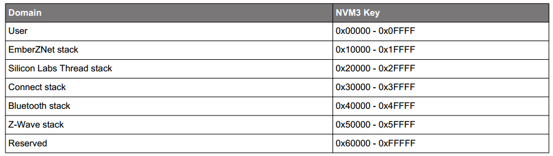
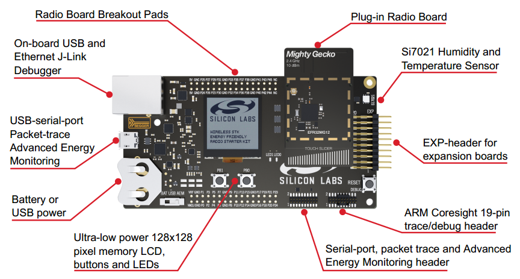

English | [中文](Zigbee-Hands-on-Non-volatile-Data-Storage-CN)

<details>
<summary><font size=5>Table of Contents</font> </summary>

- [1. Introduction](#1-introduction)
  - [1.1. Application features](#11-application-features)
  - [1.2. Purpose](#12-purpose)
- [2. Fundamentals of Non-Volatile Memory](#2-fundamentals-of-non-volatile-memory)
  - [2.1. What is Non-Volatile Memory?](#21-what-is-non-volatile-memory)
  - [2.2. Why need Non-Volatile Storage in EmberZNet PRO?](#22-why-need-non-volatile-storage-in-emberznet-pro)
  - [2.3. How does Silicon Labs implement the Non-Volatile Data Storage?](#23-how-does-silicon-labs-implement-the-non-volatile-data-storage)
- [3. Access NVM3 objects with Token API](#3-access-nvm3-objects-with-token-api)
  - [3.1. Types of Tokens: Dynamic Tokens and Manufacturing Tokens](#31-types-of-tokens-dynamic-tokens-and-manufacturing-tokens)
    - [3.1.1. Dynamic Tokens](#311-dynamic-tokens)
      - [3.1.1.1. Basic (Non-indexed) Tokens](#3111-basic-non-indexed-tokens)
      - [3.1.1.2. Indexed Tokens](#3112-indexed-tokens)
    - [3.1.2. Manufacturing Tokens](#312-manufacturing-tokens)
  - [3.2. Usage of Tokens: Creating and Accessing](#32-usage-of-tokens-creating-and-accessing)
    - [3.2.1. Dynamic Tokens](#321-dynamic-tokens)
      - [3.2.1.1. Creating Dynamic Token](#3211-creating-dynamic-token)
        - [3.2.1.1.1. Define the Token Name](#32111-define-the-token-name)
        - [3.2.1.1.2. Define the Token Type](#32112-define-the-token-type)
        - [3.2.1.1.3. Define the Token Storage](#32113-define-the-token-storage)
      - [3.2.1.2. Accessing Dynamic Tokens](#3212-accessing-dynamic-tokens)
        - [3.2.1.2.1. Accessing Basic (Non-indexed) Tokens](#32121-accessing-basic-non-indexed-tokens)
        - [3.2.1.2.2. Accessing Indexed Tokens](#32122-accessing-indexed-tokens)
    - [3.2.2. Manufacturing Tokens](#322-manufacturing-tokens)
      - [3.2.2.1. Accessing Manufacturing Tokens](#3221-accessing-manufacturing-tokens)
    - [3.2.3. Where to Find Default Token Definitions](#323-where-to-find-default-token-definitions)
- [4. Lab](#4-lab)
  - [4.1. Hardware Requirements](#41-hardware-requirements)
  - [4.2. Software Requirements](#42-software-requirements)
  - [4.3. Exercise](#43-exercise)
    - [4.3.1. Open the Switch projects](#431-open-the-switch-projects)
    - [4.3.2. Create Custom Tokens](#432-create-custom-tokens)
    - [4.3.3. Access the basic Token LED1_ON_OFF](#433-access-the-basic-token-led1_on_off)
      - [4.3.3.1. Step 1: Retrieve the basic Token data](#4331-step-1-retrieve-the-basic-token-data)
      - [4.3.3.2. Step 2: Write the basic Token data](#4332-step-2-write-the-basic-token-data)
      - [4.3.3.3. Step 3: Testing your project](#4333-step-3-testing-your-project)
    - [4.3.4. Access the manufacturing Token](#434-access-the-manufacturing-token)
      - [4.3.4.1. Step 4: Read the manufacturing Token MFG_STRING](#4341-step-4-read-the-manufacturing-token-mfg_string)
- [5. Conclusion](#5-conclusion)

</details>

***  

# 1. Introduction
## 1.1. Application features
The boot camp series hands-on workshop will cover four functionalities below, and the application development is split into four steps respectively to show how an application should be built up from the beginning.  

The exercise is the 4th part of series “Zigbee Boot Camp” course.  
-   In the 1st phase, a basic network forming by the Light, and a joining process by the Switch will be realized.  
-   The 2nd part will prepare the devices to transmit, receive, and process the On-Off commands by using APIs.  
-   At the 3rd step the Switch will have a periodic event to execute any custom code, which will be a LED blinking in our case.  
-   **The 4th thing to do is to make the Switch to be able to store any custom data in its flash by using Non-volatile memory.**  

## 1.2. Purpose
This training demonstrates the basic usage of Non-Volatile data storage on EmberZNet Stack. And also some of the basic knowledge are included in this documentation to help everyone to understand the hands-on well.  

**You will learn**  
* With this hands-on course, you will learn the basic knowledge of non-voltage data storage, and the available implementation provided by Silicon Labs, and also how to use token to access non-voltage data storage objects.  

**You need to do**  
* There is a problem we need to solve is that how to store the Light On/Off status locally over power cycle on our EFR32MG12 platform without EEPROM. In this hands-on, we provide the solution to do that with the token.  
* And also you need to retrieve the manufacturing string that the manufacturer has programmed during production.  

The figure below illustrates the working flow of this hands-on.  
<div align="center">
    
</div>  
</br>  

***

# 2. Fundamentals of Non-Volatile Memory  
## 2.1. What is Non-Volatile Memory?
Non-Volatile Memory (NVM) or Non-Volatile Storage is memory that can retrieve stored information even when the device is power-cycled. It typically refers to storage in semiconductor memory chips, including flash memory storage such as NAND flash and solid-state drives (SSD), and ROM chips such as EPROM (erasable programmable ROM) and EEPROM (electrically erasable programmable ROM).  
On Silicon Labs microcontrollers and radio SoCs, it does not offer internal EEPROM, the NVM is implemented as flash memory.  

## 2.2. Why need Non-Volatile Storage in EmberZNet PRO?
Usually, the EmberZNet stack and application need to store some data objects which should remain after power cycle. Some data is considered manufacturing data that is written only once at manufacturing time, on the other side, some data are written and read frequently over the life of the product which is referred to as dynamic data.  

## 2.3. How does Silicon Labs implement the Non-Volatile Data Storage?
Totally, Silicon Labs offers 3 different implementations for Non-Volatile data storage in **flash** memory. And also offer the Token mechanism for storing and retrieving data from the Non-Volatile Data Storage.  

**Persistent Store (PS Store)**  
PS Store is only used with Bluetooth devices on all platforms except for EFR32 Series 2. The persistent store size is 2048 bytes and uses two flash pages for storage. Both the Bluetooth stack and application can store data in this area.  
Since this documentation focus on EmberZNet PRO, we will not introduce the PS Store much in this document.  

**SimEEv1 and SimEEv2**  
SimEEv1(Simulated EEPROM version 1) or SimEEv2(Simulated EEPROM version 2) are used with EmberZNet PRO, Silicon Labs Thread, Silicon Labs Connect on EM35x and EFR32 Series 1 platforms. SimEEv1 uses two virtual pages, with each virtual page consisting of two flash pages, while SimEEv2 uses three virtual pages where each virtual page consists of 6 flash pages.  

**NVM3**  
The third generation Non-Volatile Memory (NVM3) data storage driver is an alternative to SimEEv1/v2 and PS Store, it is designed to work in EmberZNet, Silicon Labs Thread, Connect, and Bluetooth applications running on EFR32 as well as MCU applications running on EFM32.  
Since the NVM3 is more configurable which allows for better balance of token capacity versus reserved flash, and it's compatible with DMP application, it's recommended for developing on EFR32.  
In this hands-on course, we will use the NVM3 for data storage.  

**Token**  
Tokens let the application store defined data types in Non-Volatile Storage, and SimEEv1/v2 and NVM3 are designed to operate below the token system.  
A token has two parts: a token key and token data. The token key is a unique identifier that is used to store and retrieve the token data. With using the token key, the application does not need to know the exact location of the data in the non-volatile storage for retrieving it.  
The diagram below illustrates the relationship between the Tokens and the Non-volatile Data Storage mechanisms. Silicon Labs offers three different dynamic token implementations: Simulated EEPROM Version 1 (SimEEv1), Simulated EEPROM Version 2 (SimEEv2), and Third Generation Non-Volatile Memory (NVM3).  

<div align="center">
    
</div>  
<div align="center">
  <b>Figure 2-1 Non-Volatile Storage and Tokens</b>
</div>  

***

# 3. Access NVM3 objects with Token API
As NVM3 is the recommended implementation for Non-Volatile data storage, the section below will introduce how to access the NVM3 objects with Token API.  

## 3.1. Types of Tokens: Dynamic Tokens and Manufacturing Tokens  
Depending on how the tokens are going to be used, it can be distinguished as Dynamic Tokens or Manufacturing Tokens.  

<div align="center">
  
</div>
<div align="center">
  <b>Figure 3-1 Types of Tokens</b>
</div>  
</br>

### 3.1.1. Dynamic Tokens
The fundamental purpose of the Dynamic Token system is to allow it can be access (both read and written) frequently similar as generic RAM usage, but also allow the token data to persist across reboots and during power loss. They are stored in a dedicated area of the flash where we use a memory-rotation algorithm to prevent flash overuse.  
There are two types of dynamic tokens that are distinguished by their format, Basic Tokens and Indexed Tokens.  

#### 3.1.1.1. Basic (Non-indexed) Tokens
The basic token can be thought of as a simple char variable type that can only be accessed as a unit. For instance, the basic tokens can be used to store an array, and if any element of the array changes the entire array must be rewritten.  
A counter token is a special type of non-indexed dynamic token meant to store a number that increments by 1 at a time.  
<font color=red><b>Hint</b></font>: The counter token will not be covered in this hands-on, more information on counter token can be found in section [2.6 Counter Objects][UG103.7: Non-Volatile Data Storage Fundamentals] of UG103.7 and section [4.2 When to Define a Counter Token][AN703: Simulated EEPROM] of AN703.  

#### 3.1.1.2. Indexed Tokens
Indexed dynamic tokens can be considered as a linked array of char variables where each element is expected to change independently of the others and therefore is stored internally as an independent token and accessed explicitly through the token API.  
<font color=red><b>Hint</b></font>: The indexed token will also not be covered in this hands-on, more information on indexed token can be found in section [2.7 Indexed Objects][UG103.7: Non-Volatile Data Storage Fundamentals] of UG103.7 and section [4.3 Array Tokens Versus Indexed Tokens][AN703: Simulated EEPROM] of AN703.  

### 3.1.2. Manufacturing Tokens
Manufacturing Tokens are set at manufacturing time and they are stored at absolute addressed of the flash. The Manufacturing tokens are written either only once or very infrequently during the lifetime of the chip.  

## 3.2. Usage of Tokens: Creating and Accessing
Now, we are going to talk about how to use the tokens. This includes knowing how to create new tokens, how to read and potentially modify tokens, and where to find default tokens.  

### 3.2.1. Dynamic Tokens
For creating a custom dynamic token, you need to new a token header file which contains token definitions. In this hands-on, we will create a header file  ```custom-token.h``` contains the custom dynamic token definitions.  

#### 3.2.1.1. Creating Dynamic Token
In general, creating a dynamic token involves three steps below. A example will be included in section [4.3.2. Create Custom Tokens](#432-create-custom-tokens) to demonstrate how to create custom dynamic token in detail.  
* Define the token name.  
* Add any typedef needed for the token, if it is using an application-defined type.  
* Define the token storage.  

##### 3.2.1.1.1. Define the Token Name
When defining the name, please do not prepend the word TOKEN. For NVM3 dynamic tokens, use the word NVM3KEY as the prefix.  
```
/**
* Custom Zigbee Application Tokens
*/
// Define token names here
#define NVM3KEY_LED1_ON_OFF			(NVM3KEY_DOMAIN_USER | 0x0001)
```
Please note that the token key values must be unique within this device.  
For NVM3, custom application tokens should use the **NVM3KEY_DOMAIN_USER** range so as not to collide with the stack tokens in other ranges such as **NVM3KEY_DOMAIN_ZIGBEE**. See the table below for the NVM3 default instance key space.  

<div align="center">
  
</div>  
<div align="center">
  <b>Figure 3-2 NVM3 default instance key space</b>
</div>  
</br>  

##### 3.2.1.1.2. Define the Token Type
The token type can be either a built-in C data type, or defined as a custom data structure using typedef.  
```
#if defined(DEFINETYPES)
// Include or define any typedef for tokens here
typedef struct {
  uint8_t ledIndex;    // LED index
  bool ledOnOff;       // LED ON OFF status
} ledOnOffStatus_t;
#endif //DEFINETYPES
```

##### 3.2.1.1.3. Define the Token Storage
After any custom types are defined, you should define the token storage to inform the token management software about the tokens being defined.  
Each token, whether custom or default, gets its own entry in this part:  

```
#ifdef DEFINETOKENS
// Define the actual token storage information here
DEFINE_BASIC_TOKEN(LED1_ON_OFF,
                  ledOnOffStatus_t,
                  {1, false})
#endif
```

DEFINE_BASIC_TOKEN takes three arguments: the token name (LED1_ON_OFF, without the prefix "NVM3KEY"), the token type (ledOnOffStatus_t) what we defined above, and the default value of the token if it has never been written by the application ({1, false}).  

In this case, the first value (ledIndex) is initialized as ```1``` to indicates the LED1, and the next value (ledOnOff) is set to ```false``` to represent the default status of the LED1.  

#### 3.2.1.2. Accessing Dynamic Tokens
The networking stack provides a simple set of APIs for accessing token data. The APIs differ slightly depending on the type of the tokens.  

##### 3.2.1.2.1. Accessing Basic (Non-indexed) Tokens
The non-indexed/basic token API functions include:  
```
void halCommonGetToken(data, token)  
void halCommonSetToken(token, data)  
```
In this case, 'token' is the token key, and 'data' is the token data. Note that ```halCommonGetToken()``` and ```halCommonSetToken()``` are general token APIs that can be used for both basic dynamic tokens, and manufacturing tokens.  

Now let us use an example to explain the usage of these APIs.  
As mentioned in the section [You need to do](#12-purpose) at the beginning of this documentation, we needs to store the LED1's on/off status frequently, and restore the LED1 last on/off status after power up. As we have defined the token as above, then you can access it with the code snippet like this:  

```
ledOnOffStatus_t led1OnOffStatus;

// Retrieve the previous status of LED1
halCommonGetToken(&led1OnOffStatus, TOKEN_LED1_ON_OFF);

led1OnOffStatus.ledOnOff = <current status>;

// Store the current status of LED1
halCommonSetToken(TOKEN_LED1_ON_OFF, &led1OnOffStatus);
```

Since this hands-on is designed for new to the Silicon Labs EmberZNet stack, we will focus on the basic token usage, if you are interested about how to write the counter token, please read the section [3.3.1.1 Accessing Counter Tokens][AN1154: Using Tokens for Non-Volatile Data Storage] of AN1154.  

##### 3.2.1.2.2. Accessing Indexed Tokens
For accessing the Indexed Tokens, please use the APIs below. As explained above, we will not spend much space of this documentation to introduce Indexed Tokens, please refer to the section [3.3.2 Accessing Indexed Tokens][AN1154: Using Tokens for Non-Volatile Data Storage] of AN1154 for more information.  
```
void halCommonGetIndexedToken(data, token, index)
void halCommonSetIndexedToken(token, index, data)
```

### 3.2.2. Manufacturing Tokens
Manufacturing tokens are defined in the same way as basic (non-indexed) dynamic tokens, therefore you can refer to section [Creating Dynamic Token](#3211-creating-dynamic-token) on how to create them. The major difference between them is that on where the tokens are stored and how they are accessed.  
Manufacturing tokens reside in the dedicated flash page for manufacturing tokens (with fixed absolute addresses).  

#### 3.2.2.1. Accessing Manufacturing Tokens
As the name suggests, Manufacturing Tokens are usually written once at manufacturing time into fixed locations in a dedicated flash page. Since their addresses are fixed, they can be easily read from external programming tools if Read Protection for this flash area is disabled.  
And since the same flash cell cannot be written repeatedly without erase operations in between. Writing a manufacturing token from on-chip code works only if the token is currently in an erased state. Overwriting the manufacturing token that has been already written before always requires erasing the flash page for the manufacturing token with external programming tools.  

Manufacturing tokens should be accessed with their own dedicated API below.  
```
halCommonGetMfgToken(data, token);
halCommonSetMfgToken(token, data);
```
They have the same parameters as the basic tokens APIs. The two primary purposes for using the dedicated manufacturing token access APIs are:  
* For slightly faster access;  
* For access early in the boot process before emberInit() is called.  

And the Manufacturing tokens can also be accessed through the basic token APIs ```halCommonGetToken()``` and ```halCommonSetToken()```.  

Also let us use an example to explain the usage of these dedicated APIs for accessing manufacturing tokens.  
As mentioned in the section [You need to do](#12-purpose) at the beginning of this documentation, manufacturer will program the manufacturing string token during the production with programming tool, and we can use the on-chip code snippet below to retrieve the string data from the manufacturing token.  

```
tokTypeMfgString mfgString;
// Retrieve the manufacturing string from the manufacturing token
halCommonGetMfgToken(mfgString, TOKEN_MFG_STRING);
```

### 3.2.3. Where to Find Default Token Definitions
The EmberZNet PRO stack has defined lots of tokens for stack, Application Framework, manufacturing data storage.  
To view the stack tokens, refer to the file:  
```<install-dir>/stack/config/token-stack.h```

To view the Application Framework tokens, please navigate to the project directory after the project has been generated in AppBuilder. The files ```<project_name>_tokens.h``` which contains the tokens for ZCL attributes, and the protocol-specific token file ```znet-token.h``` which includes plugin token headers and the custom application token header.  

To view the manufacturing tokens for the EFR32 series of chips, refer to the following files:  
```<install-dir>/hal/micro/cortexm3/efm32/token-manufacturing.h```

***

# 4. Lab
This section provides step-by-step instructions to demonstrate how to store and retrieve the LED1's status to/from the Non-Volatile data storage (it's NVM3 in this hands-on) objects with basic token. And also demonstrate how to access manufacturing token with the dedicated APIs.  
That are the question we raised in the section [You need to do](#12-purpose) at the beginning of this documentation.  

**Prerequisites**  
Please make sure that you have finished the [preparatory course](Zigbee-Preparatory-Course) and make sure all of the SDKs software and Starter Kits are ready.  

## 4.1. Hardware Requirements
This hands-on requires either EFR32MG21/EFR32MG13/EFR32MG12 radio board, and EFR32MG12 radio board BRD4162A is recommended since we created the example project with that kit. Below is the layout of the starter kit.  
<div align="center">
  
</div>  
<div align="center">
  <b>Figure 4-1 Starter Kit layout</b>
</div>  
</br>  

Connect the starter kit to PC using the "J-Link USB" connector and the cable provided with the starter kit. And turn the power switch to "AEM" position. Start the Simplicity Studio V4, and it should able to find the attached device, and list it in the "Debug Adapter" area of the launcher console.  
<div align="center">
  
</div>
<div align="center">
  <b>Figure 4-2 Simplicity Studio detects the WSTK</b>
</div>  
</br>

## 4.2. Software Requirements
This hands-on is building on top of the previous three hands-on [Forming and Joining](Zigbee-Hands-on-Forming-and-Joining), [Sending on/off commands](Zigbee-Hands-on-Sending-OnOff-Commands) and [Using Event](Zigbee-Hands-on-Using-Event), and it's supposed that you have installed the Simplicity Studio and necessary SDKs as documented in our [preparatory course](Zigbee-Preparatory-Course).  

## 4.3. Exercise
### 4.3.1. Open the Switch projects
This hands-on is building on top of previous three hands-on. Since the Non-volatile data storage mechanism does not depend on the mesh node type, we will only demonstrate how to access the NVM3 object via token API on the Switch (router) device side, it refers to the ```Zigbee_Switch_ZR``` project.  

### 4.3.2. Create Custom Tokens
We are going to create a header file ```custom-token.h```, and define the token name, token type and token storage in this header file.  

* In Simplicity studio, click on [File] > [New] > [File]  
* Select the parent folder as the root path of your project, and set the file name as ```custom-token.h```, and click [Finish]  
* Edit the header file to define the tokens.  

**Firstly**, we will define the Token name as ```NVM3KEY_LED1_ON_OFF```. For more information about the rule of token name definition, see section [3.2.1.1.1. Define the Token Name](#32111-define-the-token-name).  
* <font color=red><b>Question</b></font>: Why need to define the token name with the prepended word ```NVM3KEY```? Can I define it as ```TOKEN_LED1_ON_OFF```?  
* <font color=red><b>Hint</b></font>: Please back to the section [Define the Token Name](#32111-define-the-token-name) for getting the answer.  

**Then** define the Token type for recording the LED On/Off status, define a structure type ```ledOnOffStatus_t``` which includes two different data type to represent the LED index and LED status. For more information, see section [3.2.1.1.2. Define the Token Type](#32112-define-the-token-type).  

**Finally**, define the token storage with the macro ```DEFINE_BASIC_TOKEN```. For more information, see section [3.2.1.1.3. Define the Token Storage](#32113-define-the-token-storage).  

Below is content of the header file we used in this hands-on for your reference.  

```
// File: custom-token.h
//
// Description: Custom token definitions used by the application.
//
// Copyright 2019 by Silicon Labs Corporation.  All rights reserved.

/**
* Custom Zigbee Application Tokens
*/
// Define token names here
#define NVM3KEY_LED1_ON_OFF			(NVM3KEY_DOMAIN_USER | 0x0001)

#if defined(DEFINETYPES)
// Include or define any typedef for tokens here
typedef struct {
  uint8_t ledIndex;     // LED index
  bool ledOnOff;        // LED ON OFF status
} ledOnOffStatus_t;
#endif //DEFINETYPES

#ifdef DEFINETOKENS
// Define the actual token storage information here
DEFINE_BASIC_TOKEN(LED1_ON_OFF,
                  ledOnOffStatus_t,
                  {1, false})
#endif
```

After creating the custom token header file, you need one more step: add the header file to the application, through the [Includes] tab in the .isc file in Simplicity Studio, under the “Token Configuration” section.  
**Note**: You always need to generate the project again after adding the header file in the .isc file.  

<div align="center">
  
</div>
<div align="center">
  <b>Figure 4-3 Add custom token header file</b>
</div>  
</br>  

### 4.3.3. Access the basic Token LED1_ON_OFF
Let's moving on for how to access the defined token. Below are step-by-step instructions for adding code to store the LED status to Non-volatile data storage, and retrieve the data for restoring the LED status.  
Each step for this lab will have an associated comment in the primary example project that starts off ```Non-volatile Data Storage: Step x```, it will benefit the user for navigating to the right place for code implementation.  

#### 4.3.3.1. Step 1: Retrieve the basic Token data
Open the ```Zigbee_Switch_ZR_callback.c``` and define a "ledOnOffStatus_t" type variable.  
```
// Non-volatile Data Storage: Step 1
ledOnOffStatus_t led1OnOffStatus;
```
Navigate to the function ```void emberAfMainInitCallback(void)``` of the ```Zigbee_Switch_ZR_callback.c``` which will be called from the application's main function during the initialization, and retrieve the basic token "LED1_ON_OFF" with the API ```halCommonGetToken()```.  

```
// Non-volatile Data Storage: Step 1
// Retrieve the LED1 status before reset/power-off from the token
halCommonGetToken(&led1OnOffStatus, TOKEN_LED1_ON_OFF);
```
And then apply the retrieved status to the LED1 by using the API ```halSetLed()``` or ```halClearLed()```  

```
// Restore the LED1 status during initialization
if(led1OnOffStatus.ledOnOff){
  halSetLed(led1OnOffStatus.ledIndex);
}
else{
  halClearLed(led1OnOffStatus.ledIndex);
}
```

#### 4.3.3.2. Step 2: Write the basic Token data
In the last hands-on, we defined a event handler ```ledBlinkingHandler()``` to toggle the LED1 periodically, we need to store the LED1 status after each toggling process.  
Navigate to the function ```void ledBlinkingHandler(void)``` in the ```Zigbee_Switch_ZR_callback.c```. Also you can address the function with the comment ```Non-volatile Data Storage: Step 2```.  
Write the basic token ```LED1_ON_OFF``` with the API ```halCommonSetToken()```. Please note that the LED1 toggle process of last hands-on is surrounded by the token retrieving and storing process.  
```
// Non-volatile Data Storage: Step 2
// Retrieve the previous status of LED1
halCommonGetToken(&led1OnOffStatus, TOKEN_LED1_ON_OFF);

halToggleLed(led1OnOffStatus.ledIndex);
led1OnOffStatus.ledOnOff = !led1OnOffStatus.ledOnOff;

// Store the current status of LED1
halCommonSetToken(TOKEN_LED1_ON_OFF, &led1OnOffStatus);
```

#### 4.3.3.3. Step 3: Testing your project
Once you've added the necessary code to you project, Build and flash the ```Zigbee_Switch_ZR``` project to your BRD4162A radio board.  
* Click on [Build]  button to start building the project.  
* When the build finishes, expand the "Binaries" folder and right click the *.hex file to select [Flash to Device...]  
* Select the connected hardware in the pop-up window. The "Flash Programmer" is now pre-filled with all needed data, and you
are ready to click on "Program".  
* Click "Program", and wait for a short while for program finish.  

<div align="center">
  
</div>
<div align="center">
  <b>Figure 4-4 Build and Program</b>
</div>  
</br>

The LED1 on the starter kit will blinky periodically after few seconds delay after power up, reset the device, the application will restore the LED1 to the status before reset/power-off.  
<font color=red><b>Hint</b></font>: You can modify the delay period of LED1 status after power up, as well as the LED1 toggle interval with the API ```emberEventControlSetDelayMS(ledBlinking, 2000);``` in the ```Zigbee_Switch_ZR_callback.c```.  

### 4.3.4. Access the manufacturing Token
#### 4.3.4.1. Step 4: Read the manufacturing Token MFG_STRING
Manufacturing token can be written from on-chip code only if the token is currently in an erased state. Generally, the manufacturer will write the manufacturing token with external programming tools, such as Simplicity Commander.  
This part will involve reading the manufacturing Token ```MFG_STRING``` which hold the manufacturing string programmed by the manufacture during production.  
Navigate to the function ```void emberAfMainInitCallback(void)``` of the ```Zigbee_Switch_ZR_callback.c```, and read the manufacturing Token MFG_STRING with the API ```halCommonGetMfgToken```.  
```
// Non-volatile Data Storage: Step 4
tokTypeMfgString mfgString;
halCommonGetMfgToken(mfgString, TOKEN_MFG_STRING);
emberAfAppPrintln("MFG String: %s", mfgString);
```
Please note that if the manufacturing string token is not programmed by external programming tool before, the debug output will be NULL which indicates the manufacturing string is NULL.  

And also you can use the Simplicity Commander to dump the manufacturing tokens as below.  
```$ commander tokendump --tokengroup znet```  

<div align="center">
  
</div>
<div align="center">
  <b>Figure 4-5 Dump manufacturing tokens</b>
</div>  
</br>

<font color=red><b>Question</b></font>: Can the Manufacturing tokens be accessed through the basic token APIs?  
<font color=red><b>Hint</b></font>: Please back to the section [Access the manufacturing Token](#3221-accessing-manufacturing-tokens) for getting the answer.  

***

# 5. Conclusion  
We hope you enjoyed the Non-volatile data storage Lab, and understood the implementation provided by Silicon Labs, they are [NVM3, SimEEv1/SimEEv2 and PS Store](#23-how-does-silicon-labs-implement-the-non-volatile-data-storage). Also, you should have learned how to create and access the basic token, as well as how to access the manufacturing token.  

For more information on Non-volatile data storage and Tokens, please refer to the following documentations.  
[UG103.7: Non-Volatile Data Storage Fundamentals](https://www.silabs.com/documents/public/user-guides/ug103-07-non-volatile-data-storage-fundamentals.pdf)  
[AN1154: Using Tokens for Non-Volatile Data Storage](https://www.silabs.com/documents/public/application-notes/an1154-tokens-for-non-volatile-storage.pdf)  
[AN1135: Using Third Generation NonVolatile Memory (NVM3) Data Storage](https://www.silabs.com/documents/public/application-notes/an1135-using-third-generation-nonvolatile-memory.pdf)  
[AN703: Simulated EEPROM](https://www.silabs.com/documents/public/application-notes/an703-simulated-eeprom.pdf)  

[UG103.7: Non-Volatile Data Storage Fundamentals]: https://www.silabs.com/documents/public/user-guides/ug103-07-non-volatile-data-storage-fundamentals.pdf  
[AN1154: Using Tokens for Non-Volatile Data Storage]: https://www.silabs.com/documents/public/application-notes/an1154-tokens-for-non-volatile-storage.pdf  
[AN1135: Using Third Generation NonVolatile Memory (NVM3) Data Storage]: https://www.silabs.com/documents/public/application-notes/an1135-using-third-generation-nonvolatile-memory.pdf  
[AN703: Simulated EEPROM]: https://www.silabs.com/documents/public/application-notes/an703-simulated-eeprom.pdf   
