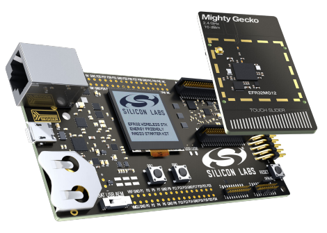
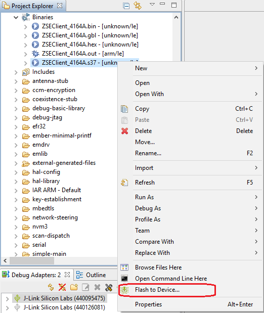

English | [中文](Introduction-of-EmberZnet-and-AppBuilder-CN)

<details>
<summary><font size=5>Table of Contents</font> </summary>  

- [1. Overview](#1-overview)
- [2. SoC and Modules](#2-soc-and-modules)
  - [2.1. SoCs](#21-socs)
  - [2.2. Modules](#22-modules)
  - [2.3. Block Diagram](#23-block-diagram)
- [3. Software Development Kits](#3-software-development-kits)
  - [3.1. Design Models](#31-design-models)
  - [3.2. Gecko Bootloader](#32-gecko-bootloader)
  - [3.3. EmberZnet SDK](#33-emberznet-sdk)
- [4. Development Tools](#4-development-tools)
  - [4.1. Wireless Starter Kits](#41-wireless-starter-kits)
  - [4.2. Simplicity IDE](#42-simplicity-ide)
    - [4.2.1. Overview](#421-overview)
    - [4.2.2. Create a Zigbee Project](#422-create-a-zigbee-project)
    - [4.2.3. Configure the project](#423-configure-the-project)
      - [4.2.3.1. "General" Tab](#4231-general-tab)
      - [4.2.3.2. "Zigbee Stack" Tab](#4232-zigbee-stack-tab)
      - [4.2.3.3. "ZCL Clusters" Tab](#4233-zcl-clusters-tab)
      - [4.2.3.4. "Plugins" Tab](#4234-plugins-tab)
      - [4.2.3.5. "Callbacks" Tab](#4235-callbacks-tab)
      - [4.2.3.6. "Includes" Tab](#4236-includes-tab)
      - [4.2.3.7. Hardware Configuration](#4237-hardware-configuration)
    - [4.2.4. Generate Project](#424-generate-project)
    - [4.2.5. Build Project](#425-build-project)
    - [4.2.6. Test and Debug](#426-test-and-debug)
      - [4.2.6.1. Flash Application Image](#4261-flash-application-image)
      - [4.2.6.2. Open Console](#4262-open-console)
      - [4.2.6.3. Useful Commands](#4263-useful-commands)
      - [4.2.6.4. Network Analyzer](#4264-network-analyzer)
- [5. Reference](#5-reference)

</details>

********

# 1. Overview
Silicon Labs' Zigbee solution consis of three parts:  
- Soc and Modules
- Software Development Kits
- Development Tools

# 2. SoC and Modules
As you can find from the [official website of Silicon Labs](https://www.silabs.com/wireless/zigbee), Mighty Gecko series SoC and modules are used for Zigbee applications. Mighty Gecko is the most powerful chips of the Gecko family. It supports Zigbee, Bluetooth, Thread, Proprietary technologies.  

## 2.1. SoCs

|SoC Family|MCU Core|Frequency Bands|Flash Size(KB)|RAM Size(KB)|  
|:-|:-|:-|:-|:-|
|[EFR32MG22](https://www.silabs.com/wireless/zigbee/efr32mg22-series-2-socs)|ARM Cortex-M33|2.4GHz|512|32|
|[EFR32MG21](https://www.silabs.com/wireless/zigbee/efr32mg21-series-2-socs)|ARM Cortex-M33|2.4GHz|512/768/1024|64/96|
|[EFR32MG12](https://www.silabs.com/wireless/zigbee/efr32mg12-series-1-socs)|ARM Cortex-M4|2.4GHZ/Sub-GHz|1024|128/256|
|[EFR32MG13](https://www.silabs.com/wireless/zigbee/efr32mg13-series-1-socs)|ARM Cortex-M4|2.4GHZ/Sub-GHz|512|64|

## 2.2. Modules

The benefits of using a module is that you can save a lot of time to get the regulatory certifications, such as FCC, CE, ISED, etc.  

|Module Family|MCU Core|Frequency Bands|Flash Size(KB)|RAM Size(KB)|  
|:-|:-|:-|:-|:-|
|[MGM210 Series](https://www.silabs.com/wireless/zigbee/efr32mg21-series-2-modules)|ARM Cortex-M33|2.4GHz|1024|96|
|[MGM12  Series](https://www.silabs.com/wireless/zigbee/efr32mg12-series-1-modules)|ARM Cortex-M4|2.4GHz|1024|256|
|[MGM13  Series](https://www.silabs.com/wireless/zigbee/efr32mg13-series-1-modules)|ARM Cortex-M4|2.4GHz|1024|256|  

## 2.3. Block Diagram
Below is the block diagram of EFR32MG12 series SoC.  
 
<div align="center">
    
</div>  
</br> 

The SoC can work at 6 different energy modes. From largest power consumption to lowest:  
- EM0 - Active
- EM1 - Sleep
- EM2 - Deep Sleep
- EM3 - Stop
- EM4 - Hibernate
- EM4 - Shutoff  

**Notes:**
1. In the diagram, each functional block is marked with a color indicating the lowest energy mode under which the block still works. In EmberZnet, Zigbee coordinator and router work under EM0 as they are always powered by the main power supply. Zigbee sleepy end device works under EM2 or EM4 (Hibernate) mode.  
2. There is High Frequency RCO (HFRCO) and Low Frequency RCO (LFRCO) integrated in the SoC. For Zigbee applications, there must be a HFXO clock connected as the radio needs a more accurate high frequency to work normally, but they can still use LFRCO for peripherals.  
3. There is a internal DCDC integrated. Uses can choose to use the internal DCDC or bypass the DCDC. It's recommended to use the internal DCDC for sleepy end devices, so that they can have lower power consumption. 
4. The radio transceiver is already integrated and also a PA. Users can choose to power the PA with DCDC or with the main power. If the transmitting power is more than 13dbm, it's recommended to power the PA with the main power. Otherwise, use DCDC instead. 
5. An integrated packet trace interface (PTI) can be used to capture packets over the air. It's pretty useful for debugging.
6. An integrated packet traffic arbitration (PTA) interface can be used to improve the interference between Zigbee and WiFi. It's pretty helpful for Zigbee gateways.


# 3. Software Development Kits
## 3.1. Design Models
EmberZnet provides two design models for Zigbee applications :  
- Network Co-Processor (NCP) model
- System on Chip (Soc) model

<div align="center">
    
</div>  
</br> 

1. In the SoC model, all stack layers as well as the application are implemented on a single chip, with lower level stack functions often implemented in hardware as peripherals of the microcontroller.   
   
   Access to the stack functionality here is generally provided as library API calls.   
   There may be a certain amount of shared access to peripherals or resources of the microcontroller between the stack and application.   
   While the sharing may place more constraints on the application developer, it ultimately leads to lower material cost and more compact hardware design. 
  

2. The alternative implementation offered is a network co-processor or NCP model. In this model, the stack and low-level radio functionality all reside on one chip for best integration and efficiency where the stack features are concerned. However, the application interface to the stack is through a serial interface such as SPI or UART, rather than a library of function calls. Using a proprietary serial protocol over one of these interfaces, the host microcontroller can interact with the stack potentially abstracting the serial transactions into a library or operation system module that better accommodates the needs of the application running on the host.   
   
   This model allows for great flexibility on the application design and the host processor architecture.   
   It allows the application designer to ignore many implementation details about the stack itself.   
   Depending on the implementation of the NCP, the NCP firmware may also expose additional features or abstractions of stack behavior that accomplish higher-level application tasks tailored to the kind of application being run.   
   We provide an Application Framework to build a customizable NCP, and NCP sample applications for those who just need a standard or popular set of features.   
   
   For more detailed examination of these options, refer to application notes and training resources on customizable NCP, EZSP-SPI and EZSP-UART (such as [AN1010](https://www.silabs.com/documents/public/application-notes/an1010-customized-ncp.pdf), [AN711](https://www.silabs.com/documents/public/application-notes/an711-ezsp-spi-host-interfacing-guide.pdf), [AN706](https://www.silabs.com/documents/public/application-notes/an706-ezsp-uart-host-interfacing-guide.pdf)).  

You may want to refer to [UG103.3](https://www.silabs.com/documents/public/user-guides/ug103-03-fundamentals-design-choices.pdf) on design choices and when to choose an SoC vs. NCP model.

## 3.2. Gecko Bootloader
To support firmware upgrading, we need a bootloader.   

1. For SoC models, the upgrading scenario is that :
   - Device boots up and run application
   - Application receives new image over the air and store the new image into storage
   - Device resets and the bootloader bootloads the new image  

2. For NCP models, the upgrading scenario is that :  
   - Host receives new NCP image through internet
   - Host resets the NCP and lets NCP stay at bootloader stage
   - Host transfers the new NCP image to NCP through UART/SPI and overwrites the current image
   - Host resets the NCP and lets the new image run

Silicon Labs provides three types of bootloader.  

|Type|Comments|  
|:-|:-|
|Bootloader Xmodem UART|Also called standalone bootloader. Mainly used on NCP based on UART. Host can transfer image to NCP through UART to upgrade the NCP image.|
|EZSP SPI Bootloader|Another kind of standalone bootloader. Mainly used on NCP based on SPI. Host can transfer image to NCP through SPI to upgrade the NCP image.|
|Internal Storage Bootloader|Used on Soc. Store new image in internal flash.|
|SPI Storage Bootloader|Used on Soc. Store new image in SPI flash.|

There are also some pre-built bootloader images for DEV-Kits. They can be found at `platform\bootloader\sample-apps` directory under the Gecko SDK Suite directory.   
e.g.  
```
The default path for Gecko SDK Suite V2.7:
C:\SiliconLabs\SimplicityStudio\v4\developer\sdks\gecko_sdk_suite\v2.7  

The path for pre-built bootloader:  
C:\SiliconLabs\SimplicityStudio\v4\developer\sdks\gecko_sdk_suite\v2.7\platform\bootloader\sample-apps
```

## 3.3. EmberZnet SDK
EmberZnet SDK is part of the Gecko SDK Suite. It can be found at `protocol\zigbee` under the Gecko SDK Suite directory. The directories hierarchy of EmberZnet SDK is as below (just some important directories are listed) :  

```
+---app
|   +---framework  -- Source code of the framework, consist of many plugins
|   |   +---plugin          -- plugins applicable for host and SoC
|   |   +---plugin-host     -- plugins applicable for host
|   |   +---plugin-soc      -- plugins applicable for SoC
|   +---gpd        -- Source code of Green Power Device SDK
+---build          -- Libraries of some component
+---documentation  -- All documents about EmberZnet SDK
+---ncp-images     -- Pre-built NCP images for DEV-Kits
\---tool
    +---image-builder  -- Tools for build Zigbee OTA files
```

# 4. Development Tools
## 4.1. Wireless Starter Kits
Silicon Labs' Wireless Starter Kit (WSTK) is consis of a mother board and a radio board. Just like below :  

<div align="center">
    
</div>  
</br> 

1. The mother board is a multi-function J-Link debugger. For most case, we will use :  
   - 2 buttons
   - 2 LEDs
   - LCD Screen
   - J-Link 
   - Capture the network traffic over the air
   - Measure current
   - UART to USB converter

    The mother board can also used as a standalone flash-programmer and J-Link debugger to debug custom boards. As described in section 4.1 of [AN958](https://www.silabs.com/documents/public/application-notes/an958-mcu-stk-wstk-guide.pdf), it's recommended to design the 10-pin Simplicity mini debug connector on your custom board. When you start programming or debugging, you just need to connect the mini connector of the mother board to your custom board and set the "debug mode" of the mother board to "out".

2. The radio board is swappable. Users can swap different radio boards to evaluate different SoC or modules.  

    <div align="center">
        
    </div>  
    </br> 

## 4.2. Simplicity IDE
### 4.2.1. Overview
Simplicity IDE is a powerful IDE. There are many tools integrated, including:
- AppBuilder
- Hardware Configurator
- Network Analyzer
- Energy Profiler
- Simplicity Commander

These tools will be frequently used during the Zigbee development process. We will demostrate how we create a Zigbee project, configure the project, debug the project. All these tools will be introduced during the demostration.  

### 4.2.2. Create a Zigbee Project
You can create a Zigbee project following the steps below:  
1. Go to File -> New -> Project. This will bring up the "New Project Wizard";
2. Select “Silicon Labs AppBuilder Project”, Click "Next";
3. Select “Silicon Labs Zigbee”, Click "Next";
4. Select our latest EmberZNet stack for SoC, Click "Next";
5. Here the sample project will be listed. You can choose either one of them, Click "Next";
6. Name your project, such as “ZigbeeMinimal_Demo”, Click "Next";
7. In next window (Project Setup), select the board (If you're developing a custom board, leave the "board" field empty and just select the part number.) and compiler, Click "Finish". 
8. After that, the project is created. The isc file of the project will be opened automatically.  
    <div align="center">
        
    </div>
    </br>


### 4.2.3. Configure the project
It's recommended to read [UG391](https://www.silabs.com/documents/public/user-guides/ug391-zigbee-app-framework-dev-guide.pdf) first before you configuring a Zigbee project.

#### 4.2.3.1. "General" Tab
When the isc file is opened, the default tab is the "General" tab. Here you can see the board/parts and toolchain of the project. You can also see the absolute path of the project. You can change to a different part or different toolchain here.  

<div align="center">
    
</div>  
</br> 

#### 4.2.3.2. "Zigbee Stack" Tab
Under "Zigbee Stack" tab, you can set the device type and security type. For Zigbee device type, we have four options:  
- Cooridnator or Router
- Router
- End Device
- Sleepy End Device

#### 4.2.3.3. "ZCL Clusters" Tab
After Zigbee device type is determined, you can set the endpoints and the clusters in each endpoints. These functions are under "ZCL Clusters" tab.  

1. Firstly, you need to set the manufacture code. This is code is provided by Zigbee Alliance when the first product of your company is certified by the Alliance. If your company has already gotten the manufacture code, you can choose it from the list.  
 
    <div align="center">
        
    </div>  
    </br> 

2. Secondly, you can add/remove endpoints here, and you can also choose a device profile to use on the endpoint. You can also select extra clusters based on the profile. In that case, when you set "ZCL Device Type", don't select a Zigbee device profile directly. Instead, choose "Zigbee Custom", and then select one device profile.  
  
    <div align="center">
        
    </div>  
    </br>  

    You can select clusters, and select the attributes and commands defined by the cluster.

3. The attributes and commands of the clusters are defined in Zigbee Cluster Library (ZCL). We need to refer to ZCL spec when we are selecting attirbutes and commands.

#### 4.2.3.4. "Plugins" Tab
1. Properties of a plugin
    <div align="center">
        
    </div>  
    </br> 

    A plugin has the following properties:  

    |Properties|Comment|
    |:-|:-|
    |Plugin Name|name of the plugin|
    |Quality|The quality of the plugin, could be:<ul type="disc"><li>Production Ready</li><li>Test Tool</li><li>Requires Extending</li><li>Sample Code</li><li>Alpha Release</li><li>Beta Release</li><li>Debug Tool</li></ul>|
    |Option|options of the plugin|
    |Located|The directory of the plugin|
    |Source files|The source files of the plugin|
    |Defined callbacks|Callbacks defined by this plugin|
    |Implemented callbacks|Callbacks defined in the stack or other plugins, implemented by this plugin|  

    Most of the plugins are open-sourced. You can check the source code to learn how it is implemented.  
2. Frequently used plugins  
    <table>
      <tr>
          <th>Catagory</th>
          <th>Plugin</th>
          <th>Comments</th>
      </tr>
      <tr>
          <td rowspan="6">Core Stack</td>
          <td>Zigbee PRO Stack Library</td>
          <td>Core stack with routing support, used by routes and coordinator</td>
      </tr>
      <tr>
          <td>Zigbee PRO Leaf Library</td>
          <td>Core stack without routing support, used by end devices</td>
      </tr>   
      <tr>
          <td>End Device Support</td>
          <td>A plugin to support end devices</td>
      </tr>       
      <tr>
          <td>Network Creator</td>
          <td>Create network, used by coordinator</td>
      </tr>  
      <tr>
          <td>Network Creator Security</td>
          <td>Security settings for coordinator, such as configuring link key for new device</td>
      </tr>  
      <tr>
          <td>Network Steering</td>
          <td>Scanning joinable networks and join</td>
      </tr>  
      <tr>
          <td rowspan="2">Sleeping</td>
          <td>Idle/Sleep</td>
          <td>Used by sleepy end device. Device will enter EM2 when idle.</td>
      </tr>     
      <tr>
          <td>EM4</td>
          <td>A plugin helps sleepy end device enter EM4</td>
      </tr>       
      <tr>
          <td>Main Entry</td>
          <td>Simple Main</td>
          <td>Main entry of the project</td>
      </tr>      
      <tr>
          <td rowspan="6">Non-volatile Data</td>
          <td>Simulate EEPROM Version 1 Library</td>
          <td>Library of Simulate EEPROM Version 1, used to store non-volatile data</td>
      </tr>       
      <tr>
          <td>Simulate EEPROM Version 2 Library</td>
          <td>Library of Simulate EEPROM Version 2, used to store non-volatile data</td>
      </tr>  
      <tr>
          <td>NVM3 Library</td>
          <td>Library of NVM3, used to store non-volatile data</td>
      </tr>                 
    </table>

3. Plugins may have dependency on other plugins. AppBuilder will check the dependency when generating the project. If a dependency is not satisfied, there would be a warning.

#### 4.2.3.5. "Callbacks" Tab
Silicons Labs recommends customer to add their custom source code in a callback. The benefits is that when you migrate from an old SDK to a newer one, it would be very easy.   

It's recommended to define and implement the selected callbacks in the generated file &lt;projectname&gt;_callbacks.c . You can also add them in a new source file. 

Please make sure you have read the comments of the callbacks before you use them.  

<div align="center">
    
</div>  
</br>

#### 4.2.3.6. "Includes" Tab
Under "Includes" tab, you can include your custom header files, include custom token header files, define custom macros and define custom event and handler pair.

<div align="center">
    
</div>  
</br> 

#### 4.2.3.7. Hardware Configuration
Under "HAL" tab, there is a button "Open Hardware Configurator". Hit this button, you will open "Hardware Configurator".  

<div align="center">
    
</div>  
</br> 

There are a bunch of hardware components. You can choose those you need and configure the pins of them.

After you complete it, press "CTRL + S" to save. The hardware settings will be generated as the header file hal-config.h.

### 4.2.4. Generate Project
After completing the project settings, save and press the button "Generate", AppBuilder will generate the project.   

In the generated project, most source files are linked to the SDK. They don't exist in the project folder. When you try to edit the linked source files, there would be a warning to let you choose whether to make a copy.  

<div align="center">
    
</div>  
</br> 

If you do need to edit one of these files, please always choose to make a copy.  

Some files are generated under the project folder.  
|Files|Description|
|:-|:-|
|&lt;projectname&gt;.h|The main header file. All plugin settings, callbacks settings are listed here|
|&lt;projectname&gt;_callbacks.c|The generated source file. Custom callbacks and event handling should be implemented in this file.|
|&lt;projectname&gt;_endpoint_config.h|Define endpoints, attributes and commands|
|znet-cli.c/znet-cli.h|CLI commands list|
|client-command-macro.h|Defined lots of macros used to fill message|
|call-command-handler.c|Cluster command process|
|attribute-id.h/attribute-size.h/attribute-type.h/att-storage.h|Attributes related|
|af-structs.h|Data structs|
|af-gen-event.h|Event/handler pair|

### 4.2.5. Build Project
There are two approaches to start the build:
- Select the project in "Project Explorer" window, right click and select "Build".
- Select the project in "Project Explorer" window, then press the icon  in the tool bar.

After build completed, the generated application image is located in:
- "IAR ARM - Default" directory if you are using IAR
- "GNU ARM v7.2.1 - Default" directory if you are using GCC

The generated application image is **.s37/.hex** file. You can flash them into the device to test.

### 4.2.6. Test and Debug
#### 4.2.6.1. Flash Application Image

Currently we have two common approaches to flash a image into a device:  
- Use Flash Programmer
- Use Simplicity Commander


**Flash Programmer**

Using Flash Programmer is the most common approach to flash a image into a device. You can select the generated flash image (.hex or .s37) in "Project Explorer", right click and then select "Flash to Device".  

<div align="center">
    
</div>
</br>

After that, the "Flash Programmer" will be started. There might be a pop-out window to let you choose the device if there is multiple devices connected.  

<div align="center">
    
</div>
</br>

Then you can see the main window of "Flash Programmer". By default, the file is the one you selected.

<div align="center">
    
</div>
</br>

Just click "Program" button to start the programming.  
**Note**:If you click "Erase" button, it will erase the main flash (Starting from address 0). **All data saved in the main flash such as network info, security key, etc, will be lost.**
  
    

**Simplicity Commander**  

You can also use "Simplicity Commander" to flash program.  
First, start "Simplicity Commander". Change to "Launcher" perspective, click the button  in toolbar, then select "Simplicity Commander".  

<div align="center">
    
</div>
</br> 

Select file and click "Flash" button.

#### 4.2.6.2. Open Console

Simplicity Studio has integrated a console which is very convenient to debug the WSTK. It's quite easy to open the console. You just need to follow the steps below :  
1. Select the WSTK from the list of the "Debug Adapters" window. Right click and select "Launch Console".

    <div align="center">
        
    </div>
    </br>  

2. Then select the "Serial 1" tab, hit enter on the console.

    <div align="center">
        
    </div>
    </br>  

#### 4.2.6.3. Useful Commands
Below are some commands which are frequently used during testing and debugging.

- **plugin network-creator form [useCentralizedSecurity:1] [panId:2] [radioTxPower:1] [channel:1]**
  - Form a network with specified parameters.
      - useCentralizedSecurity - BOOLEAN - Whether or not to form a centralized network. If this value is false, the device will attempt to join a distributed network.
      - panId - INT16U - PanID of the network to be formed
      - radioTxPower - INT8S - Tx power of the network to be formed
      - channel - INT8U - channel of the network to be formed  

- **plugin network-creator-security open-network**
  - Open the network for joining.

- **plugin network-creator-security open-with-key [eui64:8] [joiningLinkKey:-1]**
    - Open the network that would only allow the node with specified EUI and link key pair to join.
        - eui64 - IEEE_ADDRESS - The EUI64 of the joining device.
        - joiningLinkKey - OCTET_STRING - The link key that the joining device will use to enter the network.

- **plugin network-steering start [options:1]**
    - Starts the network steering process.
        - options - INT8U - A mask of options for indicating specific behavior within the network-steering process.

- **zcl on-off toggle**
    - Fill a on-off toggle command in message buffer

- **send [id:2] [src-endpoint:1] [dst-endpoint:1]**
    - Send a pre-buffered message from a given endpoint to an endpoint on a device with a given short address.
        - id - INT16U - short id of the device to send the message to
        - src-endpoint - INT8U - The endpoint to send the message from
        - dst-endpoint - INT8U - The endpoint to send the message to

#### 4.2.6.4. Network Analyzer
Network Analyzer is very helpful to debug wireless issues. Packets over the air can be captured by the WSTK and then decoded in details.  

To start a capture, you just need to follow the steps below:  

1. Select the WSTK from the list of the "Debug Adapters" window. Right click and select "connect".  

2. Right click again and select "Start Capture". 

    <div align="center">
        
    </div>
    </br> 

3. After that, Network Analyzer will be started.  

    <div align="center">
        
    </div>
    </br>  

4. Some of the packets might be encrypted. You will need to configure the security keys for decoding them. To configure the security keys, turn to menu "Windows"-->"Preferences":

    <div align="center">
        
    </div>
    </br>  

    It's recommended to select the option "Save decrypton keys in ISD files", so that when you pass the ISD files to others, you don't need to pass them the security keys again.  

    The security keys will take place when you start the capture next time. If you have enabled the capture before setting the keys, you can save the captured packets to an ISD file and open it after the keys configured.  

# 5. Reference
- [AN1211 Simplicity Studio V4 Installation Methods](https://www.silabs.com/documents/public/application-notes/an1121-headless-builds.pdf)
- [AN1160 Project Collaboration with Simplicity Studio](https://www.silabs.com/documents/public/application-notes/an1160-project-collaboration-with-simplicity-studio.pdf)
- [AN0822 Simplicity Studio User Guide](https://www.silabs.com/documents/public/application-notes/AN0822-simplicity-studio-user-guide.pdf)
- [AN1115 32-bit Device Peripheral Configuration in Simplicity Studio](https://www.silabs.com/documents/public/application-notes/an1115-32-bit-device-peripheral-configuration-in-simplicity-studio.pdf)
- [UG391 Zigbee App Framework Dev Guide](https://www.silabs.com/documents/public/user-guides/ug391-zigbee-app-framework-dev-guide.pdf)
- [Silicon Labs: Zigbee - Application Framework API Reference Documentation](https://docs.silabs.com/zigbee/latest/)
- [Peripheral Utilization on EFR32MG by EmberZNet Stack](https://www.silabs.com/community/wireless/zigbee-and-thread/knowledge-base.entry.html/2016/07/08/peripheral_utilizati-n9VT)
********
