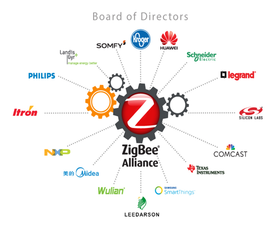
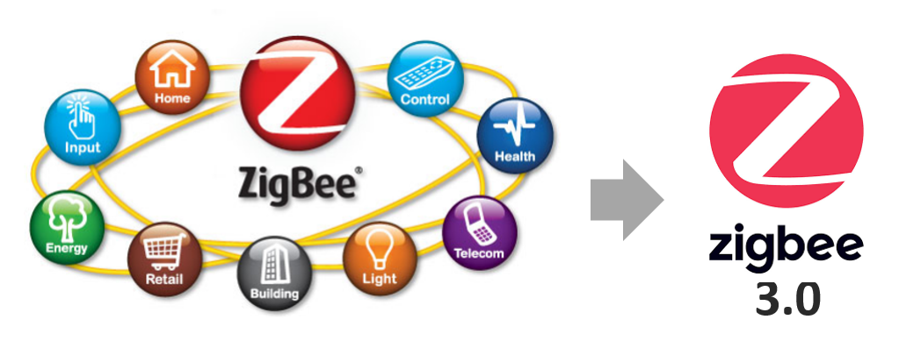
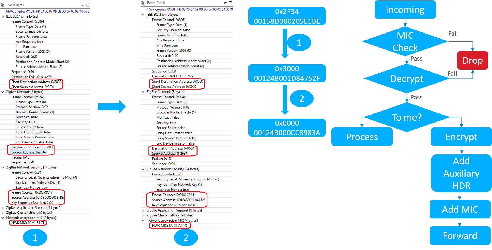
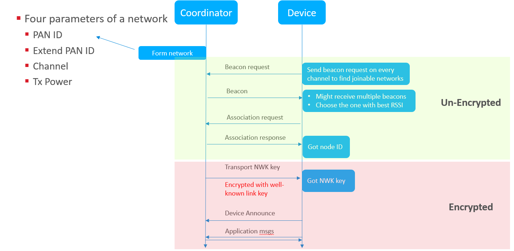
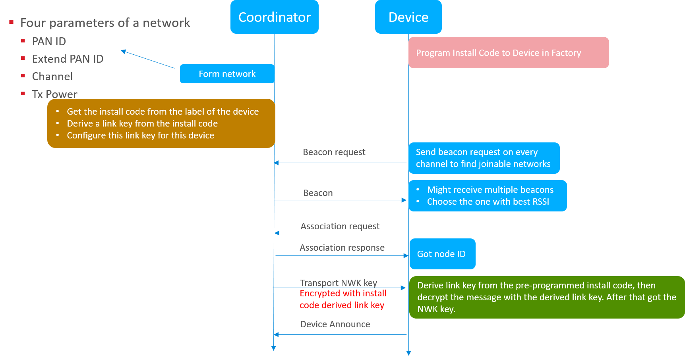

English | [中文](Introduction-of-Zigbee-Basic-CN)

Table of Contents 
  

- [1. Overview](#1-overview)
  - [1.1. What's Zigbee](#11-whats-zigbee)
  - [1.2. History of Zigbee](#12-history-of-zigbee)
  - [1.3. Zigbee Alliance](#13-zigbee-alliance)
  - [1.4. Protocol Overview](#14-protocol-overview)
- [2. Physical Layer](#2-physical-layer)
  - [2.1. Modulation](#21-modulation)
  - [2.2. Output Power](#22-output-power)
  - [2.3. Data Rate](#23-data-rate)
  - [2.4. Open Field Range](#24-open-field-range)
  - [2.5. Summary](#25-summary)
- [3. Medium Access Control (MAC) Layer](#3-medium-access-control-mac-layer)
  - [3.1. CSMA-CA](#31-csma-ca)
  - [3.2. Acknowledgements](#32-acknowledgements)
  - [3.3. MAC Frame](#33-mac-frame)
- [4. Network Layer](#4-network-layer)
  - [4.1. Device Type](#41-device-type)
  - [4.2. Network Address](#42-network-address)
    - [4.2.1. PAN ID](#421-pan-id)
    - [4.2.2. Extended PAN ID](#422-extended-pan-id)
  - [4.3. Node Address](#43-node-address)
- [5. Application Layer](#5-application-layer)
  - [5.1. Endpoint](#51-endpoint)
  - [5.2. Cluster](#52-cluster)
  - [5.3. Example](#53-example)
- [6. Security](#6-security)
  - [6.1. Network Layer Security](#61-network-layer-security)
    - [6.1.1. Overview](#611-overview)
    - [6.1.2. Hop-by-Hop Security](#612-hop-by-hop-security)
    - [6.1.3. Network Key](#613-network-key)
    - [6.1.4. Frame Counter](#614-frame-counter)
  - [6.2. APS Layer Security](#62-aps-layer-security)
    - [6.2.1. Overview](#621-overview)
    - [6.2.2. Install Code](#622-install-code)
- [7. Joining Procedure](#7-joining-procedure)
  - [7.1. Form Network](#71-form-network)
  - [7.2. Joining with the Well-Known Link Key](#72-joining-with-the-well-known-link-key)
  - [7.3. Joining with Install-Code Derived Link Key](#73-joining-with-install-code-derived-link-key)
- [8. Reference](#8-reference)

********

# 1. Overview
## 1.1. What's Zigbee
As the Internet of Things (IoT) industry develops, more and more wireless technologies come out.   

    

  
  

As we know, in IoT industry, we have two typical networks. One is WAN (Wide Area Network), the other is PAN(Personal Area Network).

- For the wireless technologies like LoRa, NB-IoT, 2G/3G/4G, etc, normally the transmit distance more than 1 km, so they are mainly used in wide area network (WAN). 
- For the wireless technologies like WiFi, Bluetooth, BLE, Zigbee and Zwave, normally the transmit distance is less than 1 km, so they are mainly used in personal area network (PAN).

Zigbee is one of the most popular wireless technologies used in IoT networks, especially in home automation industry. Its characteristics includes:
- Short range – Normally the radio can conver from 10 to 100 meters.
- Low data rate – the maximum data rate is 250 Kbps.
- Low Power – a sleepy end device can use less than 5uA at sleep mode;
- It’s a mesh technology – the network can be easily extended to very large. Theoretically maximum nodes number is 65535.

## 1.2. History of Zigbee
Zigbee is an open standard published and revisioned by [Zigbee Alliance](https://zigbeealliance.org/). It has a very long history.

    

  
  

Silicon Labs has been devoted to Zigbee technology since the very beginning. The Silicon Labs' Zigbee technology comes from Ember who began zigbee research and develop since it's born. In 2012, Silicon Labs acquired Ember and continue to provide Zigbee products and solutions. 

## 1.3. Zigbee Alliance
Zigbee Alliance is the main strength of promoting Zigbee technology. It's an open organization. Any company can join Zigbee Alliance as a member. Silicon Labs is the member of the board of Zigbee Alliance.  

    

  
  

The main three jobs of Zigbee Alliance are:
- **Develop** open, global standards for wireless device-to-device communication for the IoT (Internet of Things)
- **Certify** products to help ensure interoperability through our Certified program
- **Promote** the use of our standards around the world

In 2016, Zigbee Alliance published the latest Zigbee standard which is Zigbee 3.0. The profiles like Zigbee Home Automation Profile (ZHA), Zigbee Light Link (ZLL), etc, which are used before are unified together.  

    

  
  

Further more, security has been enhanced as it's getting more and more important.  

Zigbee 3.0 is mandated since 2017 as products which are compliant to the previous specification won't get certified.

## 1.4. Protocol Overview
The picture below demostrates the protocol architecture.  

    

  
  

1. Physical layer and MAC layer are defined by [IEEE-802.15.4](https://standards.ieee.org/content/ieee-standards/en/standard/802_15_4-2015.html). Physical layer is responsible for radio management, including functions like modulating/demodulating, signal strength detecting, etc. MAC layer is in charges of one-hop communication. 
2. Network layer is responsible for message transmitting and receiving, device mantainance, routing , etc.
3. Application Support Layer (APS), is in charges of end to end message transmitting.
4. Application layer is left for user design. Each application instance is called an endpoint. A special endpoint, which is endpoint 0, is reserved for management functionalities. We also call this management functionalities model as Zigbee Device Object (ZDO).
5. In APS layer and network layer, there are some security features which are used to protect the network from being hacked.

# 2. Physical Layer
Zigbee works on ISM frequency. The channels are defined as below:

    

  
  

Most commonly, Zigbee works on 2.4GHz.

## 2.1. Modulation
Physical layer also handles the transmission and reception of raw bits of data. The PHY layer uses binary phase shift keying (BPSK) in the 868/915 MHz bands and offset quadrature phase shift keying (O-QPSK) at 2.4 GHz. The information is coded onto the carrier with direct sequence spread spectrum (DSSS), an inherently robust method of improving multipath performance and receiver sensitivity through signal processing gain. Note that 2.4 GHz is the most commonly used frequency band for Zigbee communication worldwide. The only official sub GHz support is for UK smart energy. 

## 2.2. Output Power
802.15.4 is designed for low power, low data rate networks with a low-cost objective in mind. These are generally referred to as PANs or Personal Area Networks. The idea here is that these would be low to moderate radio range application designs. But amplification is also possible. It is possible to get up to roughly +20 dBm output power in most countries. In Europe it is regulated a little bit lower to around +10 dBm. But, that's enough to get you anywhere from about one to three kilometers, depending on what your link budget is and what kind of amplification you have and/or what kind of antenna you have. 

## 2.3. Data Rate
The raw bit rate is 250 kilobits per second using the 2.4 GHz direct sequence spread spectrum Phy or DSSS. In the real world you are going to see about a quarter or fifth of that. The expected throughout is comparable to a 56k baud modem. Around 52700 kilobits per second on a single hop link. Once you put in multi-hop effects, things will take a little bit longer to propagate. 

## 2.4. Open Field Range
With 2.4 GHz PHY, the ranges we mentioned could be roughly two kilometers with line of sight. This is with a fair amount of amplification and still within legal limits in most areas. And because of all the channels, you have robust communications such that you can avoid interference by making sure to pick channels that are not terribly noisy. Now if you do pick a channel and it becomes noisy, ZigBee has a high level response with what they call "frequency agility." So that some network manager can move the network to a different channel. The other advantage to the 2.4 GHz spectrum is that it's available globally which means you have a wide range install base for your product.

## 2.5. Summary
Functions of Physical layer includes:
- Interface of physical radio and MAC layer
- Radio on/off Control
- Modulation and Demodulation
- Channel Selection
- Link Quality Estimation
- Energy Detection

# 3. Medium Access Control (MAC) Layer
The main function of the MAC layer is to ensure reliable one-hop message delivery. Here are some more details on these functions. 

## 3.1. CSMA-CA
802.15.4 allows for multiple networks to be on the same channel. Therefore there needs to be some way to avoid having packets from different networks collide over the air and cause errors in communication. MAC sub-layer controls access to the radio using CSMA-CA (Carrier sense multiple access with Collision avoidance). Collision avoidance is done by CCA (Clear Channel Assessment). Before transmitting, every node shall check to see if the airwaves are clear (RSSI below CCA threshold). If they are, the node shall go ahead and transmit after a small random backoff. If the CCA does not pass, then the node shall wait a number of back off periods before trying the process again.  The random backoff allows multiple nodes to stagger transmissions so at some point they can find clear air to transmit. Although the bit rate is low, since packets are small (128 bytes), each node completes its transmission successfully even if the channel is fairly busy. 

## 3.2. Acknowledgements
MAC layer also provides a method for nodes to know that 1 hop unicast transmission have been successfully received by way of acknowledgements and that the integrity of the transmitted message has been preserved by verifying a CRC. 

Multi hop transmissions shall be acknowledged on every hop. After the node performs the CCA check and transmits the message, it waits for a MAC acknowledgment. If it does not receive one, the node shall attempt to resend the message multiple times until it eventually succeeds, or the maximum retries have been exhausted. The Silabs Ember ZNet stack provides additional mac retries providing earlier corrective action for a failed message transmission instead of waiting until an end-end retry to kick in, which could take several seconds.  

## 3.3. MAC Frame
The picture below demostrate MAC frame format:

    

  
  

At the end of each MAC frame, there are two bytes CRC used to verify the integrity of the packet. In MAC header, there is a 2-bytes field "Frame Control". Bit0~2 of field "Frame Control" indicates the frame type. There are four frame types:  
- Beacon, used to scan networks
- Data, used to transmit data from higher layers
- ACK, acknowledgement
- MAC Command, control commands of MAC layer, like MAC association procedure.

# 4. Network Layer
Here we will introduce some basic concepts of Zigbee network, including:  
- Device Type
- Network Address
  - PAN ID
  - Extended PAN ID
- Device Address
  - Node ID
  - Eui64

## 4.1. Device Type
IEEE-802.15.4 defined two device types:
- **FFD**, Full Functional Device, capable of performing all the duties described in the IEEE 802.15.4 standard and can accept any role in the network. 
- **RFD**, Reduced Functional Device, has limited capabilities. 

**Note**: The processing power and memory size of RFD devices are normally less than those of FFD devices.  

In Zigbee, there are three device types:  
- Coordinator
- Router
- End Device, including non-sleepy end device and sleepy end device.

    

  
  

|Device Type|Form Network|Routing|Power|As Parent||
|:-|:-|:-|:-|:-|:-|
|Coordinator|Yes|Yes|Main Power|Yes|There could be only one in a network. Node ID is always 0.|
|Router|No|Yes|Main Power|Yes||
|End Device|No|No|Main Power or Battery|No|Must have a parent.|

## 4.2. Network Address
Zigbee use PAN ID and extended PAN ID to indentify a network.

### 4.2.1. PAN ID
The PAN, or Personal Area Network, is separated from other networks through its PAN ID. This is a 16-bit identifier that all nodes in the same PAN will share. So it’s something akin to a subnet mask in the Ethernet world in that you generally would only be communicating with devices within your local network, which is the PAN in this case. **This identifier is placed into the low-level MAC-layer header in every out-going packet, and it allows devices that receive the packet to filter out the messages that don’t pertain to their network.** They can compare it against their own PAN ID, and decide if this is a message from someone in their own network, or if it’s from someone in a different network that just happens to be on this channel so there’s no need to try to decode or decrypt it.

<table>
  <tr>
    <td></td>
    <td></td>    
  </tr>
</table>

The PAN ID is chosen by the coordinator upon network formation. Because the PAN ID is the distinguishing factor between one network and another, it should be random to ensure its uniqueness. It’s recommended that you select a random 16-bit value for your PAN ID that keeps your network from coinciding with any other network that happens to exist in the area. 

Now, what if you happened to pick a PAN ID that’s already used by another network? Or what if you did pick a random PAN ID that wasn’t in conflict with any other network, but later another network grew to overlap with yours? If the PAN ID conflict ever happens, the stack can in fact detect such a conflict and can update its PAN ID automatically and inform all the nodes in its network to move to the new PAN ID, so that each node can continue communicating with nodes in its original network and exclude anyone on the conflicting network. If the PAN ID is conflict, we need to use extended PAN ID to distinguish the networks.

### 4.2.2. Extended PAN ID
Extended PAN ID is another network identifier known by all nodes in the PAN.

While the normal short 16-bit PAN ID is transmitted over the air in all the packets because it’s short and simple, the 64-bit extended PAN ID is rarely transmitted over the air. The extended PAN ID is also unique for every PAN, and it’s basically used as a backup criteria when the 16-bit PAN ID is not enough to always distinguish one network from another. For instance, when a PAN ID conflict occurs and you want to notify all devices in your network to move, the way that you distinguish your network from the conflicting network is, those devices in your network all share the same extended PAN ID. The extended PAN ID is highly unlikely to ever conflict because it has 64 bits compared to the 16 bits in the short PAN ID.

    

  
  

The extended PAN ID is also chosen by the coordinator during network formation. **It’s only sent over the air in response to an Active Scan when nodes are soliciting the network, or when a PAN ID update is occurring.**

It’s also a useful factor in allowing you to select the network. If you are trying to come into a network rather than form one, you might wonder how to tell which networks are available. The way the networks are distinguishable from one another is not only in the PAN ID but also in the extended PAN ID. You might want to do something special where you decide you are only going to use a certain subset of extended PAN IDs so that you can distinguish your networks from other networks, but just don’t limit yourself too much, because the more you limit this the more likely that you have a conflict, and if your extended PAN ID ever conflicts there’s really nothing you can do to fix that. It’s a little like a WiFi SSID, except that those can be the same between networks and this one can’t.

## 4.3. Node Address
Besides their network-wide criteria, one node is distinguished from another by its individual node addresses.

A node has a short address and a long address. The long address is the IEEE-assigned MAC address, or EUI-64. It is a 64-bit address that is globally unique, meaning no two IEEE-based radios in the world should ever have the same EUI-64. This is generally assigned at manufacturing time. They are assigned when the chips come out of our manufacturing facility before they arrive to you, and they will never change. That’s how you tell one radio from another. But because 64 bits are a lot of data, this long address is not sent over the air very often.

    

  
  

Most of the time the much shorter, 16-bit address is used over the air. This is known as the node ID and unique within a network, similar to an IP address in Ethernet world. It is assigned as the node enters the network, and it’s supposed to be unique within that network. There may be two networks each of which has a node with the same node ID, but because they in different PANs, it doesn’t matter.

Note that it’s possible for two nodes to have chosen the same random node ID when they enter the network. If that happens, much like the PAN ID scheme, there is a method for conflict resolution. When the nodes notice the conflict, based on the EUI-64 information as a fallback, they can agree upon new addresses. So the nodes can change addresses at run-time if required, based on a conflict.

# 5. Application Layer
In application layer, a physical device can be split to several logic devices by implementing multiple endpoints.

## 5.1. Endpoint
Each endpoint represents a logic device. For example, if we have a smart outlet adapter with 6 outlets on it. We can implement it with 6 endpoints so that  we can switch on/off each outlet respectively.

    

  
  

The endpoint ID is a 8bit value, ranging from 0 to 255. 
- Endpoint 0 is reserved for Zigbee Device Object, mainly used for management purpose.
- Endpoint 1 to 239 can be used by user applications.
- Endpoint 240 to 254 are reserved for special applications. Like Zigbee Green Power use dedicate endpoint 242.
- Endpoint 255 is used for broadcasting. 

## 5.2. Cluster
In each endpoint, we can configure several clusters. Zigbee cluster is actually a communication model. 

    

  
  

It’s based on client/server mode and used to describe the application protocol between the two devices.
Each cluster has a cluster ID which is defined in Zigbee Cluster Library (ZCL).
A cluster may define several attributes and commands.

## 5.3. Example
Let’s see an example of the cluster, so that we can understand it better.  
For example we need to implement a Light with two bulbs.

    

  
  

We can define two endpoints in it. Each endpoint represents a bulb.

For the basic function, like turning on/off, we can use the on/off cluster.  The light is the server side, and the switch is the client side.
There is an attribute “on/off” defined in the server side, indicating if the light is on or off.
There is also commands like “turn on”, “turn off”, “toggle” defined and should be sent from the client side to server side.

If we want more functionalities, like we need to support level control. We can use the level-control cluster.
In this cluster, there is an attribute “level” defined in the server side, indicating the brightness of the bulb.
There is also commands like “move to level” defined and should be sent from the client side to server side.

And if we need even more functionalities, for example we need to support color control, we can use the color control cluster.

# 6. Security
As Zigbee is a wireless technology, security is very important because hackers can sniffer those packets over the air. Imaging that you have a smart door lock. If the hacker captured the packets of unlocking your door, then he could replay that to open your door. That would be dangerous. To prevent that from happening, Zigbee defined many security features. Let talk about it.  

## 6.1. Network Layer Security
### 6.1.1. Overview
Look at the picture below. 

<table>
  <tr>
    <td></td>
    <td></td>    
  </tr>
</table>

It shows how an unsecured network frame is secured in network layer.  
First, the network payload will be encrypted. After that, an security header will be added before the encrypted payload. Then calculate a hash value from the network header, security header and the encrypted payload. Finally appended the 32-bit hash value to the end of the frame. If any byte of the network header, security header and encrypted payload is changed, the hash value will be different. We call this value MIC, short for message integrity check.

The network encryption uses a symmetric encrypting algorithm (AES128), which means the same key is used for encryption and decryption. This key is called network key.
As it's a symmetric encrypting algorithm, all devices in the same Zigbee network will use the same network key.

In the network security header, a field named “frame counter” and the source Eui64 of the node who encrypt the message are added to protect replay attack.
A key sequence number is added to support network key updating.

### 6.1.2. Hop-by-Hop Security
Network layer security is a hop-by-hop security.  

    

  
  

The router node needs to decrypt the message, then encrypt it and replace the info in security header, after that send it out.
If the decrypting fails, the message will be dropped immediately.

The benefits of this is to drop the attacking messages as soon as we can.

### 6.1.3. Network Key
Network key is a 16 bytes octets.
Normally it’s randomly generated by coordinator when the network is formed.
When new devices join network, they must get a copy of the network key.

In Zigbee network, the role who distribute network key to new devices is called trust center. There are two typical security models, centralized security network and distributed security network.  

    

  
  

In a centralized security network, there is only one trust center, normally it’s the coordinator. All new devices will get network key from coordinator.  
In a distributed security network, every router is a trust center. New devices can get network key from every router.

As the network key needs to be transported from one device to another, the key value needs to be encrypted during transporting. 
This encryption is done in application layer. We will talk about it later.

### 6.1.4. Frame Counter
Frame counter is added to prevent replay attacks. Let’s see how it works.

    

  
  

First, a node will record the frame counter of the received frame and the Eui64 of the node. The frame counter of the next message from the same node must be bigger than the recorded. Otherwise, the message will be considered to be a replay and will be dropped.

To achieve this, on the transmitting side, every node will save it’s outgoing frame counter. On the reception side, nodes need to save frame counters of all neighbors.

As frame counter is a 32-bit value, it could wrap if the device keep running for a very long time. Apparently there could be a problem if the frame counter wraps. To prevent this from happening, the network key must be updated before it wraps. If the network key is updated, the frame counter could start from zero again.

## 6.2. APS Layer Security
### 6.2.1. Overview
The message of transporting network key is encrypted in application. Let’s see application layer security.  

    

  
  

It’s quite similar to network security. 
Also symmetric encrypting algorithm (AES128) is used. The key is called link key. For most case, only the transporting network key message needs to be encrypted in application layer, and this only happens between trust center and the new device. So in this case, we also call it as trust center link key.

APS layer security is an **end-to-end** security because only the two peers which participate the communication know the link key.

Devices in the network can use the same link key or different link key.
If the devices use the same link key, this key is a global link key.

In distributed model, as every router could be a trust center, global link key will be used.
In centralized model, there is also a special global link key being used, which is the well-known link key. It’s the string “**ZigbeeAlliance09**”.
This is used in the standards before Zigbee 3.0 and is kept to keep backward compatibility.

The trust center link key must be preconfigured on the devices so that they can join and work.
It would be easy if they are using the well-known link key.
But what if they need to use different link key?

Zigbee defines an approach to configure the link key out of band. It’s the install code.

### 6.2.2. Install Code

    

  
  

Install code is a 16 bytes polynomial + 2 bytes CRC.   

When device is manufactured, in the factory, an install code will be programmed into the device. After that, on the label of the device, the install code and the Eui64 of the device will also be recorded.

When device is going to be installed, users get the install code and Eui64 from the label.
Then configure them to coordinator. The coordinator them derive a link key from the install code and set a table to use the link key for this specific device.

After that, this link key will be used to encrypt the message in application layer.  

On the device side, it reads the install code from the flash and then derive a link key with the same algorithm. This link key should be the same with the derived link key on the coordinator side. So that they can communicate in application layer even if the message is encrypted.

# 7. Joining Procedure
We will talk a little about how a Zigbee network is formed and how a device joins into the network.

## 7.1. Form Network
First, the coordinator forms a network. To form a Zigbee network, you have to prepare 4 parameters:
- PAN ID
- Extend PAN ID
- The working channel
- Transmit power

You need to specify these four parameters. 
If you don’t, the coordinator will randomly choose a PAN ID and an extended PAN ID.
If you don’t specify a channel, the coordinator will scan and pick a relatively quiet channel to work on.

## 7.2. Joining with the Well-Known Link Key

    

  
  

After the network formed, new devices can start to join. 
1. The new device will start to find the joinable network. In this phase, the new device will send beacon requests on each channel. 
2. Routers and coordinators will respond a beacon with the network info carried in the beacon frame. These info includes the PAN ID, the extend PAN ID and also some other properties of the router or coordinator, like if the device permit join, if the device has the capacity to let the new device join.
3. The new device may receive multiple beacons from different devices. It will pick up one with the best signal quality and start to send association request. In this association request, the PAN ID is set to the chosen PAN and the destination node id is set to the node ID of the chosen device. In this frame, the capability of the new device will be carried on.
4. When the router or coordinator received this association request, it would pick up a node ID for the new device and respond with an association response. Then the new device got its node ID and but it can’t communicate with other nodes as it hasn’t gotten the security key.
5. The coordinator will transport the current NWK key to the new device. **This transporting message is encrypted in application layer with the well-known link key.**.
6. When the new device receives this message, **it uses the well-known link key to decrypt the message and gets the network key**. After that, the device is really joined the network and is able to communicate with all other nodes in the network.
7. The device will send an announce message to notify the other nodes of the network to inform them that I’m joined.

## 7.3. Joining with Install-Code Derived Link Key

    

  
  

1. The new device should have been programmed with the install code before shipped out from the factory.  
2. Before it joins, users need to get the install code and Eui64 of the new device, and then configure them on the coordinator.  
3. The coordinator then derive a link key from the install code and set the coordinator to use this link key to encrypt the transport NWK key message for this new device.

The rest procedure is similar to the procedure of joining with the well-known link key. **When coordinator starts to transport network key to the new device, it encrypt the message and transport it to the new device.** When the new device receives this message, **it reads the install code from flash and derive a link key from it, then use this key to decrypt the message and get the network key**.

# 8. Reference
- [UG103-01 Fundamentals: Wireless Network](https://www.silabs.com/documents/public/user-guides/ug103-01-fundamentals-wireless-network.pdf)
- [UG103-02 Fundamentals: Zigbee](https://www.silabs.com/documents/public/user-guides/ug103-02-fundamentals-zigbee.pdf)
- [UG103-03 Fundamentals: Design Choices](https://www.silabs.com/documents/public/user-guides/ug103-03-fundamentals-design-choices.pdf)
- [AN1233 Zigbee Security](https://www.silabs.com/documents/public/application-notes/an1233-zigbee-security.pdf)
- [Zigbee Online Training Resources](https://www.silabs.com/support/training/mesh)
********
