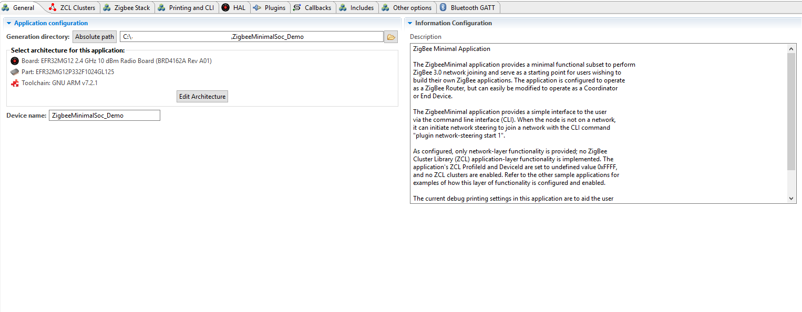
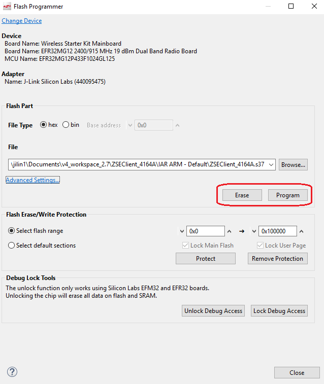
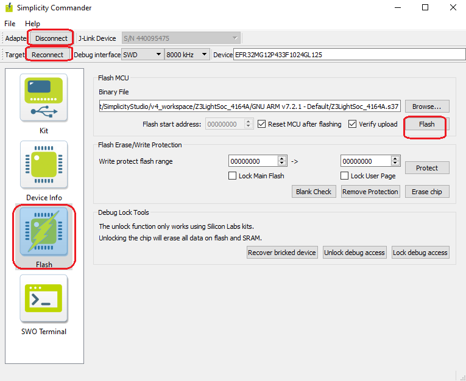

[English](Introduction-of-EmberZnet-and-AppBuilder) | 中文

<details>
<summary><font size=5>目录</font> </summary>  

- [1. 总览](#1-总览)
- [2. SoC和模块](#2-soc和模块)
  - [2.1. SoCs](#21-socs)
  - [2.2. 模块](#22-模块)
  - [2.3. 框图](#23-框图)
- [3. 软件开发套件](#3-软件开发套件)
  - [3.1. 设计模型](#31-设计模型)
  - [3.2. Gecko Bootloader](#32-gecko-bootloader)
  - [3.3. EmberZnet SDK](#33-emberznet-sdk)
- [4. 开发工具](#4-开发工具)
  - [4.1. 无线入门套件](#41-无线入门套件)
  - [4.2. Simplicity IDE](#42-simplicity-ide)
    - [4.2.1. 总览](#421-总览)
    - [4.2.2. 创建一个Zigbee项目](#422-创建一个zigbee项目)
    - [4.2.3. 配置项目](#423-配置项目)
      - [4.2.3.1. "General" 选项卡](#4231-general-选项卡)
      - [4.2.3.2. "Zigbee Stack" 选项卡](#4232-zigbee-stack-选项卡)
      - [4.2.3.3. "ZCL CLuster" 选项卡](#4233-zcl-cluster-选项卡)
      - [4.2.3.4. “Plugins”选项卡](#4234-plugins选项卡)
      - [4.2.3.5. “Callbacks”选项卡](#4235-callbacks选项卡)
      - [4.2.3.6. “Includes”选项卡](#4236-includes选项卡)
      - [4.2.3.7. 硬件配置](#4237-硬件配置)
    - [4.2.4. 生成项目](#424-生成项目)
    - [4.2.5. 建立项目](#425-建立项目)
    - [4.2.6. 测试和调试](#426-测试和调试)
      - [4.2.6.1. 烧录应用image](#4261-烧录应用image)
        - [4.2.6.2. 打开控制台](#4262-打开控制台)
        - [4.2.6.3. 常用的命令](#4263-常用的命令)
      - [4.2.6.4. Network-Analyzer](#4264-network-analyzer)
  - [5. 参考](#5-参考)

</details>

********
## [点击这里观看视频课程][video-tutorial]

# 1. 总览
Silicon Labs的Zigbee解决方案包括三个部分： 
- SoC和模块
- 软件开发套件
- 开发工具

# 2. SoC和模块
你可以从[Silicon Labs的官方网站](https://www.silabs.com/wireless/zigbee)了解到，Mighty Gecko系列的SoC和模块用于Zigbee应用。Mighty Gecko是Gecko家族中最强大的芯片。它支持Zigbee，蓝牙，Thread，私有技术。

## 2.1. SoCs

|SoC 系列|MCU 内核|频段|闪存大小（KB）|内存大小（KB）|  
|:-|:-|:-|:-|:-|
|[EFR32MG22](https://www.silabs.com/wireless/zigbee/efr32mg22-series-2-socs)|ARM Cortex-M33|2.4GHz|512|32|
|[EFR32MG21](https://www.silabs.com/wireless/zigbee/efr32mg21-series-2-socs)|ARM Cortex-M33|2.4GHz|512/768/1024|64/96|
|[EFR32MG12](https://www.silabs.com/wireless/zigbee/efr32mg12-series-1-socs)|ARM Cortex-M4|2.4GHZ/Sub-GHz|1024|128/256|
|[EFR32MG13](https://www.silabs.com/wireless/zigbee/efr32mg13-series-1-socs)|ARM Cortex-M4|2.4GHZ/Sub-GHz|512|64|

## 2.2. 模块

使用模块的好处在于，无需再进行认证，可以节省大量的时间，例如FCC，CE，ISED等。

|模块 系列|MCU 内核|频段|闪存大小（KB）|内存大小（KB）|  
|:-|:-|:-|:-|:-|
|[MGM210 Series](https://www.silabs.com/wireless/zigbee/efr32mg21-series-2-modules)|ARM Cortex-M33|2.4GHz|1024|96|
|[MGM12  Series](https://www.silabs.com/wireless/zigbee/efr32mg12-series-1-modules)|ARM Cortex-M4|2.4GHz|1024|256|
|[MGM13  Series](https://www.silabs.com/wireless/zigbee/efr32mg13-series-1-modules)|ARM Cortex-M4|2.4GHz|1024|256|  

## 2.3. 框图
下面是EFR32MG12系列SoC的框图。
  
<div align="center">
    
</div>
</br>

SoC可以在6种不同的功耗模式下工作。从最大功耗到最低功耗：

- EM0 - Active
- EM1 - Sleep
- EM2 - Deep Sleep
- EM3 - Stop
- EM4 - Hibernate
- EM4 - Shutoff  

**注意:**
1. 在该图中，每个功能块都用一个颜色标记，该颜色表示该功能块能工作的最低能量模式。在EmberZnet中，Zigbee协调器和路由器始终在EM0下工作，因为它们始终由主电源供电。Zigbee睡眠终端设备在EM2或EM4（休眠）模式下工作。
2. SoC中集成了高频RC振荡器（HFRCO）和低频RC振荡器（LFRCO）。对于Zigbee应用，必须连接一个HFXO时钟，因为无线电需要高精度的高频时钟才能工作，但它们仍可以将LFRCO用于外围设备。 
3. 内部集成了DCDC。使用者可以选择使用内部DCDC或绕过DCDC。 建议在睡眠节点上使用内部DCDC，从而更好的控制功耗。 
4. 无线电收发器已经集成，并且已经集成了PA。用户可以选择使用DCDC或主电源为PA供电。如果发射功率大于13dbm，建议使用主电源为PA供电。否则，请改用DCDC。
5. 集成的数据包跟踪接口（PTI）可用于空中捕获数据包。这对于调试非常有用。
6. 集成的数据包流量仲裁（PTA）接口可用于改善Zigbee和WiFi之间的干扰。这对于Zigbee网关非常有帮助。

# 3. 软件开发套件
## 3.1. 设计模型
EmberZnet为Zigbee应用程序提供了两种设计模型：
- 网络协处理器（NCP）模型
- 片上系统（SoC）模型

<div align="center">
    
</div>
</br>

1. 在SoC模型中，所有协议层以及应用程序都在单个芯片上实现，较底层的协议栈功能通过专用的硬件外围模块来实现。

   通常以库API调用的形式提供对协议栈功能的访问。  
   在协议栈和应用程序之间可能有一定数量的对微控制器的外围设备或资源的共享访问。  
   尽管共享可能会给应用程序开发人员带来更多限制，但最终会带来更低的材料成本和更紧凑的硬件设计。  

2. 另一种实现是网络协处理器或NCP模型。在此模型中，协议栈和底层的无线电功能都驻留在一个芯片上，以实现有关协议栈功能的最佳集成和效率。但是，协议栈与应用程序接口是通过诸如SPI或UART之类的串行接口，而不是函数调用库。通过在这些接口之上使用专有的串行协议，主机微控制器可以与协议栈交互，从而有可能将串行处理抽象成库或系统模块的操作，从而更好地满足主机上运行的应用程序的需求。

   该模型为应用程序设计和主机处理器体系结构提供了极大的灵活性。  
   它允许应用程序设计者忽略有关协议栈本身的许多实现细节。  
   根据NCP的实现，NCP固件还可能会公开其他功能或协议栈行为的抽象，以完成针对正在运行的应用程序类型定制的更高级别的应用程序任务。  
   我们提供了一个应用程序框架来为那些只需要标准或常用功能集的用户编译可定制的NCP和NCP示例应用程序。  
   
   有关这些选项的更多详细检查，请参阅应用笔记和有关可定制NCP，EZSP-SPI和EZSP-UART（例如[AN1010](https://www.silabs.com/documents/public/application-notes/an1010-customized-ncp.pdf), [AN711](https://www.silabs.com/documents/public/application-notes/an711-ezsp-spi-host-interfacing-guide.pdf), [AN706](https://www.silabs.com/documents/public/application-notes/an706-ezsp-uart-host-interfacing-guide.pdf)）的培训资源。
   
您可能想参考[UG103.3](https://www.silabs.com/documents/public/user-guides/ug103-03-fundamentals-design-choices.pdf)的设计选择以及何时选择SoC和NCP模型。

## 3.2. Gecko Bootloader
为了支持固件升级，我们需要一个Bootloader。

1. 对于SoC模型，升级方案为：
    - 设备启动并运行应用程序
    - 应用程序通过空中接收新image并将新image存储到存储单元中
    - 设备重置，并且通过Bootloader加载新image

2. 对于NCP模型，升级方案为：
   - 主机通过互联网接收新的NCP image
   - 主机重置NCP并让NCP停留在Bootloader阶段
   - 主机通过UART / SPI将新的NCP image传输到NCP并覆盖当前image
   - 主机重置NCP并运行新image

Silicon Labs提供了三种类型的Bootloader。  

|类型|注释|  
|:-|:-|
|Bootloader Xmodem UART|也称为独立Bootloader。主要用于基于UART的NCP。主机可以通过UART将image传输到NCP，以升级NCP image。|
|EZSP SPI Bootloader|另一种独立的Bootloader。主要用于基于SPI的NCP。主机可以通过SPI将image传输到NCP，以升级NCP image。|
|Internal Storage Bootloader|用于SoC。将新软件image存储在内部闪存中。|
|SPI Storage Bootloader|用于SoC。将新image存储在SPI闪存中。|

还有一些用于DEV-Kit的预编译的Bootloader image。可以在Gecko SDK Suite目录下的`platform\bootloader\sample-apps`目录中找到它们。   
例如  
```
The default path for Gecko SDK Suite V2.7:
C:\SiliconLabs\SimplicityStudio\v4\developer\sdks\gecko_sdk_suite\v2.7  

The path for pre-built bootloader:  
C:\SiliconLabs\SimplicityStudio\v4\developer\sdks\gecko_sdk_suite\v2.7\platform\bootloader\sample-apps
```

## 3.3. EmberZnet SDK
EmberZnet SDK是Gecko SDK套件的一部分。可以在Gecko SDK Suite目录下的`protocol\zigbee`中找到它。EmberZnet SDK的目录层次结构如下（仅列出了一些重要目录）：

```
+---app
|   +---framework  -- Source code of the framework, consist of many plugins
|   |   +---plugin          -- plugins applicable for host and SoC
|   |   +---plugin-host     -- plugins applicable for host
|   |   +---plugin-soc      -- plugins applicable for SoC
|   +---gpd        -- Source code of Green Power Device SDK
+---build          -- Libraries of some component
+---documentation  -- All documents about EmberZnet SDK
+---ncp-images     -- Pre-built NCP images for DEV-Kits
\---tool
    +---image-builder  -- Tools for build Zigbee OTA files
```

# 4. 开发工具
## 4.1. 无线入门套件
Silicon Labs的无线入门套件（WSTK）由主板和无线电板组成。就像下面这样：

<div align="center">
    
</div>
</br>

1. 母板是多功能J-Link调试器。在大多数情况下，我们将使用：
   - 2个按钮
   - 2个LED
   - 液晶屏
   - J-Link
   - 捕获空中网络包
   - 测量电流
   - UART转USB转换器

    母板还可以用作独立的闪存编程器和J-Link调试器，以调试定制板。如[AN958](https://www.silabs.com/documents/public/application-notes/an958-mcu-stk-wstk-guide.pdf)第4.1节所述，建议在自定义板上设计10管脚的Simplicity微型调试连接器。  
    开始编程或调试时，只需将主板的微型连接器连接到自定义板上，然后将主板的“调试模式”设置为“输出”即可。

2. 开发板是可更换的。用户可以交换不同的开发板来评估不同的SoC或模块 

    <div align="center">
        
    </div>
    </br>

## 4.2. Simplicity IDE
### 4.2.1. 总览
Simplicity IDE是一个功能强大的IDE。集成了许多工具，包括：
- AppBuilder
- Hardware Configurator
- Network Analyzer
- Energy Profiler
- Simplicity Commander

这些工具将在Zigbee开发过程中频繁使用。我们将演示如何创建Zigbee项目，配置项目，调试项目。所有这些工具将在演示期间进行介绍。

### 4.2.2. 创建一个Zigbee项目
您可以按照以下步骤创建Zigbee项目： 
1. 转到File->New->Project。 这将显示 "New Project Wizard";
2. 选择“ Silicon Labs AppBuilder项目”，单击“Next”；
3. 选择“ Silicon Labs Zigbee”，单击“Next”；
4. 选择我们用于SoC的最新EmberZNet协议栈，单击“Next”；
5. 这里将列出示例项目。您可以选择其中之一，单击“Next”；
6. 命名您的项目，例如“ ZigbeeMinimal_Demo”，单击“Next”；
7. 在下一个窗口（项目设置）中，选择板（如果要开发自定义板，请将“board”字段留空，然后选择芯片型号。）和编译器，单击“Finish”。
8. 之后，创建项目。项目的isc文件将自动打开。  

    <div align="center">
        
    </div>
    </br>


### 4.2.3. 配置项目
在配置Zigbee项目之前，建议先阅读[UG391](https://www.silabs.com/documents/public/user-guides/ug391-zigbee-app-framework-dev-guide.pdf)。

#### 4.2.3.1. "General" 选项卡
打开isc文件时，默认选项卡是“General”选项卡。在这里，您可以看到项目的板/芯片型号和工具链。您还可以看到项目的绝对路径。您可以在此处更改为其他芯片或不同的工具链。

<div align="center">
    
</div>
</br>

#### 4.2.3.2. "Zigbee Stack" 选项卡
在“ Zigbee Stack”选项卡下，您可以设置设备类型和安全性类型。对于Zigbee设备类型，我们有四个选项：
- Cooridnator or Router
- Router
- End Device
- Sleepy End Device

#### 4.2.3.3. "ZCL CLuster" 选项卡
确定Zigbee设备类型后，您可以设置endpoint和每个endpoint所在的cluster。这些功能在“ ZCL Clusters”选项卡下。

1. 首先，您需要设置制造商代码。这是Zigbee联盟在您公司的第一个产品通过联盟认证时提供的代码。如果您的公司已经获得了制造代码，则可以从列表中选择。  

    <div align="center">
        
    </div>
    </br>

2. 其次，您可以在此处添加/删除endpoint，还可以选择要在endpoint上使用的设备配置文件。您还可以根据配置文件选择其他Clusters。在这种情况下，设置“ ZCL设备类型”时，请勿直接选择Zigbee设备配置文件。而是选择“ Zigbee Custom”，然后选择一个设备配置文件。
    <div align="center">
        
    </div>
    </br>

    您可以选择Cluster，然后选择Cluster定义的属性和命令。

3. Cluster的属性和命令在Zigbee Cluster Library（ZCL）中定义。选择属性和命令时，需要参考ZCL规范。

#### 4.2.3.4. “Plugins”选项卡
1. 插件的属性

    <div align="center">
        
    </div>
    </br>

    插件具有以下属性：
    |属性|注释|
    |:-|:-|
    |Plugin Name|插件名称|
    |Quality|插件的质量可能是：:<ul type="disc"><li>制作准备</li><li>测试工具</li><li>扩展需求</li><li>示例代码</li><li>内部测试</li><li>公开测试</li><li>调试工具</li></ul>|
    |Option|插件选项|
    |Located|插件目录|
    |Source files|插件的源文件|
    |Defined callbacks|此插件定义的回调|
    |Implemented callbacks|在协议栈或其他插件中定义的回调，用此插件实现|  
    大多数插件都是开源的。您可以检查源代码以了解其实现方式。
    </ul>

2. 常用插件

    <table>
        <tr>
            <th>类别</th>
            <th>插件</th>
            <th>注释</th>
        </tr>
        <tr>
            <td rowspan="6">核心协议栈</td>
            <td>Zigbee PRO Stack Library</td>
            <td>具有路由支持的核心协议栈，由路由和协调器使用</td>
        </tr>
        <tr>
            <td>Zigbee PRO Leaf Library</td>
            <td>不支持路由的核心协议栈，由终端设备使用</td>
        </tr>   
        <tr>
            <td>End Device Support</td>
            <td>一个支持终端设备的插件</td>
        </tr>       
        <tr>
            <td>Network Creator</td>
            <td>创建网络，由协调器使用</td>
        </tr>  
        <tr>
            <td>Network Creator Security</td>
            <td>协调器的安全设置，例如为新设备配置Link key</td>
        </tr>  
        <tr>
            <td>Network Steering</td>
            <td>扫描可加入的网络并加入</td>
        </tr>  
        <tr>
            <td rowspan="2">睡眠</td>
            <td>Idle/Sleep</td>
            <td>由睡眠终端设备使用。空闲时设备将进入EM2。</td>
        </tr>     
        <tr>
            <td>EM4</td>
            <td>插件可帮助睡眠终端设备进入EM4</td>
        </tr>       
        <tr>
            <td>主条目</td>
            <td>Simple Main</td>
            <td>项目的主要入口</td>
        </tr>      
        <tr>
            <td rowspan="6">非易失性数据</td>
            <td>Simulate EEPROM Version 1 Library</td>
            <td>模拟EEPROM版本1的库，用于存储非易失性数据</td>
        </tr>       
        <tr>
            <td>Simulate EEPROM Version 2 Library</td>
            <td>模拟EEPROM版本2的库，用于存储非易失性数据</td>
        </tr>  
        <tr>
            <td>NVM3 Library</td>
            <td>NVM3库，用于存储非易失性数据</td>
        </tr>                 
    </table>

3. 插件可能依赖于其他插件。在生成项目时，AppBuilder将检查依赖性。如果不满足依赖关系，则会出现警告。

#### 4.2.3.5. “Callbacks”选项卡
Silicons Labs建议客户在回调中添加其自定义源代码。好处是，当您从旧的SDK迁移到新的SDK时，这将非常容易。

建议在生成的文件&lt;projectname&gt;_callbacks.c 中定义和实现选定的回调。您也可以将它们添加到新的源文件中。

使用它们之前，请确保已阅读回调的注释。
  
<div align="center">
    
</div>
</br>

#### 4.2.3.6. “Includes”选项卡
在“Includes”选项卡下，您可以包含自定义头文件，包含自定义Token头文件，定义自定义宏以及定义自定义事件和处理程序对。

<div align="center">
    
</div>
</br>

#### 4.2.3.7. 硬件配置
在“ HAL”选项卡下，有一个按钮“ Open Hardware Configurator”。点击此按钮，您将打开“Hardware Configurator”。

<div align="center">
    
</div>
</br>

有很多硬件组件。您可以选择所需的引脚并配置它们的引脚。

完成后，按“ CTRL + S”进行保存。硬件设置将作为头文件hal-config.h生成。

### 4.2.4. 生成项目
完成项目设置后，保存并按下按钮“ Generate”，AppBuilder将生成项目。

在生成的项目中，大多数源文件都链接到SDK。它们在项目文件夹中不存在。当您尝试编辑链接的源文件时，会出现一条警告，让您选择是否进行复制。

<div align="center">
    
</div>
</br>

如果确实需要编辑这些文件之一，请始终选择进行复制。

一些文件在项目文件夹下生成。
|文件|描述|
|:-|:-|
|&lt;projectname&gt;.h|主头文件。此处列出了所有插件设置，回调设置|
|&lt;projectname&gt;_callbacks.c|生成的源文件。自定义回调和事件处理应在此文件中实现。|
|&lt;projectname&gt;_endpoint_config.h|定义endpoint，属性和命令|
|znet-cli.c/znet-cli.h|CLI命令列表|
|client-command-macro.h|定义大量宏指令用于填充消息|
|call-command-handler.c|Cluster命令处理|
|attribute-id.h/attribute-size.h/attribute-type.h/att-storage.h|相关属性|
|af-structs.h|数据结构|
|af-gen-event.h|事件/处理程序对|

### 4.2.5. 建立项目
有两种启动编译的方法：
- 在"Project Explorer"窗口中选择项目, 右键单击并选择"Build".
- 在"Project Explorer"窗口中选择项目, 然后按工具栏中的图标。

编译完成后，生成的应用程序image位于：

- 如果使用的是IAR，则为“ IAR ARM-默认”目录
- 如果使用的是GCC，则为“ GNU ARM v7.2.1-默认”目录

生成的应用程序image是 **.s37/.hex** 文件。您可以将它们烧录到设备中进行测试。

### 4.2.6. 测试和调试
#### 4.2.6.1. 烧录应用image

Simplicity Studio提供了两种烧录程序的工具:  
- 使用 Flash Programmer
- 使用 Simplicity Commander


**Flash Programmer**

使用Flash Programmer是开发过程中最常用的烧录程序的方式。你可以在”Project Explorer“中选择编译好的程序(.hex或者.s37)，右键，然后选择"Flash to Device".  

<div align="center">
    
</div>
</br>

之后，Flash Programer启动。如果连接有多块开发板，会弹出对话框提示你，选择要操作的开发板。  

<div align="center">
    
</div>
</br>

之后你可以看到Flash Programmer的主界面了。”File“ 字段是你选择的文件。

<div align="center">
    
</div>
</br>

点击"Program"按钮，开始烧录。

**注意**：如果你点击”Erase“按钮，在Flash内部从地址0开始的空间都会被擦除。所有保存在Flash中的信息，包括程序、安全密钥、网络信息等都会丢失。

**Simplicity Commander**

你也可以使用Simplicity Commmander来烧录程序。操作步骤如下:

启动Simplicity Studio，切换到”Launcher“界面，点击工具栏的按钮，然后选择”Simplicity Commander“，然后Simplicity Commander会启动。

<div align="center">
    
</div>
</br>  

之后，选择文件并烧录。

##### 4.2.6.2. 打开控制台

Simplicity Studio 已经集成了一个终端控制台，你可以很方便的通过这个控制台操作开发板。只需通过如下的步骤即可打开集成的控制台：  
1. 在Simplicity Studio界面的"Debug Adapters"窗口里面的开发板列表中，选择要启动抓包的开发板，右键，选择"Launch Console";
   
    <div align="center">
        
    </div>
    </br>

2. 选择"Serial 1"选项卡，敲一下回车键即可进入控制台。

    <div align="center">
        
    </div>
    </br>

##### 4.2.6.3. 常用的命令
以下是一些在测试和调试期间经常使用的命令

- **plugin network-creator form [useCentralizedSecurity:1] [panId:2] [radioTxPower:1] [channel:1]**
  - 建立具有指定参数的网络。
      - useCentralizedSecurity-BOOLEAN-是否创建集中式网络。如果该值为false，则设备将尝试加入分布式网络。
      - panId-INT16U-要创建的网络的PanID
      - radioTxPower-INT8S-要创建的网络的Tx功率
      - channel-INT8U-要创建的网络所在的信道

- **plugin network-creator-security open-network**
  - 打开网络并允许入网

- **plugin network-creator-security open-with-key [eui64:8] [joiningLinkKey:-1]**
    - 打开网络且仅允许具有指定EUI和Link key对的节点加入。
        - eui64 - IEEE_ADDRESS - 加入设备的EUI64。
        - joiningLinkKey - OCTET_STRING - 入网设备将使用该link key来加入网络。

- **plugin network-steering start [options:1]**
    - 开始设备入网过程。
        - options - INT8U - 选项的掩码，用于指示设备入网过程中的特定行为。
        
- **zcl on-off toggle**
    - 在消息缓冲区中填充开/关切换命令

- **send [id:2] [src-endpoint:1] [dst-endpoint:1]**
    - 从给定endpoint向具有给定短地址的设备上的endpoint发送预缓冲消息。
        - id - INT16U - 将消息发送到的设备的短ID
        - src-endpoint - INT8U - 发送消息的源endpoint
        - dst-endpoint - INT8U - 发送消息的目的endpoint

#### 4.2.6.4. Network-Analyzer
Network Analyzer 对于调试无线故障非常有用. 空中传输的数据包可以被WSTK板子捕捉并解码.

按照如下步骤开始抓包: 

1. 从"Debug Adapters" 窗口板子列表中选中正确的WSTK板子. 鼠标右键点击, 在弹出菜单里选择"connect".  

2. 再次右键点击并选择"Start Capture". 

    <div align="center">
        
    </div>
    </br>

3. 然后Network Analyzer开始工作.  

    <div align="center">
        
    </div>
    </br>

4. 有些数据包是被加密过的. 你需要设置好的密钥来解析这些加密的数据包. 可以在菜单"Windows->Preference" 中输入密钥. 

    <div align="center">
        
    </div>
    </br>

建议选择"Save decrypton keys in ISD files", 这样你在传递ISD文件给其他人分析的时候, 就不用再单独发送密钥给他.  

密钥设置好后在下次数据包捕捉生效. 如果你在设置好密钥之间已经捕捉了数据包, 那么你可以把数据包保存为ISD文件, 设置好密钥再打开ISD文件就可以看到解码后的数据包. 

## 5. 参考
- [AN1211 Simplicity Studio V4 Installation Methods](https://www.silabs.com/documents/public/application-notes/an1121-headless-builds.pdf)
- [AN1160 Project Collaboration with Simplicity Studio](https://www.silabs.com/documents/public/application-notes/an1160-project-collaboration-with-simplicity-studio.pdf)
- [AN0822 Simplicity Studio User Guide](https://www.silabs.com/documents/public/application-notes/AN0822-simplicity-studio-user-guide.pdf)
- [AN1115 32-bit Device Peripheral Configuration in Simplicity Studio](https://www.silabs.com/documents/public/application-notes/an1115-32-bit-device-peripheral-configuration-in-simplicity-studio.pdf)
- [UG391 Zigbee App Framework Dev Guide](https://www.silabs.com/documents/public/user-guides/ug391-zigbee-app-framework-dev-guide.pdf)
- [Silicon Labs: Zigbee - Application Framework API Reference Documentation](https://docs.silabs.com/zigbee/latest/)
- [Peripheral Utilization on EFR32MG by EmberZNet Stack](https://www.silabs.com/community/wireless/zigbee-and-thread/knowledge-base.entry.html/2016/07/08/peripheral_utilizati-n9VT)
******** 

[video-tutorial]:https://www.bilibili.com/video/BV1SK411n7mp