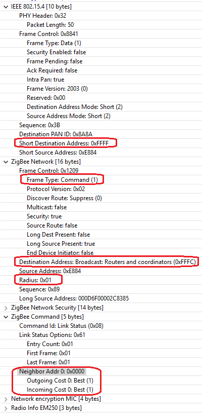
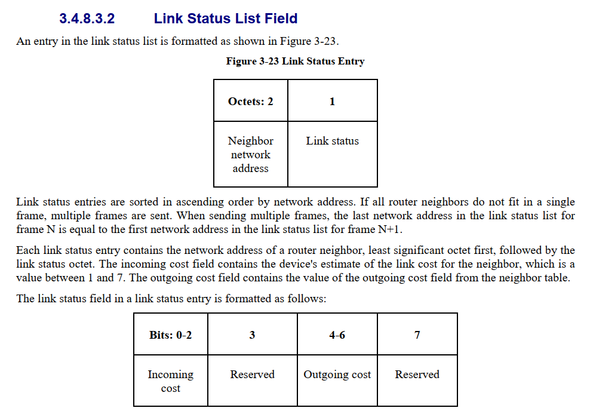
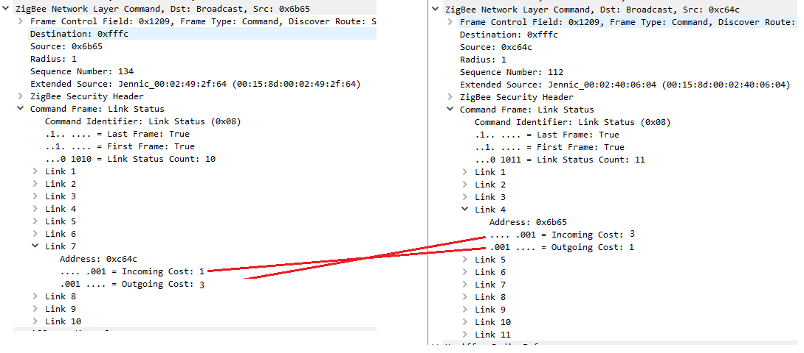

<details>
<summary><font size=5>Table of Contents</font> </summary>  
</br>

- [1. Overview](#1-overview)
- [2. Neighbor Table](#2-neighbor-table)
  - [2.1. Link Status](#21-link-status)
  - [2.2. Link Cost](#22-link-cost)
    - [2.2.1. Incoming Cost](#221-incoming-cost)
    - [2.2.2. Outgoing Cost](#222-outgoing-cost)
    - [2.2.3. Analyze](#223-analyze)
  - [2.3. Neighbor Table Age](#23-neighbor-table-age)
- [3. Reference](#3-reference)

</details>

********

# 1. Overview
Zigbee network uses a mesh topology. Normally, the communication happens between children and parents or neighbors, then spreads to the destination hop by hop. In this page, we will focus on the communication between neighbors. 

There is neighbor table on the coordinator and each router. The neighbor table is helpful to the route discovery and broadcast suppressing. There is no neighbor table on end devices (both non-sleepy end devices and sleepy end devices) as they have no routing capability.

In this page, we will introduce the structure of the neighbor table and the neighbor exchanging process.

# 2. Neighbor Table
As we known, Zigbee is a self-organizing topology. Neighbor table helps to achieve that. Routers will exchange some information periodically. These info includes Eui64, Node ID, incoming cost, outgoing cost, etc.

The neighbor info is a dynamic data which changes at runtime. Therefore, it's no need to save it as non-volatile data. Neighbors exchange the neighbor info by sending link status message periodically. 

## 2.1. Link Status
Link status is a network layer command. Below is an example of link status in Network Analyzer.
<div align="center">
    
</div>
</br>

From the example, we can tell the following info:
1. Link status is a broadcast. It's sent to all routers (destination address 0xFFFC). 
2. The message can't be relayed as the `Radius` field is set to 1. It means that the link status message is just sent and received between neighbors.
3. The link status is a network layer command. It's handled in network layer.
4. In the payload, all active neighbors of the sender will be listed. Each neighbor entry will cost 3 bytes: two bytes Node ID and 1 byte the link cost. As the link status message can't be fragmented, the maximum neighbor entries which can be filled in the frame is limited. As the maximum size of the IEEE 802.15.4 frame is 127 bytes, we can calculate the maximum neighbor table size:  
    ```
    (127 - 10(MAC Header) - 16(NWK Header) - 14(Security Header) - 4(MIC) - 2(CRC) - 2(Cmd ID + Option)) / 3 = 26
    ```
    Therefore, the maximum neighbor table size is 26.

## 2.2. Link Cost
Per Zigbee spec, section 3.4.8.3.2, the neighbor entry in link status is filled as the following format:
<div align="center">
    
</div>
</br>

The incoming cost and outgoing cost are represented by 3-bit value, valid range from 1 to 7, the smaller, the better. In EmberZnet, only 1,3,5 is being used. Link cost 7 is only used when the neighbor is considered unreachable.

### 2.2.1. Incoming Cost
The incoming cost is calculated by the reception side. The valid range of the incoming cost is 1 ~ 7, the smaller the better. When a link status message is received, the reception device will calculate the incoming cost from the LQI. As the valid range of the LQI is 0 ~ 255, the bigger the better, there is an algorithm mapping the LQI into incoming cost.

### 2.2.2. Outgoing Cost
The outgoing cost is the incoming cost of the entry whose Node ID is equal to the current node. This can be illustrated by the following picture:
<div align="center">
    
</div>
</br>

### 2.2.3. Analyze
There could be several different situations. Let's take two nodes A and B as an example to describe it.
1. A is in the neighbor table of B, and B is also in the neighbor table of A. This is the normal case we expect.
2. A is in the neighbor table of B, but B is not in the neighbor table of A. In this case, it means that B can receive the link status from A, but A can't receive link status from B. In this case, the outgoing cost of entry A in the neighbor table of B should be set to 0, which means the neighbor A is not reachable for node B. This is helpful when we select the route.

## 2.3. Neighbor Table Age
Imaging this scenario that we power off one node of a network, what will happen in the neighbor table of the rest routers? The corresponding neighbor table entries will be aged. If there are still free entries on the node, the stale entry will still be kept, but it won't appear in the ougoing link status.

In EmberZnet, the neighbor exchange period is 16 seconds. The age of the neighbor entries increases every 16 seconds.

The age of the neighbor table entry is set to a value between 0 to 7. A neighbor table entry have three states, probation, normal, stale. 
- Probation (Age 0 ~ 2): When a neighbor table entry is created, but the outgoing cost is unknown, the state is set t probation state. i.e. If Node A on neighbor table of Node B is in probation state, it means that B can receive messages from A, but A can't received message from B. Once the node received a link status and can get a valid outgoing cost, the age will be set to 3 directly. 
- Normal (Age 3 ~ 6): Once the node received a link status and can get a valid outgoing cost, the age will be set back to 3. Otherwise, the age will keep increasing every interval.
- Stale (Age 7): Once the age reaches 7, the entry is considered as stale and won't appear in the neighbor list of the outgoing link status.


# 3. Reference
- [How does neighbor table aging in EmberZNet work? What constitutes a stale neighbor?](https://www.silabs.com/community/wireless/zigbee-and-thread/knowledge-base.entry.html/2012/06/29/how_does_neighborta-2WUW)
- [Zigbee Spec](https://zigbeealliance.org/wp-content/uploads/2019/11/docs-05-3474-21-0csg-zigbee-specification.pdf)


