<details>
<summary><font size=5>Table of Contents</font> </summary>

- [1. Introduction](#1-introduction)
- [2. Install Simplicity Studio and setup system environment variables](#2-install-simplicity-studio-and-setup-system-environment-variables)
- [3. Install VS Code and recommended extensions](#3-install-vs-code-and-recommended-extensions)
  - [3.1. Download and install VS Code from official web site.](#31-download-and-install-vs-code-from-official-web-site)
  - [3.2. Set Git bash as default shell](#32-set-git-bash-as-default-shell)
- [4. Command-line build support for Zigbee project](#4-command-line-build-support-for-zigbee-project)
  - [4.1. Replace the makefile template.](#41-replace-the-makefile-template)
  - [4.2. Generate Z3Light Soc project](#42-generate-z3light-soc-project)
    - [4.2.1.  Connect board](#421-connect-board)
    - [4.2.2. Create Z3Light example code](#422-create-z3light-example-code)
    - [4.2.1 Generate source code](#421-generate-source-code)
  - [4.3. Command-line build in VS Code terminal](#43-command-line-build-in-vs-code-terminal)
  - [4.4. Verify building result](#44-verify-building-result)
- [5. Develop Zigbee project in VS Code with configuration setup](#5-develop-zigbee-project-in-vs-code-with-configuration-setup)
  - [5.1. Create a workspace](#51-create-a-workspace)
  - [5.2. Configure include and browse path](#52-configure-include-and-browse-path)
    - [5.2.1. Configure include path](#521-configure-include-path)
    - [5.2.2. Configure macro definition](#522-configure-macro-definition)
    - [5.2.3. Configure browse directory](#523-configure-browse-directory)
    - [5.2.4. Verify the configuration](#524-verify-the-configuration)
    - [5.2.5. Check go to definition](#525-check-go-to-definition)
  - [5.3. Create a build task](#53-create-a-build-task)
    - [5.3.1. Create a build task](#531-create-a-build-task)
    - [5.3.2. Configure build task](#532-configure-build-task)
    - [5.3.3. Run build task](#533-run-build-task)
    - [5.3.4. Adding an external programmer tool](#534-adding-an-external-programmer-tool)
- [6. Source control by Git](#6-source-control-by-git)
  - [6.1. Create Git repo for SDK](#61-create-git-repo-for-sdk)
  - [6.2. Create Git repo for Z3LightSoc](#62-create-git-repo-for-z3lightsoc)
  - [6.3. Verify the Git function](#63-verify-the-git-function)
- [7. Have fun with VS Code](#7-have-fun-with-vs-code)

</details>

*****

## 1. Introduction
This article will introduce how to develop Silicon Labs IoT project with VS Code. Silicon Labs provides [Simplicity Studio](https://www.silabs.com/products/development-tools/software/simplicity-studio.) as IoT development platform. It is a highly integrated IDE based on Eclipse. It can easily setup the project and generate source codes according to the configuration you made within the IDE. However, it is a monster in size and speed. Once the user finishes the all common configurations it is unnecessary to stick on the Simplicity Studio to develop the project. A better choice is to use a lightweight IDE to do IoT development. Here we will introduce how to use Microsoft [Virtual Studio Code](https://code.visualstudio.com/) as our default IDE to develop a Zigbee project.

## 2. Install Simplicity Studio and setup system environment variables
Download [Simplicity Studio](https://www.silabs.com/documents/login/software/install-studio-v4_x64.exe) from the official website. Open the IDE after installation completed, download and install all necessary stacks of SDK. We install SDK v2.6 in this article.

Press **WIN+Pause** key to open System setup. Click on the "Advanced system settings", and then "Environment Variables".

**Adding new variable "ARM_GNU_DIR"**

In "User variable", This variable is your Simplicity Studio GNU arm toolchain directory. In default, it is "C:/SiliconLabs/SimplicityStudio/v4/developer/toolchains/gnu_arm/7.2_2017q4". This variable will be used in the makefile. So be careful to use a slash "/" instead of backslash "\\". 

**Adding msys path**

The Simplicity Studio contains a msys 1.0 which can be used to build the project.  It is recommended to use this one, the msys2.0 from the official website doesn't work well under the Git bash terminal, it converts several "spaces" into "return" on the list of source code which eventually causes the build fails.

Add **C:\SiliconLabs\SimplicityStudio\v4\support\common\build\msys\1.0\bin** on top of path.

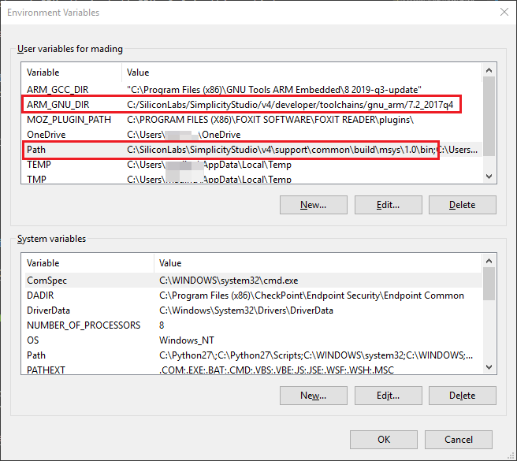

## 3. Install VS Code and recommended extensions
### 3.1. Download and install [VS Code](https://code.visualstudio.com/) from official web site.
Open the VS Code after installation completed. Press **Ctrl+Shift+X** to open the EXTENSIONS view, Install recommended extensions. **C/C++, Code Spell Checker, Monokai Night Theme, Python**.

### 3.2. Set Git bash as default shell
Install [Git](https://git-scm.com/download/win) from the official website. Open VS code and press **Ctrl+Shift+P** to open the command palette. Type "Select Default Shell" and choose Git Bash. Press **Ctrl+`** to open the terminal window, we can see the git bash prompt appears.

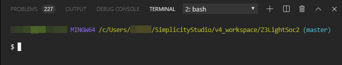

## 4. Command-line build support for Zigbee project
By default, the Simplicity Studio doesn't support the command line build although it supports GNU compilers. The next generation Simplicity Studio is considering to add the command line support but we cannot wait for it. There is a makefile template file which can help to generate makefile of a project, but the makefile doesn't work with a lot of errors. Jim Lin did some works recently and modified the template file to make the command line build working. That is a very nice job since the command line build is an important part of this project. I just made a minor modification to match the requirement of the VS Code.

### 4.1. Replace the makefile template.
The makefile template is located at **C:\SiliconLabs\SimplicityStudio\v4\developer\sdks\gecko_sdk_suite\v2.6\app\esf_common\template\efr32\efr32-afv2.mak**, make a backup of the file and replace it with attached modified the [template file](files/ZB-IoT-Development-with-VS-Code/efr32-afv2.mak).

Here is the modification of the makefile template

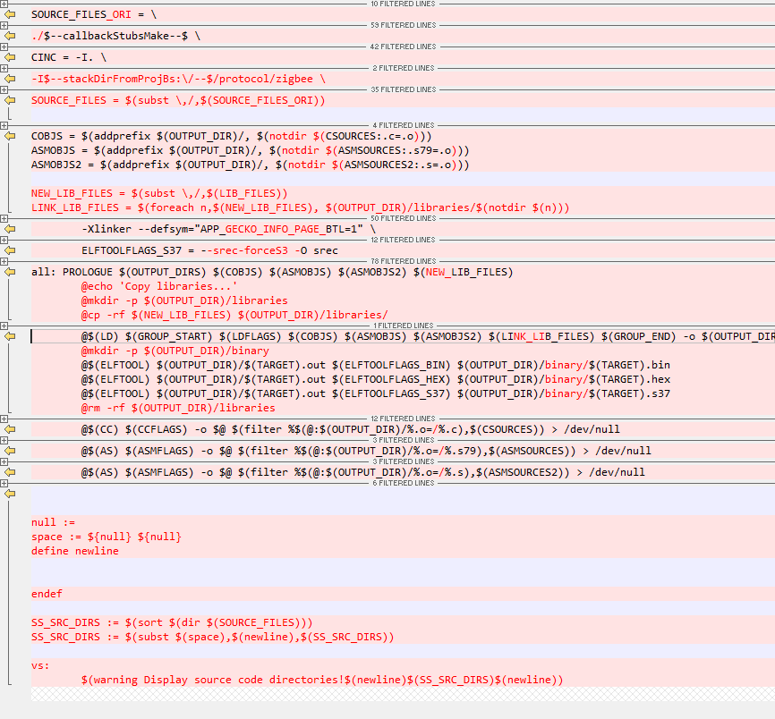

### 4.2. Generate Z3Light Soc project
#### 4.2.1.  Connect board
Connect [BRD4162A](https://www.silabs.com/products/development-tools/wireless/mesh-networking/slwrb4162a-wireless-radioboard) WSTK board(EFR32MG12)  to your laptop.
#### 4.2.2. Create Z3Light example code
Open Simplicity Studio, select the board on the list, click on Z3Light from the Software example list.


#### 4.2.1 Generate source code
Click on **Generate** button In Z3LightSoc.isc view, then the whole project is generated at **C:\Users\username\SimplicityStudio\v4_workspace\Z3LightSoc**

Build the project in Simplicity Studio to verify the project generation is successful or not.  Clean project after building done.

### 4.3. Command-line build in VS Code terminal
Press **Ctrl+`** to open bash terminal in VS code, enter the Z3LightSoc directory, run following command to build the project.

```bash
$make -j8 -f Z3LightSoc.mak
```


### 4.4. Verify building result
Find the binary files under **C:\Users\username\SimplicityStudio\v4_workspace\Z3LightSoc\build\efr32\binary**. Use Simplicity Commander in Simplicity Studio to download the code into the WSTK board. The LED on board is blinking, which means everything works well.

## 5. Develop Zigbee project in VS Code with configuration setup
Now we need to figure out how to develop the Zigbee project with VS Code. Several things are needed to do for a comfortable development environment.
**Go to the definition, Build/Clean project, Git manages source code**.

### 5.1. Create a workspace
Open VS Code, open your Z3LightSoc from menu **File->Open Workspace**, and name your workspace from menu **File->Save Workspace As**.
Press **Ctrl+P** to open Z3LightSoc_callback.c, press **F12** while moving the cursor on top of include files, functions, macros, we can see it cannot find the definition.  

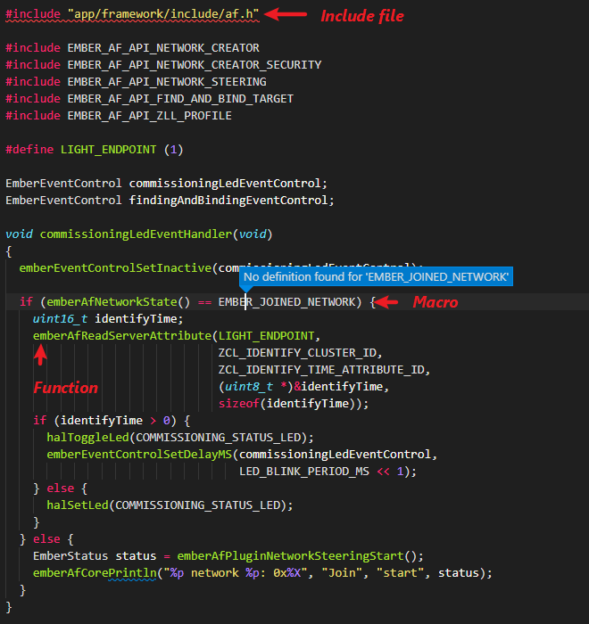

In the following section, we will show how to add all necessary information in VS Code setting to enable it to locate the include files, functions and macros.

The makefile Z3LightSoc.mak contains all the information we need. We can add the info in the VS Code configuration.  After completing the configuration, we will have two files in a .vscode subfolder:

* c_cpp_properties.json (compiler path and IntelliSense settings)
* tasks.json (build and flash instructions)

### 5.2. Configure include and browse path
Press **Ctrl+Shift+P** to open the Command Palette, type "C/C++" and choose **Edit Configurations(JSON)**.

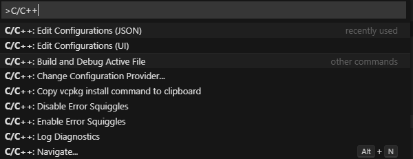

This open **c_cpp_properties.json** in **.vscode** folder. The detailed introduction on this file can be found at VS Code [docs web site](https://code.visualstudio.com/docs/cpp/c-cpp-properties-schema-reference).

Please refer to the attached [c_cpp_properties.json](files/ZB-IoT-Development-with-VS-Code/c_cpp_properties.json) in details.

We add env SDK_PATH, COMPILER_PATH, browse. Set the name as VS-Z3Light, intelliSenseMode as gcc-x86, cStandard as C99.

Note: We will add include path in "**includepath**"; add macro definition in "**defines**"; add all directories of source code in "**browse**".

```JSON
{
    "env": {
        "SDK_PATH": "C:/SiliconLabs/SimplicityStudio/v4/developer/sdks/gecko_sdk_suite/v2.6",
        "COMPILER_PATH": "C:/SiliconLabs/SimplicityStudio/v4/developer/toolchains/gnu_arm/7.2_2017q4/lib/gcc/arm-none-eabi/7.2.1/include"
    },
    "configurations": [
        {
            "name": "VS-Z3Light",
            "intelliSenseMode": "gcc-x86",
            "compilerPath": "",
            "cStandard": "c99",
            "cppStandard": "c++14",
            "includePath": [
                "${COMPILER_PATH}/**",
                "${workspaceFolder}/**"
            ],
            "defines": [
                "_DEBUG",
                "UNICODE",
                "_UNICODE"
            ],
            "browse": {
                "path": [
                    "${workspaceFolder}"
                ]
            }
        }
    ],
    "version": 4
}
```

Press **Ctrl+P**, type "Z3LightSoc.mak" and open the Z3LightSoc.mak,

#### 5.2.1. Configure include path
Copy all stuff of **CINC** variable and paste them in "includepath" field of c_cpp_properties.json. And we make some modifications to match the requirement of the JSON file.
Press **Ctrl+H** to replace "-I../../../../../SiliconLabs/SimplicityStudio/v4/developer/sdks/gecko_sdk_suite/v2.6" with **"${SDK_PATH}**.
Select all include path lines, press **Shift+Alt+I** to add cursors at line ends, delete symbol \\, add symbol ". Please check the below GIF.

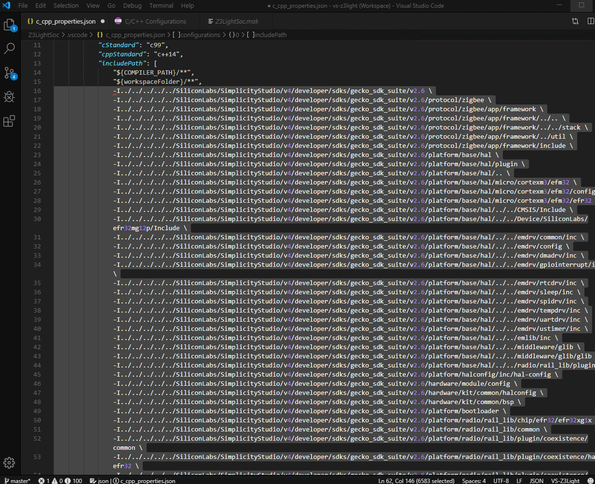

Remove some weird "../../" stuff and final version looks like this

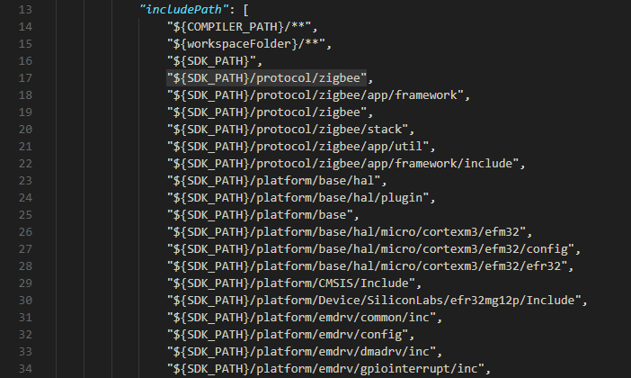

#### 5.2.2. Configure macro definition
Copy all stuff of **CDEFS** in Z3LightSoc.mak and paste them in "defines" field of c_cpp_properties.json. Make an adjustment to match the requirement. 

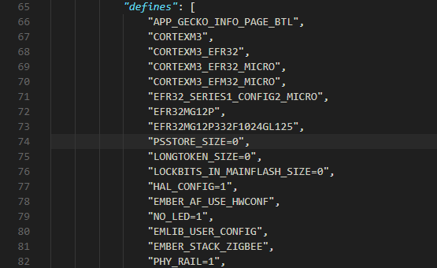

#### 5.2.3. Configure browse directory
Get source code to browse the directories list.
Press **Ctrl+`** to open git bash terminal, run "make -f Z3LightSoc.mak vs", it prints a list of directories.

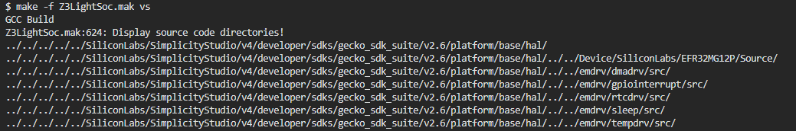

Copy and paste them in the "browse->path" field of c_cpp_properties.json and make adjustments of the format.

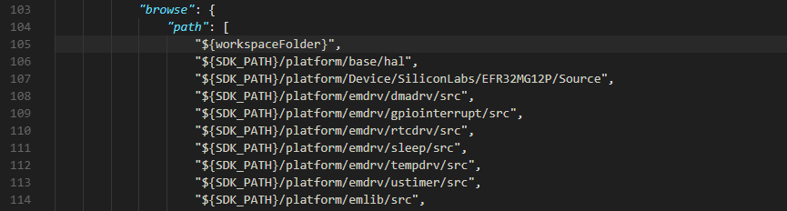

#### 5.2.4. Verify the configuration
Press **Ctrl+Shift+P**, choose C/C++: Edit Configurations(UI)

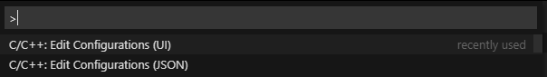

If there is something uncorrected input in include and browse path, it shows error messages.

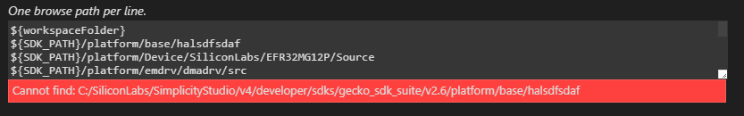

Once you fix the path issue, the error disappeared.

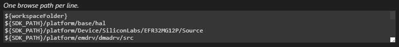

#### 5.2.5. Check go to definition
Move cursor on top of the functions, macros, a floating window shows the contents. Press **F12** key, it goes to the definition.

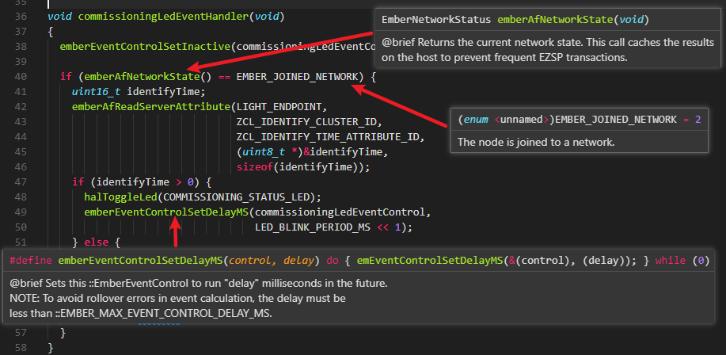

### 5.3. Create a build task
Next, create a tasks.json file to tell VS Code how to build the project.

#### 5.3.1. Create a build task
Press **Ctrl+Shift+P**, type "task" and choose **Tasks: Configure Default Build Task**. In the drop-down, select Create tasks.json file from template, then choose Others. VS Code creates a minimal tasks.json file and opens it in the editor.

Please refer to the attached [tasks.json](files/ZB-IoT-Development-with-VS-Code/tasks.json) in detail.

#### 5.3.2. Configure build task
Go ahead and replace the entire file contents with the following code snippet:

```JSON
{
    "version": "2.0.0",
    "tasks": [
        {
            "label": "Build",
            "type": "shell",
            "command": "make -j8 -f Z3LightSoc.Mak",
            "group": {
                "kind": "build",
                "isDefault": true
            },
            "problemMatcher": [
                "$gcc"
            ]
        },
        {
            "label": "Clean",
            "type": "shell",
            "command": "make clean -f Z3LightSoc.Mak",
            "group": {
                "kind": "build",
                "isDefault": true
            },
            "problemMatcher": [
                "$gcc"
            ]
        }
    ]
}
```

#### 5.3.3. Run build task
Press **Alt+Shift+B**, it popup a drop-down, choose **Clean** to clean the project. And then choose **Build** to build the whole project. 

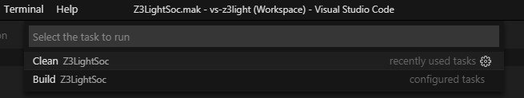

The output message can be seen in the bash terminal.

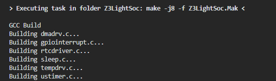

It takes 66 seconds to complete the project build. Compare to 120 seconds in Simplicity Studio, the building speed is almost double quick than in Simplicity Studio.

#### 5.3.4. Adding an external programmer tool
There is a Commander tool in Simplicity Studio to program binary code into the WSTK board.  It can run in GUI or command line mode. 

**Run Commander Tool in Command-Line**

This way works seamlessly with VS Code. It is recommended. Thanks for Eric's contribution to this. 

Press **CTRL+N**, open a new file, typing follow text in the file. Save as **flash.bat** under current workspace (C:\Users\username\SimplicityStudio\v4_workspace\Z3LightSoc).

It searches hex file under current workspace, and run commander.exe to flash the hex file into the WSTK board. 

```bat
@echo OFF
for /f "delims=" %%i in ('dir /b /s /a-d *.hex') do (set filename=%%i)
C:\SiliconLabs\SimplicityStudio\v4\developer\adapter_packs\commander\commander.exe flash "%filename%"
```

Add the following text in the tasks.json

```JSON
{
    "label": "Flash",
    "type": "process",
    "command": "flash.bat",
    "group": {
        "kind": "build",
        "isDefault": true
    },
    "problemMatcher": []
}
```

Press **Alt+Shift+B**, choose Flash from the drop-down menu.

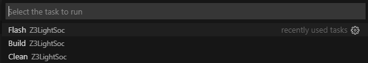

It flashes the hex file into the WSTK board. 
Start from the SDK v2.7, the command line execution of Commander won't popup board selection dialog while attach two more WSTK boards to the computer. 
So, to use the flash.bat for program download, use it under a single WSTK connection. Otherwise, use the GUI tools described below.

```bash
> Executing task in folder Z3LightSoc: C:\Users\username\SimplicityStudio\v4_workspace\Z3LightSoc\flash.bat  <

Parsing file c:\Users\username\SimplicityStudio\v4_workspace\Z3LightSoc\build\efr32\binary\Z3LightSoc.hex...
Writing 262144 bytes starting at address 0x00000000
Comparing range 0x00000000 - 0x0001FFFF (128 KB)
Comparing range 0x00020000 - 0x0003FFFF (128 KB)
Comparing range 0x00000000 - 0x0001FFFF (128 KB)
Comparing range 0x00020000 - 0x0003FFFF (128 KB)
DONE
```

**Run Commander Tool with GUI**

The user can run the commander tool in GUI mode if that makes more comfortable. 

Add the following text in the tasks.json

```JSON
{
    "label": "Flash",
    "type": "process",
    "command": "C:/SiliconLabs/SimplicityStudio/v4/developer/adapter_packs/commander/commander.exe",
    "group": {
        "kind": "build",
        "isDefault": true
    },
    "problemMatcher": []
}
```

Press **Alt+Shift+B**, choose Flash from the drop-down menu.


It opens Simplicity Commander, chooses the binary file and downloads it into the board.

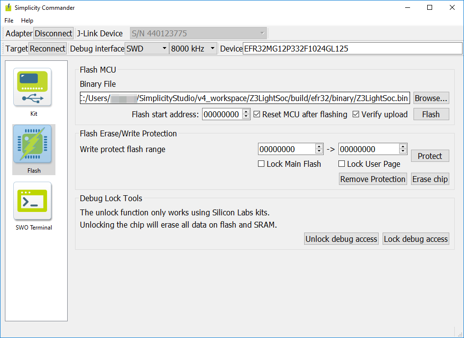

## 6. Source control by Git
### 6.1. Create Git repo for SDK
Sometimes you might need to change files in SDK, using Git to manage the source code changes. In Git Bash terminal. Type following commands

```bash
$ cd  C:/SiliconLabs/SimplicityStudio/v4/developer/sdks/gecko_sdk_suite/v2.6
$ git init
$ git add .
$ git commit -m "Init commit"
```

It takes a little longer time to finish the job due to the large size(2.4GB) of the SDK.

### 6.2. Create Git repo for Z3LightSoc
Enter your workspace directory C:/Users/username/SimplicityStudio/v4_workspace/Z3LightSoc.  Remove all build output directories. Like "build" and "GNU ARM v7.2.1 - Default" directories,

Type following command to create your Git repo to manage your workspace source code.

```bash
$ git init
$ git add .
$ git commit -m "Init commit of Z3LightSoc"
```

### 6.3. Verify the Git function
In VS Code, add a comment in Z3LightSoc_callbacks.c, then we can see on the sidebar, it shows changes of the Z3LightSoc_callbacks.c, click on the file, the diff is shown on the edit area.

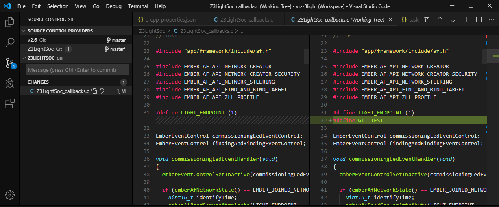

## 7. Have fun with VS Code
Now, we have finished all setup on IoT development with VS Code, enjoy your time!

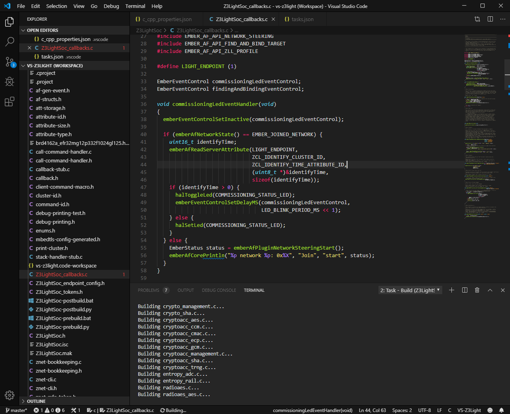
