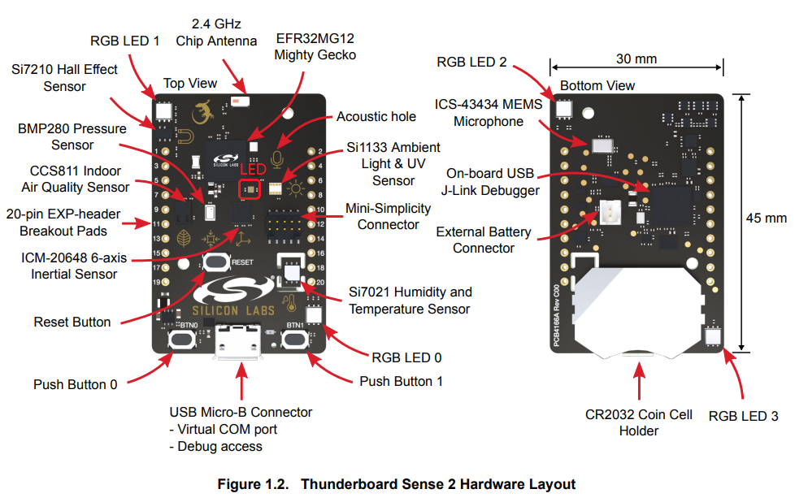
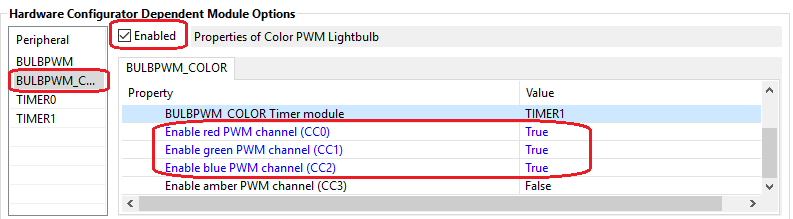
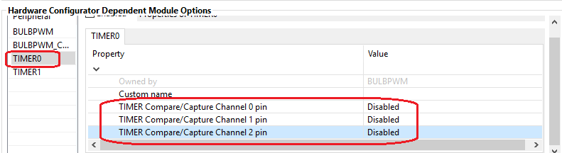
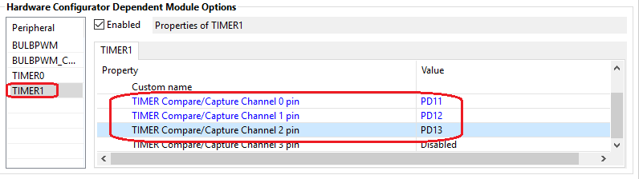

<details>
<summary><font size=5>Table of Contents</font> </summary>  

- [Color Control Light](#color-control-light)
  - [1. Summary](#1-summary)
  - [2. Gecko SDK version](#2-gecko-sdk-version)
  - [3. Hardware Required](#3-hardware-required)
  - [4. Connections Required](#4-connections-required)
  - [5. Setup](#5-setup)
    - [5.1. Setup the Light Project](#51-setup-the-light-project)
    - [5.2. Setup the Switch Project](#52-setup-the-switch-project)
  - [6. How It Works](#6-how-it-works)
  - [7. .sls Projects Used](#7-sls-projects-used)
  - [8. How to Port to Another Part](#8-how-to-port-to-another-part)
  - [9. Special Notes](#9-special-notes)
</details>

********

# Color Control Light

## 1. Summary ##
We used to have a reference design about color-control-light which is [RD-0098-0401]([RD-0098-0401](https://www.digikey.com/product-detail/en/silicon-labs/RD-0098-0401/336-4193-ND/7697497)), but it's deprecated now. All the documents about this reference design can't be found on [Silicon Labs' official website](https://www.silabs.com/).

This example is a Zigbee color-control-light example based on [Thunder Board Sense 2](https://www.silabs.com/development-tools/thunderboard/thunderboard-sense-two-kit). It demonstrates controlling RGB color using Zigbee.  

Below is the hardware layout of Thunder Board Sense 2:

<div align="center">
	
</div>
</br>

## 2. Gecko SDK version ##
Gecko SDK Suite 2.7.

## 3. Hardware Required ##
- 2 pcs [Thunder Board Sense 2](https://www.silabs.com/development-tools/thunderboard/thunderboard-sense-two-kit)

## 4. Connections Required ##
Form a Zigbee network on the light, and then join the switch into the network.

## 5. Setup ##
### 5.1. Setup the Light Project
1. Create a ZigbeeMinimal project, name it with "Z3ColorLight" and select the **"BRD4166A"** (the board type for Thunder Board Sense 2) as the board.
2. In **"Zigbee Stack"** tab, set the device type to **"Coordinator or Router"**.
3. In **"ZCL Clusters"** tab, select endpoint 1, then in **"Zigbee device type"** field, change it to **HA devices-->HA Color Dimmable Light**. 
4. In cluster **"Color Control"**, enable the following attributes:  
    - [x] remaining time
    - [x] color mode, default value set to 1.
5. Set the default value, so that the RGB LEDs will be turned on by default.
	- [x] In cluster **On/Off**, set default value of **on/off** attribute to `0x01`.
	- [x] In cluster **Level Control**, set default value of **current level** attribute to `0xC8`.
6. Enable the following plugins:  
    - [x] On/Off Server Cluster
	- [x] Level Control Server Cluster
	- [x] Color Control Cluster Server
    - [x] Buld PWM Driver    
    - [x] Led Rgb Pwm    
    - [x] Network Creator
    - [x] Network Creator Security
    - [x] Source Route Library 
    - [x] Identify Cluster
    - [x] Find and Bind Target
7. In plugin "Serial", in the properties, select **USART0**, change the **Flow control mode** to **No flow control**, then save.
8. In plugin "Bulb PWN Driver", select **BULBPWM_COLOR**, check the **Enable**, and set **CC0**, **CC1**, **CC2** to true.  
	<div align="center">
		
	</div>
	<br>
	Then select **TIMER0**, disable the timer channel **CC0**, **CC1**, **CC2** as TIMER0 will not be used in this example.
	<div align="center">
		
	</div>
	<br>
	Select **TIMER1**, configure the pins for **CC0**, **CC1**, **CC2** to **PD11**, **PD12**, **PD13** respectively.
	<div align="center">
		
	</div>
	<br>		
9. In "Callbacks" tab, enable the following callbacks:
      - [x] emberAfMainInitCallback
      - [x] emberAfStackStatusCallback
      - [x] emberAfPluginNetworkSteeringCompleteCallback
      - [x] emberAfHalButtonIsrCallback
10. Add two custom event:
	- [x] Event `buttonEventControl` and its handler `buttonEventHandler`
	- [x] Event `closeNetworkEventControl` and its handler `closeNetworkEventHandler`
11. Save and generate the project.
12. We need to modify two source files of the SDK because the the corresponding function is not supported on Thunder Board Sense 2. As this source files are linked into the SDK, there will be a pop-up warning windows like below. If you see it, **please always select "Make a Copy"**.  
	<div align="center">
		
	</div>
	<br>
	A. Modify source file `bulb-pwm-driver/EFR32/bulb-pwm-driver-efr32.c`:  
	
	``` C
	026		//#define BULB_PWM_USING_TIMER0 Comment this line as TIMER0 is used by the stack
	027
	028		#define BULB_PWM_WHITE_TIMER      BSP_BULBPWM_TIMER
	029		#define BULB_PWM_WHITE_CHANNEL    0
	030		#define BULB_PWM_LOWTEMP_TIMER    BSP_BULBPWM_TIMER
	031		#define BULB_PWM_LOWTEMP_CHANNEL  1
	032		#define BULB_PWM_STATUS_TIMER     BSP_BULBPWM_TIMER
	033		#define BULB_PWM_STATUS_CHANNEL   2
	```  
	B. Modify source file `led-rgb-pwm/led-rgb-pwm.c`:  
	``` C
	224		static void driveWRGB(uint16_t white, uint16_t red, uint16_t green, uint16_t blue)
	225		{
	226		  //halBulbPwmDriverSetPwmLevel(white, BULB_PWM_WHITE); -- comment this line
	227		  halBulbPwmDriverSetPwmLevel(red, BULB_PWM_RED);
	228		  halBulbPwmDriverSetPwmLevel(green, BULB_PWM_GREEN);
	229		  halBulbPwmDriverSetPwmLevel(blue, BULB_PWM_BLUE);
	230		}


	630		/** @brief Called during blinking behavior telling the bulb implementation to turn the bulb on.
	631		 *
	632		 * @appusage Should be implemented by an application layer configuration
	633		 * plugin.
	634		 *
	635		 */
	636		void halBulbPwmDriverBlinkOnCallback(void)
	637		{
	638		  //halBulbPwmDriverSetPwmLevel(halBulbPwmDriverTicksPerPeriod(), BULB_PWM_WHITE); -- comment this line
	639		  halBulbPwmDriverSetPwmLevel(halBulbPwmDriverTicksPerPeriod(), BULB_PWM_RED);
	640		  halBulbPwmDriverSetPwmLevel(halBulbPwmDriverTicksPerPeriod(), BULB_PWM_GREEN);
	641		  halBulbPwmDriverSetPwmLevel(halBulbPwmDriverTicksPerPeriod(), BULB_PWM_BLUE);
	642		}
	643
	644		/** @brief Called during blinking behavior telling the bulb implementation to turn the bulb off.
	645		 *
	646		 * @appusage Should be implemented by an application layer configuration
	647		 * plugin.
	648		 *
	649		 */
	650		void halBulbPwmDriverBlinkOffCallback(void)
	651		{
	652		  //halBulbPwmDriverSetPwmLevel(OFF_TICKS, BULB_PWM_WHITE); -- comment this line
	653		  halBulbPwmDriverSetPwmLevel(OFF_TICKS, BULB_PWM_RED);
	654		  halBulbPwmDriverSetPwmLevel(OFF_TICKS, BULB_PWM_GREEN);
	655		  halBulbPwmDriverSetPwmLevel(OFF_TICKS, BULB_PWM_BLUE);
	656		}
	```  
13. Implement the callback file `Z3ColorLight_callbacks.c`. Refer to the file in the project.
14. Save and build. 


### 5.2. Setup the Switch Project
1. Create a ZigbeeMinimal project, name it with "Z3ColorSwitch" and select the **"BRD4166A"** (the board type for Thunder Board Sense 2) as the board.
2. In **"ZCL Clusters"** tab, select endpoint 1, then in **"Zigbee device type"** field, change it to **HA devices-->HA Color Dimmable Switch**. 
3. Enable the following plugins:
	- [x] Find and Bind Initiator
4. Enable the following callbacks:
	- [x] emberAfStackStatusCallback
	- [x] emberAfPluginNetworkSteeringCompleteCallback
	- [x] emberAfHalButtonIsrCallback
	- [x] emberAfPluginFindAndBindInitiatorCompleteCallback
5. Add a custom event `buttonEventControl` and its handler `buttonEventHandler`.
6. Save, generate.
7. Implement the callbacks in the file `Z3ColorSwitch_callbacks.c` and build. Refer to the file in the exported project.
8. Save and build.

## 6. How It Works ##
1. Flash the light and switch program into the two boards.
2. On the console of the Light, press button0 to create a network. When its done, the LED (The LED in the middle of the board, not the RGB LED) will turn orange.
3. On the switch, press button0 to start joining. This must be done when the LED of the light is orange. If it's red other than orange, press button1 of the light and then press button0 of the switch. If the switch joined successfully, the LED of the switch will turn orange.
4. Press button1 of the switch to change the color.


## 7. .sls Projects Used ##
- [Z3ColorLight.sls](files/ZB-Zigbee-Color-Control-Light-On-TBS2/Z3ColorLight.sls)
- [Z3ColorSwitch.sls](files/ZB-Zigbee-Color-Control-Light-On-TBS2/Z3ColorSwitch.sls)

## 8. How to Port to Another Part ##
This example can be used on any parts. Below are the steps of porting it to other part:
- Import the .sls file into Simplicity Studio
- Open the .isc file of each project, turn to "General" tab, hit button "Edit Architecture", then select the board and part.


## 9. Special Notes ##
- [Schematic of Thunder Board Sense 2](https://www.silabs.com/documents/public/schematic-files/TBSense2-BRD4166A-D00-schematic.pdf)
