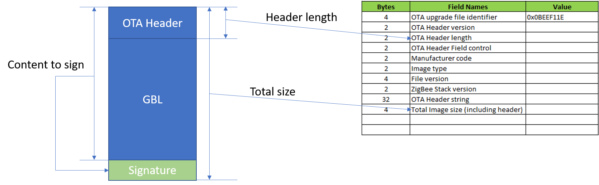

<details>
<summary><font size=5>Table of Contents</font> </summary>  

- [Signing OTA Image](#signing-ota-image)
  - [1. Summary](#1-summary)
  - [2. Gecko SDK version](#2-gecko-sdk-version)
  - [3. Hardware Required](#3-hardware-required)
  - [4. Connections Required](#4-connections-required)
  - [5. Setup](#5-setup)
    - [5.1. Signing Tool](#51-signing-tool)
    - [5.2. Verify the OTA file](#52-verify-the-ota-file)
  - [6. How It Works](#6-how-it-works)
  - [7. .sls Projects Used](#7-sls-projects-used)
  - [8. How to Port to Another Part](#8-how-to-port-to-another-part)
  - [9. Special Notes](#9-special-notes)
</details>

********

# Signing OTA Image

## 1. Summary ##
Signing the OTA file is a mandatory requirement of Zigbee Smart Energy applications. For non-SE applications, it's optional. In this page, we will introduce the approach of signing the OTA image of a general Zigbee 3.0 application and verifying it on the client side.

OTA image format is described in section 11.4 of ZCL spec. We will add the signature as a tag.
<div align="center">
  
</div>
</br>


## 2. Gecko SDK version ##
Gecko SDK Suite 2.7.

## 3. Hardware Required ##
- Wireless Starter Kit Main Board (BRD4001)
- EFR32MG12 2400/915 MHz 19 dBm Dual Band Radio Board (BRD4164A)

## 4. Connections Required ##
NA

## 5. Setup ##
### 5.1. Signing Tool
In this example, we will use the ECDSA-P256-SHA256 signing algorithm which is the same algorithm used in GBL signature. We will also use Simplicity Commander to generate the signing key as described in section 9.3.1 of [UG266](https://www.silabs.com/documents/public/user-guides/ug266-gecko-bootloader-user-guide.pdf).

1. Generate the signing key pair.

    ```
    commander util genkey --type ecc-p256 --privkey signing-key --pubkey signing-key.pub --tokenfile signing-keytokens.txt
    ```

2. Program the public signing key into the device as manufacture tokens.

    ```
    commander flash --tokengroup znet --tokenfile signing-key-tokens.txt
    ```

3. Install Python3, then install python-ecdsa library with `pip install ecdsa`. After that, download the [signing script](files/ZB-Zigbee-Signing-OTA-Image/OTAFileSigner.py), run the command `python OTAFileSigner.py sign <otafile> <private signing-key>` to sign the OTA file.

    e.g.
    ```
    python OTAFileSigner.py sign OTA4164A.ota signing-key
    ```

### 5.2. Verify the OTA file
1. Create the OTA client project per described in [AN728](https://www.silabs.com/documents/public/application-notes/an728-ota-client-server-setup.pdf).
2. Add a custom macro "MBEDTLS_SHA256_C" to enable SHA256 in mbedtls.
3. Add a folder `ecdsa` in your project and copy the following source files to it. These files can be found in the example.
      - btl_security_ecdsa.c
      - btl_security_ecdsa.h
      - ecc.c
      - ecc.h
4. Edit the function `emAfOtaImageSignatureVerify` in source file `ota-client/ota-client-signature-verify.c`. 
    ``` C
    #include "mbedtls/sha256.h"
    #include "ecdsa/btl_security_ecdsa.h"

    #define SIGNATURE_TAG_ID   0x0001
    #define SIGNATURE_LEN      64

    #pragma pack(push)
    #pragma pack(1)
    typedef struct
    {
      uint16_t  tagID;
      uint32_t  dataLen;
    }OTATagHeader;
    #pragma pack(pop)

    bool emberOTAImageIsSigned(const EmberAfOtaImageId *id)
    {
      uint32_t headerSize;
      uint32_t imageSize;
      uint32_t offset;
      bool     has_signature = false;
      OTATagHeader tagHeader;
      uint32_t     readLen;
      EmberAfOtaStorageStatus status;

      status = emAfOtaStorageGetHeaderLengthAndImageSize(id,
                                  &headerSize,
                                  &imageSize);
      if (0 != status) {
        otaPrintln("Error: get image length failed");
        return false;
      }

      otaPrintln("headerSize=%d imageSize=%d", headerSize, imageSize);

      //The last tag must be the signature
      offset = headerSize;
      while (offset < imageSize) {
        status = emberAfOtaStorageReadImageDataCallback(id,
                                                        offset,
                                                        sizeof(OTATagHeader),
                                                        (uint8_t *)&tagHeader,
                                                        &readLen);
        if (EMBER_AF_OTA_STORAGE_SUCCESS != status) {
          otaPrintln("Error: read image failed at offset %d", offset);
          return false;
        }

        otaPrintln("offset=%d tag=%d len=%d readLen=%d", offset, tagHeader.tagID, tagHeader.dataLen, readLen);

        if (tagHeader.tagID == SIGNATURE_TAG_ID) {
          has_signature = true;
        }

        offset += sizeof(OTATagHeader) + tagHeader.dataLen;
      }

      if (has_signature && (tagHeader.tagID == SIGNATURE_TAG_ID && SIGNATURE_LEN == tagHeader.dataLen)) {
        return true;
      } else {
        otaPrintln("Error: image not signed or signature is not the last tag");
        return false;
      }
    }

    EmberAfImageVerifyStatus emAfOtaImageSignatureVerify(uint16_t maxHashCalculations,
                                                        const EmberAfOtaImageId* id,
                                                        bool newVerification)
    {
      EmberAfOtaStorageStatus status;
      uint32_t imageSize;
      uint8_t  block[64];
      uint32_t readSize;
      int32_t  dataLeftToRead;
      uint32_t offset = 0;
      uint32_t readLen;
      uint8_t  digest[32];
        uint8_t  signature[64];
        uint8_t  i;
      mbedtls_sha256_context ctx;

      if (!emberOTAImageIsSigned(id)) {
        return EMBER_AF_IMAGE_BAD;
      }

      mbedtls_sha256_init(&ctx);
      mbedtls_sha256_starts(&ctx, 0);

      status = emAfOtaStorageGetHeaderLengthAndImageSize(id,
                                  NULL, // header length (don't care)
                                  &imageSize);
      if (0 != status) {
        otaPrintln("Error: get image length failed");
        return EMBER_AF_IMAGE_VERIFY_ERROR;
      }

      //calculate the digest. exclude the last tag
      dataLeftToRead = imageSize - sizeof(OTATagHeader) - SIGNATURE_LEN;
      offset = 0;
      while (dataLeftToRead > 0) {
        readSize = dataLeftToRead < sizeof(block) ? dataLeftToRead : sizeof(block);

        if ((EMBER_AF_OTA_STORAGE_SUCCESS != emberAfOtaStorageReadImageDataCallback(id,
                                                                                offset,
                                                readSize,
                                                block,
                                                &readLen)) || (readSize != readLen)) {
          otaPrintln("Error: calculate digest fail");
          return EMBER_AF_IMAGE_VERIFY_ERROR;
        }

        mbedtls_sha256_update(&ctx, block, readLen);
        dataLeftToRead -= readLen;
        offset += readLen;
      }

      mbedtls_sha256_finish(&ctx, digest);

      otaPrint("Digest=");
      for (i = 0; i < 32; i++) {
        otaPrint("%X", digest[i]);
      }
      otaPrintln("\r\n");

      //read signature
      
      status = emAfOtaStorageGetTagDataFromImage(id, SIGNATURE_TAG_ID, signature, &readLen, sizeof(signature));
      if (0 != status) {
        otaPrintln("Error: read signature failed");
        return EMBER_AF_IMAGE_VERIFY_ERROR;
      }

      //read signing key
      tokTypeMfgSignedBootloaderKeyX  key_x;
      tokTypeMfgSignedBootloaderKeyY  key_y;
      halCommonGetMfgToken(&key_x, TOKEN_MFG_SIGNED_BOOTLOADER_KEY_X);
      halCommonGetMfgToken(&key_y, TOKEN_MFG_SIGNED_BOOTLOADER_KEY_Y);

      int32_t ret = btl_verifyEcdsaP256r1(digest, &signature[0], &signature[32], (uint8_t *)&key_x, (uint8_t *)&key_y);
      otaPrintln("verify result ret=%d", ret);

        if (0 != ret) {
            return EMBER_AF_IMAGE_VERIFY_ERROR;
        } else {
            return EMBER_AF_IMAGE_GOOD;
        }
    }    
    ```
5. Save and build.

## 6. How It Works ##
1. Sign the OTA image, then put the signed OTA image on the server
2. Start OTA upgrading and check it it can upgrade successfully.

## 7. .sls Projects Used ##
Project | Comment
-|-|
[OTA4164A.sls](files/ZB-Zigbee-Signing-OTA-Image/OTA4164A.sls) | OTA client project with signature support

## 8. How to Port to Another Part ##
NA

## 9. Special Notes ##
NA
