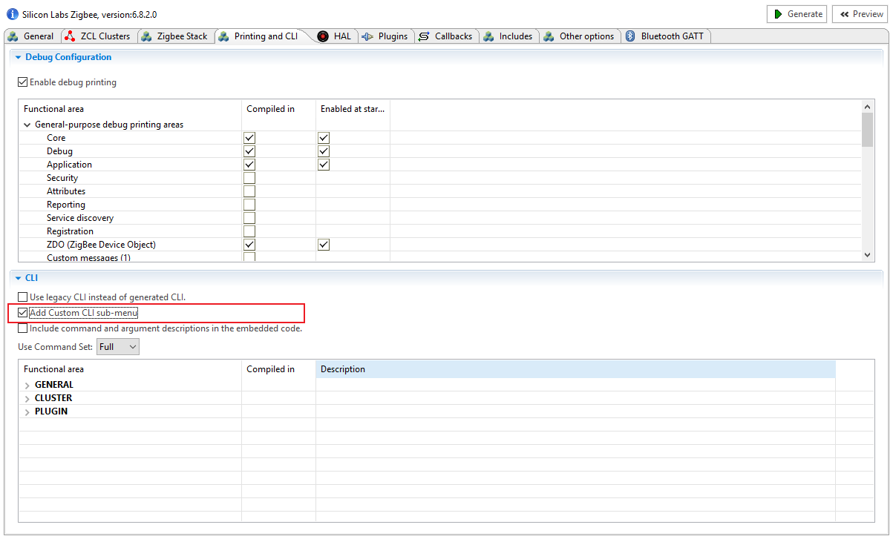
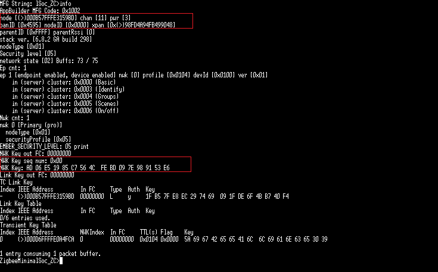
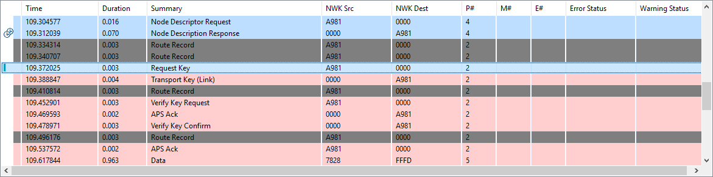

<details>
<summary><font size=5>Table of Contents</font> </summary>

- [1. Introduction](#1-introduction)
- [2. Joining a Network Through Association](#2-joining-a-network-through-association)
- [3. Joining a Network without association](#3-joining-a-network-without-association)
  - [3.1. Set the initial security state](#31-set-the-initial-security-state)
  - [3.2. Software Development](#32-software-development)
  - [3.3. Test](#33-test)
    - [3.3.1. Form centralized network](#331-form-centralized-network)
    - [3.3.2. Join the network without association](#332-join-the-network-without-association)
</details>

***

# 1. Introduction
This article will provide a guideline for how to setup Zigbee network without association process.

# 2. Joining a Network Through Association
As you probably know that setup a Zigbee network is always required to establish a new network on the Zigbee Coordinator side and permit device to join, and then the joining device should initiate the procedure for network discovery to find a joinable network. The beacon request will be sent out from the joining device, and router or coordinator will response the beacon request with beacon. 

Each beacon frame includes information such as the PAN ID, extend PAN ID, the information that the device is capable of accepting join request from new device. 

The joining device receives beacons from nearby routers, and it will choose a network with the best signal quality to join from the discovered networks. Once the network is selected, it will send an Association request. In this request, the PAN ID is set to the chosen PAN, and the destination node id is set to the node ID of the chosen device which sent the beacon, and the capability information of the joining device will also be carried on in the Association request command frame.

Upon receipt of an Association request, if the router or coordinator was able to associate the device to its PAN, it responds it with an Association response, and a short address will be contained in the response that the device may use in its communications on the PAN until it is disassociated. Upon receipt of the Association response MAC command, the joining device is now declared "joined, but unauthorized" to the network.

The coordinator will then transport the current NWK key to the new device. This transporting message is encrypted in application layer with the well-known link key or the link key derived from the install code.

When the new device receives this message, it uses the well-known link key or the link key derived from the install code to decrypt the message and gets the network key. After that, the device is really joined the network and is able to communicate with all other nodes in the network.

# 3. Joining a Network without association
However, sometimes the customer would like to simplify the network joining procedure when deploying their Zigbee network. They want to pre-configure all of the network information of the Zigbee device during factory production, and the devices will be able to communicate with other pre-configured nodes after power up without the association process as mentioned in last chapter.

Another customer requirement is that transfer the network information from the gateway to joining device via Out-of-Band mechanism, after receiving the network information, the joining device can just fill out the information to stack, and make it work without association process.  

It's doable with the commissioning mode to setup a Zigbee network without using the standard association process. The general method would be to load up all the attributes while in one "dummy" network with all of the desired network information, then you could join a new network using the commissioning mode.  
**Note**: The commissioning joining method is not available for the end device as a rejoin process is required following the commissioning join, however, by default, the trust center will not allow rejoining of a device using the well known key. In the case of end device, you need to enable the option of "Allow Trust Center rejoin with well known key" on the trust center side, or pre-configure the link key of the end device as the updated trust center link key.  

Regarding to the desired network information for joining a new network, please check the stack's tokens information in the See stack/config/token-stack.h  

```c
typedef struct {
  uint8_t networkKey[16];
  uint8_t activeKeySeqNum;
} tokTypeStackKeys;
typedef struct {
  uint16_t panId;
  int8_t radioTxPower;
  uint8_t radioFreqChannel;
  uint8_t stackProfile;
  uint8_t nodeType;
  uint16_t zigbeeNodeId;
  uint8_t extendedPanId[8];
} tokTypeStackNodeData;
typedef struct {
  uint16_t mode;
  uint8_t eui64[8];
  uint8_t key[16];
} tokTypeStackTrustCenter;
typedef struct {
  uint32_t activeChannels;
  uint16_t managerNodeId;
  uint8_t updateId;
} tokTypeStackNetworkManagement;
typedef struct {
  uint8_t parentEui[8];
  uint16_t parentNodeId;
} tokTypeStackParentInfo;
```
## 3.1. Set the initial security state
Firstly, you will have to set the initial security state using the API ```EmberStatus emberSetInitialSecurityState(EmberInitialSecurityState* state);``` before joining. 
The initial security state struct is also defined in ```stack/include/ember-types.h``` and requires you to set *EMBER_HAVE_TRUST_CENTER_EUI64*, *EMBER_HAVE_PRECONFIGURED_KEY* and *EMBER_HAVE_NETWORK_KEY* in the ***EmberInitialSecurityBitmask***, and you will also need to provide the pre-configured key that can be used by devices when joining the network, network key, sequence number associated with the network key, and the EUI64 of the trust center.

```c
/** @brief This describes the Initial Security features and requirements that
 *  will be used when forming or joining the network.  */
typedef struct {
  /** This bitmask enumerates which security features should be used
      and the presence of valid data within other elements of the
      ::EmberInitialSecurityState data structure.  For more details, see the
      ::EmberInitialSecurityBitmask. */
  uint16_t bitmask;
  /** This is the pre-configured key that can be used by devices when joining the
   *  network if the Trust Center does not send the initial security data
   *  in-the-clear.
   *  For the Trust Center, it will be the global link key and <b>must</b> be set
   *  regardless of whether joining devices are expected to have a pre-configured
   *  Link Key.
   *  This parameter will only be used if the EmberInitialSecurityState::bitmask
   *  sets the bit indicating ::EMBER_HAVE_PRECONFIGURED_KEY. */
  EmberKeyData preconfiguredKey;
  /** This is the Network Key used when initially forming the network.
   *  It must be set on the Trust Center and is not needed for devices
   *  joining the network.  This parameter will only be used if the
   *  EmberInitialSecurityState::bitmask sets the bit indicating
   *  ::EMBER_HAVE_NETWORK_KEY.  */
  EmberKeyData networkKey;
  /** This is the sequence number associated with the network key.  It must
   *  be set if the Network Key is set and is used to indicate a particular
   *  of the network key for updating and switching.  This parameter will
   *  only be used if the ::EMBER_HAVE_NETWORK_KEY is set. Generally, it should
   *  be set to 0 when forming the network; joining devices can ignore
   *  this value.  */
  uint8_t networkKeySequenceNumber;
  /** This is the long address of the trust center on the network that will
   *  be joined.  It is usually NOT set prior to joining the network and
   *  is learned during the joining message exchange.  This field
   *  is only examined if ::EMBER_HAVE_TRUST_CENTER_EUI64 is set in the
   *  EmberInitialSecurityState::bitmask.  Most devices should clear that
   *  bit and leave this field alone.  This field must be set when using
   *  commissioning mode.  It is required to be in little-endian format. */
  EmberEUI64 preconfiguredTrustCenterEui64;
} EmberInitialSecurityState;
```

Secondly, the API ```EmberStatus emberJoinNetwork(EmberNodeType nodeType, EmberNetworkParameters *parameters);``` provided by the stack can be used to cause the stack to associate with the network using the specified network parameters. 
Before calling the API, you will need to set the ***EmberNetworkParameters.joinMethod*** as *EMBER_USE_CONFIGURED_NWK_STATE* as described in ```stack/include/ember-types.h```. And filling out the remaining struct member in the EmberNetworkParameters, such as extendedPanId, panId, radioTxPower, nwkManagerId, nwkUpdateId and channels.

```c
typedef struct {
  /** The network's extended PAN identifier.*/
  uint8_t   extendedPanId[EXTENDED_PAN_ID_SIZE];
  /** The network's PAN identifier.*/
  uint16_t  panId;
  /** A power setting, in dBm.*/
  int8_t   radioTxPower;
  /** A radio channel. Be sure to specify a channel supported by the radio. */
  uint8_t   radioChannel;
  /** Join method: The protocol messages used to establish an initial parent.  It is
   *  ignored when forming a ZigBee network, or when querying the stack for its
      network parameters.
   */
  EmberJoinMethod joinMethod;

  /** NWK Manager ID.  The ID of the network manager in the current network.
      This may only be set at joining when using EMBER_USE_CONFIGURED_NWK_STATE
      as the join method.
   */
  EmberNodeId nwkManagerId;
  /** An NWK Update ID.  The value of the ZigBee nwkUpdateId known by the stack.
      It is used to determine the newest instance of the network after a PAN
      ID or channel change.  This may only be set at joining when using
      EMBER_USE_CONFIGURED_NWK_STATE as the join method.
   */
  uint8_t nwkUpdateId;
  /** The NWK channel mask.  The list of preferred channels that the NWK manager
      has told this device to use when searching for the network.
      This may only be set at joining when using EMBER_USE_CONFIGURED_NWK_STATE
      as the join method.
   */
  uint32_t channels;
} EmberNetworkParameters;
```
## 3.2. Software Development
The code below is a sample that implemented two custom CLI to set the initial security state and associate with the network using the specified network parameters. You can just copy and paste it to your *project*_callback.c file, and please make sure that the **Add Custom CLI sub-menu** option in project configuration is already enabled. For more information, please see the article [Zigbee Custom CLI Commands](https://github.com/MarkDing/IoT-Developer-Boot-Camp/wiki/Zigbee-Custom-CLI-Commands).  

<div align="center">
    
</div>  
<div align="center">
  <b> Enable Custom CLI </b>
</div>  
<br>

```c
void setupZ3Security(void)
{
  EmberEUI64 TrustCenterEui64;
  EmberKeyData NetworkKey;
  EmberStatus status;
  EmberInitialSecurityState state={0};
  uint8_t PRECONFIGURED_KEY[EMBER_ENCRYPTION_KEY_SIZE] ={ 0x5A, 0x69, 0x67, 0x42, 0x65, 0x65, 0x41, 0x6C,0x6C, 0x69, 0x61, 0x6E, 0x63, 0x65, 0x30, 0x39};
//  uint8_t PRECONFIGURED_KEY[EMBER_ENCRYPTION_KEY_SIZE] = {0x7A, 0x45, 0x48, 0x34, 0x3B, 0x9D, 0x74, 0xC6, 0x31, 0xF2, 0xF9, 0x95, 0xE4, 0x0D, 0xDE, 0xFF};

  emberCopyBigEndianEui64Argument(0, TrustCenterEui64);
  emberCopyKeyArgument(1, &NetworkKey);

  state.bitmask = (EMBER_HAVE_PRECONFIGURED_KEY
                   | EMBER_HAVE_NETWORK_KEY
                   | EMBER_HAVE_TRUST_CENTER_EUI64
                   | EMBER_NO_FRAME_COUNTER_RESET
                   );

  MEMCOPY(emberKeyContents(&(state.preconfiguredKey)), &PRECONFIGURED_KEY, EMBER_ENCRYPTION_KEY_SIZE);
  MEMCOPY(emberKeyContents(&(state.networkKey)), &NetworkKey, EMBER_ENCRYPTION_KEY_SIZE);
  MEMCOPY(state.preconfiguredTrustCenterEui64, &TrustCenterEui64,EUI64_SIZE);
  state.networkKeySequenceNumber = 0;
  if ((status = emberSetInitialSecurityState(&state))
      != EMBER_SUCCESS) {
    emberAfCorePrintln("Error: could not setup security: 0x%X", status);
  }
}

void commissioning_join(void)
{
  EmberNetworkParameters networkParams={0};
  networkParams.radioChannel = (uint8_t)emberUnsignedCommandArgument(0);
  networkParams.radioTxPower = (int8_t)emberSignedCommandArgument(1);
  networkParams.panId = (uint16_t)emberUnsignedCommandArgument(2);
  networkParams.joinMethod = EMBER_USE_CONFIGURED_NWK_STATE;
  networkParams.nwkManagerId = 0x0000;
  networkParams.nwkUpdateId = 0;
  emberCopyBigEndianEui64Argument(3,networkParams.extendedPanId);
  EmberStatus status = emberJoinNetwork(EMBER_ROUTER, &networkParams);
  if (EMBER_SUCCESS != status)
    emberAfCorePrintln("Error: could not join: 0x%X",status);
}
EmberCommandEntry emberAfCustomCommands[] = {
  emberCommandEntryAction("commissioning-setup-security", setupZ3Security, "bb", ""),
  emberCommandEntryAction("commissioning-join", commissioning_join, "usvb", ""),
  emberCommandEntryTerminator()
};
```

## 3.3. Test
### 3.3.1. Form centralized network
On the coordinator side, use the command below to form a centralized network with Zigbee 3.0 security.
```
plugin network-creator start 1
```
And then add a key entry to the transient key table of the coordinator as below.
```
plugin network-creator-security open-with-key [eui64:8] [joiningLinkKey:-1]
```
```
plugin network-creator-security open-with-key {00 0D 6F FF FE 0A 4F CA} {5A 69 67 42 65 65 41 6C 6C 69 61 6E 63 65 30 39}
```
eui64 is the EUI64 of the joining device, and the joiningLinkKey is the well known link key. 

Check the network information with the command "info" and "keys print" on the Coordinator side.
<div align="center">
    
</div>  

**Note**: For this test, I didn't specify the network information on the Coordinator side, and of course you can specify these parameters on the Coordinator as well.

### 3.3.2. Join the network without association
After that, initial security state on the joining device side with the command below. ```{000B57FFFE3159BD}``` is the EUI64 of the trust center, and ```{AD 06 E5 19 85 C7 56 4C  FE BD 09 7E 98 91 53 E6}``` is the network key.
```
custom commissioning-setup-security {000B57FFFE3159BD} {AD 06 E5 19 85 C7 56 4C  FE BD 09 7E 98 91 53 E6}
```
And then enter the command below to associate with the network using the specified network parameters. ```0x0B``` indicates the network was formed at channel 12, and ```3``` is the tx power, ```0x4595``` and ```{98FD4A94FB499048}``` are the PAN ID and extended PAN ID respectively.
```
custom commissioning-join 0x0B 3 0x4595 {98FD4A94FB499048}
```
After that, the device is joined the network now, and the joining device will start the process of updating link key.  
<div align="center">
    
</div>  
