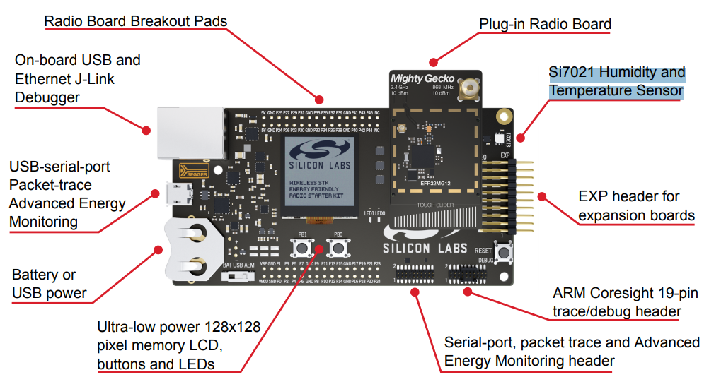
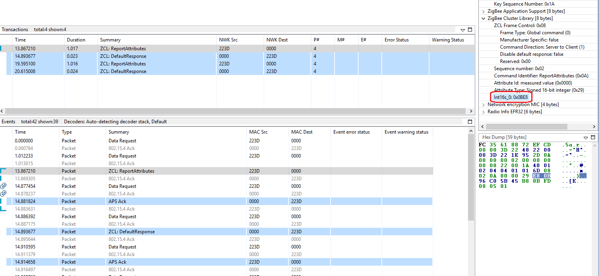

<details>
<summary><font size=5>Table of Contents</font> </summary>  

- [Temperature Sensor](#temperature-sensor)
	- [1. Summary](#1-summary)
	- [2. Gecko SDK version](#2-gecko-sdk-version)
	- [3. Hardware Required](#3-hardware-required)
	- [4. Connections Required](#4-connections-required)
	- [5. Setup](#5-setup)
	- [6. How It Works](#6-how-it-works)
	- [7. .sls Projects Used](#7-sls-projects-used)
	- [8. How to Port to Another Part](#8-how-to-port-to-another-part)
	- [9. References](#9-references)
</details>

********

# Temperature Sensor

## 1. Summary ##
On the WSTK (Wireless Starter Kit), there is a temperature sensor [Si7021](https://www.silabs.com/documents/public/data-sheets/Si7021-A20.pdf). In this example, we will demostrate how we develop a Zigbee temperature sensor based on the WSTK.

Below is the hardware layout of SLWSTK600B:

<div align="center">
	
</div>
</br>

## 2. Gecko SDK version ##
Gecko SDK Suite 3.1.

## 3. Hardware Required ##
- 2 pcs WSTK

## 4. Connections Required ##
Form a Zigbee network on one of the WSTK, and then join the other WSTK into the network.

## 5. Setup ##
1. Create a ZigbeeMinimal project, name it with "Z3TemperatureSensor" and select the **"BRD4164A"** (the board type of your kit) as the board.
2. In **"ZCL Clusters"** tab, select endpoint 1, then in **"Zigbee device type"** field, change it to **HA devices-->HA Temperature Sensor**. With this step, the server side of cluster "Temperature Measurement" is selected automatically.
3. In **Zigbee Stack** tab, change device type to **Sleepy End Device**.
4. Enable the following plugins:  
    - [x] Reporting
	- [x] Idle/Sleep
	- [x] End Device Support
    - [x] Temperature Measurement Server Cluster
    - [x] Temperature Si7021
    - [x] I2C Driver
5. In plugin "Idle/Sleep", in the properties, enable the option **Stay awake when NOT joined**
6. In "Callbacks" tab, enable the following callbacks:
      - [x] emberAfMainInitCallback
      - [x] halSleepCallback

7.  Save and generate the project.
8.  Implement the two callbacks.
	``` C
	void emberAfMainInitCallback(void)
	{
		GPIO_PinModeSet(BSP_I2CSENSOR_ENABLE_PORT, BSP_I2CSENSOR_ENABLE_PIN, gpioModePushPull, 1);
	}

	void halSleepCallback(boolean enter, SleepModes sleepMode)
	{
		if (enter) {
			GPIO_PinModeSet(BSP_I2CSENSOR_ENABLE_PORT, BSP_I2CSENSOR_ENABLE_PIN, gpioModePushPull, 0);
		} else {
			GPIO_PinModeSet(BSP_I2CSENSOR_ENABLE_PORT, BSP_I2CSENSOR_ENABLE_PIN, gpioModePushPull, 1);
		}
	}
	```
9. Save and build. 


## 6. How It Works ##
1. Flash the application into one WSTK, and join it to a Zigbee network.
2. Setup binding on the sensor, so that the temperature can be reported to the bound device. e.g. with the following command, bind the cluster 0x402 of local endpoint 1 to end point 1 of the remote device 000B57FFFE07A7E3.
	```
	option binding-table set 0 0x0402 1 1 {000B57FFFE07A7E3}
	```
3. After that, the device will report the temperature periodically.

<div align="center">
	
</div>
</br>

## 7. .sls Projects Used ##
- [TemperatureSensor4164A.sls](files/ZB-Zigbee-Temperature-Sensor/TemperatureSensor4164A.sls)

## 8. How to Port to Another Part ##
This example can be used on any parts. Below are the steps of porting it to other part:
- Import the .sls file into Simplicity Studio
- Open the .isc file of each project, turn to "General" tab, hit button "Edit Architecture", then select the board and part.


## 9. References ##
- [BRD4164A Schematic](https://www.silabs.com/documents/public/schematic-files/BRD4164A-A02-schematic.pdf)
