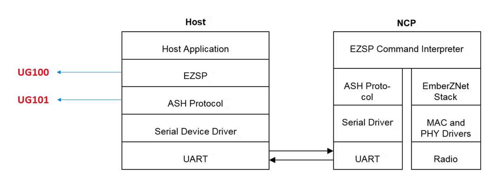
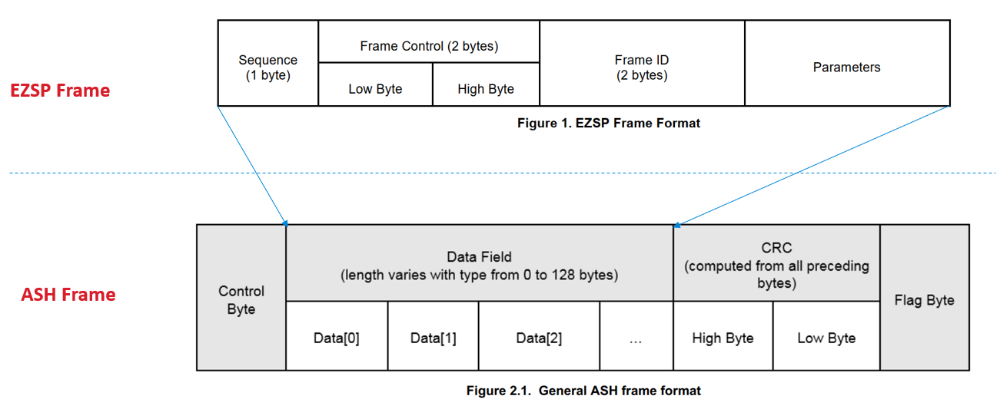
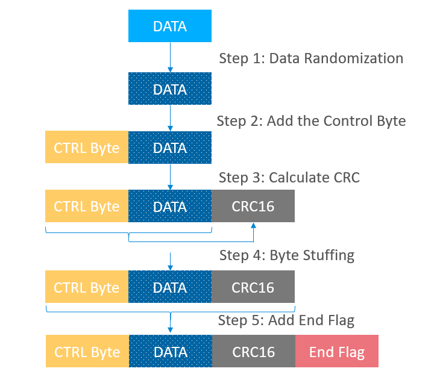
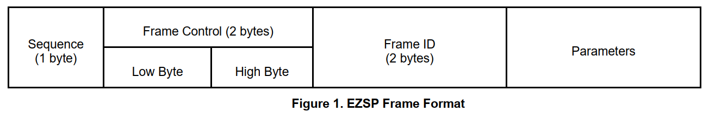
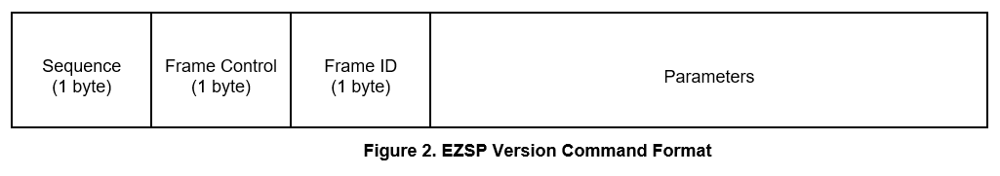
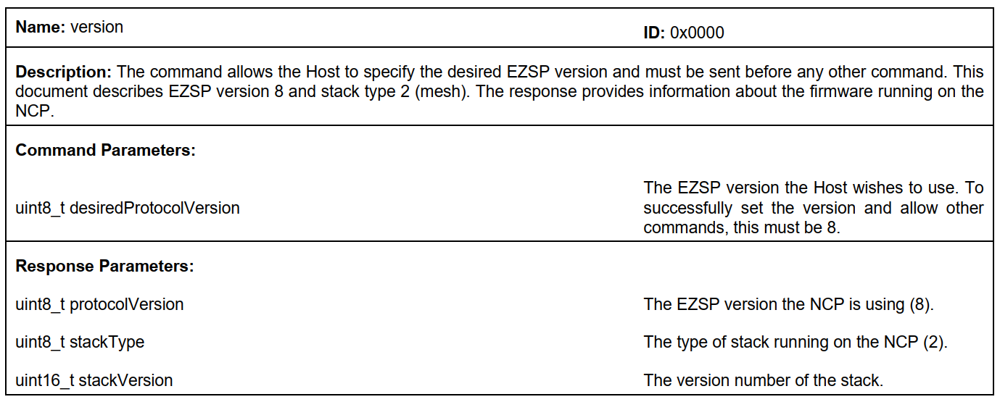
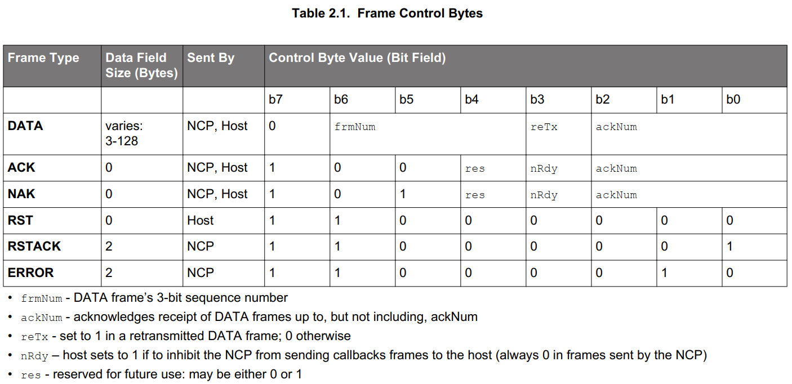
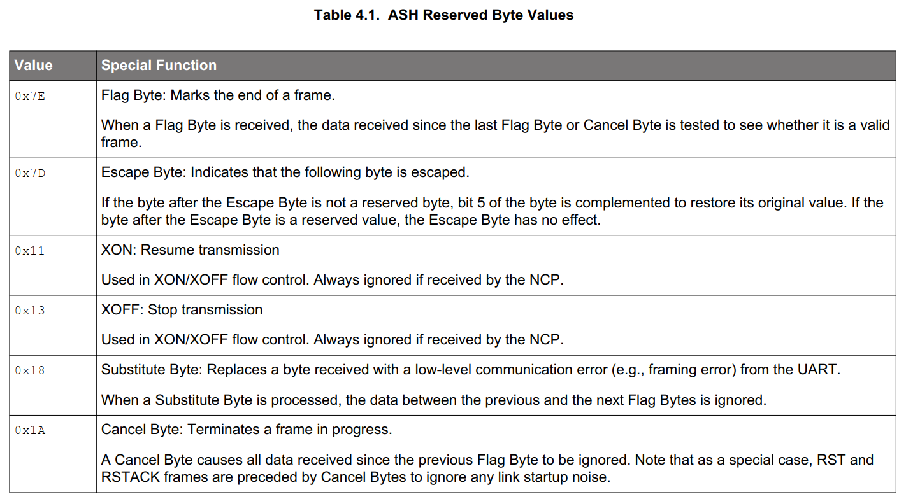

Table of Contents 

&nbsp;  

- [1. Introduction](#1-introduction)
- [2. Frameing](#2-frameing)
  - [2.1. Fill the EZSP Frame](#21-fill-the-ezsp-frame)
  - [2.2. Data Randomization](#22-data-randomization)
  - [2.3. Add the Control Byte](#23-add-the-control-byte)
  - [2.4. Calculate the CRC](#24-calculate-the-crc)
  - [2.5. Byte Stuffing](#25-byte-stuffing)
  - [2.6. Add the End Flag](#26-add-the-end-flag)
- [3. De-framing Process](#3-de-framing-process)
- [4. References](#4-references)

&nbsp; 

# 1. Introduction
Silicon Labs has offered a host+NCP solution for Zigbee gateway design. In this architecture, the host can communicates with the NCP through UART or SPI interface. Most commonly, UART is used as it's much simpler than SPI. 

Silicon Labs has also provided a sample project for the host program, which is the sample **`Z3GatewayHost`**. The sample runs on a Unix-like system. Some customers may want a host sample which can run on a RTOS, but unfortunately, there is no RTOS based host sample for the time being. Users need to develop their own host program based on RTOS.

It's important to understand the UART gateway protocol before developing a customized host program. For both UART based NCP and SPI based NCP, the host uses the EZSP protocol to communicate with the NCP. **EZSP** is short for **EmberZnet Serial Protocol**, and it is defined in [UG100](https://www.silabs.com/documents/public/user-guides/ug100-ezsp-reference-guide.pdf). For UART based NCP, a lower layer protocol is implemented to carry EZSP data reliably over UART, that's the **ASH** protocol, short for **Asynchronous Serial Host**. For more details about ASH, please refer to [UG101](https://www.silabs.com/documents/public/user-guides/ug101-uart-gateway-protocol-reference.pdf) and [UG115](https://www.silabs.com/documents/public/user-guides/ug115-ashv3-protocol-reference.pdf).

The relation between EZSP and ASH can be illustrated by the following diagram:

  

 

The data format of the EZSP and the ASH protocol can be illustrated by the following diagram:

  

 

In this page, we will introduce the process of framing the UART data and some key frames which are frequently used in Zigbee gateway.

# 2. Frameing
The general frameing process can be illustrated by the following chart:

  

 

In this chart, the data means the EZSP frame. In general, the framing processes are:
|No|Step|Reference|
|:-|:-|:-|
|1|Fill the EZSP Frame|UG100|
|2|Data Randomization|Section 4.3 of UG101|
|3|Add the Control Byte|Chap2 and Chap3 of UG101|
|4|Calculate the CRC|Section 2.3 of UG101|
|5|Byte Stuffing|Section 4.2 of UG101|
|6|Add the End Flag|Section 2.4 of UG101|

## 2.1. Fill the EZSP Frame
The EZSP frame format is illustrated in Chap 3 of UG100. 

  

 

Pay attention that this format may change when the SDK upgrades. When the format changes, we will give it a new version number. The latest EZSP version number is 8 when this article is written (EmberZnet 6.8).

As the EZSP frame format may be different between different versions, there is a mandatory requirement that the host and NCP **MUST** work with the same EZSP version. Otherwise, they can't communicate as expectedly.

To achieve that, the first command between the host and the NCP must be the version command. In other words, the host must retrive the EZSP version of the NCP before any other communication. If the EZSP version is different with the EZSP version of the host side, the communication must be aborted.

The implicit requirement behind this is that the format of the version command can **NEVER CHANGE**. The EZSP version command format is like below:

  

 

The explanations of the parameter field and the format of the version response can be found in Chap 4 of UG100. The parameter field is the EZSP version of the host program. When this article is written, it's 8.

  

 

## 2.2. Data Randomization
The detailed randomization process is described in section 4.3 of UG101. The whole EZSP frame will be randomized. The randomization is to exclusive-OR the EZSP frame and a pseudo-random sequence.

Below is the algorithm of generating the pseudo-random sequence.

- rand0 = 0x42
- if bit 0 of randi is 0, randi+1 = randi >> 1
- if bit 0 of randi is 1, randi+1 = (randi >> 1) ^ 0xB8

## 2.3. Add the Control Byte
The control byte is a one byte data, and should be added to the head of the frame. The format is illustrated with the table below:

  

 

Totally, there are 6 kinds of control bytes. The first three are used for common frames with EZSP data, including DATA, ACK and NAK. The last three are used without common EZSP data, including RST, RSTACK and ERROR.

The format of the RST, RSTACK and ERROR are described in section 3.1 to 3.3.

## 2.4. Calculate the CRC
A 16-bit CRC is calculated on bytes from the control byte till the end of the data. The standard CRCCCITT (g(x) = x16 + x12 + x5 + 1) is initialized to 0xFFFF. The most significant byte precedes the least significant byte (big-endian
mode).

## 2.5. Byte Stuffing
As described in section 4.2 of UG101, there are some reserved byte values used for special purpose. These values can be found in the following table:

  

 

When these values appear in the frame, a special treatment will be done to the data. 
- Insert the escape byte 0x7D in front of the reserved byte
- Reverse the bit5 of that reserved byte

Below are some examples of this algorithm:

  

 

## 2.6. Add the End Flag
The final step is to add the end flag 0x7E to the end of the frame. After that, the data can be sent to the UART port.

# 3. De-framing Process
When data is received from the UART, we just need to do the reverse steps to decode it.

# 4. References
- [UG100 EZSP Reference Guide](https://www.silabs.com/documents/public/user-guides/ug100-ezsp-reference-guide.pdf)
- [UG101 UART Gateway Protocol Reference](https://www.silabs.com/documents/public/user-guides/ug101-uart-gateway-protocol-reference.pdf)
- [UG115 ASHv3 Protocol Reference](https://www.silabs.com/documents/public/user-guides/ug115-ashv3-protocol-reference.pdf)