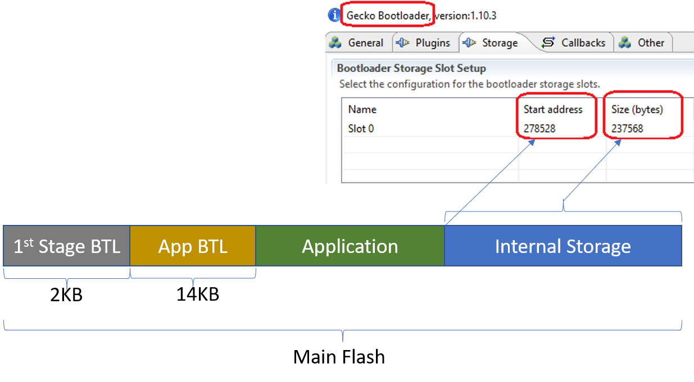
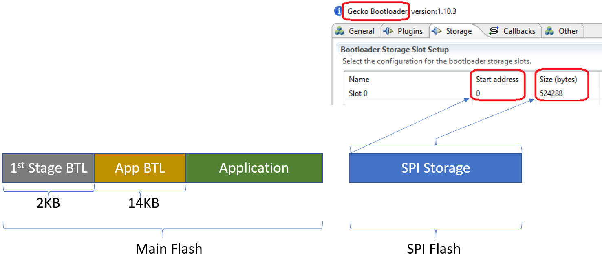
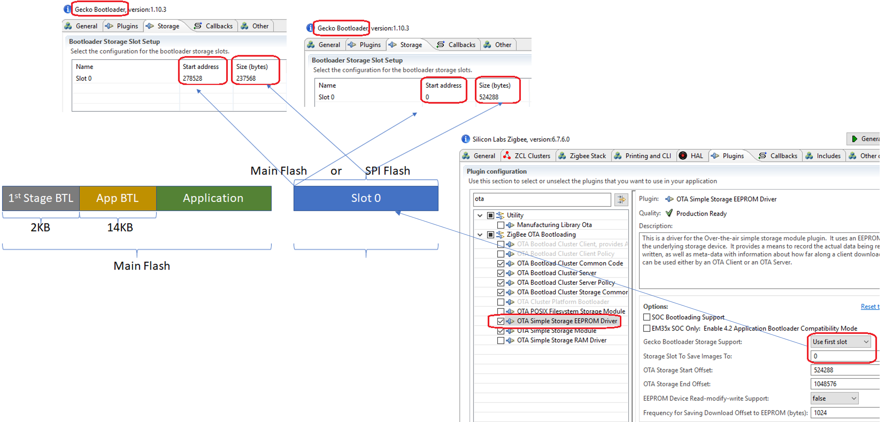
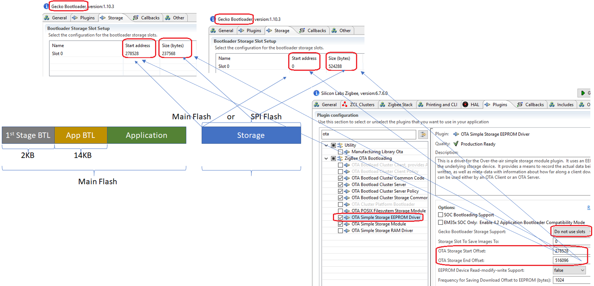
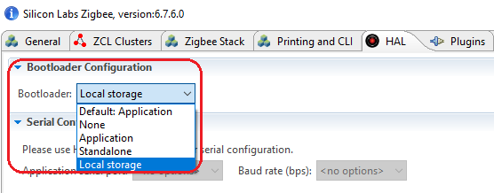
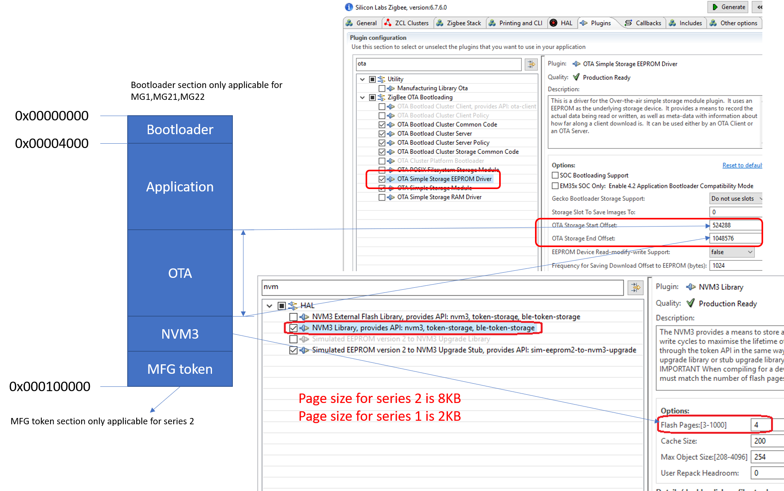
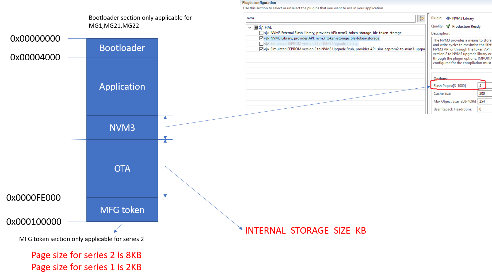

Table of Contents 

&nbsp;  

- [1. Introduction](#1-introduction)
- [2. Storage Layout](#2-storage-layout)
  - [2.1. Storage Layout in Gecko Bootloader's Perspective](#21-storage-layout-in-gecko-bootloaders-perspective)
    - [2.1.1. Internal Storage](#211-internal-storage)
    - [2.1.2. SPI Flash Storage](#212-spi-flash-storage)
  - [2.2. Storage Layout in Application's Perspective](#22-storage-layout-in-applications-perspective)
    - [2.2.1. Using Slot Manager](#221-using-slot-manager)
    - [2.2.2. Using direct offset](#222-using-direct-offset)
  - [2.3. The Full Layout of Internal Flash](#23-the-full-layout-of-internal-flash)
    - [2.3.1. Bootloader is set to Application](#231-bootloader-is-set-to-application)
    - [2.3.2. Bootloader is set to Local Storage](#232-bootloader-is-set-to-local-storage)

&nbsp; 

# 1. Introduction
OTA upgrading is an important feature for Zigbee devices. There is a detailed guide about setting up OTA server and client, [AN728](https://www.silabs.com/documents/public/application-notes/an728-ota-client-server-setup.pdf), but we still need to learn more about the storage settings. 

Application upgrading is done by Gecko Bootloader. Gecko Bootloader can only bootload the **GBL** file format. Therefore, to upgrade the application image, we have to put the new image to the right place in **GBL** format. The detailed upgrading process is introduced in [UG266](https://www.silabs.com/documents/public/user-guides/ug266-gecko-bootloader-user-guide.pdf).

This page will introduce the storage layout in bootloader perspective and application perspective,  and also the settings of OTA storage, so that users can understand it better.  

# 2. Storage Layout
## 2.1. Storage Layout in Gecko Bootloader's Perspective
### 2.1.1. Internal Storage
Note that the start address is the offset from the begining of the main flash.

  

 

### 2.1.2. SPI Flash Storage
Note that the start address is the offset from the beginning of the SPI flash, so it can start from 0.

  

 

## 2.2. Storage Layout in Application's Perspective
### 2.2.1. Using Slot Manager
When the plugin `Slot Manager` is used, the exact storage offset is determined by the Gecko Bootloader.

  

 

### 2.2.2. Using direct offset
When the plugin `Slot Manager` is **NOT** used, users need to specify the exact offset of the OTA storage. The start offset for OTA storage must match the start offset of the slot setting in Gecko Bootloader.

  

 

## 2.3. The Full Layout of Internal Flash
Besides the OTA storage, there are some other sections stored in the internal flash. When you set the offset of the OTA storage, please make sure the offset of these sections don't overlap each other. This is only applicable for internal storage. If the OTA image is stored in SPI flash, it will be OK.  

There are two different flash layouts which is determined by the following setting:

  

 

### 2.3.1. Bootloader is set to Application

  

 

### 2.3.2. Bootloader is set to Local Storage

  

 
