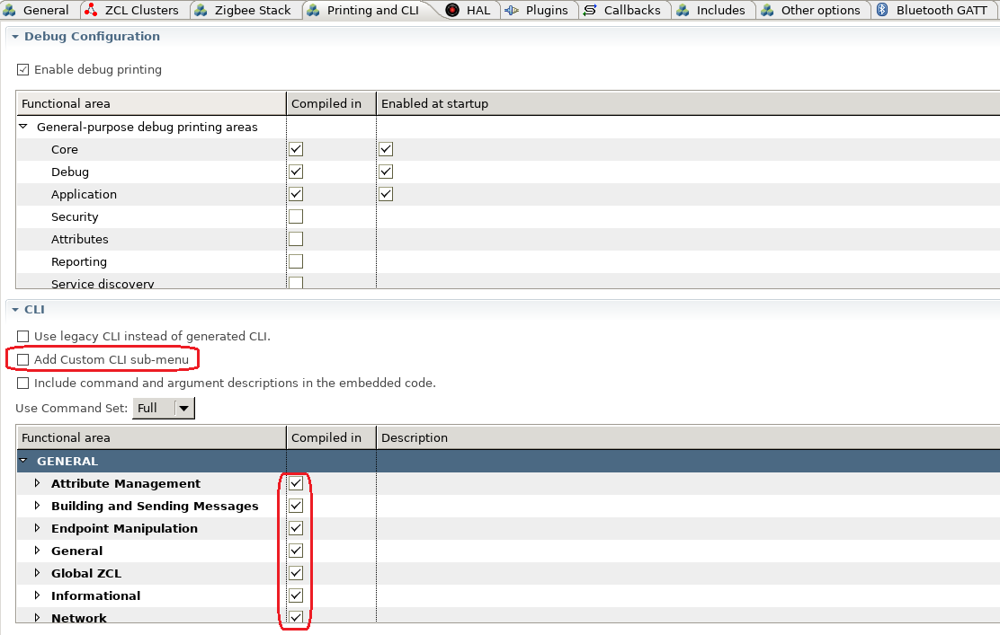

<details>
<summary><font size=5>Table of Contents</font> </summary>
&nbsp;  

- [1. Introduction](#1-introduction)
- [2. Add Custom CLI Command](#2-add-custom-cli-command)
  - [2.1. Define Custom CLI Command](#21-define-custom-cli-command)
  - [2.2. Implement the CLI Command Handler](#22-implement-the-cli-command-handler)
</details>
&nbsp; 

## 1. Introduction
CLI commands are very helpful at develop stage. EmberZnet has provided a lot of debug commands. In AppBuilder, customer can choose the provided debug commands or to add custom CLI commands.



To use the provided CLI commands, you just need to enable the commands you need, then generate your project. To use the provided CLI commands of clusters or plugins, you need to enable these clusters and plugins first. The command line usage can be found at our [official docs website](https://docs.silabs.com/zigbee/latest/af/group-cli). 

In this page, we will introduce how we add a new custom command.

&nbsp; 

## 2. Add Custom CLI Command
### 2.1. Define Custom CLI Command
To add custom CLI command, you need to enable the option **"Add Custom CLI sub-menu"** in tab "Printing and CLI". Then generate your project.  

Then you need to source code like below to define your custom CLI command:  
```
EmberCommandEntry emberAfCustomCommands[] = {
  emberCommandEntryAction("test", customtestcmd, "", ""),
  emberCommandEntryTerminator()
};
```
There are four parameters in the macro "emberCommandEntryAction":  
- Command Key word. In the example above, we've added a command **"custom test"**.
- Command handler. When the input command matches this key word, this handler will be called. The prototype is like:  typedef void (*CommandAction)(void).
- Argument types. It's a special string.
- Description of the command.

Argument type is a string that specifies the number and types of arguments the command accepts.  The argument specifiers are:  
- u:   one-byte unsigned integer.
- v:   two-byte unsigned integer.
- s:   one-byte signed integer.
- b:   string.  The argument can be entered in ASCII by using
       quotes, for example: "foo".  It can also be entered
       in hexadecimal values by using curly braces,
       for example: { 08 A1 f2 }.
       The number of hexadecimal digits must be even and spaces
       are ignored.
- *:   zero or more of the previous type.
       If used, this must be the last specifier.
- ?:   unknown number of arguments. If used this must be the only
       character, which means that the command interpreter will not
       perform any validation of arguments and will call the
       action directly trusting that it will handle
       whatever arguments are passed in.

Integer arguments can be either decimal or hexadecimal.
A 0x prefix indicates a hexadecimal integer, for example: 0x3ed.

These specifiers can be bound together. e.g. "vus" means the command has 3 arguments. The first one is a two-byte unsigned integer, the second one is an one-byte unsigned integer and the third one is a one-byte signed integer. 

### 2.2. Implement the CLI Command Handler
The prototype of the CLI command handler is like:
```
static void customtestcmd(void)
{
    //do something
}
```

There are some APIs you might need to use in order to handle the arguments. 
- int32_t emberSignedCommandArgument(uint8_t argNum)  - get value of a signed integer
- uint32_t emberUnsignedCommandArgument(uint8_t argNum)  - get value of an unsigned integer
- uint8_t *emberStringCommandArgument(int8_t argNum, uint8_t *length)  - get the pointer of a string argument

