[English](Zigbee-Custom-Clusters) | 中文

<details>
<summary><font size=5>Table of Contents</font> </summary>
&nbsp;  

- [1. 介绍](#1-介绍)
  - [1.1. Zigbee Clusters 的扩展性](#11-zigbee-clusters-的扩展性)
  - [1.2. EmberZnet SDK 中的 Cluster](#12-emberznet-sdk-中的-cluster)
- [2. 扩展标准的 Clusters](#2-扩展标准的-clusters)
  - [2.1. 定义扩展属性和命令](#21-定义扩展属性和命令)
    - [2.1.1. 理解XML 文件](#211-理解xml-文件)
    - [2.1.2. 创建 XML 文件以扩展标准Cluster](#212-创建-xml-文件以扩展标准cluster)
  - [2.2. 把定义好的xml文件添加到工程中](#22-把定义好的xml文件添加到工程中)
  - [2.3. 测试](#23-测试)
- [3. 添加自定义 Cluster](#3-添加自定义-cluster)
  - [3.1. 定义自定义 Cluster](#31-定义自定义-cluster)
  - [3.2. 将自定义Cluster的 xml 添加到工程中](#32-将自定义cluster的-xml-添加到工程中)
  - [3.3. 测试](#33-测试)
- [4. 参考](#4-参考)
</details>
&nbsp; 

## 1. 介绍
### 1.1. Zigbee Clusters 的扩展性
Zigbee 联盟已经定义了很多标准Cluster。它还允许制造商根据需要自定义自己的Cluster。在本文中，我们将介绍如何在 EmberZnet 中扩展Cluster。扩展Cluster的两种场景： 
- 扩展标准Cluster上的属性或命令
- 创建全新的自定义Cluster  

**请注意，在这两种情况下，基于自定义Cluster的功能只能与具有这些自定义Cluster的产品进行交互操作，这意味着您的产品只能与您自己的产品进行交互操作。我们建议您仅在必须使用自定义Cluster时才使用。**

根据 [ZCL 规范](https://zigbeealliance.org/wp-content/uploads/2019/12/07-5123-06-zigbee-cluster-library-specification.pdf)的描述, 一部分Cluster ID是预留给厂商自行定义的：

|Cluster ID|描述|
|:-|:-|
|0x0000 – 0x7fff|标准 Cluster|
|0xfc00 – 0xffff|厂商自定义 cluster|
|其他值|保留|

### 1.2. EmberZnet SDK 中的 Cluster
Zibgee Clusters 在 EmberZnet SDK 中是以xml文件的形式来定义的. 这些xml文件可以在SDK下面的`app\zcl` 目录中找到。  

例如：  
```
C:\SiliconLabs\SimplicityStudio\v4\developer\sdks\gecko_sdk_suite\v2.7\app\zcl
```

你可以查看其中的xml文件内容来尝试去理解这些格式。  

例如，`general.xml` 这个文件定义了一些通用类别的Cluster，比如Basic、Identify、Groups、Scenes、On/Off等等。
&nbsp; 

## 2. 扩展标准的 Clusters
扩展标准Clusters意味着我们将自定义属性或命令添加到标准Clusters。

### 2.1. 定义扩展属性和命令
首先，您需要创建一个 xml 文件。编辑此文件，定义自定义的属性和命令。

#### 2.1.1. 理解XML 文件
在SDK中已经有一个示例的xml文件，即 `app\zcl` 文件夹下的 `sample-extensions.xml`。
``` xml
  <!-- Use the cluster extension Extend the on/off cluster -->
  <clusterExtension code="0x0006"> 
    <attribute side="server" code="0x0000" 
      define="SAMPLE_MFG_SPECIFIC_TRANSITION_TIME" 
      type="INT16U" min="0x0000" max="0xFFFF" writable="true" 
      default="0x0000" optional="true" 
      manufacturerCode="0x1002">Sample Mfg Specific Attribute: 0x0000 0x1002</attribute>
    <attribute side="server" code="0x0000" 
      define="SAMPLE_MFG_SPECIFIC_TRANSITION_TIME_2" 
      type="INT8U" min="0x0000" max="0xFFFF" writable="true" 
      default="0x0000" optional="true" 
      manufacturerCode="0x1049">Sample Mfg Specific Attribute: 0x0000 0x1049</attribute>
    <attribute side="server" code="0x0001" 
      define="SAMPLE_MFG_SPECIFIC_TRANSITION_TIME_3" 
      type="INT8U" min="0x0000" max="0xFFFF" writable="true" 
      default="0x00" optional="true" 
      manufacturerCode="0x1002">Sample Mfg Specific Attribute: 0x0001 0x1002</attribute>
    <attribute side="server" code="0x0001" 
      define="SAMPLE_MFG_SPECIFIC_TRANSITION_TIME_4" 
      type="INT16U" min="0x0000" max="0xFFFF" writable="true" 
      default="0x0000" optional="true" 
      manufacturerCode="0x1049">Sample Mfg Specific Attribute: 0x0001 0x1040</attribute>

    <command source="client" code="0x00" 
      name="SampleMfgSpecificOffWithTransition" optional="true" manufacturerCode="0x1002">
      <description>Client command that turns the device off with a transition given
        by the transition time in the Ember Sample transition time attribute.</description>
    </command>
    <command source="client" code="0x01" 
      name="SampleMfgSpecificOnWithTransition" optional="true" manufacturerCode="0x1002">
      <description>Client command that turns the device on with a transition given
        by the transition time in the Ember Sample transition time attribute.</description>
    </command>
    <command source="client" code="0x02" 
      name="SampleMfgSpecificToggleWithTransition" optional="true" manufacturerCode="0x1002">
      <description>Client command that toggles the device with a transition given
        by the transition time in the Ember Sample transition time attribute.</description>
    </command>
        <command source="client" code="0x01" 
      name="SampleMfgSpecificOnWithTransition2" optional="true" manufacturerCode="0x1049">
      <description>Client command that turns the device on with a transition given
        by the transition time in the Ember Sample transition time attribute.</description>
    </command>
    <command source="client" code="0x02" 
      name="SampleMfgSpecificToggleWithTransition2" optional="true" manufacturerCode="0x1049">
      <description>Client command that toggles the device with a transition given
        by the transition time in the Ember Sample transition time attribute.</description>
    </command>
  </clusterExtension>
```
在此示例中，我们通过添加一些属性和命令来扩展标准Cluster On/Off。以下属性是自定义的：  
<div align="center">
  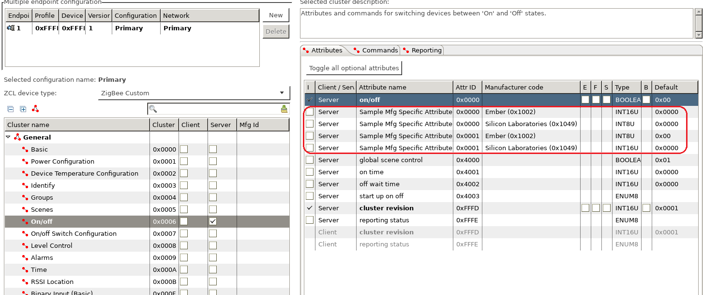
</div>
</br>

以下命令是自定义的：
<div align="center">
  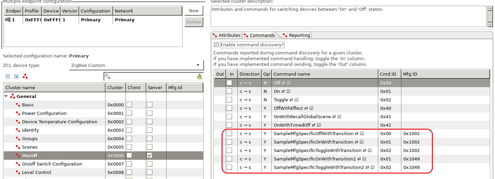
</div>
</br>

**注意:**
- 扩展属性 ID 和命令 ID 可以与标准属性 ID 相同，因为这些扩展属性和命令仅适用于特定制造商的产品（可以通过Manufacture Code来区分）。
- 不同制造商的扩展属性 ID 和命令 ID 可以相同。
- 所有扩展属性和命令必须是可选的。

#### 2.1.2. 创建 XML 文件以扩展标准Cluster
作为测试，我们扩展了 `Level Control` 这个Cluster的属性和命令。以下是 xml 的内容： 
``` xml
<configurator>
  <domain name="Test" />
  
  <!-- Use the cluster extension Extend the on/off cluster -->
  <clusterExtension code="0x0008"> 
    <attribute side="server" code="0x0000" 
      define="SAMPLE_MFG_SPECIFIC_ATTRIBUTE" 
      type="INT16U" min="0x0000" max="0xFFFF" writable="true" 
      default="0x0000" optional="true" 
      manufacturerCode="0x1002">Extend attribute for testing.</attribute>

    <command source="client" code="0x00" 
      name="SampleMfgSpecificCmd" optional="true" manufacturerCode="0x1002">
      <description>Extend command for testing.</description>
    </command>
    <command source="client" code="0x01" 
      name="SampleMfgSpecificCmdWithArgs" optional="true" manufacturerCode="0x1002">
      <description>Extend command with args for testing.</description>
	  <arg name="argOne" type="INT8U" />
    </command>	
  </clusterExtension>
  
</configurator>
```

### 2.2. 把定义好的xml文件添加到工程中
将定义好的 xml 文件放入项目文件夹，然后转向 `Zigbee Stack` 标签，在底部有一个 `Custom ZCL additions` 的区域。单击按钮"Add"，然后选择 xml 文件将其添加到项目中。
<div align="center">
  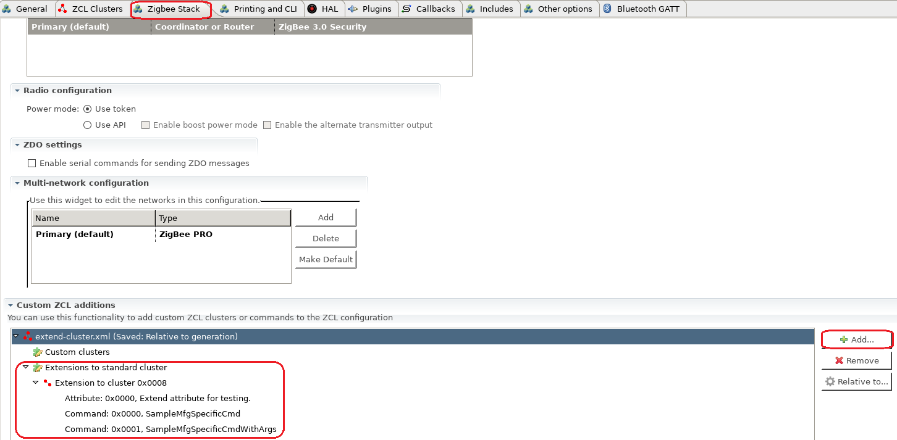
</div>
</br>

之后，检查能否在 `ZCL Clusters` 标签中找到扩展属性和扩展命令。
<div align="center">
  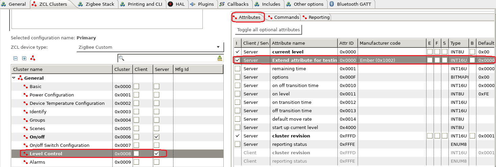
</div>
</br>

<div align="center">
  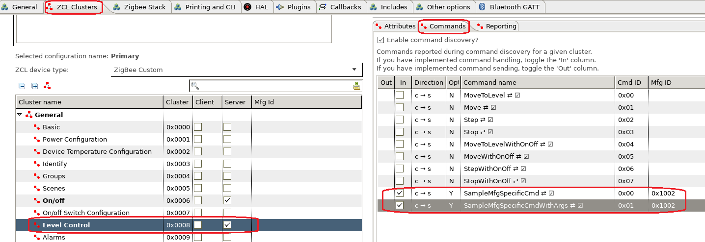
</div>
</br>

### 2.3. 测试
创建一个启用了 `Level Control` 服务器端的项目，以及启用了 `Level Control` 客户端的另一个项目。在服务器项目中，勾选回调 `Sample Mfg Specific Cmd` 和 `Sample Mfg Specific Cmd With Args` 进行测试。

<div align="center">
  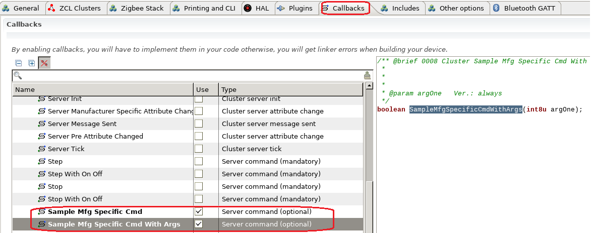
</div>
</br>

在文件 `<projectname>_callbacks.c` 中, 添加下面两个回调函数的实现:
``` C
boolean emberAfLevelControlClusterSampleMfgSpecificCmdCallback(void)
{
	emberAfCorePrintln("[%s] called", __func__);
	return true;
}

boolean emberAfLevelControlClusterSampleMfgSpecificCmdWithArgsCallback(int8u argOne)
{
	emberAfCorePrintln("[%s] called argOne=%X", __func__, argOne);
	return true;
}
```

**注意:** 注意扩展Cluster的回调函数的名称可能与命令名称不完全相同。这取决于您现在使用的Simplicity Studio版本。建议读取生成的文件 `call-command-handler.c` 的源代码，然后在函数 `emberAfClusterSpecificCommandParse` 中，查找您扩展的Cluster和您添加的命令，然后您将在此处找到回调函数名称。回调将在这里调用。

在此测试中，我们使用协调器作为服务器端。我们添加一个自定义命令来发送 `Level Control` Cluster的两个扩展命令。（如果您不知道如何添加自定义命令，可以参考[自定义 CLI 命令](Zigbee-Custom-CLI-Commands)）

``` C
static void custom_test_noargcmd()
{
	EmberStatus status;

	emberAfFillCommandLevelControlClusterSampleMfgSpecificCmd();
    emberAfSetCommandEndpoints(1, 1);
	status = emberAfSendCommandUnicast(EMBER_OUTGOING_DIRECT, 0x0000);
	emberAfCorePrintln("send custom level control cmd with no args, status=%X", status);
}

static void custom_test_1argcmd()
{
	EmberStatus status;
	int8_t arg = emberSignedCommandArgument(0);

	emberAfFillCommandLevelControlClusterSampleMfgSpecificCmdWithArgs(arg);
    emberAfSetCommandEndpoints(1, 1);
	status = emberAfSendCommandUnicast(EMBER_OUTGOING_DIRECT, 0x0000);
	emberAfCorePrintln("send custom level control cmd with 1 arg=%X, status=%X", arg, status);
}

EmberCommandEntry emberAfCustomCommands[] = {
  emberCommandEntryAction("test_cmd_noarg", custom_test_noargcmd, "", ""),
  emberCommandEntryAction("test_cmd_1arg", custom_test_1argcmd, "s", ""),
  emberCommandEntryTerminator()
};
```

将客户端和服务器加入网络。在客户端，运行以下命令：
```
custom test_cmd_noarg
custom test_cmd_1arg 100
```

然后在服务器端，你会看到以下输出：
```
T00000000:RX len 5, ep 01, clus 0x0008 (Level Control) mfgId 1002 FC 05 seq 03 cmd 00 payload[]
[emberAfLevelControlClusterSampleMfgSpecificCmdCallback] called
Processing message: len=6 profile=FFFF cluster=0008

T00000000:RX len 6, ep 01, clus 0x0008 (Level Control) mfgId 1002 FC 05 seq 04 cmd 01 payload[64 ]
[emberAfLevelControlClusterSampleMfgSpecificCmdWithArgsCallback] called argOne=64
```

在抓包中，您可以找到有关这两个命令的详细信息。

<div align="center">
  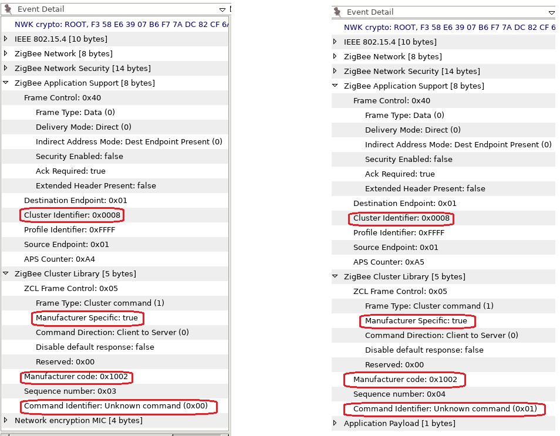
</div>
</br>

## 3. 添加自定义 Cluster
### 3.1. 定义自定义 Cluster
要添加自定义Cluster，我们需要首先在 xml 中定义它。我们有一个示例，它是 `app\zcl` 目录中的 `sample-extensions.xml`。
``` xml
  <cluster manufacturerCode="0x1002">
    <name>Sample Mfg Specific Cluster</name>
    <domain>Ember</domain>
    <description>This cluster provides an example of how the Application 
      Framework can be extended to include manufacturer specific clusters.
      </description>
    <!-- Cluster Id must be within the mfg spec range 0xfc00 - 0xffff -->
    <code>0xFC00</code> 
    <define>SAMPLE_MFG_SPECIFIC_CLUSTER</define>
    <client init="false" tick="false">true</client>
    <server init="false" tick="false">true</server>
    <attribute side="server" code="0x0000" define="ATTRIBUTE_ONE" 
      type="INT8U"  min="0x00"   max="0xFF"   writable="true"  
      default="0x00" optional="true">ember sample attribute</attribute>

    <attribute side="server" code="0x0001" define="ATTRIBUTE_TWO" 
      type="INT8U"  min="0x00"   max="0xFF"   writable="true"  
      default="0x00" optional="true">ember sample attribute 2</attribute>
    <command source="client" code="0x00" 
      name="CommandOne" 
      optional="true">
      <description>
        A sample manufacturer specific command within the sample manufacturer specific
        cluster.
      </description>
      <arg name="argOne" type="INT8U" />
    </command>
  </cluster>
```
在此示例中，我们定义了一个自定义Cluster，其制造商代码为 0x1002。Cluster ID 为 0xFC00，其中定义了两个属性和一个命令。

作为测试，我们可以定义如下自定义Cluster：
``` xml
<configurator>
  <domain name="Test" />
  
  <cluster manufacturerCode="0x1002">
    <name>Hello World</name>
    <domain>Ember</domain>
    <description>This cluster provides an example of how the Application 
      Framework can be extended to include manufacturer specific clusters.
      </description>
    <!-- Cluster Id must be within the mfg spec range 0xfc00 - 0xffff -->
    <code>0xFC10</code> 
    <define>SAMPLE_MFG_SPECIFIC_HELLOWORLD_CLUSTER</define>
    <client init="false" tick="false">true</client>
    <server init="false" tick="false">true</server>
    <attribute side="server" code="0x0000" define="ATTRIBUTE_ONE" 
      type="CHAR_STRING"  min="0x00"   max="0xFF"   writable="true"  
      default="" optional="true">ember sample attribute</attribute>
    <command source="client" code="0x00" 
      name="CommandOne" 
      optional="true">
      <description>
        A sample manufacturer specific command within the sample manufacturer specific
        cluster.
      </description>
      <arg name="argOne" type="CHAR_STRING" />
    </command>
  </cluster>
  
</configurator>
```

### 3.2. 将自定义Cluster的 xml 添加到工程中
将自定义的 xml 文件放入项目文件夹，然后转向 `Zigbee Stack` 标签，在底部有一个 `Custom ZCL additions` 的区域。单击按钮"Add"，然后选择 xml 文件将其添加到项目中。
<div align="center">
  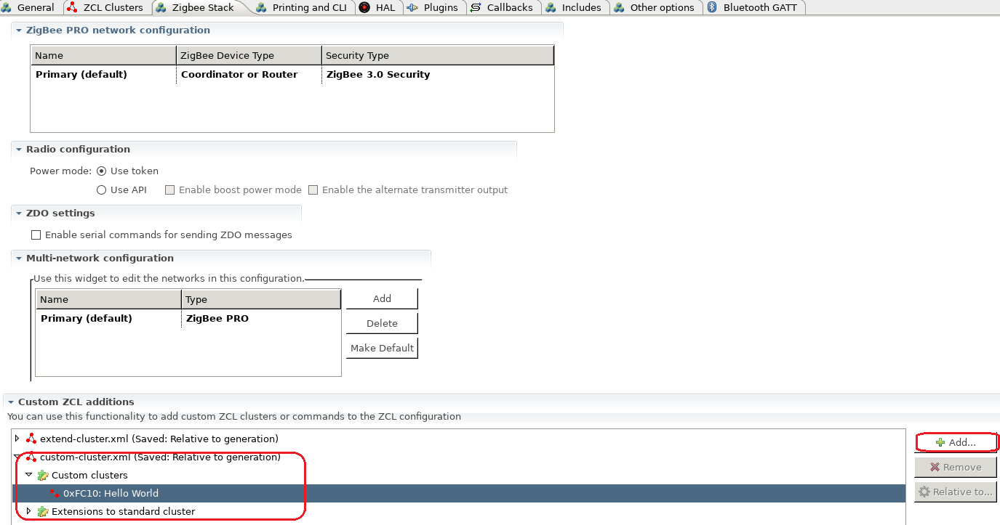
</div>
</br>

之后，请检查能否在 `ZCL Clusters` 标签中找到自定义Cluster以及属性和命令。
<div align="center">
  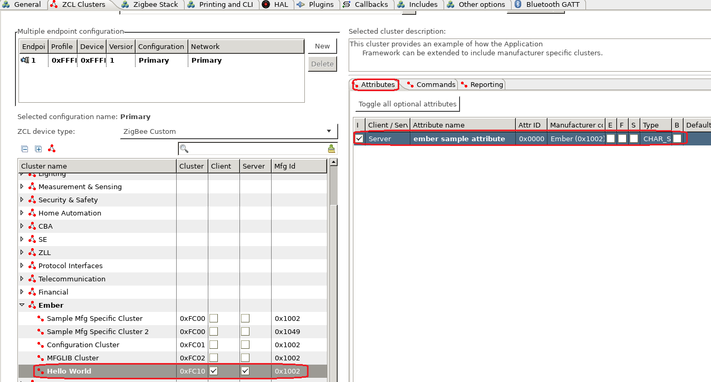
</div>
</br>

<div align="center">
  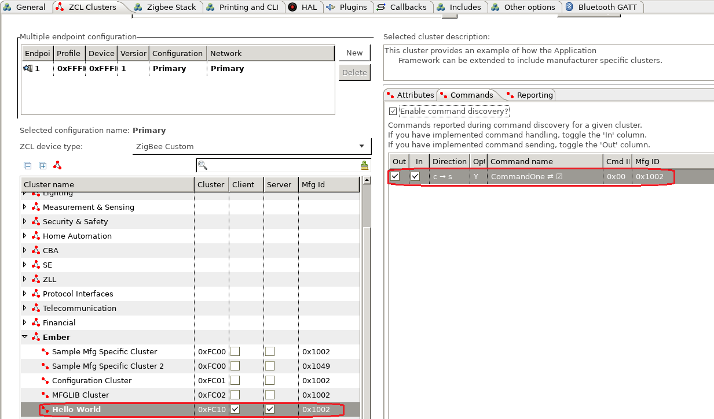
</div>
</br>

### 3.3. 测试
创建启用自定义Cluster `Hello World` 的服务器端的项目，同时创建一个启用自定义Cluster `Hello World` 的客户端的另一个项目。在服务器项目上，勾选要测试的回调 `Command One`。
<div align="center">
  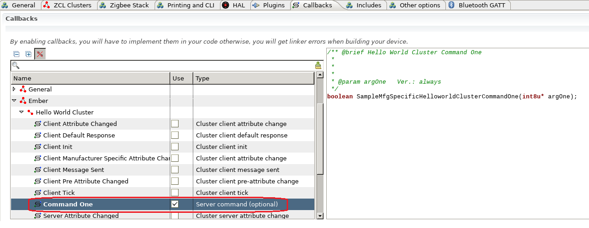
</div>
</br>

在文件 `<projectname>_callbacks.c` 中, 添加回调函数的实现:
``` C
boolean emberAfSampleMfgSpecificHelloworldClusterCommandOneCallback(int8u* argOne)
{
	emberAfCorePrintln("[%s] called argOne=%s", __func__, argOne);
	return true;
}
```

在此测试中，我们使用协调器作为服务器端。我们在客户端添加自定义命令以发送自定义Cluster的命令。（如果您不知道如何添加自定义命令，可以参考[自定义 CLI 命令](Zigbee-Custom-CLI-Commands)）

``` C
static void custom_helloworld_cmd()
{
	EmberStatus status;
	uint8_t length;
  char buffer[128];
	uint8_t *arg = emberStringCommandArgument(0, &length);

  if (length >= sizeof(buffer)) {
    emberAfCorePrintln("input string too long, length=%d", length);
    return;
  }

  //for string arguments, first byte is the length
  buffer[0] = length;
  memcpy(&buffer[1], arg, length);
    
	emberAfFillCommandSampleMfgSpecificHelloworldClusterCommandOne(buffer);
  emberAfSetCommandEndpoints(1, 1);
	status = emberAfSendCommandUnicast(EMBER_OUTGOING_DIRECT, 0x0000);
	emberAfCorePrintln("send custom helloworld cmd with 1 status=%X", status);
}

EmberCommandEntry emberAfCustomCommands[] = {
  emberCommandEntryAction("helloworld_cmd", custom_helloworld_cmd, "b", ""),
  emberCommandEntryTerminator()
};
```

将客户端和服务器加入网络。在客户端，运行以下命令：
```
custom helloworld_cmd "hello world"
```

然后在服务器端，你会看到以下输出：
```
T00000000:RX len 17, ep 01, clus 0xFC10 (Hello World) mfgId 1002 FC 05 seq 00 cmd 00 payload[0B 68 65 6C 6C 6F 20 77 6F 72 6C 64 ]
[emberAfSampleMfgSpecificHelloworldClusterCommandOneCallback] called argOne=hello world
```

在抓包中，您可以找到有关自定义命令的详细信息。
<div align="center">
  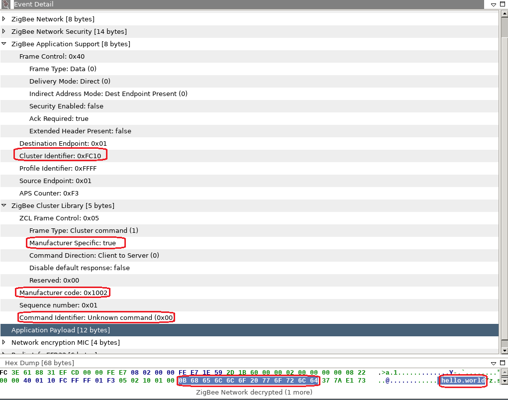
</div>
</br>

## 4. 参考
- [Zigbee Cluster Library Specification](https://zigbeealliance.org/wp-content/uploads/2019/12/07-5123-06-zigbee-cluster-library-specification.pdf)
