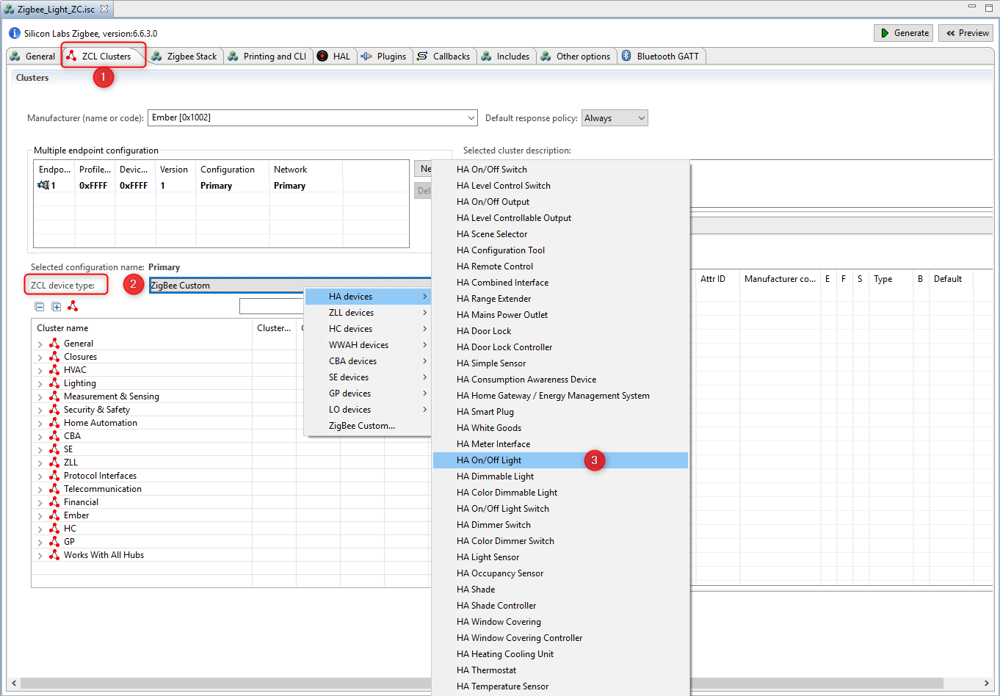
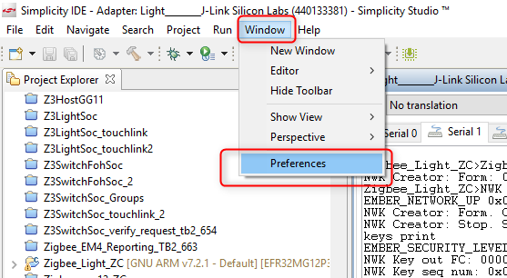

<details>   
<summary><font size=5>目录</font> </summary>

- [1. 简介](#1-简介)
    - [1.1. 应用功能](#11-应用功能)
    - [1.2. 目的](#12-目的)
- [2. 基本步骤](#2-基本步骤)
    - [2.1. 硬体需求](#21-硬体需求)
    - [2.2. 软件需求](#22-软件需求)
        - [2.2.1. 检查EmberZNet SDK](#221-检查EmberZNet-SDK)
        - [2.2.2. 检查工具链](#222-检查工具链)
        - [2.2.3. 使用Gecko Bootloader](#223-使用Gecko-Bootloader)
- [3. 创建Light应用程序](#3-创建Light应用程序)
- [4. 下载并测试Light应用程序](#4-下载并测试Light应用程序)
- [5. 创建Switch应用程序](#5-创建Switch应用程序)
- [6. 下载并测试Switch应用程序](#6-下载并测试Switch应用程序)
- [7. 使用从安装代码派生的链接密钥在Light和Switch之间建立连接](#7-使用从安装代码派生的链接密钥在Light和Switch之间建立连接)
    - [7.1. 对安装代码编程以切换（路由器）设备](#71-对安装代码编程以切换（路由器）设备)
        - [7.1.1. 安装代码文件的格式](#711-安装代码文件的格式)
        - [7.1.2. 检查EFR32设备上的安装代码](#712-检查EFR32设备上的安装代码)
        - [7.1.3. 将安装代码写入EFR32设备上的制造区域](#713-将安装代码写入EFR32设备上的制造区域)
        - [7.1.4. 验证在EFR32设备上存储的安装代码](#714-验证在EFR32设备上存储的安装代码)
        - [7.1.5. 删除安装代码](#715-删除安装代码)
    - [7.2. 在Light（协调器）设备上构建集中式网络](#72-在Light（协调器）设备上构建集中式网络)
        - [7.2.1. 从安装代码中获取链接密钥](#721-从安装代码中获取链接密钥)
        - [7.2.2. 构建集中网络](#722-构建集中网络)
        - [7.2.3. 使用派生的链接密钥打开网络](#723-使用派生的链接密钥打开网络)
    - [7.3. 在Switch（路由器）设备上加入网络](#73-在Switch（路由器）设备上加入网络)
    - [7.4. 捕获Light(协调器)设备的网络日志](#74-捕获Light(协调器)设备的网络日志)
        - [7.4.1. 查找网络密钥和派生链接密钥以进行捕获](#741-查找网络密钥和派生链接密钥以进行捕获)
        - [7.4.2. 将网络密钥和派生链接密钥添加到网络分析器](#742-将网络密钥和派生链接密钥添加到网络分析器)
        - [7.4.3. 开始在Light（协调器）设备上捕获](#743-开始在Light（协调器）设备上捕获)
        - [7.4.4. 网络分析仪中的加入过程](#744-网络分析仪中的加入过程)
- [8. 结论](#8-结论)

</details>

***
[English](Zigbee-Hands-on-Forming-and-Joining.md) | Chinese

# 1. 简介
在此工作表中，我们提供了分步指南，基于EmberZNet Stack 6.6.4创建，用于构建和运行ZigBee 3.0应用程序。如果将来使用的是更高版本，则尽管此处可能有没有预料到的细微差别，但大多数说明仍适用。
这些练习可帮助您熟悉EmberZNet Stack中的ZigBee 3.0，Simplicity Studio v4开发环境以及带有EFR32MG12 SoC的无线入门套件（WSTK）。我们假定您具有WSTK和以下软件。 

## 1.1. 应用功能
新手训练营系列动手研讨会将涵盖以下四个功能，应用程序开发分别分为四个步骤，以展示应如何从一开始就构建应用程序。

本文档中的练习是“ Zigbee新手训练营”系列中的第一个练习。 
-   **	在第一阶段，将通过使用安装代码来实现由light构成的基本网络以及加入switch的过程。**
-  	第二部分将使用API准备设备以发送，接收和处理On-Off命令。  
-   在第三步，Switch将有一个定期事件来执行任何自定义代码，在我们的案例中，这将是一个LED闪烁。
-   要做的第四件事是使Switch能够使用非易失性存储器在其闪存中存储任何自定义数据。  

## 1.2. 目的
本教程将全面介绍如何从头开始构建Light和Switch设备。在实验结束时，用户将熟悉Simplicity Studio，SoC正常工作的基本需求，SDK源体系结构。

通过使用BRD4162A（EFR32MG12）板，网络将由两个设备组成。 
* 其中之一是Light。由于已实现的网络是集中式的，因此它将充当网络的协调器和信任中心。该设备构建并打开网络，允许其他设备加入并管理安全密钥。
* 另一个设备是switch。它加入到打开的网络，并向Light发送开-关命令。 

下图说明了该动手操作的流程。

<div align="center">
    
</div>  
</br>  

*** 

# 2. 基本步骤
在执行所有单个步骤之前，有必要检查一些基础知识，以避免在开发过程中出现不必要的问题。
实际上，Zigbee新手训练营系列培训的预备知识已在[Zigbee预备课程](https://github.com/MarkDing/IoT-Developer-Boot-Camp/wiki/Zigbee-Preparatory-Course)中进行了记录，我们仅在此处再次强调一些内容以确保开发环境已经准备就绪。

## 2.1. 硬体需求
* 2 个WSTK主要开发板 
* 2个EFR32MG12无线板（BRD4162A）  

## 2.2. 软件需求
确保已在PC上安装了最新的EmberZNet SDK（在本文撰写时为v6.6.4）和兼容的GCC工具链。 

### 2.2.1. 检查EmberZNet SDK
1. 启动Simplicity Studio v4。 
2.	转到Windows ->Preference -> Simplicity Studio-> SDK，确保已安装“ EmberZNet 6.6.4”。
它是Gecko SDK Suite 2.6.4的一部分，因此并不单独出现。请参见下面的图2-1。
<div align="center">
    
</div>  
<div align="center">
  <b>图2-1检查已安装的EmberZNet SDK</b>
</div>  

### 2.2.2. 检查工具链
1.	转到Windows->Preference -> Simplicity Studio->工具链，确保已安装GCC工具链。
在构建项目时使用与构建SDK附带的库相同的工具链版本非常重要。可以在[此处](https://www.silabs.com/community/software/simplicity-studio/knowledge-base.entry.html/2018/08/22/gecko_sdk_suite_tool-qlc4)找到正确的工具链-SDK配对的列表。请参见下面的图2-2。

<div align="center">
    
</div>  
<div align="center">
  <b>图2-2检查工具链</b>
</div>  

### 2.2.3. 使用Gecko Bootloader
引导加载程序是存储在保留的闪存中的程序，可以初始化设备，更新固件镜像并可能执行某些完整性检查。如果应用程序似乎没有运行，请始终检查引导加载程序，因为缺少引导加载程序会导致程序崩溃。
**注意**: 在本系列动手练习的开始，强烈建议对Gecko SDK随附的预构建引导加载程序镜像进行编程。以“ -combined”结尾的镜像（例如，bootloader-storage-internal-single-combined.s37）应该闪烁，其中包含Gecko Bootloader的第一和第二阶段。该镜像可以在如下位置找到
```c:\SiliconLabs\SimplicityStudio\v4\developer\sdks\gecko_sdk_suite\v2.6\platform\bootloader\sample-apps\bootloader-storage-internal-single\efr32mg12p332f1024gl125-brd4162a\```  

有关如何将Gecko Bootloader添加到Zigbee项目的更多信息，请阅读[预备课程](https://github.com/MarkDing/IoT-Developer-Boot-Camp/wiki/Zigbee-Preparatory-Course#using-gecko-bootloader)。 
**提示**: 有关Gecko Bootloader的更多信息，请参见下面的文档。  
[UG266: Silicon Labs Gecko引导程序用户指南](https://www.silabs.com/documents/public/user-guides/ug266-gecko-bootloader-user-guide.pdf)  
[UG103.6: 引导程序基础知识](https://www.silabs.com/documents/public/user-guides/ug103-06-fundamentals-bootloading.pdf)  
[AN1084: 将Gecko引导程序与EmberZNet和Silicon Labs线程一起使用](https://www.silabs.com/documents/public/application-notes/an1084-gecko-bootloader-emberznet-silicon-labs-thread.pdf)  

*** 

# 3.创建Light应用程序
完成上述步骤后，是时候实现Light设备的第一个功能了。如前所述，Light应该能够构建并打开网络。
AppBuilder将用于创建应用程序。Appbuilder是一个交互式GUI工具，允许开发人员创建和配置其大部分Zigbee应用程序。
在打开构建器之前，建议选择“启动器”视图左侧的目标板。它有助于AppBuilder识别目标设备，能自动应用与电路板相关的正确配置（外围设备，引脚）。 

1.	转到File ->New ->Project。这将显示“新建项目向导”。请参阅下面的图3-1。
<div align="center">
    
</div>  
<div align="center">
  <b>图3-1打开AppBuilder</b>
</div>  
</br>  

2.	选择“ Silicon Labs Zigbee”。点击下一步。请参阅图3-2。
<div align="center">
    
</div>  
<div align="center">
  <b>图3-2选择堆叠类型</b>
</div>  
</br>  

3.	选择“ EmberZNet 6.6.x GA SoC 6.6.x.0”。点击下一步。参见图3-3。 
<div align="center">
    
</div>  
<div align="center">
  <b>图3-3选择堆栈版本和SoC应用程序类型</b>
</div>  
</br>  

4.	选择“ ZigbeeMinimal”示例应用程序。点击下一步。请参阅图3-4。  
    **ZigbeeMinimal**: 这是一个Zigbee最小网络层应用程序，适合作为新应用程序开发的起点。
<div align="center">
    
</div>  
<div align="center">
  <b>图3-4选择Zigbee最小示例应用程序</b>
</div>  
</br>  

5.5.	将您的项目命名为“ Zigbee_Light_ZC”，然后单击“下一步”。请参阅图3-5。 
<div align="center">
    
</div>  
<div align="center">
  <b>图3-5为项目命名</b>
</div>  
</br>  

6.	在下一个窗口（项目设置）中，仔细检查板子是否为BRD4162A，如果不是，则可以手动进行更正。并且还要检查编译器是“ GNU ARM v7.2.1”。单击完成。请参见图3-6。
<div align="center">
    
</div>  
<div align="center">
  <b>图3-6检查开发板和编译器</b>
</div>  
</br>  

7.	设置“ Zigbee_Light_ZC”项目。 
此时，项目被放置在默认的工作空间目录中，但是大多数源文件都缺失。这些文件稍后将根据AppBuilder设置进行链接或生成。
要打开AppBuilder，请双击“ Zigbee_Light_ZC.isc”文件。文件中有多个标签，让我们仔细看看每个标签。

**General**  
此页面提供有关当前项目配置的信息，其路径，以及显示所选工具链和电路板的信息。
**注意**: 值得一提的是，如果更改工具链或电路板，请始终创建一个新项目，而不要修改项目设置。 

**ZCL Clusters**  
ZCL配置是最重要的设置之一。设备的类型基于其群集和属性。Silicon Labs预定义了大多数可用的设备类型。在我们的教程中，它是一种“ HA Light On / Off Light”类型的设备。要为Light启用所有必需的群集和属性，请单击“ ZCL设备类型”下拉菜单，然后选择“ HA Light On / Off Light”模板。请参阅图3-7。

<div align="center">
    
</div>  
<div align="center">
  <b>图3-7选择ZCL设备类型</b>
</div>  
</br>  

选择模板后，新启用的集群和属性将显示在列表中，此外，端点配置也会更改。这些设置是基于Zigbee规范应用的。 

**注意**: 值得一提的是，对于网络创建和开放，ZCL选择不是严格强制的。此步骤准备使设备能够在第二步中接收和处理On-Off命令。
**注意**: 用户无法修改这些模板，因此，如果需要添加任何其他群集，则应使用“ ZigBee Custom ..”。 

**Zigbee Stack**  
此选项卡可用于更改网络方面的设备类型。由于路由器设备无法构建集中式网络，因此必须选择“协调器或路由器”类型。默认的“ Zigbee 3.0安全性”是合适的。请参阅图3-8。 
<div align="center">
    
</div>  
<div align="center">
  <b>图3-8将设备类型更改为协调器</b>
</div>  
</br>  

其余设置不应修改，因为该设备在具有基本群集的单一网络上运行。

**Printing and CLI**  
通常在此练习中，默认设置就足够了。唯一要做的就是确认“启用调试打印”框已启用，然后签入“On off集群”调试打印以获取更多信息。参见图3-9。
<div align="center">
    
</div>  
<div align="center">
  <b>图3-9调试打印</b>
</div>  
</br>

**注意**: “On off cluster”调试打印还将在第二次动手实践中提供稍后实现的功能。

**HAL**  
此选项卡很少修改。可以使用外部硬件配置器并更改引导加载程序类型，但是出于传统目的而存在。在本实验中，无需在此选项卡上执行任何操作。 

**Plugins**  
插件是实现功能的单独软件包。插件也可以包含库和源文件。这些文件被收集在此选项卡上，设备类型的选择不会过滤掉设备无法使用的插件，因此必须手动完成。例如，此示例应用程序未启用用于网络构建/打开的必要插件，我们需要手动进行。
必须添加或删除以下插件才能获得可以用作协调器的设备。请参阅下图，了解如何在Appbuilder中启用插件。
请注意，下面提到的插件是完成动手创建和连接的最低要求，但是，不足以使“协调器/路由器”和“路由器”设备通过Z3认证。对于Z3认证，请参阅Z3LightSoc和Z3SwitchSoc示例以获取必要的插件。

该**Network Creator**和 **Network Creator Security** 插件实现网络构建开放的功能，因此，这些都要求有。
该**Network Steering**和**Update TC Link Key**可以被移除，因为设备不打算联合到任何网络。
该**ZigBee PRO Stack Library**包括最复杂的堆栈库之一。它包含路由，联网，扫描，邻居，子处理程序和其他功能。这对于协调器和路由器是必需的。默认情况下，示例应用程序使用此插件。
该**Security Link Keys library**提供密钥表中APS链接密钥的管理。信任中心（协调器）使用它来管理网络中设备的链接密钥，或者希望管理伙伴链接密钥的非信任中心设备使用它。因此，需要具备。
该**Serial**建立了命令行界面（CLI）。该接口使用户可以与SoC通信。如果在项目创建阶段选择正确的电路板，则插件设置应适合设备的引脚排列，但是再次检查值也很重要。该应用程序通过USB Mini-B连接器使用UART0。WSTK主板具有一个板卡控制器，可进行UART-USB转换。这是虚拟COM端口，必须从插件中单独启用。稍后将详细介绍。

<div align="center">
    
</div>  
</br>

**综上所述，下表列出了Light（协调器）节点上受影响的插件。**  

<div align="center">
    
</div>  
<div align="center">
  <b>表3.1检查插头</b>
</div>  
</br>  

在继续之前，这里是指出用户如何找到有关插件的更多信息的好地方。如上所述，某些插件具有源文件，而不仅仅是预构建的库。可以检查这些文件以找到有关其内部工作的一些不详细信息。标头和源文件位于“ C：\ SiliconLabs \ SimplicityStudio \ v4 \ developer \ sdks \ gecko_sdk_suite \ v2.6 \ protocol \ zigbee \ app \ framework”下的“ plugin”，“ plugin-soc”和“ plugin-host” 文件夹。此分隔用于识别常用的SoC和特定于主机的插件。 

这些文件也可以从AppBuilder中获得，但是可以找到一些额外的信息，例如该插件实现和定义的回调和API。请参阅图3-10。  
<div align="center">
    
</div>  
<div align="center">
  <b>图3-10插件详细信息</b>
</div>  
</br>  

**Callbacks**  
回调是用于实现应用程序级功能的一组函数。其中一些与插件相关，而其他可以不受限制地使用。该选项卡是根据先前的“ 插件和ZCL群集”选项卡动态更改的。这意味着仅当启用了适当的插件或集群时，某些回调才可见/可用。
基本的网络构建和开放功能无需使用任何回调。稍后将使用。

**Includes**  
项目特定的宏和包含路径在此处定义。除非用户将使用任何自定义标记或事件，否则不应对其进行修改。稍后将使用

**Other options**  
如果使用双频段功能，请进行高级设置。在此项目中未使用它。

**Bluetooth GATT**  
Zigbee-BLE动态多协议蓝牙支持的配置器位于AppBuilder中。
注意：此项目中不使用此选项卡。可使用一些与BLE相关的插件对其进行编辑。

8.	保存.isc文件的修改，现在可以生成项目文件并链接必要的SDK源和库。
    按下Appbuilder右上方的Generate按钮。

“生成成功”标签指示已创建所有必需文件。请参阅图3-11。
<div align="center">
    
</div>  
<div align="center">
  <b>图3-11生成结果</b>
</div>  
</br>  

按下构建build按钮。成功构建后，二进制文件应显示在“ Binaries”目录中。 

*** 

# 4. 下载并测试Light应用程序  
让我们将Zigbee_Light_ZC.s37文件下载到开发工具包，如下所示。请参阅图4-1和图4-2。  
**注意**: 请在执行以下步骤之前执行“Erase擦除”过程，以避免设备中现有网络设置造成任何意外影响。 
<div align="center">
    
</div>  
<div align="center">
  <b>图4-1 Open Flash编程器</b>
</div>  
</br>  

<div align="center">
    
</div>  
<div align="center">
  <b>图4-2下载镜像</b>
</div> 
</br>  

高亮显示的“ Advanced Settings ..”提供了决定如何刷新芯片的可能性。在下载文件之前，可以在此处将闪存与新镜像合并（合并内容），部分擦除（页面擦除）或完全擦除（完全擦除）。
请记住，这两种擦除类型都不会清除EFR32MG12部分的bootloader部分，但是完全擦除会删除令牌区域。
下载镜像后，就可以与设备进行通讯了。为此，请打开启动控制台，该控制台是Studio中的内置串行端口终端。请参阅图4-3。

<div align="center">
    
</div>  
<div align="center">
  <b>图4-3打开串行控制台</b>
</div>  
</br>  

如果打开了串行控制台，请切换到“ Serial 1”，然后按“ Enter”。请参见图4-4。 
<div align="center">
    
</div>  
<div align="center">
  <b>图4-4选择“串行1”选项卡</b>
</div>  
</br>  

“ \ n \ r”字符触发项目名称的打印。此基本测试表明CLI的RX和TX正常工作。
如果打印了相同的文本，则将Light应用程序放一边，然后开始创建Switch。

*** 

# 5. 创建Switch应用程序
In this hands-on, the Switch is the device that be able to join to the network what is created and opened by the Light.  

在本动手实践中，Switch是能够将Light创建和打开的内容加入网络的设备。
AppBuilder的项目创建和配置方式与Light应用程序相同，因此本章所包含的图形要比Light少一些。
该项目还基于“ ZigBeeMinimal”示例应用程序，因此请
1.	重复[创建Light应用程序](#3-create-light-application)一章的步骤1-6 ，除了将项目命名为“ Zigbee_Switch_ZR”。 
2.	打开项目的.isc文件。
   *    转到*ZCL群集*选项卡，然后选择**HA开/关Switch设备模板**。 
   *    转到*Zigbee堆栈*选项卡，然后从下拉菜单中选择**路由器**设备类型。
   *    转到*打印和CLI*选项卡，然后仔细检查“启用调试打印”是否已打开。 
   *    转到*插件*标签，然后仔细检查以下插件是否已启用
      -   Serial  
      -   Network Steering  
      -   Update TC Link Key  
      -   Install code library

Light应用程序和Switch应用程序之间的主要区别是选择了与网络相关的插件。让我们仔细看看启用的插件。
请注意，下面提到的插件是完成动手创建和连接的最低要求，但是，不足以使“协调器/路由器”和“路由器”设备通过Z3认证。对于Z3认证，请参阅Z3LightSoc和Z3SwitchSoc示例以获取必要的插件。

该**Serial** 已经在Light中讨论。对CLI必需的。
该**Network Steering**插件，用来发现启用通道中的现有网络。设备发出“信标请求”消息并监听响应。如果收到带有设置的“许可关联”标志的信标响应（来自ZC或ZR），则设备将开始网络的加入过程，否则继续扫描。有关推荐和必需的插件，请参见下面的表5.1。
该**Update TC Link Key**用于从信任中心请求新的APS链接密钥。由于Light（信任中心）具有安全链接密钥库，因此应启用它。
在**Install code library**根据设备中的安装代码制造商令牌提供初始链接密钥。根据ZigBee规范对密钥进行哈希处理。


**综上所述，下表列出了Switch（路由器）节点上受影响的插件。**  

<div align="center">
    
</div>  
<div align="center">
  <b>表5.1检查插头</b>
</div>  
</br>  

3.	按Generate按钮
4.	验证是否在硬件配置器中启用了VCOM使能（与**3.12硬件配置器类似**）
5.	Build建立项目

*** 

# 6. 下载并测试Switch应用程序
请重复[下载和测试Light应用程序](#4-download-and-test-the-light-application) 一章中的步骤，并测试Switch应用程序是否正常工作。参见图6-1。
<div align="center">
    
</div>  
<div align="center">
  <b>图6-1 CLI测试</b>
</div>  

***

# 7.使用从安装代码派生的链接密钥在Light和Switch之间建立连接
本章介绍如何构建网络并加入其中。设备之间的通信将由网络分析器工具捕获。本部分将使用安装代码。安装代码用于创建预配置的链接密钥。安装代码通过使用AES-MMO哈希算法转换为链接密钥，派生的Zigbee链接密钥仅被信任中心和加入设备知道。因此，信任中心可以使用该密钥将Zigbee网络密钥安全地传输到设备。设备拥有网络密钥后，就可以在网络层与Zigbee网络通信。

## 7.1. 对安装代码编程以切换（路由器）设备
要将安装代码编程到Switch设备中，您需要使用安装代码的值创建一个文本文件，然后使用Simplicity Commander将安装代码写入Switch节点的制造区域。
为了节省您的时间，我们准备了如下的批处理文件，该文件可以自动完成安装代码的编程。创建一个批处理文件（例如，[program_install_code.bat](files/ZB-Zigbee-Hands-on-Forming-and-Joining/program_install_code.bat)），使用任何文本编辑器打开它，将下面的内容复制并粘贴到该文件中，保存并执行以对安装代码进行编程。

```
@echo off

:: THIS FILE IS USED FOR PROGRAMMING INSTALLATION CODE AUTOMATICALLY.

:: use PATH_SCMD env var to override default path for Simplicity Commander
if "%PATH_SCMD%"=="" (
  set COMMANDER="C:\SiliconLabs\SimplicityStudio\v4\developer\adapter_packs\commander\commander.exe"
) else (
  set COMMANDER=%PATH_SCMD%\commander.exe
)

:: default file extension of GCC and IAR
set DEFAULT_INSTALL_CODE="83FED3407A939723A5C639B26916D505"

:: change the working dir to the dir of the batch file, which should be in the project root
cd %~dp0

if not exist "%COMMANDER%" (
  echo Error: Simplicity Commander not found at '%COMMANDER%'
  echo Use PATH_SCMD env var to override default path for Simplicity Commander.
  pause
  goto:eof
)

echo **********************************************************************
echo Program the default installation code to the specified device
echo 1. Erase the Installation Code if existing
echo 2. Program the Installation Code into the Manufacturing Area of the specified Device
echo 3. Check the Stored Installation Code
echo **********************************************************************
echo.
%COMMANDER% flash --tokengroup znet --token "Install Code: !ERASE!"
echo.
%COMMANDER% flash --tokengroup znet --token "Install Code:%DEFAULT_INSTALL_CODE%"
echo.
%COMMANDER% tokendump --tokengroup znet --token TOKEN_MFG_INSTALLATION_CODE

pause
```

以下是执行批处理文件的结果。
<div align="center">
    
</div>  
</br>  

**注意**: 以下各节（默认情况下不可见，单击标题以查看详细信息）详细描述了如何对安装代码进行编程，如果您不想花很多时间在那上面，则可以跳过它并转到 [7.2在Light（协调器）设备上构建集中式网络](#72-form-centralized-network-on-light-coordinator-device)。

<details>
<summary><font size=5>Show/Hide detail about how to program the installation code (non-required)</font> </summary>


### 7.1.1. 安装代码文件的格式
要对安装代码进行编程，请创建一个带有安装代码值的简单文本文件（不带CRC）。在这些说明中，文件名为```install-code-file.txt```.  
该文件的格式如下：
```
Install Code: <ascii-hex>
```

这是示例安装代码文件。该代码的CRC为0xB5C3，不包含在文件中。 
```
Install Code: 83FED3407A939723A5C639B26916D505
```

### 7.1.2. 检查EFR32设备上的安装代码
首先，最好验证与要编程的设备之间的连接，以及当前在节点上存储了哪些信息。
为此，请确保仅将**Switch**设备连接到PC（否则将弹出一个新对话框，以选择正确的设备），然后执行以下命令以从基于EFR32的设备打印所有制造令牌数据。该```tokendump```命令将制造令牌数据打印为键值对。Simplicity Commander支持不止一组令牌。在此示例中，使用了名为“ znet”的令牌组。  
```
$ C:\SiliconLabs\SimplicityStudio\v4\developer\adapter_packs\commander\commander.exe tokendump --tokengroup znet
```

如果您之前没有编写安装代码，则应该看到以下输出，其中下面突出显示区域中的代码反映了与安装代码相关的重要字段：
注意：如果该```commander```命令在PowerShell控制台上不可用，请检查是否您已经正确安装了Commander，并确保commander.exe包含在以下目录中。  
**注意**:如果该```commander```命令在PowerShell控制台上不可用，请检查是否您已经正确安装了Commander，并确保commander.exe包含在以下目录中
```
C:\SiliconLabs\SimplicityStudio\v4\developer\adapter_packs\commander
```

<div align="center">
    
</div>  
</br>  

### 7.1.3. 将安装代码写入EFR32设备上的制造区域
要将安装代码写入Switch节点的制造区域，请执行以下命令：
```
$ C:\SiliconLabs\SimplicityStudio\v4\developer\adapter_packs\commander\commander.exe flash --tokengroup znet --tokenfile install-code-file.txt
```
您应该看到类似于以下内容的输出：  
<div align="center">
    
</div>  

### 7.1.4. 验证在EFR32设备上存储的安装代码
编写安装代码后，最好再次执行以下命令来验证信息：
```
$ C:\SiliconLabs\SimplicityStudio\v4\developer\adapter_packs\commander\commander.exe tokendump --tokengroup znet
```
<div align="center">
    
</div>  

### 7.1.5. 删除安装代码（不必要）
**注意**: 在本动手操作中，通常无需执行此步骤，除非您需要更新编程的安装代码。
如果要从刚编程的设备中删除安装代码，只需创建具有以下内容的安装代码文件，然后执行命令以将该文件编程到目标中。
```
Install Code: !ERASE!
```
</details>

## 7.2. 在Light（协调器）设备上构建集中式网络
### 7.2.1. 从安装代码中获取链接密钥
要从安装代码中获取链接密钥，并将其存储到Light（作为集中式网络的信任中心）上的链接密钥表中，请输入以下命令：
```
option install-code <link key table index> {<Joining Node's EUI64>} {<16-byte installation code + 2-byte CRC>}
```
例如：
```
option install-code 0 {00 0B 57 FF FE 64 8D D8} {83 FE D3 40 7A 93 97 23 A5 C6 39 B2 69 16 D5 05 C3 B5}
```

* 第一个参数是链接密钥表索引。
* 下一个参数是加入节点的EUI64（在此示例中，其为**Switch**节点）。您可以通过```info```在Switch节点上运行CLI 命令并查找类似于的字符串来找到此信息```node [(>)000B57FFFE648DD8]```。

<div align="center">
    
</div>  
</br>

* 最后一个参数是在末尾附加2字节CRC的安装代码。您可以自己计算CRC，也可以简单地从批处理文件执行的输出中找出，其中的命令 ```$ commander tokendump --tokengroup znet```

<div align="center">
    
</div>  
</br>

CRC显示在安装代码的正下方，并以小端格式打印。 **在将其用作选项install-code CLI的参数之前，将字节反转为big endian**.  

要查看是否成功添加了链接密钥，请在**Light**节点的CLI上输入```keys print```，以在“链接密钥表”（或v6.7.0 EmberZNet SDK之后的“Transient Key Table”）中查看它。这显示了从安装代码派生的链接密钥和网络密钥。
<div align="center">
    
</div>  
</br>

如上所示，派生的链接密钥为： 
```
66 B6 90 09 81 E1 EE 3C  A4 20 6B 6B 86 1C 02 BB 
```

### 7.2.2. 构建集中网络
在Light节点上，使用以下命令构建具有Zigbee 3.0安全性的集中式网络。  
```
plugin network-creator start 1
```
之后，请检查网络的Pan ID，它将用于识别网络。
```
network id
```
<div align="center">
    
</div>  
</br>

### 7.2.3. 使用派生的链接密钥打开网络
现在，在信任中心上设置临时链接密钥（与从安装代码获得的链接相同），并打开网络来加入设备的EUI64：
```
plugin network-creator-security open-with-key {eui64} {linkkey}
```
例如： 
```
plugin network-creator-security open-with-key {00 0B 57 FF FE 64 8D D8} {66 B6 90 09 81 E1 EE 3C A4 20 6B 6B 86 1C 02 BB}
```

## 7.3. 在Switch（路由器）设备上加入网络
在Switch节点上，输入以下CLI以使用“网络指引”插件加入网络：
```
plugin network-steering start 0
```
并且串行控制台将输出类似以下内容，以指示Switch节点已成功加入网络0xD31F。 

<div align="center">
    
</div>  
</br>

## 7.4. 捕获灯（协调器）设备的网络日志
本章介绍如何通过网络分析器工具捕获设备之间的通信。 

### 7.4.1. 查找网络密钥和派生链接密钥以进行捕获
网络密钥是分析网络日志所必需的，您可以使用以下命令在协调器端获取网络密钥。 

命令:  
```
keys print
```

结果:  
```
EMBER_SECURITY_LEVEL: 05
NWK Key out FC: 00000057
NWK Key seq num: 0x00
NWK Key: C1 05 57 73 1A 09 83 71  77 C3 22 B7 E1 90 9A A1  
Link Key out FC: 00000006
TC Link Key
Index IEEE Address         In FC     Type  Auth  Key
-     (>)000B57FFFE648D95  00000000  L     y     A8 ED 49 FB C5 13 FA 64  E5 60 D1 76 13 FD B8 6A  
Link Key Table
Index IEEE Address         In FC     Type  Auth  Key
0     (>)000B57FFFE648DD8  00001002  L     y     66 B6 90 09 81 E1 EE 3C  A4 20 6B 6B 86 1C 02 BB  
1/6 entries used.
Transient Key Table
Index IEEE Address         In FC     TTL(s) Flag    Key    
0 entry consuming 0 packet buffer.
```

### 7.4.2. 将网络密钥和派生链接密钥添加到网络分析器
将网络密钥```C1 05 57 73 1A 09 83 71 77 C3 22 B7 E1 90 9A A1```和派生的链接密钥添加```66 B6 90 09 81 E1 EE 3C A4 20 6B 6B 86 1C 02 BB```到网络分析仪的密钥存储中，以便能够解码消息。  

1.	打开Window->Preferences
<div align="center">
    
</div>  
</br>  

2.	确保将网络分析仪设置为解码正确的协议。选择Window >Preferences>Network Analyzer >Decoding > Stack Versions，并验证其设置是否正确。如果需要更改它，请单击正确的堆栈，单击“应用”，然后单击“确定”。
<div align="center">
    
</div>  
</br>  

3.	导航到Network Analyzer->Decoding->安全Security Keys，然后添加网络密钥。参见下图。

<div align="center">
    
</div>  
</br>  

4.	重复最后一步，将派生的链接密钥添加到列表中。 

### 7.4.3. 开始在Light（协调器）设备上捕获
现在，Switch应该已经加入了Light创建的网络，请首先使用**Switch**上的命令退出网络。
```
network leave
```
右键单击Light-\> *Connect*（如果尚未连接）-\> *Start capture*的适配器名称。
<div align="center">
    
</div>  
<div align="center">
  <b>开始捕捉</b>
</div>  
</br>  

它应该将视图更改为*Network Analyzer*，然后立即开始捕获。
<div align="center">
    
</div>  
<div align="center">
  <b>对Light捕捉</b>
</div>  
</br>  

然后重复步骤[打开网络与派生链接键](#723-open-the-network-with-the-derived-link-key)打开网络，并一步[加入网络上的Switch（路由器）设备](#73-join-the-network-on-switch-router-device)加入网络。
捕获文件（* Live）应该显示网络上的数据包。

### 7.4.4. 网络分析仪中的加入过程
Switch完成加入网络后，请停止网络分析仪，然后查看网络分析仪的加入过程。参见下图。 

<div align="center">
    
</div>  
<div align="center">
  <b>网络分析仪中的加入过程</b>
</div>  
</br>  

**注意**: 日志中可能会出现很多“多对一路由发现”。上方的绿色过滤器框可用于过滤掉这些消息。右键单击该程序包，然后单击“仅显示摘要：很多…..”，然后将条件从“ ==“改为“！=”。

***

# 8. 结论
在本动手实践中，您学习了如何从ZigbeeMinimal示例开始创建Zigbee应用程序项目。以及如何将您的应用程序配置为不同类型的Zigbee节点（协调器，路由器等），如何为不同的功能启用/禁用不同的插件以满足您的需求，以及如何构建集中式网络并加入该网络。
还演示了如何使用网络分析器工具评估在Zigbee网络中传输的数据。
