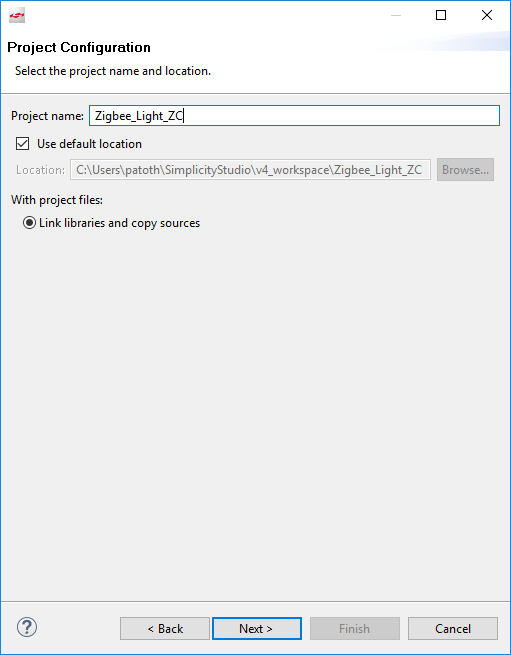
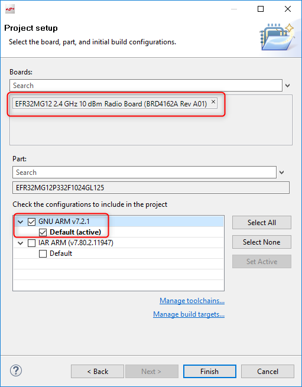
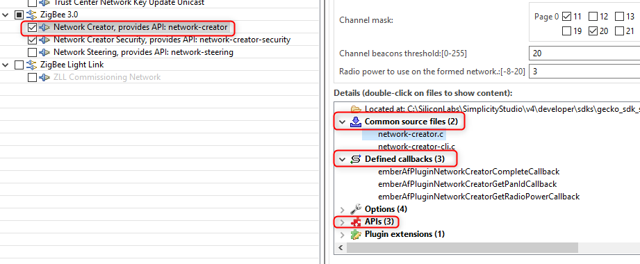
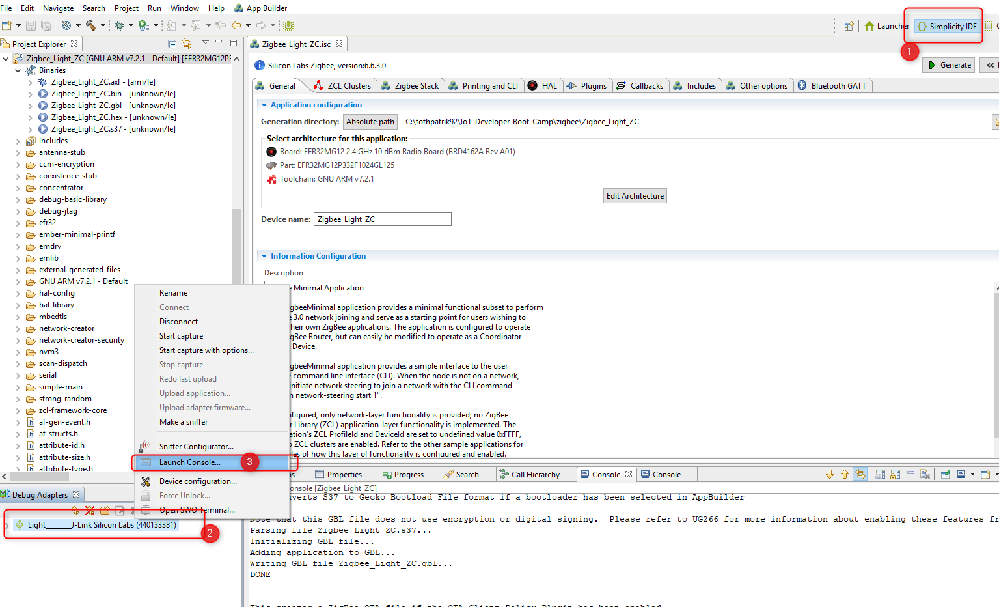
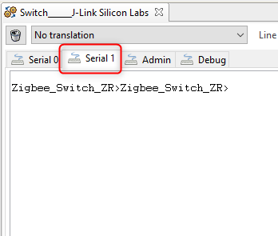

[English](Zigbee-Hands-on-Forming-and-Joining) | 中文

<details>   
<summary><font size=5>目录</font> </summary>

- [1. 简介](#1-简介)
  - [1.1. 实验内容](#11-实验内容)
  - [1.2. 目的](#12-目的)
- [2. 基本步骤](#2-基本步骤)
  - [2.1. 硬体需求](#21-硬体需求)
  - [2.2. 软件需求](#22-软件需求)
    - [2.2.1. 检查EmberZNet SDK](#221-检查emberznet-sdk)
    - [2.2.2. 检查工具链](#222-检查工具链)
    - [2.2.3. 使用Gecko Bootloader](#223-使用gecko-bootloader)
- [3. 创建Light应用程序](#3-创建light应用程序)
- [4. 烧录并测试Light应用程序](#4-烧录并测试light应用程序)
- [5. 创建Switch应用程序](#5-创建switch应用程序)
- [6. 烧录并测试Switch应用程序](#6-烧录并测试switch应用程序)
- [7.使用从install code派生的Link key在Light和Switch之间建立连接](#7使用从install-code派生的link-key在light和switch之间建立连接)
  - [7.1. 将install code烧录至Switch(路由器)设备](#71-将install-code烧录至switch路由器设备)
    - [7.1.1. install code文件的格式](#711-install-code文件的格式)
    - [7.1.2. 检查EFR32设备上的install code](#712-检查efr32设备上的install-code)
    - [7.1.3. 将install code写入EFR32设备上的制造区域](#713-将install-code写入efr32设备上的制造区域)
    - [7.1.4. 验证在EFR32设备上存储的install code](#714-验证在efr32设备上存储的install-code)
    - [7.1.5. 删除install code(不必要)](#715-删除install-code不必要)
  - [7.2. 在Light(协调器)设备上构建集中式网络](#72-在light协调器设备上构建集中式网络)
    - [7.2.1. 从install code中获取Link key](#721-从install-code中获取link-key)
    - [7.2.2. 构建集中网络](#722-构建集中网络)
    - [7.2.3. 使用派生的Link key打开网络](#723-使用派生的link-key打开网络)
  - [7.3. 将Switch(路由器)设备上加入网络](#73-将switch路由器设备上加入网络)
  - [7.4. 捕获Light(协调器)设备的网络日志](#74-捕获light协调器设备的网络日志)
    - [7.4.1. 查找Network Key和派生Link key以进行捕获](#741-查找network-key和派生link-key以进行捕获)
    - [7.4.2. 将Network Key和派生Link key添加到Network Analyzer](#742-将network-key和派生link-key添加到network-analyzer)
    - [7.4.3. 开始在Light(协调器)设备上捕获](#743-开始在light协调器设备上捕获)
    - [7.4.4. Network Analyzer捕捉的入网过程](#744-network-analyzer捕捉的入网过程)
- [8. 结论](#8-结论)

</details>


***
## [点击这里观看视频课程][video-tutorial]

# 1. 简介
我们提供了基于EmberZnet Stack 6.6.4来创建、编译和运行Zigbee 3.0应用程序的分步操作指南。如果将来使用的是更高版本，则尽管此处可能有未预料到的细微差别，但大多数说明仍适用。  
这些实验可帮助您熟悉EmberZNet Stack中的ZigBee 3.0的实现、Simplicity Studio v4开发环境以及带有EFR32MG12 SoC的无线入门套件（WSTK）。我们假定您有WSTK和这些软件(Simplicity Studio and EmberZnet SDK)。  

## 1.1. 实验内容
Zigbee快速入门——新兵训练营系列培训的实验环节将涵盖以下四个部分。我们通过这四个部分来向大家逐步展示，如何从零开始构建一个Zigbee应用。  

本文档中的实验是“Zigbee快速入门——新兵训练营”系列中的第一部分。  
-   **第一部分，由Light构建网络，并使用install code将Switch加入到这个网络。**  
-  	第二部分，在设备上使用API发送，接收和处理On-Off命令。  
-   第三部分，在Switch端用一个周期事件来执行自定义代码，在我们的实验中是控制LED闪烁。  
-   第四部分，在Switch端使用非易失性存储器来存储自定义数据。  

## 1.2. 目的
本教程将全面介绍如何从头开始构建Light和Switch设备。在实验结束时，用户将熟悉Simplicity Studio，SoC正常工作的基本需求，SDK 源码框架。  

本实验中，我们将使用BRD4162A (EFR32MG12)开发板来构建一个包含两个设备的网络。  
* 其中之一是Light。由于已实现的网络是集中式的，因此它将充当网络的Coordinator和Trust Center。该设备构建并打开网络，允许其他设备加入，并管理安全密钥。
* 另一个设备是Switch。它加入到打开的网络，并向Light发送开-关命令。   

下图说明了该实验的流程。  

<div align="center">
    
</div>  
</br>  

*** 

# 2. 基本步骤
在开始实验之前需要作一些基本的确认，保证硬件平台及软件环境都已经准备就绪，以避免在开发过程中出现不必要的问题。  
实际上，Zigbee快速入门——新兵训练营系列培训的预备知识已在[Zigbee预备课程](Zigbee-Preparatory-Course-CN)中进行了记录，我们仅在此处再次强调一些内容以确保开发环境已经准备就绪。  

## 2.1. 硬体需求
* 2个无线入门套件 (WSTK) 主板
* 2个EFR32MG12无线板（BRD4162A）  
或者 
* 2个Thunderboard Sense 2开发板(BRD4166A)

## 2.2. 软件需求
确保已在PC上安装了最新的EmberZNet SDK（在本文撰写时为v6.6.4）和兼容的GCC工具链。 

### 2.2.1. 检查EmberZNet SDK
1. 启动Simplicity Studio v4。 
2. 转到Windows ->Preference -> Simplicity Studio-> SDK，确保已安装“ EmberZNet 6.6.4”。
它是Gecko SDK Suite 2.6.4的一部分，因此并不单独出现。请参见下面的图2-1。
<div align="center">
    
</div>  
<div align="center">
  <b>图2-1 检查已安装的EmberZNet SDK</b>
</div>  

### 2.2.2. 检查工具链
1.	转到Windows->Preference -> Simplicity Studio->工具链，确保已安装GCC工具链。  
在构建项目时所使用的工具链版本应当与构建SDK附带的库文件的工具链版本相同。用户可以在[此处](https://www.silabs.com/community/software/simplicity-studio/knowledge-base.entry.html/2018/08/22/gecko_sdk_suite_tool-qlc4)找到正确的工具链-SDK对应关系。请参见下面的图2-2。

<div align="center">
    
</div>  
<div align="center">
  <b>图2-2 检查工具链</b>
</div>  

### 2.2.3. 使用Gecko Bootloader
Bootloader是存储在预留的闪存中的一段程序，可以初始化设备，更新固件image并可能执行某些完整性检查。如果发现应用程序没有运行，请检查是否有正确烧录Bootloader，因为缺少Bootloader会导致程序无法运行。  
**注意**: 在本系列实验的开始，强烈建议对设备用Gecko SDK随附的预编译的Bootloader image进行烧录。应当用“ -combined”结尾的image（例如，bootloader-storage-internal-single-combined.s37）烧录，这个image包含Gecko Bootloader的第一和第二阶段。该image可以在如下位置找到```c:\SiliconLabs\SimplicityStudio\v4\developer\sdks\gecko_sdk_suite\v2.6\platform\bootloader\sample-apps\bootloader-storage-internal-single\efr32mg12p332f1024gl125-brd4162a\```    

想知道有关如何将Gecko Bootloader添加到Zigbee项目的更多信息，请阅读[Zigbee预备课程](#223-使用gecko-bootloader)。   
**提示**: 有关Gecko Bootloader的更多信息，请参见下面的文档。    
[UG266: Silicon Labs Gecko Bootloader User's Guide](https://www.silabs.com/documents/public/user-guides/ug266-gecko-bootloader-user-guide.pdf)      
[UG103.6: Bootloader Fundamentals](https://www.silabs.com/documents/public/user-guides/ug103-06-fundamentals-bootloading.pdf)      
[AN1084: Using the Gecko Bootloader with EmberZNet and Silicon Labs Thread](https://www.silabs.com/documents/public/application-notes/an1084-gecko-bootloader-emberznet-silicon-labs-thread.pdf)    

*** 

# 3. 创建Light应用程序
完成上述步骤后，是时候实现Light设备的第一个功能了。如前所述，Light应该能够构建并打开网络。  
AppBuilder将用于创建应用程序。Appbuilder是一个交互式GUI工具，允许开发人员创建和配置其大部分Zigbee应用程序。  
在开始创建项目之前，建议在Simplicity Studio的主界面左侧，选择相应的目标板。它有助于AppBuilder识别目标设备，并自动应用与硬件相应的正确配置（外围设备，引脚）。  

1.	转到File ->New ->Project。这将显示“New Project”。请参阅下面的图3-1。
<div align="center">
    
</div>  
<div align="center">
  <b>图3-1 打开AppBuilder</b>
</div>  
</br>  

2.	选择“ Silicon Labs Zigbee”。点击“ Next”。请参阅图3-2。
<div align="center">
    
</div>  
<div align="center">
  <b>图3-2 选择协议栈</b>
</div>  
</br>  

3.	选择“ EmberZNet 6.6.x GA SoC 6.6.x.0”。点击“ Next”。参见图3-3。 
<div align="center">
    
</div>  
<div align="center">
  <b>图3-3 选择协议栈版本和SoC应用程序类型</b>
</div>  
</br>  

4.	选择“ ZigbeeMinimal”示例应用程序。点击“ Next”。请参阅图3-4。  
    **ZigbeeMinimal**: 这是一个Zigbee最小应用程序，适合作为新应用程序开发的起点。
<div align="center">
    
</div>  
<div align="center">
  <b>图3-4 选择Zigbee最小应用程序</b>
</div>  
</br>  

5.  将您的项目命名为“ Zigbee_Light_ZC”，然后单击“ Next”。请参阅图3-5。 
<div align="center">
    
</div>  
<div align="center">
  <b>图3-5 为项目命名</b>
</div>  
</br>  

6.	在下一个窗口（项目设置）中，仔细检查板子是否为BRD4162A，如果不是，则可以手动进行更正。如果使用的是Thunderboard sense2 请选择BRD4166A。并且还要检查编译器是“ GNU ARM v7.2.1”。单击完成。请参见图3-6。
<div align="center">
    
</div>  
<div align="center">
  <b>图3-6A 检查开发板和编译器</b>
</div>  
</br>  
<div align="center">
    
</div>  
<div align="center">
  <b>Figure 3‑6B 检查开发板和编译器(Thunderboard)</b>
</div>  
</br>  

7.	设置“ Zigbee_Light_ZC”项目。   
**注意**: 如果使用Thunderboard Sense 2，则需要配置UART流控模式，将其从默认模式（硬件流控）更改为软件流控。 要进行配置，请双击“ brd4166a_efr32mg12p332f1024gl125.hwconf”文件， 然后。
* 点击 DefaultMode Peripherals 
* 点击 USART0
* 将 flow control mode 从 USART-based CTS/RTS 改为 Xon-Xoff。请参见图3-7。

<div align="center">
    
</div>  
<div align="center">
  <b>Figure 3-7 配置UART流控方式（Thunderboard）</b>
</div>  
</br> 
如果使用BRD4162A，请忽略上面的UART流控制配置步骤。   

此时，项目被放置在默认的工作空间目录中，但是大多数源文件都缺失。这些文件稍后将根据AppBuilder设置进行链接或生成。    
要打开AppBuilder，请双击“ Zigbee_Light_ZC.isc”文件。文件中有多个选项卡，让我们仔细看看每个选项卡。

**General**  
此页面提供有关当前项目配置的信息，其路径，以及显示所选工具链和电路板的信息。  
**注意**: 如果需要更改工具链或者开发板信息，我们建议重新创建一个新的项目，而不是修改当前项目的设置。  

**ZCL Clusters**  
ZCL配置是最重要的设置之一。设备的类型基于其Cluster和属性。Silicon Labs预定义了大多数可用的设备类型。在我们的教程中，Light是一种“ HA Light On / Off Light”类型的设备。要为Light启用所有必需的Cluster和属性，请单击“ ZCL device type”下拉菜单，然后选择“ HA Light On / Off Light”模板。请参阅图3-8。
<div align="center">
    
</div>  
<div align="center">
  <b>图3-8 选择ZCL设备类型</b>
</div>  
</br>  

选择模板后，新启用的cluster和属性将显示在列表中，此外，endpoint的配置也会相应被更改。这些设置是基于Zigbee规范来应用的。

**注意**: 值得一提的是，对于网络创建和开放，ZCL并不是强制需要的。此步骤是为实验二的接收和处理On-Off命令作准备。  
**注意**: 用户无法修改这些模板，因此，如果需要添加任何其他Cluster，则应使用“ ZigBee Custom ..”。

**Zigbee Stack**  
此选项卡可用于更改设备的类型。由于路由器设备无法构建集中式网络，因此必须选择“Coordinator or Router”类型，并保持默认的“ Zigbee 3.0 Security”设置。请参阅图3-9。
<div align="center">
    
</div>  
<div align="center">
  <b>图3-9 将设备类型更改为协调器</b>
</div>  
</br>  

其余设置请保持默认值，因为该设备在具有基本Cluster的单一网络上运行。

**Printing and CLI**  
通常，在此实验中，默认设置已经可以满足基本的要求。唯一要做的就是确认“Enable debug printing”框已启用，然后选择“On off cluster”调试打印以获取更多信息。参见图3-10。
<div align="center">
    
</div>  
<div align="center">
  <b>图3-10 调试打印</b>
</div>  
</br>

**注意**: “On off cluster”调试打印功能也是为第二次实验服务的。

**HAL**  
此选项卡很少修改。可以使用它作一些硬件配置，并更改Bootloader类型。在本实验中，无需在此选项卡上执行任何操作。 

**Plugins**  
插件是实现功能的单独软件包。插件也可以包含库和源文件。这些文件被收集在此选项卡上，设备类型的选择不会自动过滤掉设备无法使用的插件，因此必须手动完成。例如，此示例应用程序未启用用于网络构建/打开的必要插件，我们需要手动选择。  
必须添加或删除以下插件，以将当前设备设置为协调器设备。请参阅图3-11，了解如何在Appbuilder中启用插件。  
请注意，下面提到的插件是完成本实验的最低需求，但是，不足以使“协调器/路由器”和“路由器”设备通过Z3认证。对于Z3认证，请参阅 Z3LightSoc和 Z3SwitchSoc示例以获取必要的插件。  

该**Network Creator**和 **Network Creator Security** 插件实现网络构建开放的功能，因此，这些都要求有。  
该**Network Steering**和**Update TC Link Key**可以被移除，因为设备不会主动加入到其它任何网络。  
该**ZigBee PRO Stack Library**包含协议栈。它包含路由，联网，扫描，邻居，子设备管理和其他功能。该插件对于协调器和路由器是必需的。示例应用程序默认已经包含此插件。  
该**Security Link Keys library**提供APS link key的管理。Trust Center（协调器）使用它来管理网络中设备的link key，非Trust Center 设备也可以使用它来管理partner link keys。因此，在本实验中，该插件是必须的。  
该**Serial**用于实现命令行（CLI）。如果在项目创建阶段已经有正确选择开发板，那么该插件的的默认GPIO引脚的设置将会与开发板相匹配，当然再次确认设置是否正确也很重要。本实验中，我们通过USB Mini-B接口与PC连接器，以使用开发板上的虚拟串口（VCOM）。该虚拟COM端口，必须从插件中单独启用。稍后将详细介绍。  
<div align="center">
    
</div>  
<div align="center">
  <b>图3-11 插件</b>
</div>  
</br>

**综上所述，下表列出了Light(协调器)节点上所涉及到的插件。**  

<div align="center">
    
</div>  
<div align="center">
  <b>表3.1 检查相应的插件</b>
</div>  
</br>  

在继续介绍之前，我们在这里花费少量的篇幅来说明如何找到有关插件的更多信息。如上所述，某些插件具有源文件，而不仅仅只是预编译的库文件。可以通过查看这些源文件，以了解其内部工作的一些详细信息。头文件和源文件位于“ C:\SiliconLabs\SimplicityStudio\v4\developer\sdks\gecko_sdk_suite\v2.6\protocol\zigbee\app\framework” 目录下的“ plugin”，“ plugin-soc”和“ plugin-host” 文件夹。这几个不同的文件夹用来区分通用的、及专门用于SoC或Host的插件。

从AppBuilder中也可以获取到这些信息，同时，它还提供了一些额外的信息，例如该插件所定义和实现的callback和API。请参阅图3-12。  
<div align="center">
    
</div>  
<div align="center">
  <b>图3-12 插件详细信息</b>
</div>  
</br>  

**Callbacks**  
回调是用于实现应用层功能的一系列函数。其中一些与插件相关，而另外一些可以不受限制地使用。该选项卡是根据先前的“ 插件和ZCL Cluster”选项卡动态更改的。这意味着仅当启用了相应的plugins或cluster时，某些回调函数才是可见/可用的。  
本实验中，基本的网络构建和开放功能无需使用任何回调。在后续的实验中将使用到。

**Includes**  
项目特定的宏和路径在此处定义。除非用户将使用任何自定义token或事件，否则不应对其进行修改。我们将在后续的实验中使用到。

**Other options**  
如果使用双频段功能，才会使用到此项高级设置。在此项目中未使用它。

**Bluetooth GATT**  
Zigbee-BLE动态多协议蓝牙支持的配置器位于AppBuilder中。  
**注意**：本项目中不使用此选项卡。某些BLE相关的插件使能之后，该选项卡才可编辑。

8. 保存.isc文件的修改，现在可以生成项目文件并链接必要的SDK源和库。  
按下Appbuilder右上方的Generate按钮。
“Generation successful!”表示已创建了所有必需文件。请参阅图3-13。
<div align="center">
    
</div>  
<div align="center">
  <b>图3-13 生成结果</b>
</div>  
</br>  

按下编译 （Build）按钮。成功编译后，二进制文件应显示在“ Binaries”目录中。 

*** 

# 4. 烧录并测试Light应用程序  
让我们将Zigbee_Light_ZC.s37文件烧录到开发板，如下所示。请参阅图4-1和图4-2。  
**注意**: 请在执行以下步骤之前执行“Erase擦除”过程，以避免设备中存在旧的网络设置影响到实验的结果。  
<div align="center">
    
</div>  
<div align="center">
  <b>图4-1 Open Flash编程器</b>
</div>  
</br>  

<div align="center">
    
</div>  
<div align="center">
  <b>图4-2 烧录image</b>
</div> 
</br>  

高亮显示的“ Advanced Settings ..”提供了多种芯片烧录的方式。你可以选择在烧录文件之前部分擦除（页面擦除）或完全擦除（完全擦除），或者合并写入。  
请记住，这两种擦除类型都不会清除EFR32MG12芯片的bootloader部分，但是完全擦除会删除token区域。
烧录image后，就可以与设备进行通讯了。为此，请右键点击并启动控制台，该控制台是Studio中的内置串行控制台。请参阅图4-3。  
<div align="center">
    
</div>  
<div align="center">
  <b>图4-3 打开串行控制台</b>
</div>  
</br>  

如果打开了串行控制台，请切换到“ Serial 1”，然后按“ Enter”。请参见图4-4。 
<div align="center">
    
</div>  
<div align="center">
  <b>图4-4 选择“Serial 1”选项卡</b>
</div>  
</br>  

“ \ n \ r”字符触发项目名称的打印。此基本测试表明CLI的RX和TX正常工作。  
在完成该步骤之后，我们来继续创建Switch。

*** 

# 5. 创建Switch应用程序
在本实验中，Switch将加入由Light创建并打开的网络。  
AppBuilder的项目创建和配置方式与Light应用程序相同，因此本章所包含的图片说明要比Light章节少一些。  
该项目还基于“ ZigBeeMinimal”示例应用程序，因此请
1.  重复[创建Light应用程序](#3-创建Light应用程序)一章的步骤1-6 ，除了将项目命名为“ Zigbee_Switch_ZR”。   
2.	打开项目的.isc文件。  
   *    转到*ZCL Cluster*选项卡，然后选择**HA On/Off Switch**设备模板。 
   *    转到*Zigbee Stack*选项卡，然后从下拉菜单中选择**Router**设备类型。
   *    转到*Printing and CLI*选项卡，然后仔细检查“ Enable debug printing”是否已打开。 
   *    转到*Plugins*选项卡，然后仔细检查以下插件是否已启用  
      -   Serial  
      -   Network Steering  
      -   Update TC Link Key  
      -   Install code library

Light应用程序和Switch应用程序之间的主要区别是网络相关插件的选择。让我们仔细看看启用的插件。  
请注意，下面提到的插件是完成本实验的最低需求，但是，不足以使“协调器/路由器”和“路由器”设备通过Z3认证。对于Z3认证，请参阅Z3LightSoc和Z3SwitchSoc示例以获取必要的插件。

该**Serial** 已经在Light中讨论。对CLI必需的。  
该**Network Steering**插件，用来发现已启用信道中的网络。设备发出“Beacon Request”消息并监听响应。如果收到带有的“permit association”标志的Beacon response（来自ZC或ZR），则设备将开始网络的加入过程，否则继续扫描。有关推荐和必需的插件，请参见下面的表5.1。  
该**Update TC Link Key**用于从Trust Center请求新的APS Link Key。在Switch端需要启用它，因为网络的创建者Light（Trust Center）已经有启用Security Link Keys Library。  
在**Install code library**根据设备中的install code制造token提供初始链接密钥。它根据ZigBee规范，通过哈希算法得到该密钥。 


**综上所述，下表列出了Switch(路由器)节点上所涉及的插件。**  

<div align="center">
    
</div>  
<div align="center">
  <b>表5.1 检查相应的插件</b>
</div>  
</br>  

3.	按Generate按钮
4.	编译项目

*** 

# 6. 烧录并测试Switch应用程序
请重复[烧录并测试Light应用程序](#4-烧录并测试Light应用程序) 一章中的步骤，并测试Switch应用程序是否正常工作。参见图6-1。
<div align="center">
    
</div>  
<div align="center">
  <b>图6-1 CLI测试</b>
</div>  

*** 

# 7.使用从install code派生的Link key在Light和Switch之间建立连接
本章介绍如何构建网络并加入其中。设备之间的通信将由Network Analyzer工具捕获。本部分将使用install code。install code用于创建预配置的Link key。install code通过使用AES-MMO哈希算法转换为Link key，派生的Zigbee Link key仅被Trust Center和加入网络的设备知道。因此，Trust Center可以使用该密钥将ZigbeeNetwork Key安全地传输到设备。设备拥有Network Key后，就可以在网络层与Zigbee网络通信。

## 7.1. 将install code烧录至Switch(路由器)设备
要将install code烧录到Switch设备中，您需要先创建一个文本文件，并将install code的值保存在其中，然后使用Simplicity Commander将install code写入Switch节点的MFG token区域。  
为了节省您的时间，我们准备了如下的批处理文件，该文件可以自动完成install code的烧录。创建一个批处理文件（例如，[program_install_code.bat](files/ZB-Zigbee-Hands-on-Forming-and-Joining/program_install_code.bat)），使用任何文本编辑器打开它，将下面的内容复制并粘贴到该文件中，保存并执行以烧录install code。

```
@echo off

:: THIS FILE IS USED FOR PROGRAMMING INSTALLATION CODE AUTOMATICALLY.

:: use PATH_SCMD env var to override default path for Simplicity Commander
if "%PATH_SCMD%"=="" (
  set COMMANDER="C:\SiliconLabs\SimplicityStudio\v4\developer\adapter_packs\commander\commander.exe"
) else (
  set COMMANDER=%PATH_SCMD%\commander.exe
)

:: default file extension of GCC and IAR
set DEFAULT_INSTALL_CODE="83FED3407A939723A5C639B26916D505"

:: change the working dir to the dir of the batch file, which should be in the project root
cd %~dp0

if not exist "%COMMANDER%" (
  echo Error: Simplicity Commander not found at '%COMMANDER%'
  echo Use PATH_SCMD env var to override default path for Simplicity Commander.
  pause
  goto:eof
)

echo **********************************************************************
echo Program the default installation code to the specified device
echo 1. Erase the Installation Code if existing
echo 2. Program the Installation Code into the Manufacturing Area of the specified Device
echo 3. Check the Stored Installation Code
echo **********************************************************************
echo.
%COMMANDER% flash --tokengroup znet --token "Install Code: !ERASE!"
echo.
%COMMANDER% flash --tokengroup znet --token "Install Code:%DEFAULT_INSTALL_CODE%"
echo.
%COMMANDER% tokendump --tokengroup znet --token TOKEN_MFG_INSTALLATION_CODE

pause
```

以下是执行批处理文件的结果。
<div align="center">
    
</div>  
<div align="center">
  <b>Figure 7‑1 烧录Install Code</b>
</div>  
</br>  

**注意**: 以下各节（默认情况下不可见，单击标题以查看详细信息）详细描述了如何对install code进行编程，如果您不想花很多时间在那上面，则可以跳过它并转到 [7.2 在Light(协调器)设备上构建集中式网络](#72-在light协调器设备上构建集中式网络)。 

<details>
<summary><font size=5>显示/隐藏 关于如何烧录installation code的更多细节（不作要求）</font> </summary>


### 7.1.1. install code文件的格式
要对install code进行编程，请创建一个带有install code值的文本文件（不带CRC）。在这些示例中，文件名为```install-code-file.txt```.     
该文件的格式如下：
```
Install Code: <ascii-hex>
```

这是示例install code文件。该代码的CRC为0xB5C3，不包含在文件中。 
```
Install Code: 83FED3407A939723A5C639B26916D505
```

### 7.1.2. 检查EFR32设备上的install code
首先，最好验证与要编程的设备之间的连接，以及当前在节点上存储了哪些信息。  
为此，请确保仅将**Switch**设备连接到PC（否则将弹出一个新对话框，以选择正确的设备），然后执行以下命令以从EFR32设备读取所有制造token数据。该```tokendump```命令将制造token数据打印为键值对。Simplicity Commander支持不止一组token。在此示例中，使用了名为“ znet”的token组。  
```
$ C:\SiliconLabs\SimplicityStudio\v4\developer\adapter_packs\commander\commander.exe tokendump --tokengroup znet
```

如果您之前没有编写install code，则应该看到以下输出，其中下面突出显示区域中的代码反映了与install code相关的重要字段：  
**注意**：如果该```commander```命令在PowerShell控制台上不可用，请检查是否您已经正确安装了Commander，并确保commander.exe包含在以下目录中。  
```
C:\SiliconLabs\SimplicityStudio\v4\developer\adapter_packs\commander
```
<div align="center">
    
</div>  
<div align="center">
  <b>Figure 7‑2 查看Install Code</b>
</div>  
</br>  

### 7.1.3. 将install code写入EFR32设备上的制造区域
要将install code写入Switch节点的制造区域，请执行以下命令：
```
$ C:\SiliconLabs\SimplicityStudio\v4\developer\adapter_packs\commander\commander.exe flash --tokengroup znet --tokenfile install-code-file.txt
```
您应该看到类似于以下内容的输出：  
<div align="center">
    
</div>  
<div align="center">
  <b>Figure 7‑3 烧录Install Code</b>
</div>  

### 7.1.4. 验证在EFR32设备上存储的install code
编写install code后，最好再次执行以下命令来验证信息：
```
$ C:\SiliconLabs\SimplicityStudio\v4\developer\adapter_packs\commander\commander.exe tokendump --tokengroup znet
```
<div align="center">
    
</div>  
<div align="center">
  <b>Figure 7‑4 验证已烧录的Install Code</b>
</div>  

### 7.1.5. 删除install code(不必要)
**注意**: 在本实验中，通常无需执行此步骤，除非您需要更新已烧录的install code。 
如果要从刚烧录的设备中删除install code，只需创建具有以下内容的install code文件，然后执行命令以将该文件烧录到目标设备中。
```
Install Code: !ERASE!
```
</details>  

## 7.2. 在Light(协调器)设备上构建集中式网络
### 7.2.1. 从install code中获取Link key
要从install code中获取Link key，并将其存储到Light（作为集中式网络的Trust Center）上的Link key表中，请输入以下命令：
```
option install-code <link key table index> {<Joining Node's EUI64>} {<16-byte install code + 2-byte CRC>}
```
例如：
```
option install-code 0 {00 0B 57 FF FE 64 8D D8} {83 FE D3 40 7A 93 97 23 A5 C6 39 B2 69 16 D5 05 C3 B5}
```

* 第一个参数是Link key Table Index。
* 下一个参数是加入节点的EUI64（在此示例中，其为**Switch**节点）。您可以通过```info```在Switch节点上运行CLI 命令并查找类似于的字符串来找到此信息```node [(>)000B57FFFE648DD8]```。

<div align="center">
    
</div>  
<div align="center">
  <b>Figure 7‑5 查看设备的EUI</b>
</div>  
</br>

* 最后一个参数是在末尾附加2字节CRC的install code。您可以自己计算CRC，也可以简单地从批处理文件执行的输出中找出，其中的命令 ```$ commander tokendump --tokengroup znet```

<div align="center">
    
</div>  
<div align="center">
  <b>Figure 7‑6 获取Install Code的CRC</b>
</div>  
</br>

CRC显示在install code的正下方，并以小端格式打印。 **在将其用作选项install-code CLI的参数之前，将字节反转为大端格式**.    

要查看是否成功添加了Link key，请在**Light**节点的CLI上输入```keys print```，以在“Link key表”（或v6.7.0 EmberZNet SDK之后的“Transient Key Table”）中查看它。这显示了从install code派生的Link key和Network Key。
<div align="center">
    
</div>  
<div align="center">
  <b>Figure 7‑7 查看Link Key</b>
</div>  
</br>

如上所示，派生的Link key为： 
```
66 B6 90 09 81 E1 EE 3C  A4 20 6B 6B 86 1C 02 BB 
```

### 7.2.2. 构建集中网络
在Light节点上，使用以下命令构建具有Zigbee 3.0安全性的集中式网络。  
```
plugin network-creator start 1
```
之后，请检查网络的Pan ID，它将用于识别网络。
```
network id
```
<div align="center">
    
</div>  
<div align="center">
  <b>Figure 7‑8 查看Pan ID</b>
</div>  
</br>

### 7.2.3. 使用派生的Link key打开网络
现在，在Trust Center上设置临时Link key（与从install code获得的链接相同），并打开网络来加入设备的EUI64：
```
plugin network-creator-security open-with-key {eui64} {linkkey}
```
例如： 
```
plugin network-creator-security open-with-key {00 0B 57 FF FE 64 8D D8} {66 B6 90 09 81 E1 EE 3C A4 20 6B 6B 86 1C 02 BB}
```

## 7.3. 将Switch(路由器)设备上加入网络
在Switch节点上，输入以下CLI以使用“Network Steering”插件加入网络：
```
plugin network-steering start 0
```
并且串行控制台将输出类似以下内容，以指示Switch节点已成功加入网络0x220E。 
<div align="center">
    
</div>  
<div align="center">
  <b>Figure 7‑9 入网</b>
</div>  
</br>

## 7.4. 捕获Light(协调器)设备的网络日志
本章介绍如何通过Network Analyzer工具捕获设备之间的通信。 

### 7.4.1. 查找Network Key和派生Link key以进行捕获
Network Key是分析网络日志所必需的，您可以使用以下命令在协调器端获取Network Key。 

命令:  
```
keys print
```

结果:  
```
EMBER_SECURITY_LEVEL: 05
NWK Key out FC: 00000057
NWK Key seq num: 0x00
NWK Key: C1 05 57 73 1A 09 83 71  77 C3 22 B7 E1 90 9A A1  
Link Key out FC: 00000006
TC Link Key
Index IEEE Address         In FC     Type  Auth  Key
-     (>)000B57FFFE648D95  00000000  L     y     A8 ED 49 FB C5 13 FA 64  E5 60 D1 76 13 FD B8 6A  
Link Key Table
Index IEEE Address         In FC     Type  Auth  Key
0     (>)000B57FFFE648DD8  00001002  L     y     66 B6 90 09 81 E1 EE 3C  A4 20 6B 6B 86 1C 02 BB  
1/6 entries used.
Transient Key Table
Index IEEE Address         In FC     TTL(s) Flag    Key    
0 entry consuming 0 packet buffer.
```

### 7.4.2. 将Network Key和派生Link key添加到Network Analyzer
将Network Key```C1 05 57 73 1A 09 83 71 77 C3 22 B7 E1 90 9A A1```和派生的Link key```66 B6 90 09 81 E1 EE 3C A4 20 6B 6B 86 1C 02 BB```添加到Network Analyzer的密钥存储中，以便能够解码消息。  

1.	打开Window->Preferences
<div align="center">
    
</div>  
<div align="center">
  <b>Figure 7‑10 设置</b>
</div>  
</br>  

2.	确保将Network Analyzer设置为解码正确的协议。选择Window >Preferences>Network Analyzer >Decoding > Stack Versions，并验证其设置是否正确。如果需要更改它，请单击正确的协议栈，单击“Application”，然后单击“Yes”。
<div align="center">
    
</div>  
<div align="center">
  <b>Figure 7‑11 选择正确的协议栈</b>
</div>  
</br>  

3.	导航到Network Analyzer->Decoding->安全Security Keys，然后添加Network Key。参见下图。

<div align="center">
    
</div>  
<div align="center">
  <b>Figure 7‑12 添加network key</b>
</div>  
</br>  

4.	重复最后一步，将派生的Link key添加到列表中。 

### 7.4.3. 开始在Light(协调器)设备上捕获
现在，Switch应该已经加入了Light创建的网络，请首先使用**Switch**上的命令退出网络。
```
network leave
```
右键单击选择J-Link Adapter,然后点击Light-\> *Connect*（如果尚未连接）-\> *Start capture*的适配器名称。
<div align="center">
    
</div>  
<div align="center">
  <b>7-13 开始捕获</b>
</div>  
</br>  

当前视图将被自动更改为*Network Analyzer*，然后立即开始捕获。
<div align="center">
    
</div>  
<div align="center">
  <b>7-14 在Light端捕获网络数据</b>
</div>  
</br>  

然后重复步骤[使用派生的Link Key打开网络](#723-使用派生的link-key打开网络)打开网络，以及下一步[将Switch路由器设备上加入网络](#73-将switch路由器设备上加入网络)加入网络。  
捕获文件（* Live）应该显示网络上的数据包。

### 7.4.4. Network Analyzer捕捉的入网过程
Switch完成加入网络后，请停止Network Analyzer，然后通过Network Analyzer所抓取的数据来查看入网过程。参见下图。 

<div align="center">
    
</div>  
<div align="center">
  <b>7-15 Network Analyzer的加入过程</b>
</div>  
</br>  

**注意**: 日志中可能会出现很多“Many-to-One Route Discovery”。上方的绿色过滤器框可用于过滤掉这些消息。右键单击该数据包，然后单击“Show only summary: Many…..”，然后将条件从“ ==“改为“！=”。

***

# 8. 结论
在本实验中，您学习了如何从ZigbeeMinimal示例开始创建Zigbee应用程序项目。以及如何将您的应用程序配置为不同类型的Zigbee节点（协调器，路由器等），如何为不同的功能启用/禁用不同的插件以满足您的需求，以及如何构建集中式网络并加入该网络。
还演示了如何使用Network Analyzer工具来分析、评估在Zigbee网络中传输的数据。

[video-tutorial]:https://www.bilibili.com/video/BV1CT4y177HV