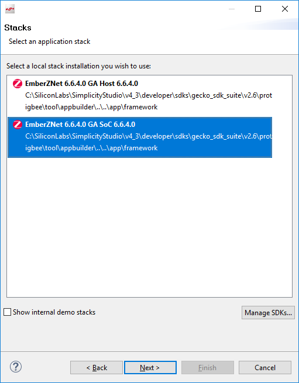
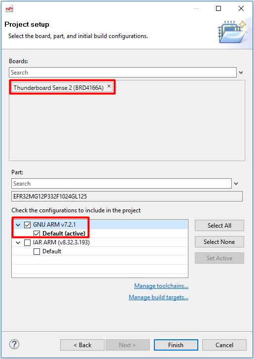
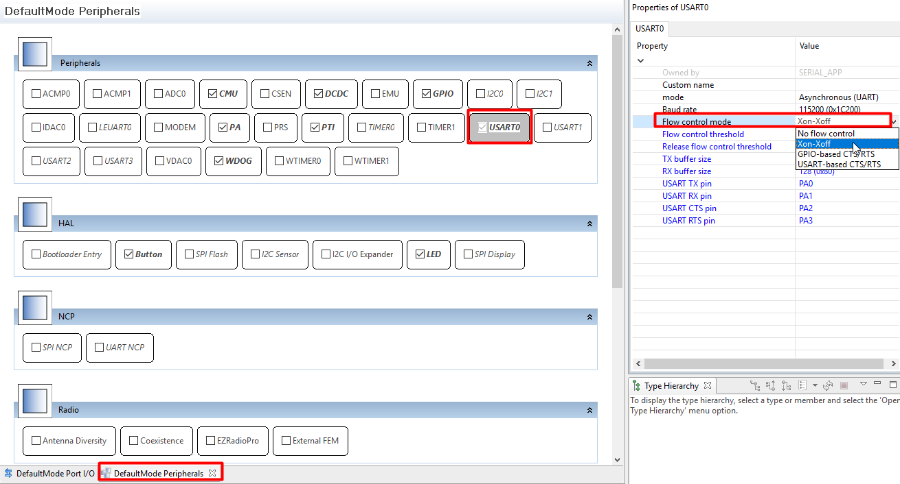
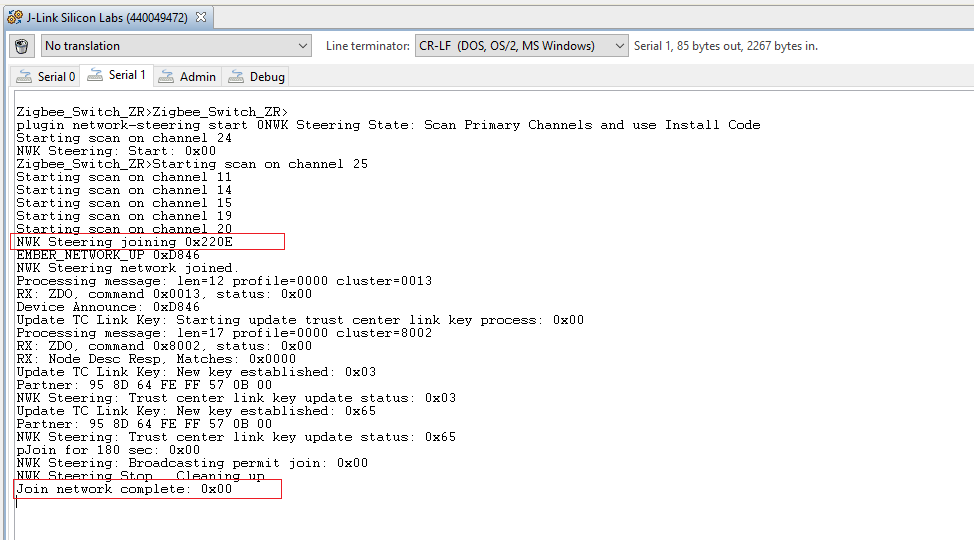
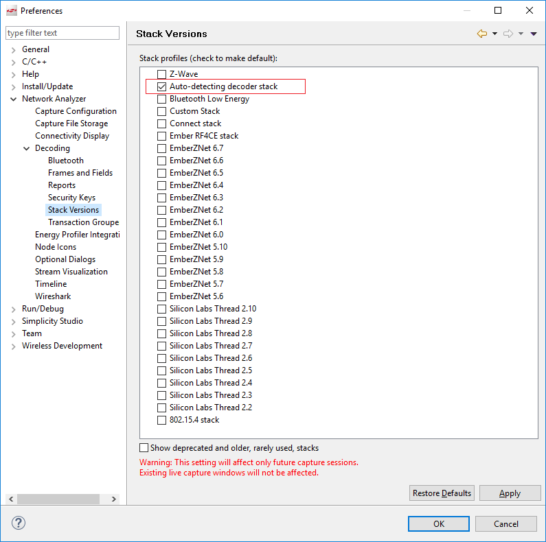

English | [中文](Zigbee-Hands-on-Forming-and-Joining-CN) 

<details>
<summary><font size=5>Table of Contents</font> </summary>

- [1. Introduction](#1-introduction)
  - [1.1. Application features](#11-application-features)
  - [1.2. Purpose](#12-purpose)
- [2. Fundamental steps](#2-fundamental-steps)
  - [2.1. Hardware Requirements](#21-hardware-requirements)
  - [2.2. Software Requirements](#22-software-requirements)
    - [2.2.1. Check EmberZNet SDK](#221-check-emberznet-sdk)
    - [2.2.2. Check Toolchains](#222-check-toolchains)
    - [2.2.3. Using Gecko Bootloader](#223-using-gecko-bootloader)
- [3. Create Light application](#3-create-light-application)
- [4. Download and test the Light application](#4-download-and-test-the-light-application)
- [5. Create Switch application](#5-create-switch-application)
- [6. Download and test the Switch application](#6-download-and-test-the-switch-application)
- [7. Establish connection between Light and Switch with an install code-derived link key](#7-establish-connection-between-light-and-switch-with-an-install-code-derived-link-key)
  - [7.1. Programming the Install Code to Switch (Router) Device](#71-programming-the-install-code-to-switch-router-device)
    - [7.1.1. Format of the Install Code File](#711-format-of-the-install-code-file)
    - [7.1.2. Checking the Install Code on an EFR32 Device](#712-checking-the-install-code-on-an-efr32-device)
    - [7.1.3. Writing the Install Code into the Manufacturing Area on an EFR32 Device](#713-writing-the-install-code-into-the-manufacturing-area-on-an-efr32-device)
    - [7.1.4. Verifying the Stored Install Code on an EFR32 Device](#714-verifying-the-stored-install-code-on-an-efr32-device)
    - [7.1.5. Erasing the Install Code (not-necessary)](#715-erasing-the-install-code-not-necessary)
  - [7.2. Form centralized network on Light (Coordinator) device](#72-form-centralized-network-on-light-coordinator-device)
    - [7.2.1. Derive a link key from the install code](#721-derive-a-link-key-from-the-install-code)
    - [7.2.2. Form centralized network](#722-form-centralized-network)
    - [7.2.3. Open the network with the derived link key](#723-open-the-network-with-the-derived-link-key)
  - [7.3. Join the network on Switch (Router) device](#73-join-the-network-on-switch-router-device)
  - [7.4. Capture the Network log on Light (Coordinator) device](#74-capture-the-network-log-on-light-coordinator-device)
    - [7.4.1. Find the Network key and Derived Link key for capturing](#741-find-the-network-key-and-derived-link-key-for-capturing)
    - [7.4.2. Add network key and Derived link key to Network Analyzer](#742-add-network-key-and-derived-link-key-to-network-analyzer)
    - [7.4.3. Start capturing on Light (Coordinator) device](#743-start-capturing-on-light-coordinator-device)
    - [7.4.4. Joining process in Network Analyzer](#744-joining-process-in-network-analyzer)
- [8. Conclusion](#8-conclusion)

</details>

***

# 1. Introduction
In this worksheet we provide a step-by-step guide to create, build and run ZigBee 3.0 applications based on EmberZNet Stack 6.6.4. If you use a later release in the future, most of the instructions should be still applied, although there could be minor differences not foreseen at the time of this document.  
These exercises help you get familiar with ZigBee 3.0 in the EmberZNet Stack, Simplicity Studio v4 development environment, and the Wireless Start Kit (WSTK) with EFR32MG12 SoC. We assume that you have a WSTK and the following software(Simplicity Studio and EmberZnet SDK).  

## 1.1. Application features
The boot camp series hands-on workshop will cover four functionalities below, and the application development is split into four steps respectively to show how an application should be built up from the beginning.  

The exercise in this documentation is the first exercise in the "Zigbee Boot Camp" series.  
-   **In the 1st phase, a basic network forming by the Light, and a joining process on the Switch will be realized by using install code.**
-   The 2nd part will prepare the devices to transmit, receive, and process the On-Off commands by using APIs.  
-   At the 3rd step the Switch will have a periodic event to execute any custom code, which will be a LED blinking in our case.  
-   The 4th thing to do is to make the Switch to be able to store any custom data in its flash by using Non-volatile memory.  

## 1.2. Purpose
This tutorial will give an overall knowledge about how to build a Light and Switch device from the scratch. For the end of the Lab, the user will be familiar with the Simplicity Studio, fundamental needs to make an SoC to work, SDK source architecture.  

The network will consist of two devices by using board of BRD4162A (EFR32MG12).  
* One of them is the Light. Since the realized network is centralized, it will work as the Coordinator and Trust Center of the network. This device forms and opens the network, permits other devices to join, and manages the security keys.  
* The other device is the Switch. It joins to the opened network and send On-Off commands to the Light.  

The figure below illustrates the working flow of this hands-on.  

<div align="center">
    
</div>  
</br>  

*** 

# 2. Fundamental steps
Before all the individual steps would be performed, it's necessary to check some basics to avoid unwanted issues during the development.  
In fact, the prerequisites of the Zigbee boot camp series training is documented in the [Zigbee Preparatory Course](Zigbee-Preparatory-Course), we just highlight some items here again to make sure that the development environment is ready on your side.  

## 2.1. Hardware Requirements
* 2 WSTK Main Development Board  
* 2 EFR32MG12 radio boards (BRD4162A) 
Or 
* 2 Thunderboard Sense 2(BRD4166A)

## 2.2. Software Requirements
Make sure you have installed the latest EmberZNet SDK (which is v6.6.4 at the time of this document) and compatible GCC toolchain on your PC.  

### 2.2.1. Check EmberZNet SDK
1. Launch Simplicity Studio v4.  
2. Go to Window -> Preference -> Simplicity Studio -> SDKs, make sure "EmberZNet 6.6.4" is installed.  
It is part of the Gecko SDK Suite 2.6.4, therefore it doesn't appear itself alone. See Figure 2‑1 below.  
<div align="center">
    
</div>  
<div align="center">
  <b>Figure 2-1 Check installed EmberZNet SDK</b>
</div>  

### 2.2.2. Check Toolchains
1. Go to Windows -> Preference -> Simplicity Studio -> Toolchains, make sure GCC toolchain is installed.  
It is important to use the same toolchain version when building your project that was used to build the libraries supplied as part of the SDK. The list of the proper toolchain-SDK pairing can be found [here](https://www.silabs.com/community/software/simplicity-studio/knowledge-base.entry.html/2018/08/22/gecko_sdk_suite_tool-qlc4). See Figure 2‑2 below.  

<div align="center">
    
</div>  
<div align="center">
  <b>Figure 2‑2 Check the Toolchain</b>
</div>  

### 2.2.3. Using Gecko Bootloader
A bootloader is a program stored in reserved flash memory that can initialize a device, update firmware images, and possibly perform some integrity checks. If the application seems to do not running, always check the bootloader, because lack of it causes program crash.  
**Note**: At the beginning of this series hands-on, it's highly recommended to program the pre-built bootloader images which comes with the Gecko SDK to the devices. The image that ends with "-combined" (e.g. bootloader-storage-internal-single-combined.s37) should be flashed, it contains the first+second stage of the Gecko Bootloader. The image can be found at  
```c:\SiliconLabs\SimplicityStudio\v4\developer\sdks\gecko_sdk_suite\v2.6\platform\bootloader\sample-apps\bootloader-storage-internal-single\efr32mg12p332f1024gl125-brd4162a\```  

For more information about how to add Gecko Bootloader to your Zigbee project, please read the [preparatory course](#223-using-gecko-bootloader).
**Hint**: More information about Gecko Bootloader, please find the documentations below.  
[UG266: Silicon Labs Gecko Bootloader User's Guide](https://www.silabs.com/documents/public/user-guides/ug266-gecko-bootloader-user-guide.pdf)  
[UG103.6: Bootloader Fundamentals](https://www.silabs.com/documents/public/user-guides/ug103-06-fundamentals-bootloading.pdf)  
[AN1084: Using the Gecko Bootloader with EmberZNet and Silicon Labs Thread](https://www.silabs.com/documents/public/application-notes/an1084-gecko-bootloader-emberznet-silicon-labs-thread.pdf)  

*** 

# 3. Create Light application
After the previous steps have been done, it's time to realize the 1st feature of the Light device. As discussed before, the Light should be able to form, and open the network.  
The AppBuilder will be used for creating the application. Appbuilder is an interactive GUI tool that allows developers to create and configure most of their Zigbee application.  
Before the builder would be opened, I recommend to select the target board on the left side of the Launcher view. It helps to the AppBuilder to recognize the target device, thus the proper board related configurations (peripherals, pins) are automatically applied.  

1. Go to File -\> New -\> Project. This will bring up the New Project Wizard. See the Figure 3‑1 below.  
<div align="center">
    
</div>  
<div align="center">
  <b>Figure 3‑1 Open AppBuilder</b>
</div>  
</br>  

2. Select "Silicon Labs Zigbee". Click Next. See Figure 3‑2.  
<div align="center">
    
</div>  
<div align="center">
  <b>Figure 3‑2 Select the stack type</b>
</div>  
</br>  

3. Select "EmberZNet 6.6.x GA SoC 6.6.x.0". Click Next. See Figure 3‑3.  
<div align="center">
    
</div>  
<div align="center">
  <b>Figure 3‑3 Select stack version and SoC application type</b>
</div>  
</br>  

4. Choose the "ZigbeeMinimal" sample application. Click Next. See Figure 3‑4.  
    **ZigbeeMinimal**: This is a Zigbee minimal application suitable as a starting point for new application development.  
<div align="center">
    
</div>  
<div align="center">
  <b>Figure 3‑4 Select ZigbeeMinimal sample application</b>
</div>  
</br>  

5. Name your project to "Zigbee_Light_ZC" and then Click Next. See Figure 3‑5.  
<div align="center">
    
</div>  
<div align="center">
  <b>Figure 3‑5 Name the project</b>
</div>  
</br>  

6.  In next window (Project Setup), double check the board is BRD4162A, if not, you can correct it manually. If you use Thunderboard Sense 2, please choose BRD4166A.  And also check the compiler is "GNU ARM v7.2.1". Click Finish. See Figure 3‑6.  
<div align="center">
    
</div>  
<div align="center">
  <b>Figure 3‑6A Check the board and compiler</b>
</div>  
</br> 
<div align="center">
    
</div>  
<div align="center">
  <b>Figure 3‑6B Check the board and compiler for Thunderboard</b>
</div>  
</br>  

7. Configure the "Zigbee_Light_ZC" project.  
**Note**: If you use Thunderboard Sense 2, you need to configure the UART flow control mode, change it from default mode(hardware flow control) to software flow control. To configure it, click double to the "brd4166a_efr32mg12p332f1024gl125.hwconf" file, then.
* Click DefaultMode Peripherals Tab
* Click USART0
* Change flow control mode from USART-based CTS/RTS to Xon-Xoff. See Figure 3-7. 

<div align="center">
    
</div>  
<div align="center">
  <b>Figure 3-7 configure_flow_control for Thunderboard</b>
</div>  
</br> 

If you use BRD4162A, please ignore the UART flow control configuration above.   

At this point the project is placed into the default workspace directory, but most of the source files are missing. These files will be later linked or generated according to the AppBuilder settings.  
To open the AppBuilder, click double to the "Zigbee_Light_ZC.isc" file. There are multiple tabs in the file, let's have a closer look at each tab.  

**General**  
This page gives information about the current project configuration, its path, furthermore, shows the selected toolchain and board. Nothing to do with this tab. 
**Note**: It's important to mention that in case of changing the toolchain or the board, please always create a new project rather than modify the project settings.  

**ZCL Clusters**  
One of the most important setting is the ZCL configurations. The type of the device is based on its clusters and attributes. The Silicon Labs pre-defined most of the available device types. In our tutorial it's a "HA Light On/Off Light" kind of device. To enable all the mandatory clusters and attribute for a Light, click on the "ZCL device type" dropdown menu, then select "HA Light On/Off Light" template. See Figure 3-8.  

<div align="center">
    
</div>  
<div align="center">
  <b>Figure 3-8 Select ZCL device type</b>
</div>  
</br>  

After selecting the template, new enabled clusters and attributes are appeared in the list, moreover, the endpoint configuration is changed. These settings are applied based on the Zigbee Specification.  

**Note**: It's important to mention that the ZCL selection in not strictly mandatory for network creating and opening. This step prepares the device to be able to receive and process the On-Off commands in the 2nd step.  
**Note**: It's not possible to modify these templates, therefore the "ZigBee Custom.." should be used if there is need to add any additional cluster.  

**Zigbee Stack**  
This tab lets to change the device type in network aspect. Since the router device cannot form centralized network, the "Coordinator and Router" type must be selected. The default "Zigbee 3.0 Security" is appropriate. See Figure 3-9.  
<div align="center">
    
</div>  
<div align="center">
  <b>Figure 3-9 Change device type to Coordinator</b>
</div>  
</br>  

The rest of the settings should not be modified, because the device operates on Single network with basic clusters.  

**Printing and CLI**  
Usually the default setting is enough in this Lab. The only thing to do is verify the "Enable debug printing" box is enabled, and check-in the "On off cluster" debug prints to get more information later. See Figure 3-10.  
<div align="center">
    
</div>  
<div align="center">
  <b>Figure 3-10 Debug printing</b>
</div>  
</br>

**Note**: The "On off cluster" debug print also serves the later implemented features in the second hands-on.  

**HAL**  
This tab is modified quite rarely. It would be possible to use external hardware configurator and change bootloader type, but it's rather exists for legacy purposes. In this lab, there is no need to do anything on this tab.  

**Plugins**  
The plugins are individual software packages which implement a functionality. A plugin can consist of libraries and source files as well. These are collected on this tab, and the selection of device type doesn't filter out the plugins that the device cannot use, thus it must be done manually. For example, this sample application doesn't enable the necessary plugins for network forming/opening, we need to do that manually.  
The below plugins must be added or removed to get a device which can operate as a Coordinator. See the Figure 3-11 below for how to enable the plugins in Appbuilder.  
Please note that the plugins mentioned below are the minimal requirements to finish the Forming and Joining hands-on, however, it's not enough for making the "Coordinator/Router" and "Router" device to pass the Z3 certification. For Z3 certification, please refer to the Z3LightSoc and Z3SwitchSoc examples for the necessary plugins.  

The **Network Creator** and **Network Creator Security** plugins implement the network forming and opening functionality, therefore these are required to have.  
The **Network Steering** and **Update TC Link Key** can be removed, since the device doesn't intend to joint to any network.  
The **ZigBee PRO Stack Library** includes one of the most complex stack libraries. It contains the routing, networking, scanning, neighbor, child-handler and other functionalities. It's mandatory for Coordinator and Router. The sample application uses this plugin by default.  
The **Security Link Keys library** provides management of APS link keys in the key table. It is used by a trust center (coordinator) to manage link keys of devices in the network, or by non trust center devices wishing to manage partner link keys. Therefore it is required to have.  
The **Serial** establishes the Command Line Interface (CLI). This interface lets the user to communicate with the SoC. In case of selecting the correct board at project creation phase, the plugin settings should fit to the pinout of the device, but it is also important to double check the values. The WSTK comes with a built-in VCOM, and application can use it by connecting WSTK to PC via USB connector. This is the Virtual COM port, which must be enabled separately out of the plugin. It will be detailed later.  

<div align="center">
    
</div>  
<div align="center">
  <b>Figure 3-11 Plugins</b>
</div>  
</br>

**Summarized the above, the following table presents the affected plugins on the Light (Coordinator) node.**  

<div align="center">
    
</div>  
<div align="center">
  <b>Table 3.1 Plugs to check</b>
</div>  
</br>  

Before going ahead, it's a good place to point how the users can find more information about the plugins. As mentioned above, some plugins have source files, not just pre-built libraries. These files can be examined to find some not detailed information about its internal working. The header, and source files can be found at "C:\\SiliconLabs\\SimplicityStudio\\v4\\developer\\sdks\\gecko_sdk_suite\\v2.6\\protocol\\zigbee\\app\\framework", under "plugin", "plugin-soc" and "plugin-host" folders. This separation is used to identify the commonly used, SoC and Host specific plugins.  

These files are available from the AppBuilder as well, but some extra information can be found, as the implemented, defined callbacks and APIs by the plugin. See Figure 3-12.  
<div align="center">
    
</div>  
<div align="center">
  <b>Figure 3-12 Plugin details</b>
</div>  
</br>  

**Callbacks**  
The callbacks are a set of functions for the implementation of the application level functionalities. Some of them are related to plugins, while others can be used without any limitation. This tab is dynamically changing based on the previous *Plugins* and *ZCL Clusters* tab. It means some callbacks are visible/usable only if the appropriate plugin or cluster has been enabled.  
It's not necessary to use any callback for the basic network forming and opening functionalities. It will be used later.  

**Includes**  
Project specific macros and include paths are defined here. It should not be modified, unless the user would use any custom token, or event. It will be used later.  

**Other options**  
Advance settings in case of using dual band functionalities. It's not used in this project.  

**Bluetooth GATT**  
The Zigbee-BLE Dynamic Multiprotocol bluetooth side configurator is resided into the AppBuilder.  
Note: This tab is not used in this project. Some BLE related plugin make it editable.  

8. Save the modification of the .isc file, and it's ready for generating the project files and link the necessary SDK sources and libraries now.  
Press the Generate button on the upper-right of the Appbuilder.  

The "Generation successful" label signs all the required files are created. See Figure 3-13.  
<div align="center">
    
</div>  
<div align="center">
  <b>Figure 3-13 Generation result</b>
</div>  
</br>  

Press the Build button (). Upon a successful build, the binary files should be appeared in the "Binaries" directory.  

*** 

# 4. Download and test the Light application  
Let's download the *Zigbee_Light_ZC.s37* file to the development kit as shown below. See Figure 4‑1 and Figure 4‑2.  
**Note**: Please execute "Erase" process before the following steps to avoid any unintended effect by the existing network setting in the device.  
<div align="center">
    
</div>  
<div align="center">
  <b>Figure 4‑1 Open Flash Programmer</b>
</div>  
</br>  

<div align="center">
    
</div>  
<div align="center">
  <b>Figure 4‑2 Download the image</b>
</div> 
</br>  

The highlighted "Advanced Settings.." provides possibility to decide how to flash the chip. Here the flash can be merged with new image (Merge Content), partially (Page Erase) or completely (Full Erase) erased before downloading the file.  
Keep in mind that neither erase type clean the bootloader section in EFR32MG12 part, but the Full erase deletes the region of the tokens.  
After the image has been downloaded, it's possible to communicate with the device. For this purpose, open the Launch console, which is a built-in serial port terminal in the Studio. See Figure 4‑3.  

<div align="center">
    
</div>  
<div align="center">
  <b>Figure 4‑3 Open Serial console</b>
</div>  
</br>  

If the serial console is opened, switch to "Serial 1" and press "Enter". See Figure 4‑4.  
<div align="center">
    
</div>  
<div align="center">
  <b>Figure 4‑4 Select Serial 1 tab</b>
</div>  
</br>  

The "\\n\\r" characters triggers the project name printing. This basic test shows that the RX and TX of the CLI is working correctly.  
If the same text is printed, put a bit away the Light application and start to create the Switch.  

*** 

# 5. Create Switch application
In this hands-on, the Switch is the device that be able to join to the network what is created and opened by the Light.  

The creating of the project and configuration way of the AppBuilder are the same as in case of the Light application, therefore this chapter will include a bit less figure than the Light.  
The project also based on the "ZigBeeMinimal" sample application, so please  
1. Repeat the step 1-6 of chapter [Create Light application](#3-create-light-application), except name the project to "Zigbee_Switch_ZR".  
2. Open the .isc file of the project.  
   * Go to *ZCL Clusters* tab and choose **HA On/Off Switch** device template.  
   * Go to *Zigbee Stack* tab and select the **Router** device type from　the dropdown menu.  
   * Go to *Printing and CLI* tab and double check the "Enable debug printing" is turned on.  
   * Go to *Plugins* tab and double check the below plugins are enabled  
      -   Serial  
      -   Network Steering  
      -   Update TC Link Key  
      -   Install code library

The major difference between the Light application and Switch application is the selection of the network related plugins. Let's have a closer look at the enabled plugins.  
Please note that the plugins mentioned below are the minimal requirements to finish the Forming and Joining hands-on, however, it's not enough for making the "Coordinator/Router" and "Router" device to pass the Z3 certification. For Z3 certification, please refer to the Z3LightSoc and Z3SwitchSoc examples for the necessary plugins.  

The **Serial** has already been discussed at the Light. It' required for the CLI.  
The **Network Steering** plugin serves to discover the existing networks on the enabled channels. The device issues a Beacon Request message and listens the responses. If the Beacon response (from ZC or ZR) is received with set "permit association" flag, the device starts the joining process for the network, otherwise continue the scanning. Please see the Table 5.1 below for the recommended and required plugins.  
The **Update TC Link Key** is used to request new APS Link Key from the Trust Center. It should be enabled since the Light (Trust Center) has the Security Link Keys Library.  
The **Install code library** provides an initial link key based upon an install code manufacturering token in the device. The key is hashed according to the ZigBee spec.  

**Summarized the above, the following table presents the affected plugins on the Switch (Router) node.**  

<div align="center">
    
</div>  
<div align="center">
  <b>Table 5.1 Plugs to check</b>
</div>  
</br>  

3. Press *Generate* button  
4. Build the project  

*** 

# 6. Download and test the Switch application
Please repeat the steps from the chapter [Download and test the Light application](#4-download-and-test-the-light-application) and test if the Switch application works. See Figure 6‑1.  
<div align="center">
    
</div>  
<div align="center">
  <b>Figure 6‑1 CLI testing</b>
</div>  

***

# 7. Establish connection between Light and Switch with an install code-derived link key
This chapter presents how to form a network and join to this. The communication between the devices will be captured by Network Analyzer tool. The install code will be used in this part. 
An install code is used to create a preconfigured, link key. The install code is transformed into a link key by using the AES-MMO hash algorithm, and the derived Zigbee link key will be known only by the Trust Center and the joining device. So the Trust Center can use that key to securely transport the Zigbee network key to the device. Once the device has the network key, it can communicate at the network layer to the Zigbee network.  

## 7.1. Programming the Install Code to Switch (Router) Device
For programming the install code into the Switch device, you need to create a text file with the value of the install code, and then write the install code into the manufacturing area of the Switch node by using the Simplicity Commander.  
For saving your time on this hands-on, we have prepared a batch file as below that can finish the install code programming automatically. Create a batch file (for e.g., [program_install_code.bat](files/ZB-Zigbee-Hands-on-Forming-and-Joining/program_install_code.bat)), open it with any text editor, copy and paste the content below to it, save and execute it for programming the install code.  

```
@echo off

:: THIS FILE IS USED FOR PROGRAMMING INSTALLATION CODE AUTOMATICALLY.

:: use PATH_SCMD env var to override default path for Simplicity Commander
if "%PATH_SCMD%"=="" (
  set COMMANDER="C:\SiliconLabs\SimplicityStudio\v4\developer\adapter_packs\commander\commander.exe"
) else (
  set COMMANDER=%PATH_SCMD%\commander.exe
)

:: default file extension of GCC and IAR
set DEFAULT_INSTALL_CODE="83FED3407A939723A5C639B26916D505"

:: change the working dir to the dir of the batch file, which should be in the project root
cd %~dp0

if not exist "%COMMANDER%" (
  echo Error: Simplicity Commander not found at '%COMMANDER%'
  echo Use PATH_SCMD env var to override default path for Simplicity Commander.
  pause
  goto:eof
)

echo **********************************************************************
echo Program the default installation code to the specified device
echo 1. Erase the Installation Code if existing
echo 2. Program the Installation Code into the Manufacturing Area of the specified Device
echo 3. Check the Stored Installation Code
echo **********************************************************************
echo.
%COMMANDER% flash --tokengroup znet --token "Install Code: !ERASE!"
echo.
%COMMANDER% flash --tokengroup znet --token "Install Code:%DEFAULT_INSTALL_CODE%"
echo.
%COMMANDER% tokendump --tokengroup znet --token TOKEN_MFG_INSTALLATION_CODE

pause
```

Below is the result of executing the batch file.
<div align="center">
    
</div>  
<div align="center">
  <b>Figure 7‑1 Programming the Install Code</b>
</div>  
</br>  

**Note**: The sections below (invisible by default, click the heading to view the details) describe in detail about how to programming the install code, you can skip it and go to [7.2 Form centralized network on Light (Coordinator) device](#72-form-centralized-network-on-light-coordinator-device) if you don't want spend much time on that.

<details>
<summary><font size=5>Show/Hide detail about how to program the install code (non-required)</font> </summary>


### 7.1.1. Format of the Install Code File
To program the install code, create a simple text file with the value of the install code (without the CRC). In these instructions
the file is named ```install-code-file.txt```.  
The format of the file is as follows:  
```
Install Code: <ascii-hex>
```

Here is a sample install code file. The CRC for that code is 0xB5C3 and is not included in the file.  
```
Install Code: 83FED3407A939723A5C639B26916D505
```

### 7.1.2. Checking the Install Code on an EFR32 Device
To get started, it is best to verify there is connectivity with the device to be programmed, and what information is currently stored on the node.  
To do this, make sure that only the **Switch** device is connected to your PC (otherwise a new dialog will pop-up for selecting the right device), and then execute the following command to print all manufacturing token data from an EFR32-based device. The ```tokendump``` command prints manufacturing token data as key-value pairs. Simplicity Commander supports more than one group of tokens. In this example, the token group named "znet" is used.  
```
$ C:\SiliconLabs\SimplicityStudio\v4\developer\adapter_packs\commander\commander.exe tokendump --tokengroup znet
```

You should see the following output if you didn't write the install code before, where the code in highlighted area below reflects the significant fields related to the install code:  
**Note**: If the ```commander``` command is not available on your PowerShell console, please check if you have installed the commander correctly, and make sure the commander.exe is included in the directory below.
```
C:\SiliconLabs\SimplicityStudio\v4\developer\adapter_packs\commander
```

<div align="center">
    
</div>  
<div align="center">
  <b>Figure 7‑2 Checking the Install Code</b>
</div>  
</br>  

### 7.1.3. Writing the Install Code into the Manufacturing Area on an EFR32 Device
To write the install code into the manufacturing area of the Switch node, execute the following command:  
```
$ C:\SiliconLabs\SimplicityStudio\v4\developer\adapter_packs\commander\commander.exe flash --tokengroup znet --tokenfile install-code-file.txt
```
You should see output similar to the following:  
<div align="center">
    
</div>  
<div align="center">
  <b>Figure 7‑3 Writing the Install Code</b>
</div>  

### 7.1.4. Verifying the Stored Install Code on an EFR32 Device
After writing the install code, it is best to verify the information by executing the following command again:  
```
$ C:\SiliconLabs\SimplicityStudio\v4\developer\adapter_packs\commander\commander.exe tokendump --tokengroup znet
```
<div align="center">
    
</div>  
<div align="center">
  <b>Figure 7‑4 Verifying the Stored Install Code</b>
</div>  

### 7.1.5. Erasing the Install Code (not-necessary)
**Note**: This is normally not necessary to execute this step in this hands-on, except you need to update the programmed install code.  
If you want to remove the install code from the device you just programmed, simply create an install code file with the contents as below, and then execute the command to program this file into the target.  
```
Install Code: !ERASE!
```
</details>

## 7.2. Form centralized network on Light (Coordinator) device
### 7.2.1. Derive a link key from the install code 
To derive a link key from the install code and store that into the link key table on the Light, which acts as the Trust Center for the centralized network, enter the command below:  
```
option install-code <link key table index> {<Joining Node's EUI64>} {<16-byte install code + 2-byte CRC>}
```
For example:  
```
option install-code 0 {00 0B 57 FF FE 64 8D D8} {83 FE D3 40 7A 93 97 23 A5 C6 39 B2 69 16 D5 05 C3 B5}
```

* The first argument is the link key table index.  
* The next argument is the EUI64 of the joining node (in this example, its' the **Switch** node). You can find this information by running the CLI ```info``` command on the **Switch** node, and looking for the string similar to ```node [(>)000B57FFFE648DD8]```.  

<div align="center">
    
</div>  
<div align="center">
  <b>Figure 7‑5 Check device EUI</b>
</div>  
</br>

* The last argument is the install code with the 2-byte CRC appended at the end. You can calculate the CRC yourself, or you can simply find out from the output of the batch file execution which has the command ```$ commander tokendump --tokengroup znet``` inside:  

<div align="center">
    
</div>  
<div align="center">
  <b>Figure 7‑6 Get the CRC of Install Code</b>
</div>  
</br>

The CRC is displayed just below the install code and is printed in little endian format. **Reverse the bytes to big endian before using as an argument with the option install-code CLI**.  

To see if the link key is added successfully, enter the ```keys print``` CLI on the **Light** node to see it in the Link Key Table (or Transient Key Table after v6.7.0 EmberZNet SDK). This shows both the link key derived from the install code, and the network key.  
<div align="center">
    
</div>  
<div align="center">
  <b>Figure 7‑7 Check the Link Key</b>
</div>  
</br>

As show above, the derived link key is:  
```
66 B6 90 09 81 E1 EE 3C  A4 20 6B 6B 86 1C 02 BB 
```

### 7.2.2. Form centralized network
On Light node, use the command below to form a centralized network with Zigbee 3.0 security.  
```
plugin network-creator start 1
```
After that, please check the Pan ID of the network, it will be used to identify the network.  
```
network id
```
<div align="center">
    
</div>  
<div align="center">
  <b>Figure 7‑8 Check the Pan ID</b>
</div>  
</br>

### 7.2.3. Open the network with the derived link key
Now set the transient link key (the same link key that you derived from the install code) on the Trust Center and open the network for joining with the joining device's EUI64:  
```
plugin network-creator-security open-with-key {eui64} {linkkey}
```
For example:  
```
plugin network-creator-security open-with-key {00 0B 57 FF FE 64 8D D8} {66 B6 90 09 81 E1 EE 3C A4 20 6B 6B 86 1C 02 BB}
```

## 7.3. Join the network on Switch (Router) device
On the Switch node, enter this CLI to use the Network Steering plugin to join the network:  
```
plugin network-steering start 0
```
And the serial console will output similar as below to indicate that the Switch node has joined the network 0x220E successfully.  

<div align="center">
    
</div>  
<div align="center">
  <b>Figure 7‑9 Join the network</b>
</div>  
</br>

## 7.4. Capture the Network log on Light (Coordinator) device
This chapter presents how to capture the communication between the devices by Network Analyzer tool. 

### 7.4.1. Find the Network key and Derived Link key for capturing
The network key is necessary for analyzing the network log, you can get the network key on the coordinator side with the command below. 

Command:  
```
keys print
```

Result:  
```
EMBER_SECURITY_LEVEL: 05
NWK Key out FC: 00000057
NWK Key seq num: 0x00
NWK Key: C1 05 57 73 1A 09 83 71  77 C3 22 B7 E1 90 9A A1  
Link Key out FC: 00000006
TC Link Key
Index IEEE Address         In FC     Type  Auth  Key
-     (>)000B57FFFE648D95  00000000  L     y     A8 ED 49 FB C5 13 FA 64  E5 60 D1 76 13 FD B8 6A  
Link Key Table
Index IEEE Address         In FC     Type  Auth  Key
0     (>)000B57FFFE648DD8  00001002  L     y     66 B6 90 09 81 E1 EE 3C  A4 20 6B 6B 86 1C 02 BB  
1/6 entries used.
Transient Key Table
Index IEEE Address         In FC     TTL(s) Flag    Key    
0 entry consuming 0 packet buffer.
```

### 7.4.2. Add network key and Derived link key to Network Analyzer
Add the network key ```C1 05 57 73 1A 09 83 71  77 C3 22 B7 E1 90 9A A1``` and derived link key ```66 B6 90 09 81 E1 EE 3C  A4 20 6B 6B 86 1C 02 BB``` to the Network Analyzer's key storage to be able to decode the messages.  

1. Open Window-\>Preferences  

<div align="center">
    
</div>  
<div align="center">
  <b>Figure 7‑10 Preferences</b>
</div>  
</br>  

2. Make sure that Network Analyzer is set to decode the correct protocol. Select Window \> Preferences \> Network Analyzer \> Decoding \> Stack Versions, and verify it is set correctly. If you need to change it, click the correct stack, click Apply, and then OK.  
<div align="center">
    
</div>  
<div align="center">
  <b>Figure 7‑11 Select the correct stack</b>
</div>  
</br>  

3. Navigate to Network Analyzer-\>Decoding-\> Security Keys and add the network keys. See the figure below.  
<div align="center">
    
</div>  
<div align="center">
  <b>Figure 7‑12 Add network key</b>
</div>  
</br>  

4. Repeat the last step for adding the derived link key to the list.  

### 7.4.3. Start capturing on Light (Coordinator) device
Now the Switch should have joined the network created by the Light, please use the command on the **Switch** for leaving the network firstly.
```
network leave
```

Right click on Adapter name of the Light-\> *Connect* (if not connected yet)-\>*Start capture*.  
<div align="center">
    
</div>  
<div align="center">
  <b>7-13 Start capturing</b>
</div>  
</br>  

It should change the view to *Network Analyzer* and immediately start capturing.  
<div align="center">
    
</div>  
<div align="center">
  <b>7-14 Capturing on Light</b>
</div>  
</br>  

And then repeat the step in [Open the network with the derived link key](#723-open-the-network-with-the-derived-link-key) to open the network, and step in [Join the network on Switch (Router) device](#73-join-the-network-on-switch-router-device) to join the network.  
The capture file (\*Live) should show the packets on the network.  

### 7.4.4. Joining process in Network Analyzer
Stop the network analyzer after the Switch finish joining the network, and have a look at the Network Analyzer how the joining process works. See the figure below.  

<div align="center">
    
</div>  
<div align="center">
  <b>7-15 Joining process in Network Analyzer</b>
</div>  
</br>  

**Note**: Probably a lot of "Many-to-One Route Discovery" appear in the log. The upper green filter box can be used to filter these messages out. Right click on this package and "Show only summary: Many…..", then negate the condition from "==" to "!=".  

***

# 8. Conclusion
In this hands-on, you learned how to create your Zigbee application projects starting with ZigbeeMinimal example. And how to configure your application as different type of Zigbee node (coordinator, Router, etc.), how to enable/disable different plugins for different functionality to meet your needs, and how to form a centralized network and join this network.  
Also demonstrates how to evaluate the data being transmitted in the Zigbee network using the Network Analyzer tool.  
