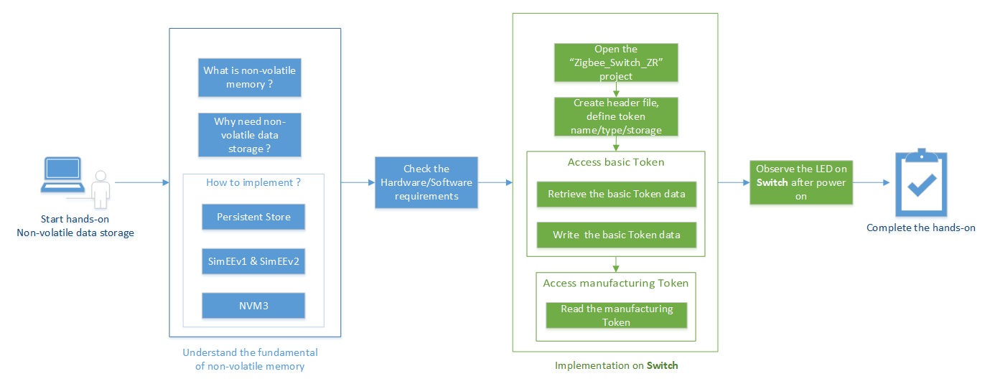
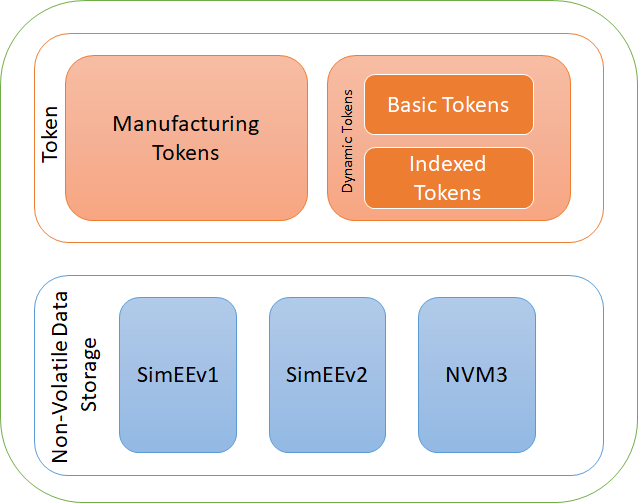
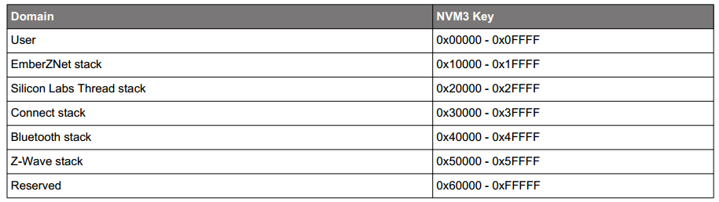
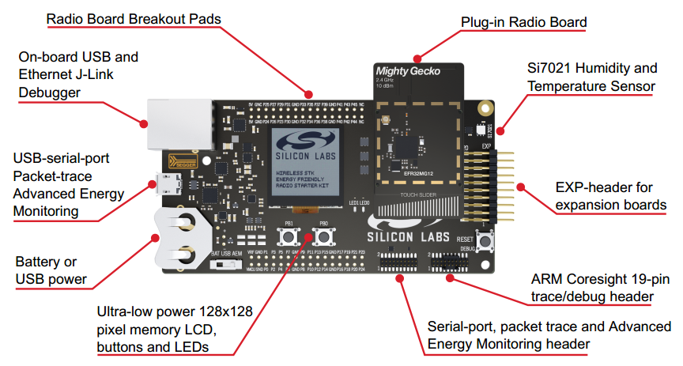
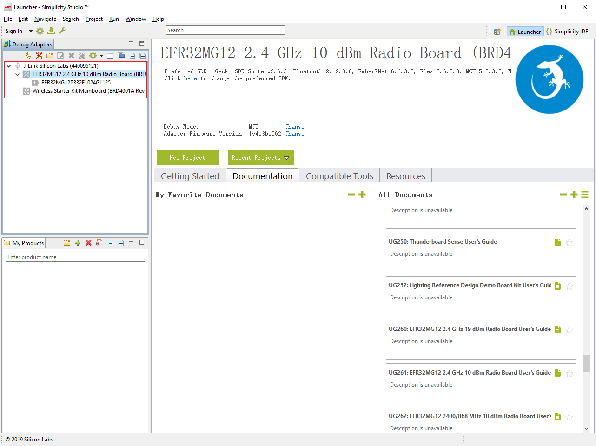
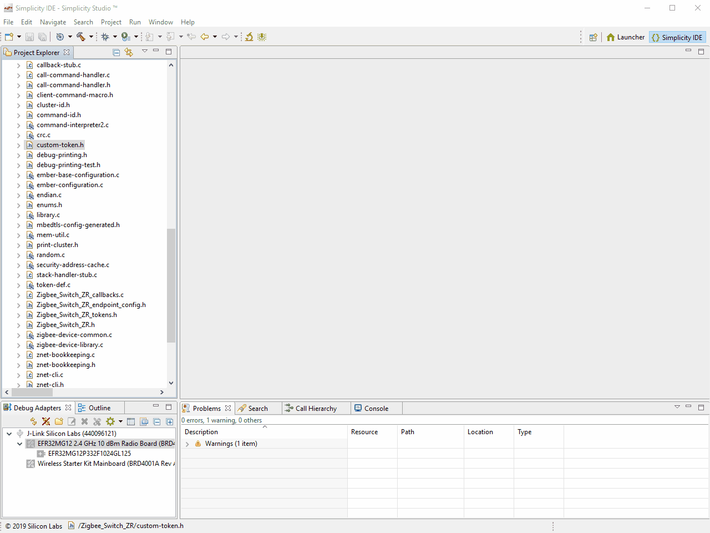
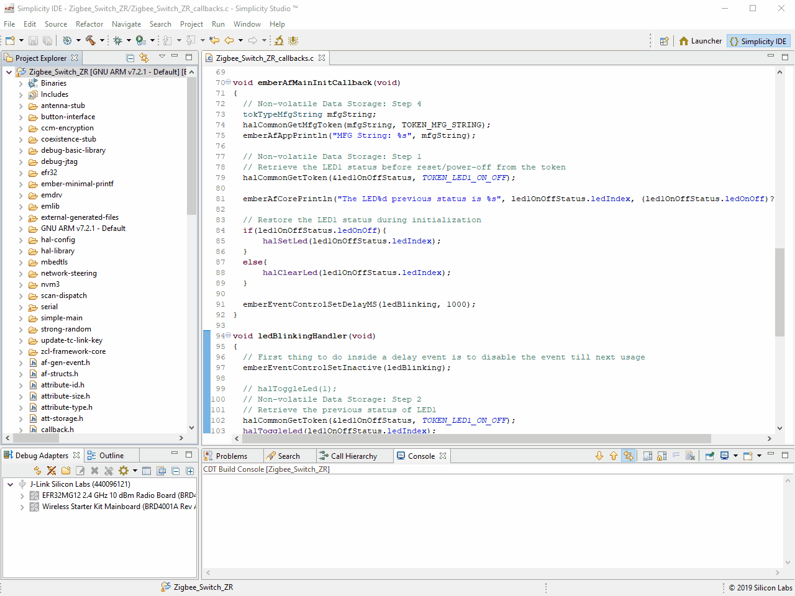
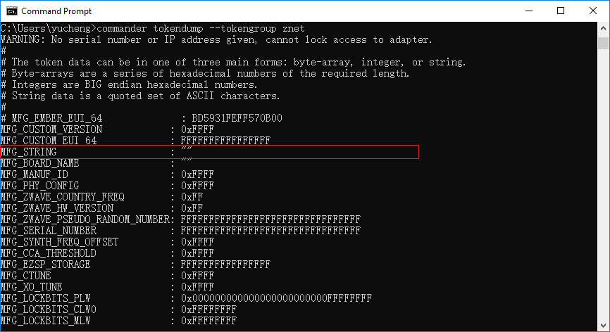

<details>
<summary><font size=5>目录</font> </summary>


- [1. 简介](#1-简介)
    - [1.1. 实验内容](#11-实验内容)
    - [1.2. 目的](#12-目的)
- [2. 非易失性存储器的基础](#2-非易失性存储器的基础)
    - [2.1. 什么是非易失性存储？](#21-什么是非易失性存储)
    - [2.2. 为什么在EmberZNet PRO中需要非易失性存储？](#22-为什么在emberznet-pro中需要非易失性存储)
    - [2.3. Silicon Labs如何实现非易失性数据存储？](#23-silicon-labs如何实现非易失性数据存储)
- [3. 使用令牌API访问NVM3对象](#3-使用令牌api访问nvm3对象)
    - [3.1. 令牌类型：动态令牌和制造令牌](#31-令牌类型动态令牌和制造令牌)
        - [3.1.1. 动态令牌](#311-动态令牌)
            - [3.1.1.1. 基本（非索引）令牌](#3111-基本非索引令牌)
            - [3.1.1.2. 索引令牌](#3112-索引令牌)
        - [3.1.2. 制造令牌](#312-制造令牌)
    - [3.2. 令牌的用法：创建和访问](#32-令牌的用法创建和访问)
        - [3.2.1. 动态令牌](#321-动态令牌)
            - [3.2.1.1. 创建动态令牌](#3211-创建动态令牌)
                - [3.2.1.1.1. 定义令牌名称](#32111-定义令牌名称)
                - [3.2.1.1.2. 定义令牌类型](#32112-定义令牌类型)
                - [3.2.1.1.3. 定义令牌存储](#32113-定义令牌存储)
            - [3.2.1.2. 访问动态令牌](#3212-访问动态令牌)
                - [3.2.1.2.1. 访问基本（非索引）令牌](#32121-访问基本非索引令牌)
                - [3.2.1.2.2. 访问索引令牌](#32122-访问索引令牌)
        - [3.2.2. 制造令牌](#322-制造令牌)
            - [3.2.2.1. 访问制造令牌](#3221-访问制造令牌)
        - [3.2.3. 在哪里可以找到默认令牌的定义](#323-在哪里可以找到默认令牌的定义)
- [4. 实验](#4-实验)
    - [4.1. 硬体需求](#41-硬体需求)
    - [4.2. 软件需求](#42-软件需求)
    - [4.3. 实验](#43-实验)
        - [4.3.1. 打开Switch项目](#431-打开switch项目)
        - [4.3.2. 创建自定义令牌](#432-创建自定义令牌)
        - [4.3.3. 访问基本令牌LED1_ON_OFF](#433-访问基本令牌led1_on_off)
            - [4.3.3.1. 步骤1：检索基本令牌数据](#4331-步骤1检索基本令牌数据)
            - [4.3.3.2. 步骤2：写入基本的令牌数据](#4332-步骤2写入基本的令牌数据)
            - [4.3.3.3. 步骤3：测试](#4333-步骤3测试)
        - [4.3.4. 访问制造令牌](#434-访问制造令牌)
            - [4.3.4.1. 步骤4：读取制造令牌MFG_STRING](#4341-步骤4读取制造令牌mfg_string)

</details>

***  
[English](Zigbee-Hands-on-Non-volatile-Data-Storage.md) | 中文

# 1. 简介
## 1.1. 实验内容
Zigbee快速入门 - 新兵训练营培训的实验环节将涵盖以下四个部分。我们通过这四个部分来向大家逐步展示，如何从零开始构建一个Zigbee应用。

本文档中的实验是“Zigbee快速入门——新兵训练营”系列中的第四部分。 
-   第一部分，由Light构建网络，并使用install code将Switch加入到这个网络。  
-   第二部分，在设备上使用API发送，接收和处理On-Off命令。  
-   第三部分，在Switch端用一个周期事件来执行自定义代码，在我们的实验中是控制LED闪烁。
-   **第四部分，在Switch端使用非易失性存储器来存储自定义数据。**  

## 1.2. 目的
本实验演示了EmberZNet Stack上非易失性数据存储的基本用法。此外，本文档中还包含了一些有关NVM, Token的基本知识，以帮助所有人更好地理解该实验。

**你将学习**  
* 通过本实验课程，您将学习非易失性数据存储的基础知识，Silicon Labs提供的数据存储方案，以及如何使用令牌来访问非易失性数据存储对象。

**你需要做**  
* 在本实验中，我们需要解决的一个问题是，在没有EEPROM的EFR32MG12平台上，如何在系统掉电或复位时来保存当前灯的开/关状态。在本实验中，我们提供了使用令牌来实现此目的的解决方案。
* 而且，您还需要检索制造商在生产过程中所烧录的制造商字符串。

下图说明了该实验的基本流程。
<div align="center">
    
</div>  
</br>  

***

# 2. 非易失性存储器的基础  
## 2.1. 什么是非易失性存储？
非易失性存储器（NVM）是指当设备掉电后，所存储的数据不会消失的存储器。它通常是指半导体存储芯片中的存储，包括NAND闪存和固态硬盘（SSD）之类的闪存存储，以及EPROM（可擦除可编程ROM）和EEPROM（电可擦除可编程ROM）之类的ROM芯片。
在Silicon Labs的微处理器和无线射频芯片上，其内部都没有包含EEPROM，NVM的功能是通过闪存来实现的。

## 2.2. 为什么在EmberZNet PRO中需要非易失性存储？
通常，EmberZNet协议栈和应用程序需要存储一些数据对象，这些对象在电源掉电之后仍需要保留。其中一部分数据是制造数据，只能写入一次，它由生产商在生产过程中写入。另一部分数据，在产品的整个生命周期内都会被频繁地写入和读取，这被称为动态数据。

## 2.3. Silicon Labs如何实现非易失性数据存储？
总体而言，Silicon Labs为**闪存**中的非易失性数据存储提供3种不同的实现方案。并且还提供令牌机制，用于从非易失性数据存储中存储和检索数据。

**Persistent Store (PS Store)**  
PS Store仅可用于除EFR32 2系列以外的所有的蓝牙设备。PS Store的大小为2048字节，并使用两个闪存页进行存储。蓝牙协议栈和应用程序都可以在该区域中存储数据。
由于本文档重点介绍EmberZNet PRO，因此在本文档中我们不会过多介绍PS Store。

**SimEEv1和SimEEv2**  
SimEEv1（模拟EEPROM版本1）或SimEEv2（模拟EEPROM版本2）与EmberZNet PRO，Silicon Labs Thread，Silicon Labs Connect在EM35x和EFR32系列1平台上配合使用。SimEEv1使用两个虚拟页，每个虚拟页包含两个闪存页，而SimEEv2使用三个虚拟页，其中每个虚拟页包含6个闪存页。

**NVM3**  
第三代非易失性存储器（NVM3）数据存储是SimEEv1 / v2和PS Store的替代产品，旨在与EFR32上运行的EmberZNet，Silicon Labs Thread，Connect和Bluetooth应用程序，以及EFM32上运行的MCU应用程序一起使用。  
由于NVM3具有更高的可配置性，可以更好地平衡令牌容量与所需的闪存，并且与DMP（动态多协议）应用程序兼容，因此推荐在EFR32上进行开发时，使用该方案。
在本实验中，我们将使用NVM3进行数据存储。

**Token**  
令牌的机制使应用程序可以将定义的数据类型存储在非易失性存储中，并且SimEEv1 / v2和NVM3都可以在令牌机制下运行。
令牌有两个部分：令牌标识和令牌数据。令牌标识是用于存储和检索令牌数据的唯一标识符。通过使用令牌标识，应用程序无需知道数据在非易失性存储中的确切位置即可进行检索。
下图说明了令牌与非易失性数据存储机制之间的关系。Silicon Labs提供了三种不同的动态令牌实现：SimEEv1（模拟EEPROM版本1），SimEEv2（模拟EEPROM版本2）和NVM3（第三代非易失性存储）。

<div align="center">
    
</div>  
<div align="center">
  <b>非易失性存储和令牌</b>
</div>  

***

# 3. 使用令牌API访问NVM3对象
在EFR32上进行开发时，我们推荐使用NVM3进行数据存储，因此以下部分将介绍如何使用令牌API访问NVM3对象。

## 3.1. 令牌类型：动态令牌和制造令牌 
根据令牌的使用方式，可以将其区分为动态令牌或制造令牌。

<div align="center">
  
</div>
</br>

### 3.1.1. 动态令牌
动态令牌系统的基本目的是允许它可以像普通RAM一样频繁地访问（读取和写入），而且令牌数据在系统重新启动和断电期间得以保存。它们存储在闪存的专用区域中，在该区域中，我们使用存储旋转算法来防止闪存过度使用。
有两种类型的动态令牌，它们的格式有所不同：基本令牌和索引令牌。

#### 3.1.1.1. 基本（非索引）令牌
基本令牌可以被视为简单的char变量类型，只能作为一个单元进行访问。例如，基本标记可用于存储数组，并且如果该数组的任何元素发生更改，则必须重写整个数组。
计数器令牌是一种特殊类型的非索引动态令牌，用于存储一次递增1的数字。
<font color=red><b>提示</b></font>：本动手操作中将不涉及计数器令牌，有关计数器令牌的更多信息，请参考UG103.7的[2.6计数器对象][UG103.7: Non-Volatile Data Storage Fundamentals]一节和AN703的4.2[何时定义计数器令牌][AN703: Simulated EEPROM]。

#### 3.1.1.2. 索引令牌
索引动态令牌可以看作是char变量的链接数组，其中每个元素都希望独立于其他元素进行更改，因此每个元素在内部被存储为独立的令牌，并可以通过令牌API进行访问。
<font color=red><b>提示</b></font>: 在本实验中也将不包括索引令牌，有关索引令牌的更多信息，请参考UG103.7的[2.6 Counter Objects][UG103.7: Non-Volatile Data Storage Fundamentals]和AN703的[4.2 When to Define a Counter Token][AN703: Simulated EEPROM]。 

### 3.1.2. 制造令牌
制造令牌是制造商在产品制造时设置，并且存储在闪存的绝对地址中。在芯片的生命周期内，制造令牌只被写入一次或很少被写入。

## 3.2. 令牌的用法：创建和访问
现在，我们将讨论如何使用令牌。这包括了解如何创建新令牌，如何读取和修改令牌数据，以及在哪里可以找到系统的默认令牌。

### 3.2.1. 动态令牌
要创建自定义动态令牌，您需要新建一个令牌头文件并包含令牌的定义。在本实验中，我们将创建一个```custom-token.h```的头文件，并包含自定义动态令牌的定义。

#### 3.2.1.1. 创建动态令牌
通常，创建动态令牌涉及以下三个步骤。本文的[4.3.2 创建自定义令牌](#432-创建自定义令牌)中包含一个示例以详细演示如何创建自定义动态令牌。
*  定义令牌名称。
*  如果令牌使用的是应用程序定义的类型，则使用typedef定义令牌类型。  
*  定义令牌存储。

##### 3.2.1.1.1. 定义令牌名称
在定义名称时，请不要在名称中加TOKEN前缀。对于NVM3动态令牌，请使用单词NVM3KEY作为前缀。
```
/**
* Custom Zigbee Application Tokens
*/
// Define token names here
#define NVM3KEY_LED1_ON_OFF			(NVM3KEY_DOMAIN_USER | 0x0001)
```
请注意，令牌名称在此设备内必须唯一。
对于NVM3，自定义应用程序令牌应使用**NVM3KEY_DOMAIN_USER**范围，以免与协议栈中的令牌（例如**NVM3KEY_DOMAIN_ZIGBEE**）冲突。有关NVM3默认范围的信息，请参考下表。

<div align="center">
  
</div>  
</br>  

##### 3.2.1.1.2. 定义令牌类型
令牌类型可以是内置的C数据类型，也可以使用typedef定义为自定义数据结构。
```
#if defined(DEFINETYPES)
// Include or define any typedef for tokens here
typedef struct {
  uint8_t ledIndex;    // LED index
  bool ledOnOff;       // LED ON OFF status
} ledOnOffStatus_t;
#endif //DEFINETYPES
```

##### 3.2.1.1.3. 定义令牌存储
定义任何自定义类型之后，您应该定义令牌存储，以将所定义的令牌通知给令牌管理系统。  
每个令牌（无论是自定义令牌还是默认令牌）在此部分都有其自己的定义：
```
#ifdef DEFINETOKENS
// Define the actual token storage information here
DEFINE_BASIC_TOKEN(LED1_ON_OFF,
                  ledOnOffStatus_t,
                  {1, false})
#endif
```

DEFINE_BASIC_TOKEN带有三个参数：令牌名称（LED1_ON_OFF，不带前缀“ NVM3KEY”），令牌类型（ledOnOffStatus_t），如上所定义，以及令牌的默认值。如果应用程序从未写入过该令牌，则其值为默认值。
在上面的例子中，第一个值（ledIndex）被初始化为```1```表示LED1，而下一个值（ledOnOff）被设置```false```代表LED1的默认状态。

#### 3.2.1.2. 访问动态令牌
协议栈提供了一组简单的API，用于访问令牌数据。根据令牌的类型，API略有不同。

##### 3.2.1.2.1. 访问基本（非索引）令牌
访问非索引/基本令牌API函数包括：
```
void halCommonGetToken(data, token)  
void halCommonSetToken(token, data)  
```
在这种情况下，“token”变量是令牌名称，“data”变量是令牌数据。请注意，```halCommonGetToken()```和```halCommonSetToken()```是通用令牌API，可用于基本动态令牌和制造令牌的访问。
现在，让我们使用一个示例来说明这些API的用法。
正如文章一开始的[你需要做的](#12-目的)章节所提及，我们需要频繁地存储LED1的开/关状态，并且在系统上电之后恢复LED1的状态。 在定义了令牌之后，您可以使用如下代码片段访问它：

```
ledOnOffStatus_t led1OnOffStatus;

// Retrieve the previous status of LED1
halCommonGetToken(&led1OnOffStatus, TOKEN_LED1_ON_OFF);

led1OnOffStatus.ledOnOff = <current status>;

// Store the current status of LED1
halCommonSetToken(TOKEN_LED1_ON_OFF, &led1OnOffStatus);
```
由于本实验是针对Silicon Labs EmberZNet协议栈入门介绍而设计的，因此我们将重点介绍基本令牌的用法，如果您对如何访问计数器令牌感兴趣，请阅读AN1154的[3.3.1.1 Accessing Counter Tokens][AN1154: Using Tokens for Non-Volatile Data Storage]。

##### 3.2.1.2.2. 访问索引令牌
要访问索引令牌，请使用下面的API。如上所述，我们将不会在本文档中花费大量篇幅来介绍索引令牌，更多信息请参考AN1154的[3.3.2 Accessing Indexed Tokens][AN1154: Using Tokens for Non-Volatile Data Storage]。
```
void halCommonGetIndexedToken(data, token, index)
void halCommonSetIndexedToken(token, index, data)
```

### 3.2.2. 制造令牌
制造令牌的定义方式与基本（非索引）动态令牌的定义方式相同，因此，有关如何创建令牌的信息，请参考[创建动态令牌](#3211-创建动态令牌)部分。它们之间的主要区别在于令牌的存储位置和访问方式。
制造令牌位于制造令牌的专用闪存页面中（具有固定的绝对地址）。

#### 3.2.2.1. 访问制造令牌
顾名思义，制造令牌通常在制造时一次写入专用闪存页面中的固定位置。由于它们的地址是固定的，因此如果禁用了此闪存区域的读保护，则可以轻松地从外部编程工具读取它们。
并且由于同一闪存单元，如果没有作擦除操作就无法重复写入。仅当令牌当前处于已擦除状态时，才能通过代码来写入制造令牌。覆盖之前已经写入的制造令牌，总是需要先使用外部编程工具擦除制造令牌所在的闪存页面。

制造令牌应通过下面的专用API来访问。
```
halCommonGetMfgToken(data, token);
halCommonSetMfgToken(token, data);
```
它们具有与基本令牌API相同的参数。使用专用制造令牌访问API的两个主要目的是：
* 为了更快地访问；
* 为了在系统启动过程中，调用emberInit()初始化协议栈之前进行访问。

而且制造令牌也可以通过基本令牌API ```halCommonGetToken()```和```halCommonSetToken()```进行访问。

还让我们使用一个示例来说明这些专用API如何访问制造令牌。
正如文章前面的章节[你需要做](#12-目的)中所提及，制造商将在生产过程中通过编程工具对“制造字符串”令牌进行编程，我们可以运行如下代码段来从制造令牌中检索该字符串。

```
tokTypeMfgString mfgString;
// Retrieve the manufacturing string from the manufacturing token
halCommonGetMfgToken(mfgString, TOKEN_MFG_STRING);
```

### 3.2.3. 在哪里可以找到默认令牌的定义
EmberZNet PRO协议栈已经为协议栈本身，应用程序框架，制造数据等定义了许多令牌。

要查看协议栈令牌，请参考文件：
```<install-dir>/stack/config/token-stack.h```
要查看应用程序框架令牌，请在AppBuilder中生成项目后，导航至该项目的目录。文件```<project_name>_tokens.h```含有ZCL属性的令牌，协议栈专用的令牌文件```znet-token.h```中包括有插件令牌头文件和自定义应用程序令牌头文件。

要查看EFR32系列芯片的制造令牌，请参阅以下文件：
```<install-dir>/hal/micro/cortexm3/efm32/token-manufacturing.h```

***

# 4. 实验
本节提供分步说明，以演示如何使用基本令牌向非易失性数据存储（在本实验中为NVM3）对象存储和从其检索LED1的状态。并演示如何使用专用API访问制造令牌。
这也正是我们在本文章开始时[你需要做](#12-目的)的部分中提出的问题。

**前提条件**  
请确保您已完成[准备课程](https://github.com/MarkDing/IoT-Developer-Boot-Camp/wiki/Zigbee-Preparatory-Course)，并确保所有SDK软件和开发套件都已准备就绪。

## 4.1. 硬体需求
该动手操作需要EFR32MG21 / EFR32MG13 / EFR32MG12开发板中的任何一款，我们推荐使用EFR32MG12无线开发板BRD4162A，我们的示例项目也是基于该套件创建的。以下是该开发板的布局。
<div align="center">
  
</div>  
</br>  

使用“ J-Link USB”连接器和开发套件中随附的USB电缆将开发板连接到PC。并将电源开关切换到“ AEM”位置。启动Simplicity Studio V4，它能识别所连接的设备，并将其列出在如下所示区域中。
<div align="center">
  
</div>
</br>

## 4.2. 软件需求
该实验是在之前的三个实验“ [构建和连接](https://github.com/MarkDing/IoT-Developer-Boot-Camp/wiki/Zigbee-Hands-on-Forming-and-Joining)”，“ [发送/关闭命令](https://github.com/MarkDing/IoT-Developer-Boot-Camp/wiki/Zigbee-Hands-on-Sending-OnOff-Commands)”和“ [使用事件](https://github.com/MarkDing/IoT-Developer-Boot-Camp/wiki/Zigbee-Hands-on-Using-Event)”的基础上进行的，并且假设您已经按照我们的[预备课程](https://github.com/MarkDing/IoT-Developer-Boot-Camp/wiki/Zigbee-Preparatory-Course)中的说明安装了Simplicity Studio和必需的SDK 。


## 4.3. 实践
### 4.3.1. 打开Switch项目
该实验是在前三个实验基础之上。由于非易失性数据存储机制不依赖于网络节点类型，因此我们仅仅演示如何在Switch（路由节点）设备端通过令牌API访问NVM3对象，即Zigbee_Switch_ZR项目。  
如果在完成该实验过程中遇到任何困难，你可以在[IoT-Developer-Boot-Camp](https://github.com/MarkDing/IoT-Developer-Boot-Camp/tree/master/zigbee)中找到示例项目，以供参考。

### 4.3.2. 创建自定义令牌
我们将创建一个头文件```custom-token.h```，并在此头文件中定义令牌名称，令牌类型和令牌存储。

* 在Simplicity studio中，单击[文件]> [新建]> [文件]
* 选择父文件夹作为项目的根路径，并将文件名设置为```custom-token.h```，然后单击[完成]。
* 编辑头文件以定义令牌。  

**首先**,我们将令牌名称定义为NVM3KEY_LED1_ON_OFF。有关令牌名称定义规则的更多信息，请参考[3.2.1.1.1. 定义令牌名称](#32111-定义令牌名称)。 
* <font color=red><b>问题</b></font>:为什么需要用前置词NVM3KEY来定义令牌名称？可以定义为TOKEN_LED1_ON_OFF吗？ 
* <font color=red><b>提示</b></font>: 请返回[3.2.1.1.1. 定义令牌名称](#32111-定义令牌名称)部分以获取答案。

**然后** 定义用于记录LED开/关状态的令牌类型，定义一个结构类型```ledOnOffStatus_t```，该结构类型包括两种不同的数据类型来表示LED索引和LED状态。有关更多信息，请参阅[3.2.1.1.2. 定义令牌类型](#32112-定义令牌类型)。

**最后**, 使用宏定义DEFINE_BASIC_TOKEN来定义令牌存储。有关更多信息，请参阅[3.2.1.1.3. 定义令牌存储](#32113-定义令牌存储)。

以下是本实验环节中使用的头文件的内容，供您参考。

```
// File: custom-token.h
//
// Description: Custom token definitions used by the application.
//
// Copyright 2019 by Silicon Labs Corporation.  All rights reserved.

/**
* Custom Zigbee Application Tokens
*/
// Define token names here
#define NVM3KEY_LED1_ON_OFF			(NVM3KEY_DOMAIN_USER | 0x0001)

#if defined(DEFINETYPES)
// Include or define any typedef for tokens here
typedef struct {
  uint8_t ledIndex;     // LED index
  bool ledOnOff;        // LED ON OFF status
} ledOnOffStatus_t;
#endif //DEFINETYPES

#ifdef DEFINETOKENS
// Define the actual token storage information here
DEFINE_BASIC_TOKEN(LED1_ON_OFF,
                  ledOnOffStatus_t,
                  {1, false})
#endif
```

创建自定义令牌头文件后，您还需要执行一个步骤：通过Simplicity Studio中“ .isc”文件中“令牌配置”部分下的[包含]选项卡，将头文件添加到应用程序中。
**注意**：在.isc文件中添加头文件后，您需要再次生成项目。

<div align="center">
  
</div>
</br>  

### 4.3.3. 访问基本令牌LED1_ON_OFF
让我们继续介绍如何访问已定义的令牌。以下分步说明如何存储LED的状态，以及如何检索并恢复LED的状态值。
该实验的每个步骤在参考示例项目中都会有一个相应的注释```Non-volatile Data Storage: Step x```，以方便用户定位到正确的位置来编写代码。

#### 4.3.3.1. 步骤1：检索基本令牌数据
打开```Zigbee_Switch_ZR_callback.c```，然后定义“ ledOnOffStatus_t”类型变量。
```
// Non-volatile Data Storage: Step 1
ledOnOffStatus_t led1OnOffStatus;
```
导航找到```Zigbee_Switch_ZR_callback.c```中的函数```void emberAfMainInitCallback(void)```，这将在初始化过程中被应用程序的主函数调用，用API ```halCommonGetToken()```读取基本令牌“LED1_ON_OFF”。

```
// Non-volatile Data Storage: Step 1
// Retrieve the LED1 status before reset/power-off from the token
halCommonGetToken(&led1OnOffStatus, TOKEN_LED1_ON_OFF);
```
然后根据所读取到的状态值，使用```API halSetLed()```或 ```halClearLed()```对LED1进行相应的设置。 

```
// Restore the LED1 status during initialization
if(led1OnOffStatus.ledOnOff){
  halSetLed(led1OnOffStatus.ledIndex);
}
else{
  halClearLed(led1OnOffStatus.ledIndex);
}
```

#### 4.3.3.2. 步骤2：写入基本的令牌数据
在上一个实验中，我们定义了一个事件处理函数```ledBlinkingHandler()```来定期切换LED1状态，本实验中，我们需要在每次切换完成之后将LED1的状态保存。
导航到```Zigbee_Switch_ZR_callback.c```的函数```void ledBlinkingHandler(void)```中。您也可以使用注释```Non-volatile Data Storage: Step 2```来定位所需要修改的代码的位置。  
使用```API halCommonSetToken()```来写令牌LED1_ON_OFF。
```
// Non-volatile Data Storage: Step 2
// Retrieve the previous status of LED1
halCommonGetToken(&led1OnOffStatus, TOKEN_LED1_ON_OFF);

halToggleLed(led1OnOffStatus.ledIndex);
led1OnOffStatus.ledOnOff = !led1OnOffStatus.ledOnOff;

// Store the current status of LED1
halCommonSetToken(TOKEN_LED1_ON_OFF, &led1OnOffStatus);
```

#### 4.3.3.3. 步骤3：测试
将必要的代码添加到项目后，请编译```Zigbee_Switch_ZR```项目，并将其烧录到BRD4162A开发板上。
* 点击[Build]  按钮开始编译项目。
* 编译完成后，展开“ Binaries”文件夹，然后右键单击* .hex文件并选择[Flash to Device ...]
* 在弹出窗口中选择所连接的开发板。现在，“Flash Programmer”已预先填充了所有需要的数据，您可以单击“烧录”。
* 单击“烧录”，然后等待一会儿以完成烧录。

<div align="center">
  
</div>
</br>

在上电延迟几秒钟后，开发板上的LED1将定期闪烁，按复位键复位该设备，复位完成后，应用程序会将LED1恢复到复位/关闭电源之前的状态。
<font color=red><b>提示</b></font>：您可以修改系统上电后LED1延迟闪烁的时间，以及在```Zigbee_Switch_ZR_callback.c```中使用API ```emberEventControlSetDelayMS(ledBlinking, 2000)```; 来更改LED1的闪烁间隔。

### 4.3.4. 访问制造令牌
#### 4.3.4.1. 步骤4：读取制造令牌MFG_STRING
仅当令牌当前处于已擦除状态时，才能通过代码写入制造令牌。通常，制造商将使用外部编程工具（例如Simplicity Commander）烧录制造令牌。 这部分将涉及读取制造令牌```MFG_STRING```，该令牌保存了制造商在生产过程中所烧录的制造字符串。  
导航到```Zigbee_Switch_ZR_callback.c```的函数```void emberAfMainInitCallback(void)```，然后通过API ```halCommonGetMfgToken```读取制造令牌MFG_STRING。

```
// Non-volatile Data Storage: Step 4
tokTypeMfgString mfgString;
halCommonGetMfgToken(mfgString, TOKEN_MFG_STRING);
emberAfAppPrintln("MFG String: %s", mfgString);
```
请注意，如果之前未通过外部编程工具对制造字符串令牌进行编程，则调试输出将为NULL，这表示制造字符串为NULL。

同样，您也可以使用Simplicity Commander来查看制造令牌，如下所示。
```$ commander tokendump --tokengroup znet```  

<div align="center">
  
</div>
</br>

<font color=red><b>Question</b></font>: 制造令牌可以通过基本令牌APIs来访问吗？   
<font color=red><b>Hint</b></font>: 请返回到[3.2.2.1. 访问制造令牌](#3221-访问制造令牌)以获取答案。  

***

# 5. 结论  
我们希望您通过非易失性数据存储的实验，理解Silicon Labs所提供的实现方案，它们是NVM3，SimEEv1 / SimEEv2和PS Store。 另外，通过本实验，您也学习了如何创建和访问基本令牌以及如何访问制造令牌。

有关非易失性数据存储和令牌的更多信息，请参考以下文档。

[UG103.7: Non-Volatile Data Storage Fundamentals](https://www.silabs.com/documents/public/user-guides/ug103-07-non-volatile-data-storage-fundamentals.pdf)

[AN1154: Using Tokens for Non-Volatile Data Storage](https://www.silabs.com/documents/public/application-notes/an1154-tokens-for-non-volatile-storage.pdf)

[AN1135: Using Third Generation NonVolatile Memory (NVM3) Data Storage](https://www.silabs.com/documents/public/application-notes/an1135-using-third-generation-nonvolatile-memory.pdf)  

[AN703: Simulated EEPROM](https://www.silabs.com/documents/public/application-notes/an703-simulated-eeprom.pdf)  
