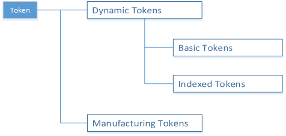

<details>
<summary><font size=5>目录</font> </summary>

- [1. 简介](#1-简介)
    - [1.1. 应用功能](#11-应用功能)
    - [1.2. 目的](#12-目的)
- [2. 非易失性记忆的基础](#2-非易失性记忆的基础)
    - [2.1. 什么是非易失性内存？](#21-什么是非易失性内存？)
    - [2.2. 为什么在EmberZNet PRO中需要非易失性存储？](#22-为什么在EmberZNet-PRO中需要非易失性存储？)
    - [2.3. Silicon Labs如何实现非易失性数据存储？](#23-Silicon-Labs如何实现非易失性数据存储？)
- [3. 使用令牌 API访问NVM3对象](#3-使用令牌-API访问NVM3对象)
    - [3.1. 令牌类型：动态令牌和制造令牌](#31-令牌类型：动态令牌和制造令牌)
        - [3.1.1. 动态令牌](#311-动态令牌)
            - [3.1.1.1. 基本（非索引）令牌](#3111-基本（非索引）令牌)
            - [3.1.1.2. 索引令牌](#3112-索引令牌)
        - [3.1.2. 制造令牌](#312-制造令牌)
    - [3.2. 令牌的用法：创建和访问](#32-令牌的用法：创建和访问)
        - [3.2.1. 动态令牌](#321-动态令牌)
            - [3.2.1.1. 创建动态令牌](#3211-创建动态令牌)
                - [3.2.1.1.1. 定义令牌名称](#32111-定义令牌名称)
                - [3.2.1.1.2. 定义令牌类型](#32112-定义令牌类型)
                - [3.2.1.1.3. 定义令牌存储](#32113-定义令牌存储)
            - [3.2.1.2. 访问动态令牌](#3212-访问动态令牌)
                - [3.2.1.2.1. 访问基本（非索引）令牌](#32121-访问基本（非索引）令牌)
                - [3.2.1.2.2. 访问索引令牌](#32122-访问索引令牌)
        - [3.2.2. 制造令牌](#322-制造令牌)
            - [3.2.2.1. 访问制造令牌](#3221-访问制造令牌)
        - [3.2.3. 在哪里可以找到默认令牌定义](#323-在哪里可以找到默认令牌定义)
- [4. 实验](#4-实验)
    - [4.1. 硬体需求](#41-硬体需求)
    - [4.2. 软件需求](#42-软件需求)
    - [4.3. 实践](#43-实践)
        - [4.3.1.打开Switch项目](#431-打开Switch项目)
        - [4.3.2. 创建自定义令牌](#432-创建自定义令牌)
        - [4.3.3. 访问基本令牌LED1_ON_OFF](#433-访问基本令牌LED1_ON_OFF)
            - [4.3.3.1.步骤1：检索基本令牌数据](#4331-步骤1：检索基本令牌数据)
            - [4.3.3.2. 步骤2：写入基本的令牌数据](#4332-步骤2：写入基本的令牌数据)
            - [4.3.3.3. 步骤3：测试专案](#4333-步骤3：测试专案)
        - [4.3.4. 访问制造令牌](#434-访问制造令牌)
            - [4.3.4.1. 步骤4：读取制造令牌MFG_STRING](#4341-步骤4：读取制造令牌MFG_STRING)
- [5. 结论](#5-结论)

</details>

***  
[English](Zigbee-Hands-on-Non-volatile-Data-Storage.md) | Chinese

# 1. 简介
## 1.1. 应用功能
新手训练营系列动手研讨会将涵盖以下四个功能，应用程序开发分别分为四个步骤，以展示应如何从一开始就构建应用程序。

本文档中的练习是“ Zigbee新手训练营”系列中的第一个练习。 
-   在第一阶段，将实现由Light构建的基本网络以及Switch的加入过程。
-  	第二部分将使用API准备设备以发送，接收和处理On-Off命令。  
-   在第三步，Switch将有一个定期事件来执行任何自定义代码，在我们的案例中，这将是一个LED闪烁。
-   **要做的第四件事是使Switch能够使用非易失性存储器在其闪存中存储任何自定义数据**。  

## 1.2. 目的
本培训演示了EmberZNet Stack上非易失性数据存储的基本用法。此外，本文档中还包含一些基本知识，以帮助所有人更好地了解实际操作。

**你将学习**  
* 通过本动手课程，您将学习非易失性数据存储的基础知识，Silicon Labs提供的可用实现，以及如何使用令牌访问非易失性数据存储对象。

**你需要做**  
* 我们需要解决的一个问题是，如何在电源周期内在没有EEPROM的EFR32MG12平台上本地存储照明开/关状态。在本动手操作中，我们提供了使用令牌来实现此目的的解决方案。
* 而且，您还需要检索制造商在生产过程中编程的制造字符串。

下图说明了该动手操作的流程。
<div align="center">
    
</div>  
</br>  

***

# 2. 非易失性记忆的基础  
## 2.1. 什么是非易失性内存？
非易失性存储器（NVM）是即使设备重启后也可以检索存储的信息的存储器。它通常是指半导体存储芯片中的存储，包括NAND闪存和固态驱动器（SSD）之类的闪存存储，以及EPROM（可擦除可编程ROM）和EEPROM（电可擦除可编程ROM）之类的ROM芯片。
在Silicon Labs微控制器和无线电SoC上，它不提供内部EEPROM，NVM被实现为闪存。

## 2.2. 为什么在EmberZNet PRO中需要非易失性存储？
通常，EmberZNet堆栈和应用程序需要存储一些数据对象，这些对象应在电源重启后保留。某些数据被认为是制造数据，在制造时只能写入一次，另一方面，某些数据在产品的整个生命周期内都会被频繁地写入和读取，这被称为动态数据。

## 2.3. Silicon Labs如何实现非易失性数据存储？
总体而言，Silicon Labs为**闪存**中的非易失性数据存储提供3种不同的实现。并且还提供令牌机制，用于从非易失性数据存储中存储和检索数据。

**持久存储（PS存储）**  
PS Store仅可用于除EFR32系列2以外的所有平台上的蓝牙设备。持久存储的大小为2048字节，并使用两个闪存页进行存储。蓝牙堆栈和应用程序都可以在该区域中存储数据。
由于本文档重点介绍EmberZNet PRO，因此在本文档中我们不会过多介绍PS Store。

**SimEEv1和SimEEv2**  
SimEEv1（模拟EEPROM版本1）或SimEEv2（模拟EEPROM版本2）与EmberZNet PRO，Silicon Labs Thread，Silicon Labs Connect在EM35x和EFR32系列1平台上配合使用。SimEEv1使用两个虚拟页面，每个虚拟页面包含两个闪存页面，而SimEEv2使用三个虚拟页面，其中每个虚拟页面包含6个闪存页面。

**NVM3**  
第三代非易失性存储器（NVM3）数据存储驱动程序是SimEEv1 / v2和PS Store的替代产品，旨在与EFR32上运行的EmberZNet，Silicon Labs Thread，Connect和Bluetooth应用程序以及MCU应用程序一起使用。在EFM32上运行。
由于NVM3具有更高的可配置性，可以更好地平衡令牌容量与保留的闪存，并且与DMP应用程序兼容，因此建议在EFR32上进行开发。
在本动手课程中，我们将使用NVM3进行数据存储。

**Token**  
令牌使应用程序可以将定义的数据类型存储在非易失性存储中，并且SimEEv1 / v2和NVM3旨在在令牌系统下运行。
令牌有两个部分：令牌密钥和令牌数据。令牌密钥是用于存储和检索令牌数据的唯一标识符。通过使用令牌密钥，应用程序无需知道数据在非易失性存储中的确切位置即可进行检索。
下图说明了令牌与非易失性数据存储机制之间的关系。Silicon Labs提供了三种不同的动态令牌实现：模拟EEPROM版本1（SimEEv1），模拟EEPROM版本2（SimEEv2）和第三代非易失性存储器（NVM3）。

<div align="center">
    
</div>  
<div align="center">
  <b>非易失性存储和令牌</b>
</div>  

***

# 3. 使用令牌API访问NVM3对象
由于建议将NVM3用于非易失性数据存储，因此以下部分将介绍如何使用令牌API访问NVM3对象。

## 3.1. 令牌类型：动态令牌和制造令牌 
根据令牌的使用方式，可以将其区分为动态令牌或制造令牌。

<div align="center">
  
</div>
</br>

### 3.1.1. 动态令牌
动态令牌系统的基本目的是允许它可以像普通RAM一样频繁地访问（读取和写入），而且还允许令牌数据在重新引导期间和断电期间得以持久。它们存储在闪存的专用区域中，在该区域中，我们使用内存旋转算法来防止闪存过度使用。
有两种类型的动态令牌，它们的格式有所不同：基本令牌和索引令牌。

#### 3.1.1.1. 基本（非索引）令牌
基本令牌可以被视为简单的char变量类型，只能作为一个单元进行访问。例如，基本标记可用于存储数组，并且如果该数组的任何元素发生更改，则必须重写整个数组。
计数器令牌是一种特殊类型的非索引动态令牌，用于存储一次递增1的数字。
<font color=red><b>提示</b></font>：本动手操作中将不涉及计数器令牌，有关计数器令牌的更多信息，请参见UG103.7的[2.6计数器对象][UG103.7: Non-Volatile Data Storage Fundamentals]一节和AN703的4.2[何时定义计数器令牌][AN703: Simulated EEPROM]。

#### 3.1.1.2. 索引令牌
索引动态令牌可以看作是char变量的链接数组，其中每个元素都希望独立于其他元素进行更改，因此可以在内部存储为独立的令牌，并可以通过令牌API进行显式访问。
<font color=red><b>提示</b></font>: 在本动手操作中也将不包括索引令牌，有关索引令牌的更多信息，请参见UG103.7的[2.7索引对象][UG103.7: Non-Volatile Data Storage Fundamentals]和AN703的[4.3数组令牌与索引令牌][AN703: Simulated EEPROM]。

### 3.1.2. 制造令牌
制造令牌在制造时设置，并且存储在闪存的绝对地址中。在芯片的生命周期内，制造令牌只被写入一次或很少被写入。

## 3.2. 令牌的用法：创建和访问
现在，我们将讨论如何使用令牌。这包括了解如何创建新令牌，如何读取和可能修改令牌以及在哪里可以找到默认令牌。

### 3.2.1. 动态令牌
要创建自定义动态令牌，您需要新建一个包含令牌定义的令牌头文件。在本动手操作中，我们将创建一个```custom-token.h```包含自定义动态令牌定义的头文件 。

#### 3.2.1.1. 创建动态令牌
通常，创建动态令牌涉及以下三个步骤。一个示例将包含在[第4.3.2节中创建自定义令牌](#432-create-custom-tokens)以详细演示如何创建自定义动态令牌。
*  定义令牌名称。
*  如果令牌使用的是应用程序定义的类型，则添加令牌所需的所有typedef。  
*  定义令牌存储。

##### 3.2.1.1.1. 定义令牌名称
在定义名称时，请不要在名称中加上TOKEN。对于NVM3动态令牌，请使用单词NVM3KEY作为前缀。
```
/**
* Custom Zigbee Application Tokens
*/
// Define token names here
#define NVM3KEY_LED1_ON_OFF			(NVM3KEY_DOMAIN_USER | 0x0001)
```
请注意，令牌密钥值在此设备内必须唯一。
对于NVM3，自定义应用程序令牌应使用**NVM3KEY_DOMAIN_USER**范围，以免与其他范围（例如**NVM3KEY_DOMAIN_ZIGBEE**）中的堆栈令牌冲突。有关NVM3默认实例密钥空间的信息，请参见下表。

<div align="center">
  
</div>  
</br>  

##### 3.2.1.1.2. 定义令牌类型
令牌类型可以是内置的C数据类型，也可以使用typedef定义为自定义数据结构。
```
#if defined(DEFINETYPES)
// Include or define any typedef for tokens here
typedef struct {
  uint8_t ledIndex;    // LED index
  bool ledOnOff;       // LED ON OFF status
} ledOnOffStatus_t;
#endif //DEFINETYPES
```

##### 3.2.1.1.3. 定义令牌存储
定义任何自定义类型之后，您应该定义令牌存储，以将所定义的令牌通知令牌管理软件。
每个令牌（无论是自定义令牌还是默认令牌）在此部分都有其自己的条目：
```
#ifdef DEFINETOKENS
// Define the actual token storage information here
DEFINE_BASIC_TOKEN(LED1_ON_OFF,
                  ledOnOffStatus_t,
                  {1, false})
#endif
```

DEFINE_BASIC_TOKEN带有三个参数：令牌名称（LED1_ON_OFF，不带前缀“ NVM3KEY”），令牌类型（ledOnOffStatus_t），如上所定义，以及令牌的默认值，如果应用程序从未写入过令牌，则默认值为（{1，假}）。
在这种情况下，第一个值（ledIndex）被初始化为```1```指示LED1，而下一个值（ledOnOff）被设置```false```为代表LED1的默认状态。

#### 3.2.1.2. 访问动态令牌
网络堆栈提供了一组简单的API，用于访问令牌数据。根据令牌的类型，API略有不同。

##### 3.2.1.2.1. 访问基本（非索引）令牌
非索引/基本令牌API函数包括：
```
void halCommonGetToken(data, token)  
void halCommonSetToken(token, data)  
```
在这种情况下，“令牌”是令牌密钥，“数据”是令牌数据。请注意，```halCommonGetToken()```和```halCommonSetToken()```是通用令牌API，可用于基本动态令牌和制造令牌。
现在，让我们使用一个示例来说明这些API的用法。
正如一节中提到[你需要做的](#12-purpose)，在这个文件的开始，我们需要存储LED1的开/关状态频繁，并恢复LED1持续开/关状态上电后。正如我们上面定义的令牌一样，您可以使用如下代码片段访问它：

```
ledOnOffStatus_t led1OnOffStatus;

// Retrieve the previous status of LED1
halCommonGetToken(&led1OnOffStatus, TOKEN_LED1_ON_OFF);

led1OnOffStatus.ledOnOff = <current status>;

// Store the current status of LED1
halCommonSetToken(TOKEN_LED1_ON_OFF, &led1OnOffStatus);
```
由于本动手操作是针对Silicon Labs EmberZNet堆栈的新手而设计的，因此我们将重点介绍基本的令牌用法，如果您对如何编写计数器令牌感兴趣，请阅读AN1154的[3.3.1.1访问计数器令牌][AN1154: Using Tokens for Non-Volatile Data Storage] 。

##### 3.2.1.2.2. 访问索引令牌
要访问索引令牌，请使用下面的API。如上所述，我们将不会在本文档中花费太多空间来介绍索引令牌，更多信息请参见AN1154的[3.3.2访问索引令牌部分][AN1154: Using Tokens for Non-Volatile Data Storage]。
```
void halCommonGetIndexedToken(data, token, index)
void halCommonSetIndexedToken(token, index, data)
```

### 3.2.2. 制造令牌
制造令牌的定义方式与基本（非索引）动态令牌的定义方式相同，因此，有关如何创建令牌的信息，请参阅[创建动态令牌](#3211-creating-dynamic-token)部分。它们之间的主要区别在于令牌的存储位置和访问方式。
制造令牌位于制造令牌的专用闪存页面中（具有固定的绝对地址）。

#### 3.2.2.1. 访问制造令牌
顾名思义，制造令牌通常在制造时一次写入专用闪存页面中的固定位置。由于它们的地址是固定的，因此如果禁用了此闪存区域的读取保护，则可以轻松地从外部编程工具读取它们。
并且由于相同的闪存单元之间如果没有擦除操作就无法重复写入。仅当令牌当前处于已擦除状态时，才能从片上代码写入制造令牌。覆盖之前已经写入的制造令牌，总是需要使用外部编程工具擦除制造令牌的闪存页面。

制造令牌应通过下面的专用API访问。
```
halCommonGetMfgToken(data, token);
halCommonSetMfgToken(token, data);
```
它们具有与基本令牌API相同的参数。使用专用制造令牌访问API的两个主要目的是：
* 为了更快地访问；
* 为了在调用emberInit（）之前对引导过程进行早期访问。

而且制造令牌也可以通过基本令牌API ```halCommonGetToken()```和```halCommonSetToken()```进行访问。

还让我们使用一个示例来说明这些专用API用于访问制造令牌的用法。
正如前面小节提到[你需要做](#12-purpose)，在这个文件的开始，制造商将在利用编程工具进行生产的过程中对制造字符令牌进行编程，我们可以利用芯片上的如下代码段来检索字符串数据从生产令牌。

```
tokTypeMfgString mfgString;
// Retrieve the manufacturing string from the manufacturing token
halCommonGetMfgToken(mfgString, TOKEN_MFG_STRING);
```

### 3.2.3. 在哪里可以找到默认令牌定义
EmberZNet PRO stack为堆栈，应用程序框架，制造数据存储定义了许多令牌。

要查看堆栈令牌，请参考文件：
```<install-dir>/stack/config/token-stack.h```
要查看Application Framework令牌，请在AppBuilder中生成项目后，导航至项目目录。文件```<project_name>_tokens.h```含有令牌ZCL属性，以及特定于协议的令牌文件```znet-token.h```，改文件包括插件令牌标头和自定义应用程序的令牌头。

要查看EFR32系列芯片的制造令牌，请参阅以下文件：
```<install-dir>/hal/micro/cortexm3/efm32/token-manufacturing.h```

***

# 4. 实验
本节提供分步说明，以演示如何使用基本令牌向非易失性数据存储（在本动手操作中为NVM3）对象存储和从其检索LED1的状态。并演示如何使用专用API访问制造令牌。
这是我们在本文档开始时[你需要做](#12-purpose)的部分中提出的问题。
**前提条件**
请确保您已完成[准备课程](https://github.com/MarkDing/IoT-Developer-Boot-Camp/wiki/Zigbee-Preparatory-Course)，并确保所有SDK软件和入门工具包都已准备就绪。

## 4.1. 硬体需求
该动手操作需要EFR32MG21 / EFR32MG13 / EFR32MG12无线板，并且推荐使用EFR32MG12无线板BRD4162A，因为我们使用该套件创建了示例项目。以下是入门工具包的布局。
<div align="center">
  
</div>  
</br>  

使用“ J-Link USB”连接器和入门工具包随附的电缆将入门工具包连接到PC。并将电源开关转到“ AEM”位置。启动Simplicity Studio V4，它能识别连接的设备，并将其列出在启动器控制台的“调试适配器”区域中。
<div align="center">
  
</div>
</br>

## 4.2.软件需求
该动手操作是在之前的三个动手操作“ [构建和连接](https://github.com/MarkDing/IoT-Developer-Boot-Camp/wiki/Zigbee-Hands-on-Forming-and-Joining)”，“ [发送/关闭命令](https://github.com/MarkDing/IoT-Developer-Boot-Camp/wiki/Zigbee-Hands-on-Sending-OnOff-Commands)”和“ [使用事件](https://github.com/MarkDing/IoT-Developer-Boot-Camp/wiki/Zigbee-Hands-on-Using-Event)”的基础上进行的，并且假设您已经按照我们的[预备课程](https://github.com/MarkDing/IoT-Developer-Boot-Camp/wiki/Zigbee-Preparatory-Course)中的说明安装了Simplicity Studio和必需的SDK 。


## 4.3. 实践
### 4.3.1. 打开Switch项目
该动手操作是在前三个动手操作之上。由于非易失性数据存储机制不依赖于网格节点类型，因此我们将仅演示如何在交换机（路由器）设备端通过令牌API访问NVM3对象，它引用了Zigbee_Switch_ZR项目。如果在完成该系列动手课时遇到任何困难，
还可以在[IoT-Developer-Boot-Camp资源库](https://github.com/MarkDing/IoT-Developer-Boot-Camp/tree/master/zigbee)中找到示例项目，以供您参考。

### 4.3.2. 创建自定义令牌
我们将创建一个头文件```custom-token.h```，并在此头文件中定义令牌名称，令牌类型和令牌存储。

* 在Simplicity studio中，单击[文件]> [新建]> [文件]
* 选择父文件夹作为项目的根路径，并将文件名设置为```custom-token.h```，然后单击[完成]。
* 编辑头文件以定义令牌。  

**首先**,我们将令牌名称定义为NVM3KEY_LED1_ON_OFF。有关令牌名称定义规则的更多信息，请参见[第3.2.1.1.1节定义令牌名称](#32111-define-the-token-name)。 
* <font color=red><b>问题</b></font>:为什么需要用前置词定义令牌名称NVM3KEY？我可以定义为TOKEN_LED1_ON_OFF吗？ 
* <font color=red><b>提示</b></font>: 请返回[定义令牌名称](#32111-define-the-token-name)部分以获取答案。

**然后** 定义用于记录LED开/关状态的令牌类型，定义一个结构类型```ledOnOffStatus_t```，该结构类型包括两种不同的数据类型来表示LED索引和LED状态。有关更多信息，请参阅[第3.2.1.1.2节定义令牌类型](#32112-define-the-token-type)。

**最后**, 使用宏定义令牌存储DEFINE_BASIC_TOKEN。有关更多信息，请参阅[第3.2.1.1.3节定义令牌存储](#32113-define-the-token-storage)。

以下是本动手操作中使用的头文件的内容，供您参考。

```
// File: custom-token.h
//
// Description: Custom token definitions used by the application.
//
// Copyright 2019 by Silicon Labs Corporation.  All rights reserved.

/**
* Custom Zigbee Application Tokens
*/
// Define token names here
#define NVM3KEY_LED1_ON_OFF			(NVM3KEY_DOMAIN_USER | 0x0001)

#if defined(DEFINETYPES)
// Include or define any typedef for tokens here
typedef struct {
  uint8_t ledIndex;     // LED index
  bool ledOnOff;        // LED ON OFF status
} ledOnOffStatus_t;
#endif //DEFINETYPES

#ifdef DEFINETOKENS
// Define the actual token storage information here
DEFINE_BASIC_TOKEN(LED1_ON_OFF,
                  ledOnOffStatus_t,
                  {1, false})
#endif
```

创建自定义令牌头文件后，您还需要执行一个步骤：通过Simplicity Studio中“ .isc”文件中“令牌配置”部分下的[包含]选项卡，将头文件添加到应用程序中。
**注意**：在.isc文件中添加头文件后，您总是需要再次生成项目。

<div align="center">
  
</div>
</br>  

### 4.3.3. 访问基本令牌LED1_ON_OFF
让我们继续介绍如何访问已定义的令牌。以下是有关添加代码以将LED状态存储到非易失性数据存储以及检索数据以恢复LED状态的分步说明。
该实验的每个步骤在开始的主要示例项目中都会有一个关联的注释```Non-volatile Data Storage: Step x```，它将使用户导航到正确的位置来实现代码，这将使用户受益。

#### 4.3.3.1. 步骤1：检索基本令牌数据
打开，```Zigbee_Switch_ZR_callback.c```然后定义“ ledOnOffStatus_t”类型变量。
```
// Non-volatile Data Storage: Step 1
ledOnOffStatus_t led1OnOffStatus;
```
导航找到```Zigbee_Switch_ZR_callback.c```下的函数```void emberAfMainInitCallback(void)```，这将在初始化过程中被应用程序的主要功能调用，用API ```halCommonGetToken()```检索基本令牌“LED1_ON_OFF”。

```
// Non-volatile Data Storage: Step 1
// Retrieve the LED1 status before reset/power-off from the token
halCommonGetToken(&led1OnOffStatus, TOKEN_LED1_ON_OFF);
```
然后使用```API halSetLed()```或 ```halClearLed()```对LED1进行检索 

```
// Restore the LED1 status during initialization
if(led1OnOffStatus.ledOnOff){
  halSetLed(led1OnOffStatus.ledIndex);
}
else{
  halClearLed(led1OnOffStatus.ledIndex);
}
```

#### 4.3.3.2. 步骤2：写入基本的令牌数据
在最后一次动手操作中，我们定义了一个事件处理程序```ledBlinkingHandler()```来定期切换LED1，我们需要在每个切换过程之后存储LED1状态。
导航到```Zigbee_Switch_ZR_callback.c```的函数```void ledBlinkingHandler(void)```中。您也可以使用注释解决该功能```Non-volatile Data Storage: Step 2```。使用```API halCommonSetToken()```编写基本令牌LED1_ON_OFF。请注意，上次动手操作的LED1切换过程被令牌检索和存储过程所围绕。
```
// Non-volatile Data Storage: Step 2
// Retrieve the previous status of LED1
halCommonGetToken(&led1OnOffStatus, TOKEN_LED1_ON_OFF);

halToggleLed(led1OnOffStatus.ledIndex);
led1OnOffStatus.ledOnOff = !led1OnOffStatus.ledOnOff;

// Store the current status of LED1
halCommonSetToken(TOKEN_LED1_ON_OFF, &led1OnOffStatus);
```

#### 4.3.3.3.步骤3：测试专案
将必要的代码添加到项目后，请生成该```Zigbee_Switch_ZR```项目并将其闪存到BRD4162A无线板上。
* 点击[Build]  按钮开始构建项目。
* 构建完成后，展开“ Binaries”文件夹，然后右键单击* .hex文件以选择[Flash to Device ...]
* 在弹出窗口中选择连接的硬件。现在，“ Flash编程器”已预先填充了所有需要的数据，您可以单击“程序”。
* 单击“程序”，然后等待一会儿以完成程序。

<div align="center">
  
</div>
</br>

上电后延迟几秒钟，入门工具包上的LED1将定期闪烁，重置设备，应用程序会将LED1恢复到重置/关闭电源之前的状态。
<font color=red><b>提示</b></font>：您可以在通电后修改LED1状态的延迟时间，以及在```Zigbee_Switch_ZR_callback.c```中使用API ```emberEventControlSetDelayMS(ledBlinking, 2000)```; 来更改LED1的切换间隔。

### 4.3.4. 访问制造令牌
#### 4.3.4.1. 步骤4：读取制造令牌MFG_STRING
仅当令牌当前处于擦除状态时，才能从片上代码写入制造令牌。通常，制造商将使用外部编程工具（例如Simplicity Commander）编写制造令牌。
这部分将涉及读取制造令牌```MFG_STRING```，该令牌保存了制造商在生产过程中编程的制造字符串。
导航到```Zigbee_Switch_ZR_callback.c```的函数```void emberAfMainInitCallback(void)```，然后通过API ```halCommonGetMfgToken```读取的制造令牌MFG_STRING。

```
// Non-volatile Data Storage: Step 4
tokTypeMfgString mfgString;
halCommonGetMfgToken(mfgString, TOKEN_MFG_STRING);
emberAfAppPrintln("MFG String: %s", mfgString);
```
请注意，如果之前未通过外部编程工具对制造字符串令牌进行编程，则调试输出将为NULL，这表示制造字符串为NULL。

同样，您也可以使用Simplicity Commander来转储制造令牌，如下所示。
```$ commander tokendump --tokengroup znet```  

<div align="center">
  
</div>
</br>

<font color=red><b>Question</b></font>: Can the Manufacturing tokens be accessed through the basic token APIs?  
<font color=red><b>Hint</b></font>: Please back to the section [Access the manufacturing Token](#3221-accessing-manufacturing-tokens) for getting the answer.  

***

# 5. 结论  
我们希望您喜欢非易失性数据存储实验，并了解Silicon Labs提供的实现，它们是NVM3，SimEEv1 / SimEEv2和PS Store。另外，您应该已经学习了如何创建和访问基本令牌以及如何访问制造令牌。

有关非易失性数据存储和令牌的更多信息，请参考以下文档。

[UG103.7：非易失性数据存储基础知识](https://www.silabs.com/documents/public/user-guides/ug103-07-non-volatile-data-storage-fundamentals.pdf)

[AN1154：将令牌用于非易失性数据存储](https://www.silabs.com/documents/public/application-notes/an1154-tokens-for-non-volatile-storage.pdf)

[AN1135：使用第三代非易失性存储器（NVM3）数据存储](https://www.silabs.com/documents/public/application-notes/an1135-using-third-generation-nonvolatile-memory.pdf)  

[AN703：模拟EEPROM](https://www.silabs.com/documents/public/application-notes/an703-simulated-eeprom.pdf)  
