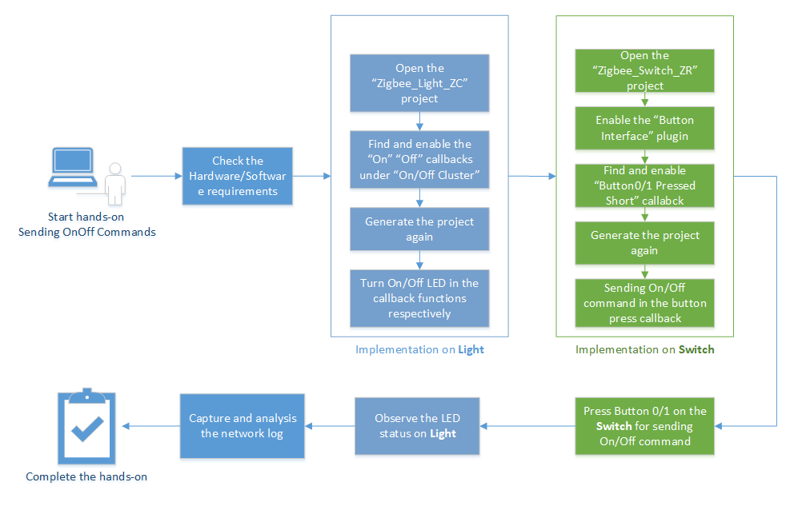
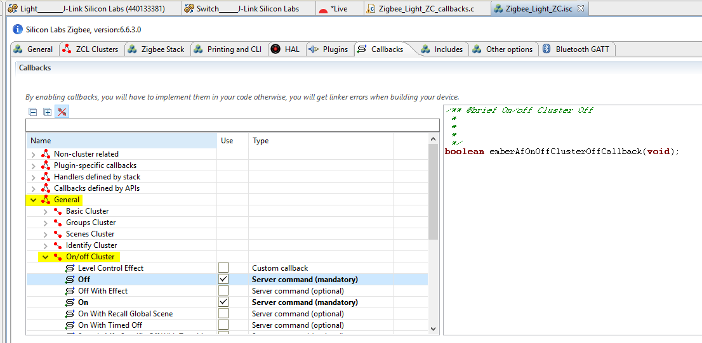
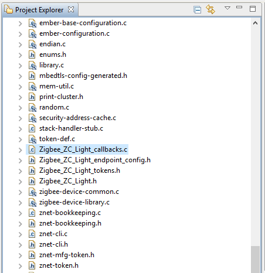
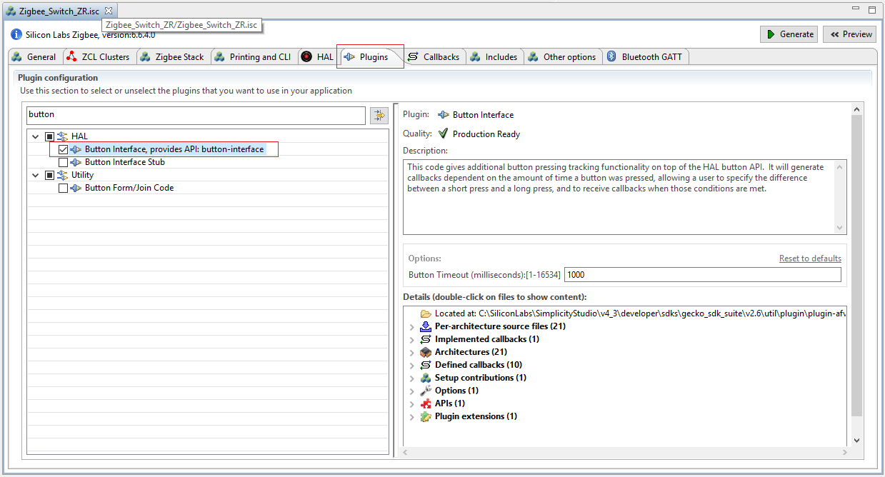
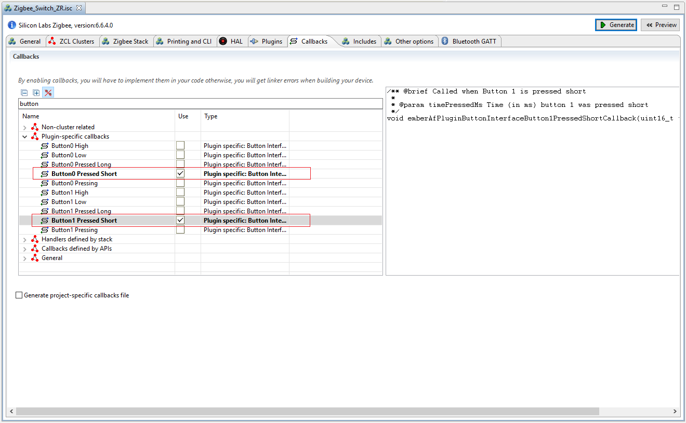
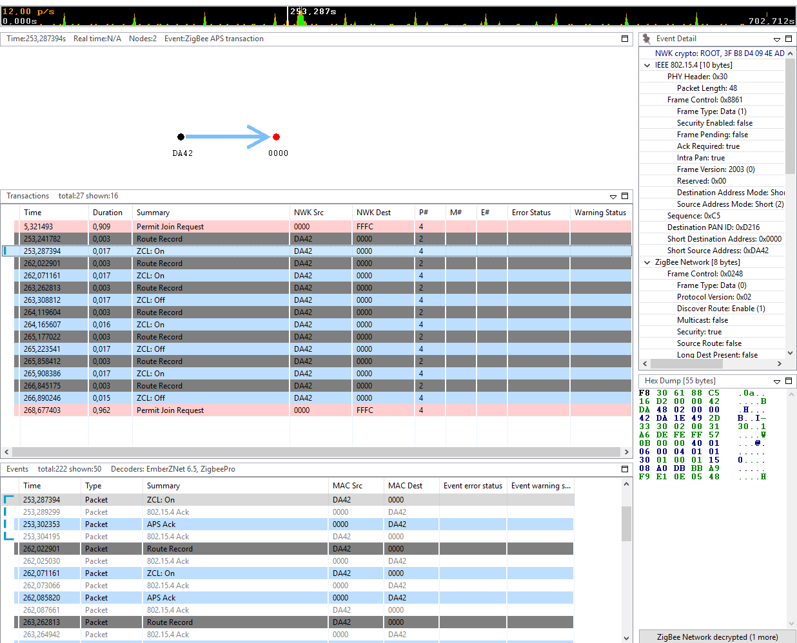
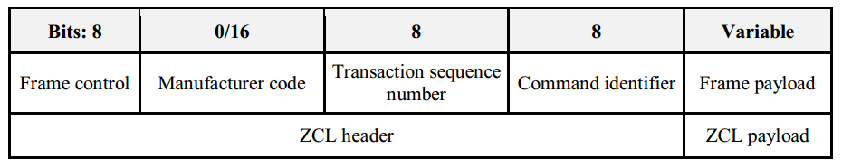
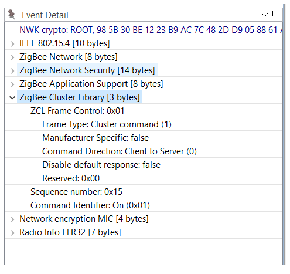
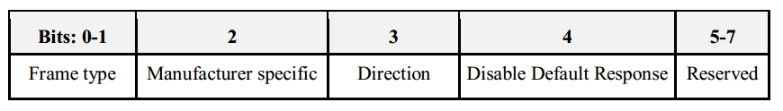

<details>
<summary><font size=5>目录</font> </summary>

- [1. 简介](#1-简介)
    - [1.1. 应用功能](#11-应用功能)
    - [1.2. 目的](#12-目的)
- [2. 基本步骤](#2-基本步骤)
    - [2.1. 硬体需求](#21-硬体需求)
    - [2.2. 软件需求](#22-软件需求)
        - [2.2.1. 检查EmberZNet SDK](#221-检查EmberZNet SDK)
        - [2.2.2. 检查工具链](#222-检查工具链)
        - [2.2.3. 使用Gecko Bootloader](#223-使用Gecko Bootloader)
- [3. 发送开/关命令](#3-发送开/关命令)
    - [3.1. Light上的命令处理](#31-Light上的命令处理)
    - [3.2. 从Switch发送命令](#32-从Switch发送命令)
- [4. 测试您的项目](#4-测试您的项目)
- [5. 结论](#5-结论)

</details>

***
[English](Zigbee-Hands-on-Sending-OnOff-Commands.md) | Chinese

# 1. 简介
## 1.1. 应用功能
新手训练营系列动手研讨会将涵盖以下四个功能，应用程序开发分别分为四个步骤，以展示应如何从一开始就构建应用程序。

本文档中的练习是“ Zigbee新手训练营”系列中的第一个练习。 
-   在第一阶段，将实现由Light构建的基本网络以及Switch的加入过程。
-  	**第二部分将使用API准备设备以发送，接收和处理On-Off命令**。  
-   在第三步，Switch将有一个定期事件来执行任何自定义代码，在我们的案例中，这将是一个LED闪烁。
-   要做的第四件事是使Switch能够使用非易失性存储器在其闪存中存储任何自定义数据。 

## 1.2. 目的
在之前的动手“构建和加入”中，我们学习了如何构建基本的集中式Zigbee网络并加入该网络。在本动手操作中，我们将演示如何从Switch节点向Light节点发送关闭命令，以操作那里的LED。
与以前的动手实验相同，该网络将使用两个设备，即两个BRD4162A（EFR32MG12）开发板。
下图说明了该动手操作的流程。

<div align="center">
    
</div>  
</br>  

在执行所有单个步骤之前，有必要检查一些基础知识，以避免在开发过程中出现不必要的问题。我们希望再次突出显示它，因为我们在上一个动手实践中已对其进行了记录。

*** 

# 2. 基本步骤
无论是创建应用程序或是设备类型，在开始开发之前都必须执行一些常规步骤。

## 2.1. 硬体需求
* 2 个WSTK主要开发板 
* 2个EFR32MG12无线板（BRD4162A）  

## 2.2. 软件需求
确保已在PC上安装了最新的EmberZNet SDK（在本文撰写时为v6.6.4）和兼容的GCC工具链。 

### 2.2.1. 检查EmberZNet SDK
1. 启动Simplicity Studio v4。 
2.	转到Windows ->Preference -> Simplicity Studio-> SDK，确保已安装“ EmberZNet 6.6.4”。
它是Gecko SDK Suite 2.6.4的一部分，因此并不单独出现。请参见下面的图2-1。


<div align="center">
    
</div>  
<div align="center">
  <b>Figure 2-1 Check installed EmberZNet SDK</b>
</div>  

### 2.2.2. 检查工具链
1.	转到Windows->Preference -> Simplicity Studio->工具链，确保已安装GCC工具链。
在构建项目时使用与构建SDK附带的库相同的工具链版本非常重要。可以在[此处](https://www.silabs.com/community/software/simplicity-studio/knowledge-base.entry.html/2018/08/22/gecko_sdk_suite_tool-qlc4)找到正确的工具链-SDK配对的列表。请参见下面的图2-2。

<div align="center">
    
</div>  
<div align="center">
  <b>Figure 2‑2 Check the Toolchain</b>
</div>  

### 2.2.3. 使用Gecko Bootloader
引导加载程序是存储在保留的闪存中的程序，可以初始化设备，更新固件镜像并可能执行某些完整性检查。如果应用程序似乎没有运行，请始终检查引导加载程序，因为缺少引导加载程序会导致程序崩溃。
**注意**: 在本系列动手练习的开始，强烈建议对Gecko SDK随附的预构建引导加载程序镜像进行编程。以“ -combined”结尾的镜像（例如，bootloader-storage-internal-single-combined.s37）应该闪烁，其中包含Gecko Bootloader的第一和第二阶段。该镜像可以在如下位置找到
```c:\SiliconLabs\SimplicityStudio\v4\developer\sdks\gecko_sdk_suite\v2.6\platform\bootloader\sample-apps\bootloader-storage-internal-single\efr32mg12p332f1024gl125-brd4162a\```  

有关如何将Gecko Bootloader添加到Zigbee项目的更多信息，请阅读[预备课程](https://github.com/MarkDing/IoT-Developer-Boot-Camp/wiki/Zigbee-Preparatory-Course#using-gecko-bootloader)。 
**提示**: 有关Gecko Bootloader的更多信息，请参见下面的文档。  
[UG266: Silicon Labs Gecko引导程序用户指南](https://www.silabs.com/documents/public/user-guides/ug266-gecko-bootloader-user-guide.pdf)  
[UG103.6: 引导程序基础知识](https://www.silabs.com/documents/public/user-guides/ug103-06-fundamentals-bootloading.pdf)  
[AN1084: 将Gecko引导程序与EmberZNet和Silicon Labs线程一起使用](https://www.silabs.com/documents/public/application-notes/an1084-gecko-bootloader-emberznet-silicon-labs-thread.pdf)  

*** 

# 3. 发送开/关命令

在之前的动手实验中，我们创建了两个项目Zigbee_Light_ZC和Zigbee_Switch_ZR，这两个设备现在位于同一网络中，并准备在网络上发送和接收数据。
在此应用程序中，Switch设备应基于已按下的按钮来发送“打开/关闭”命令，而Light应用程序应根据接收到的命令打开/关闭LED1。
我们的任务是为这些功能准备设备。

## 3.1. Light上的命令处理
为了了解从用户应用级接收到的任何命令，应使用回调函数。
可以在AppBuilder的“回调”选项卡中启用这些功能。
打开此选项卡，在“常规/ OnOff群集”菜单下找到并启用“打开”“关闭”回调。请参阅图3-1。
<div align="center">
    
</div>  
<div align="center">
  <b>图3-1开/关集群回调启用</b>
</div>  
</br>  

保存修改后的.isc文件，然后按*Generate*。

也许注意到*<ProjectName> _callbacks.c*在重新生成时未被覆盖，但是*callback-stub.c*被覆盖。其背后的原因是ZCL或插件定义的所有回调都可以由堆栈调用。即使用户未使用这些回调，也应将它们放在避免编译器错误的位置。该*callback-stub.c*服务于这个目的。
启用回调后，应将其从*callback-stub.c*中删除，并留在*<ProjectName> _callbacks.c*中。这意味着，应该将启用的回调手动添加到*Zigbee_Light_ZC_callbacks.c*文件并实现所需的功能。

从项目资源管理器中打开*Zigbee_Light_ZC_Callback.c*，如下所示。

<div align="center">
    
</div> 
</br>   

该实验的每个步骤在主[参考项目](https://github.com/MarkDing/IoT-Developer-Boot-Camp/tree/master/zigbee)中都会有一个关联的注释，该注释从“ Send-OnOff-Commands：步骤1”开始，这将使用户受益于导航到正确的代码实现位置。

找到步骤1的注释，并按如下所示实现应用程序代码。

```
// Sending-OnOff-Commands: Step 1
bool emberAfOnOffClusterOnCallback(void){
  emberAfCorePrintln("On command is received");
  halSetLed(1);
}

bool emberAfOnOffClusterOffCallback(void){
  emberAfCorePrintln("Off command is received");
  halClearLed(1);
}

bool emberAfOnOffClusterToggleCallback(void){
  emberAfCorePrintln("Toggle command is received");
  halToggleLed(1);
}
```

## 3.2. 从Switch设备发送命令
首先，应该找到一个地方来存放我们的代码以发送命令。为此，使用按钮触发回调。
按钮操作由**按钮接口**插件处理，因此应将其启用。


<div align="center">
    
</div> 
</br>  

该插件定义了一些回调，因此可以在*回调*选项卡中找到这些回调。移动到此处并同时启用**Button0 Pressed Short **和**Button1 Pressed Short **回调函数，分别发送On和Off命令。
<div align="center">
    
</div> 
</br>  

保存并点击“Generate”生成。 

与第3.1章在Light设备上的命令处理类似，将功能“ emberAfPluginButtonInterfaceButton0PressedShortCallback（）”和“ emberAfPluginButtonInterfaceButton1PressedShortCallback（）”手动添加到Zigbee_Switch_ZR_callbacks.c文件中。
保存修改后的.isc文件，然后按*Generate*。
每个命令在发送之前都存储在缓冲区中。传输的数据缓冲区应按以下方式构建：
实际的ZCL命令由以下功能发出。将\<\>替换为“打开”或“关闭”。

```
emberAfFillCommandOnOffCluster<>()
```

必须设置由哪个端点发送到哪个端点。 
```
emberAfSetCommandEndpoints(emberAfPrimaryEndpoint(), 1);
```

将消息作为单播发送到设备0x0000，然后发送到协调器。 
```
emberAfSendCommandUnicast(EMBER_OUTGOING_DIRECT, 0x0000);
```

找到步骤2的注释，并实施完整的功能代码，如下所示。
```
// Sending-OnOff-Commands: Step 2
void emberAfPluginButtonInterfaceButton0PressedShortCallback(uint16_t timePressedMs)
{
  emberAfCorePrintln("Button0 is pressed for %d milliseconds",timePressedMs);

  EmberStatus status;

  emberAfFillCommandOnOffClusterOn()
  emberAfCorePrintln("Command is zcl on-off ON");

  emberAfSetCommandEndpoints(emberAfPrimaryEndpoint(),1);
  status=emberAfSendCommandUnicast(EMBER_OUTGOING_DIRECT, 0x0000);

  if(status == EMBER_SUCCESS){
    emberAfCorePrintln("Command is successfully sent");
  }else{
    emberAfCorePrintln("Failed to send");
    emberAfCorePrintln("Status code: 0x%x",status);
  }
}

void emberAfPluginButtonInterfaceButton1PressedShortCallback(uint16_t timePressedMs)
{
  emberAfCorePrintln("Button1 is pressed for %d milliseconds",timePressedMs);

  EmberStatus status;

  emberAfFillCommandOnOffClusterOff()
  emberAfCorePrintln("Command is zcl on-off OFF");

  emberAfSetCommandEndpoints(emberAfPrimaryEndpoint(),1);
  status=emberAfSendCommandUnicast(EMBER_OUTGOING_DIRECT, 0x0000);

  if(status == EMBER_SUCCESS){
    emberAfCorePrintln("Command is successfully sent");
  }else{
    emberAfCorePrintln("Failed to send");
    emberAfCorePrintln("Status code: 0x%x",status);
  }
}
```

***

# 4. 测试您的项目
前2章介绍了如何使设备能够通过某些API发送和接收命令。
生成应用程序并将输出文件下载到目标设备。在对设备进行编程之前，请退出网络日志捕获，因为在连接网络分析器（或Energy Profiler）时调试器无法访问芯片。
**注意**：请**不要**在编程之前擦除设备，否则“ znet”令牌将被删除，并且设备将无法加入网络，只能按照上一个实验中的说明再次[加入网络](https://github.com/MarkDing/IoT-Developer-Boot-Camp/wiki/Zigbee-Hands-on-Forming-and-Joining#73-join-the-network-on-switch-router-device)。
按Button0发送ON命令，您将注意到Light上的LED1打开。
按下Button1发送OFF命令，您会注意到Light 1的LED1熄灭。
**注意**：默认情况下，Light节点上的LED0用于指示网络活动，因此，如果发送任何命令，为什么还会观察light节点上的LED0闪烁。
同时，请查看设备的CLI。Switch应在串行控制台上打印如下内容：
```
Button0 is pressed for 161 milliseconds
Command is zcl on-off ON
Command is successfully sent

Button1 is pressed for 121 milliseconds
Command is zcl on-off OFF
Command is successfully sent
```

Light的串行控制台输出为：
```
Processing message: len=3 profile=0104 cluster=0006
T00000000:RX len 3, ep 01, clus 0x0006 (On/off) FC 01 seq 17 cmd 01 payload[]
On command is received

Processing message: len=3 profile=0104 cluster=0006
T00000000:RX len 3, ep 01, clus 0x0006 (On/off) FC 01 seq 18 cmd 00 payload[]
Off command is received
```

在网络分析器中也可以观察到以上事务。请参阅图3-2。

<div align="center">
    
</div>  
<div align="center">
  <b>图3-2网络分析仪中的ZCL开/关命令</b>
</div>  
</br>  

以on / off命令为例，指定通用ZCL帧的格式，ZCL帧格式由ZCL头和ZCL有效数据包。常规ZCL帧的格式应如下图所示。
<div align="center">
    
</div>  
<div align="center">
  <b>图3-3常规ZCL帧的格式</b>
</div> 
</br>  

使用网络分析仪，您可以捕获“打开/关闭”命令的网络跟踪，如下所示。 
<div align="center">
    
</div>  

**帧控制**  
帧控制字段的长度为8位，并包含定义命令类型和其他控制标志的信息。帧控制字段的格式如下图所示。

<div align="center">
    
</div>  
<div align="center">
  <b>图3-4帧控制字段的格式</b>
</div> 
</br>  

“开/关”命令中的**帧类型**为0b1，表示该命令是特定或本地群集的（“开/关”群集）。
**特定制造商**子字段的值在开/关命令中被设置为false，制造商代码字段将不被包括在所述帧ZCL。
“ 开/关”命令中的**方向**子字段为0b0，表示该命令正在从群集的客户端（Switch）发送到群集的服务器端（Light）。
“ 打开/关闭”命令中的**禁用默认响应**子字段为0b1。这意味着仅在存在错误的情况下（以及在Zigbee群集库规范记录的指定条件下），才会返回“默认响应”命令。

**制造商代码** 制造商代码字段的长度为16位，并为专有扩展指定了分配的制造商代码。如果将帧控制字段的“ 制造商特定”子字段设置为1（指示此命令引用了制造商特定扩展名），则该字段仅应包含在ZCL框架中。
由于“ 开/关”命令框控制字段的“ 制造商特定”子字段设置为0，因此将不包括“ 制造商代码”。

**事务序列号** 事务序列号字段的长度为8位，并指定单个事务的标识号。

**命令标识符** “命令标识符”字段的长度为8位，用于指定要使用的集群命令。下面列出了On / Off群集的部分命令ID。

ID | Description
-|-
0x00 | Off |
0x01 | On |
0x02 | Toggle |

**帧有效数据包**
帧有效数据包字段的长度可变，并且包含特定于各个命令类型的信息。“打开”和“关闭”命令都没有有效数据位。

***

# 5. 结论
在本动手实践中，您学习了如何发送不同的ZCL命令以及如何从用户应用级处理收到的命令。以及如何启用/禁用不同功能的插件来满足您的需求。
还演示了如何使用网络分析器工具评估在Zigbee网络中传输的数据。
