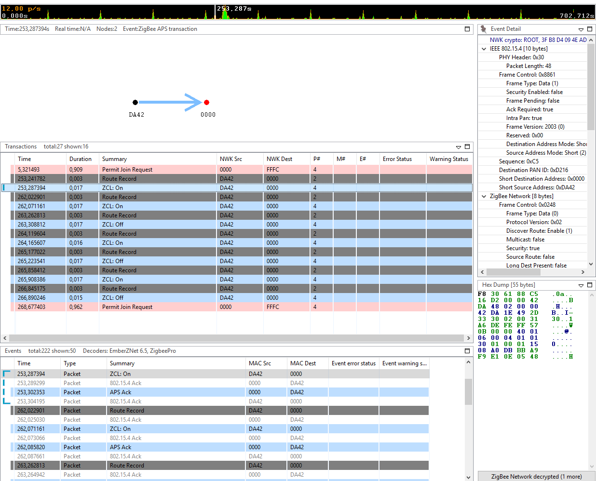
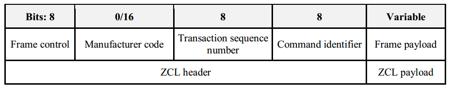
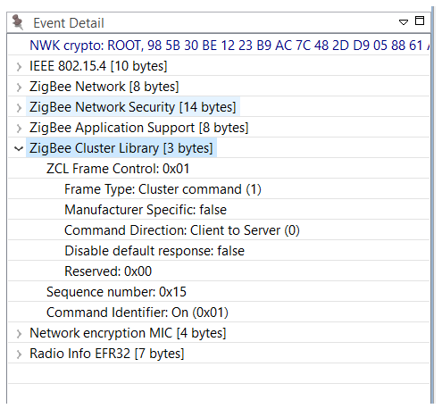
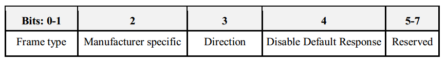

English | [中文](Zigbee-Hands-on-Sending-OnOff-Commands-CN)

<details>
<summary><font size=5>Table of Contents</font> </summary>

- [1. Introduction](#1-introduction)
  - [1.1. Application features](#11-application-features)
  - [1.2. Purpose](#12-purpose)
- [2. Fundamental steps](#2-fundamental-steps)
  - [2.1. Hardware Requirements](#21-hardware-requirements)
  - [2.2. Software Requirements](#22-software-requirements)
    - [2.2.1. Check EmberZNet SDK](#221-check-emberznet-sdk)
    - [2.2.2. Check Toolchains](#222-check-toolchains)
    - [2.2.3. Using Gecko Bootloader](#223-using-gecko-bootloader)
- [3. Sending On/Off command](#3-sending-onoff-command)
  - [3.1. Command handling on Light device](#31-command-handling-on-light-device)
  - [3.2. Command sending from Switch device](#32-command-sending-from-switch-device)
- [4. Testing your project](#4-testing-your-project)
- [5. Conclusion](#5-conclusion)

</details>

***

# 1. Introduction
## 1.1. Application features
The boot camp series hands-on workshop will cover four functionalities below, and the application development is split into four steps respectively to show how an application should be built up from the beginning.

The exercise is the 2nd part of series “Zigbee Boot Camp” course.  
-   In the 1st phase, a basic network forming by the Light, and a joining process by the Switch will be realized.
-   **The 2nd part will prepare the devices to transmit, receive, and process the On-Off commands by using APIs.**
-   At the 3rd step the Switch will have a periodic event to execute any custom code, which will be a LED blinking in our case.
-   The 4th thing to do is to make the Switch to be able to store any custom data in its flash by using Non-volatile memory.

## 1.2. Purpose
In the previous hand-on “Forming and Joining”, we learned how to form a basic centralized Zigbee network and join the network. In this hands-on, we will demonstrate how to send on off command from the Switch node to the Light node for operating the LEDs there.  
Same as the previous hands-on, the network will consist of two devices by using board of BRD4162A (EFR32MG12).  
The figure below illustrates the working flow of this hands-on.  

<div align="center">
    
</div>  
</br>  

Before all the individual steps would be performed, it’s necessary to check some basics to avoid unwanted issues during the development. We’d like to highlight it again as we have documented it in the previous hands-on.

*** 

# 2. Fundamental steps
Regardless of the created application or device type, there are some general steps that must be done prior to start the development.

## 2.1. Hardware Requirements
* 2 WSTK Main Development Board
* 2 EFR32MG12 radio boards (BRD4162A)

## 2.2. Software Requirements
Make sure you have installed the EmberZNet 6.6.4 SDK or later and GCC toolchain on your PC.

### 2.2.1. Check EmberZNet SDK
1. Launch Simplicity Studio v4.
2. Go to Window -> Preference -> Simplicity Studio -> SDKs, make sure "EmberZNet 6.6.4" is installed. 
It is part of the Gecko SDK Suite 2.6.4, therefore it doesn’t appear itself. See the Figure 2-1 below.  

<div align="center">
    
</div>  
<div align="center">
  <b>Figure 2-1 Check installed EmberZNet SDK</b>
</div>  

### 2.2.2. Check Toolchains
1. Go to Windows -> Preference -> Simplicity Studio -> Toolchains, make sure GCC toolchain is installed.  
It is important to use the same toolchain version when building your project that was used to build the libraries supplied as part of the SDK. The list of the proper toolchain-SDK pairing can be found [here](https://www.silabs.com/community/software/simplicity-studio/knowledge-base.entry.html/2018/08/22/gecko_sdk_suite_tool-qlc4). See Figure 2‑2.

<div align="center">
    
</div>  
<div align="center">
  <b>Figure 2‑2 Check the Toolchain</b>
</div>  

### 2.2.3. Using Gecko Bootloader
A bootloader is a program stored in reserved flash memory that can initialize a device, update firmware images, and possibly perform some integrity checks. If the application seems to do not running, always check the bootloader, because lack of it causes program crash.  
**Note**: At the beginning of this series hands-on, it's highly recommended to program the pre-built bootloader images which comes with the Gecko SDK to the devices. The image that ends with "-combined" (e.g. bootloader-storage-internal-single-combined.s37) should be flashed, it contains the first+second stage of the Gecko Bootloader. The image can be found at  
```c:\SiliconLabs\SimplicityStudio\v4\developer\sdks\gecko_sdk_suite\v2.6\platform\bootloader\sample-apps\bootloader-storage-internal-single\efr32mg12p332f1024gl125-brd4162a\```  

For more information about how to add Gecko Bootloader to your Zigbee project, please read the [preparatory course](Zigbee-Preparatory-Course#32-using-gecko-bootloader).  
**Hint**: More information about Gecko Bootloader, please find the documentations below.  
[UG266: Silicon Labs Gecko Bootloader User’s Guide](https://www.silabs.com/documents/public/user-guides/ug266-gecko-bootloader-user-guide.pdf)  
[UG103.6: Bootloader Fundamentals](https://www.silabs.com/documents/public/user-guides/ug103-06-fundamentals-bootloading.pdf)  
[AN1084: Using the Gecko Bootloader with EmberZNet and Silicon Labs Thread](https://www.silabs.com/documents/public/application-notes/an1084-gecko-bootloader-emberznet-silicon-labs-thread.pdf)  

*** 

# 3. Sending On/Off command

In the previous hands-on, we have created two projects, Zigbee_Light_ZC and Zigbee_Switch_ZR, and these two devices are now in the same network and ready to transmit and receive data on the network.  
In this application, the Switch device should send one of the On/Off commands based on which button has been pressed, and the Light application should turn on/off the LED1 based on the received command.  
Our task is to prepare the devices for these features.  

## 3.1. Command handling on Light device
To become aware of any received command from the user application level, the Callback functions should be used.  
These functions can be enabled in the "Callbacks" tab of the AppBuilder.  
Open this tab, find and enable the "On" "Off" callbacks under "General/OnOff Cluster" menu. See Figure 3‑1.  

<div align="center">
    
</div>  
<div align="center">
  <b>Figure 3‑1 On/Off Cluster callbacks enabling</b>
</div>  
</br>  

Save the modified .isc file and press *Generate*.  

Maybe noticed that the *\<ProjectName\>_callbacks.c* is not overwritten at re-generating time, but the *callback-stub.c* is. The reason behind this is that all the callbacks which are defined by the ZCL or Plugins could be called by the stack. These should be placed somewhere to avoid compiler errors, even if these callbacks are not used by the user. The *callback-stub.c* serves this purpose.  
When a callback is enabled, it should be taken off from the *callback-stub.c* and reside into the *\<ProjectName\>_callbacks.c*. It means for use that the enabled callbacks should be added manually to the *Zigbee_Light_ZC_callbacks.c* file and implement the desired functionality.  

Open Zigbee_Light_ZC_Callback.c from the project explorer as show below.  

<div align="center">
    
</div> 
<div align="center">
  <b>Figure 3‑2 Implement callback function</b>
</div>  
</br>   

Implement the application code as below.  

```
// Sending-OnOff-Commands: Step 1
bool emberAfOnOffClusterOnCallback(void){
  emberAfCorePrintln("On command is received");
  halSetLed(1);
}

bool emberAfOnOffClusterOffCallback(void){
  emberAfCorePrintln("Off command is received");
  halClearLed(1);
}

bool emberAfOnOffClusterToggleCallback(void){
  emberAfCorePrintln("Toggle command is received");
  halToggleLed(1);
}
```

## 3.2. Command sending from Switch device
First, a place should be found to reside our code for sending the command. For this purpose, a callback is triggered by button press is used.  
The button operations are handled by the **Button Interface** plugin, so it should be enabled.  

<div align="center">
    
</div> 
<div align="center">
  <b>Figure 3‑3 Enable the Button Interface plugin</b>
</div>  
</br>  

The plugin defines some callbacks, so these can be found in the *Callbacks* tab. Move there and enable both the **Button0 Pressed Short** and **Button1 Pressed Short** callback function for sending On and Off command respectively.  
<div align="center">
    
</div> 
<div align="center">
  <b>Figure 3‑4 Enable the callback functions</b>
</div>  
</br>  

Save and generate.  

Similarly to [chapter 3.1 Command handling on Light device](#31-command-handling-on-light-device), add the function "emberAfPluginButtonInterfaceButton0PressedShortCallback()" and "emberAfPluginButtonInterfaceButton1PressedShortCallback()" manually to the *Zigbee_Switch_ZR_callbacks.c* file.  
Save the modified .isc file and press *Generate*.  
Every command is stored in a buffer before it had been sent. The transmitted data buffer should be built up as below:  
The actual ZCL command is made by the function below. Replace \<\> to “On” or “Off”.  

```
emberAfFillCommandOnOffCluster<>()
```

It has to be set which endpoint send to which endpoint.  
```
emberAfSetCommandEndpoints(emberAfPrimaryEndpoint(), 1);
```

Send the message as unicast to the device 0x0000, so to the Coordinator.  
```
emberAfSendCommandUnicast(EMBER_OUTGOING_DIRECT, 0x0000);
```

Locate the comment for step 2, and implement the complete function code like the below.  
```
// Sending-OnOff-Commands: Step 2
void emberAfPluginButtonInterfaceButton0PressedShortCallback(uint16_t timePressedMs)
{
  emberAfCorePrintln("Button0 is pressed for %d milliseconds",timePressedMs);

  EmberStatus status;

  emberAfFillCommandOnOffClusterOn()
  emberAfCorePrintln("Command is zcl on-off ON");

  emberAfSetCommandEndpoints(emberAfPrimaryEndpoint(),1);
  status=emberAfSendCommandUnicast(EMBER_OUTGOING_DIRECT, 0x0000);

  if(status == EMBER_SUCCESS){
    emberAfCorePrintln("Command is successfully sent");
  }else{
    emberAfCorePrintln("Failed to send");
    emberAfCorePrintln("Status code: 0x%x",status);
  }
}

void emberAfPluginButtonInterfaceButton1PressedShortCallback(uint16_t timePressedMs)
{
  emberAfCorePrintln("Button1 is pressed for %d milliseconds",timePressedMs);

  EmberStatus status;

  emberAfFillCommandOnOffClusterOff()
  emberAfCorePrintln("Command is zcl on-off OFF");

  emberAfSetCommandEndpoints(emberAfPrimaryEndpoint(),1);
  status=emberAfSendCommandUnicast(EMBER_OUTGOING_DIRECT, 0x0000);

  if(status == EMBER_SUCCESS){
    emberAfCorePrintln("Command is successfully sent");
  }else{
    emberAfCorePrintln("Failed to send");
    emberAfCorePrintln("Status code: 0x%x",status);
  }
}
```

***

# 4. Testing your project
The previous 2 chapters presented how to make the devices to be able to send and receive commands through some APIs.  

Build the applications and download the output files to the target devices. Please exit from the network log capturing before programming the device, because the debugger has no access to the chip while the Network Analyzer (or Energy Profiler) is connected.  
**Note**: Please **do not** erase the device before programming, otherwise the "znet" tokes will be deleted, and the device cannot join the network except [Join the network](Zigbee-Hands-on-Forming-and-Joining#73-join-the-network-on-switch-router-device) again as instructed in last lab.  

Press Button0 to send the ON command, and you will notice that LED1 on the Light turn on.  
Press Button1 to send the OFF command, and you will notice that LED1 on the Light turn off.  

**Note**: The LED0 on the Light node is used for indicating the network activity by default, that why you will also observe the LED0 on the light node is blinky if send any command it.  
In the meantime, have a look at the CLI of the devices. The Switch should print something like the followings on the serial console:  
```
Button0 is pressed for 161 milliseconds
Command is zcl on-off ON
Command is successfully sent

Button1 is pressed for 121 milliseconds
Command is zcl on-off OFF
Command is successfully sent
```

The serial console output of the Light is:  
```
Processing message: len=3 profile=0104 cluster=0006
T00000000:RX len 3, ep 01, clus 0x0006 (On/off) FC 01 seq 17 cmd 01 payload[]
On command is received

Processing message: len=3 profile=0104 cluster=0006
T00000000:RX len 3, ep 01, clus 0x0006 (On/off) FC 01 seq 18 cmd 00 payload[]
Off command is received
```

The above transactions can be observed in the Network Analyzer as well. See Figure 4‑1.  

<div align="center">
    
</div>  
<div align="center">
  <b>Figure 4‑1 ZCL On/Off commands in Network Analyzer</b>
</div>  
</br>  

Take the on/off command as a example to specifies the format of the General ZCL Frame, the ZCL frame format is composed of a ZCL header and a ZCL payload. The general ZCL frame SHALL be formatted as illustrated in the figure below.  

<div align="center">
    
</div>  
<div align="center">
  <b>Figure 4‑2 Format of the General ZCL Frame</b>
</div> 
</br>  

With the network analyzer, you can capture the network trace of the On/Off commands similar as below.  
<div align="center">
    
</div>  
<div align="center">
  <b>Figure 4‑3 Captured onoff command</b>
</div> 

**Frame Control**  
The frame control field is 8 bits in length and contains information defining the command type and other control flags. The frame control field SHALL be formatted as shown in the figure below.  

<div align="center">
    
</div>  
<div align="center">
  <b>Figure 4‑4 Format of the Frame Control Field</b>
</div> 
</br>  

The **Frame type** in the On/Off command is 0b1 indicates the command is specific or local to a cluster (On/Off cluster).  
The value of **Manufacturer Specific** sub-field is set to false in the On/Off command, and the manufacturer code field will not be included in the ZCL frame.  
The **Direction** sub-field in the On/Off command is 0b0 indicates the command is being sent from the client side (Switch) of a cluster to the server side (Light) of a cluster.  
The **Disable Default Response** sub-field in the On/Off command is 0b1. It means the Default Response command will only be returned if there is an error, also under the specified conditions documented by Zigbee Cluster Library Specification.   

**Manufacturer Code**
The manufacturer code field is 16 bits in length and specifies the assigned manufacturer code for proprietary extensions. This field SHALL only be included in the ZCL frame if the **Manufacturer Specific** sub-field of the frame control field is set to 1 that indicates this command refers to a manufacturer specific extension.  
Because the **Manufacturer Specific** sub-field of the On/Off command frame control field is set to 0, so the **Manufacturer Code** will not be included.  

**Transaction Sequence Number**
The Transaction Sequence Number field is 8 bits in length and specifies an identification number for a single transaction.  

**Command Identifier**
The Command Identifier field is 8 bits in length and specifies the cluster command being used. And part of the command IDs for the On/Off cluster are listed below.  

ID | Description
-|-
0x00 | Off |
0x01 | On |
0x02 | Toggle |

**Frame Payload**
The frame payload field has a variable length and contains information specific to individual command types. Both the On and Off commands have no payload.  

***

# 5. Conclusion
In this hands-on, you learned how to send different ZCL command and how to handle the received command from the user application level. As well as how to enable/disable different plugins for different functionality to meet your needs.  
Also demonstrates how to evaluate the data being transmitted in the Zigbee network using the Network Analyzer tool.  
