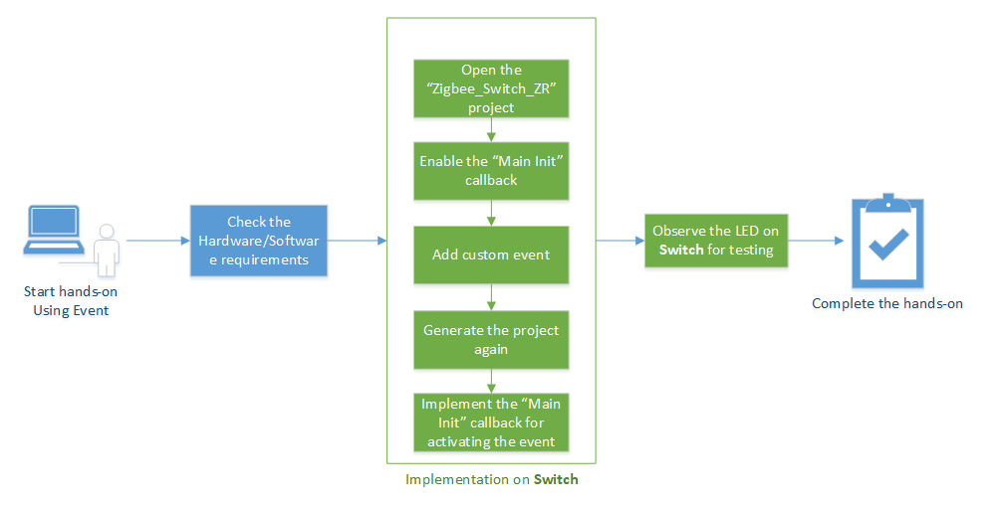
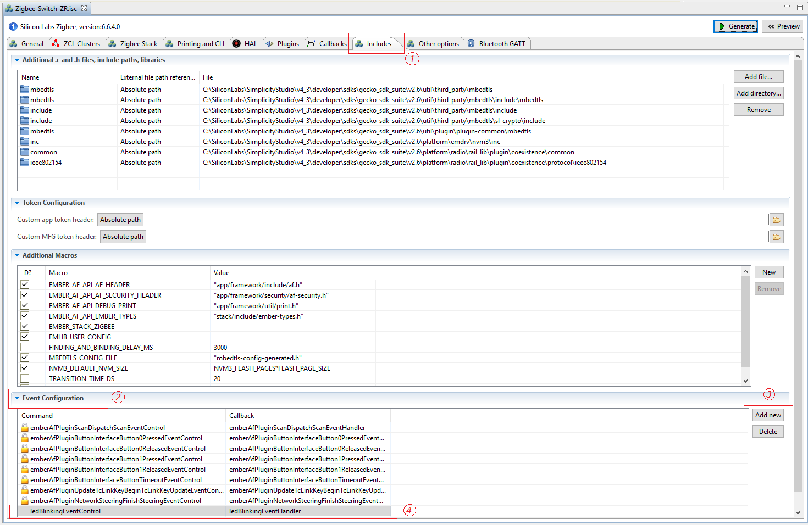
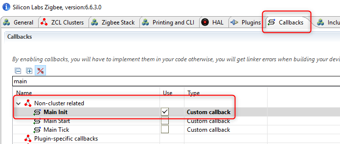

<details>
<summary><font size=5>目录</font> </summary>

- [1. 简介](#1-简介)
    - [1.1. 应用功能](#11-应用功能)
    - [1.2. 目的](#12-目的)
- [2. 使用事件](#2-使用事件)
- [3. 测试您的项目](#3-测试您的项目)
- [4. 结论](#4-结论)

</details>

***

# 1. 简介

## 1.1. 应用功能
新手训练营系列动手研讨会将涵盖以下四个功能，应用程序开发分别分为四个步骤，以展示应如何从一开始就构建应用程序。

本文档中的练习是“ Zigbee新手训练营”系列中的第一个练习。 
-   在第一阶段，将实现由Light构建的基本网络以及Switch的加入过程。
-  	第二部分将使用API准备设备以发送，接收和处理On-Off命令。  
-   **在第三步，Switch将有一个定期事件来执行任何自定义代码，在我们的案例中，这将是一个LED闪烁**。
-   要做的第四件事是使Switch能够使用非易失性存储器在其闪存中存储任何自定义数据。 

## 1.2. 目的
在之前的动手实验“构建和加入”和“发送OnOff命令”中，我们学习了如何形构建基本的集中式Zigbee网络并加入该网络，以及如何在Zigbee网状网络从Switch节点向Light节点发送on-off命令。 
在本动手操作中，我们提供了分步说明，以演示如何使用Zigbee堆栈事件机制在Switch节点上安排事件。
下图说明了该动手操作的流程。

<div align="center">
    
</div>  
</br>  

**注意**:
在执行所有单个步骤之前，请确保硬件和软件均已准备就绪，可以进行开发。阅读前两个动手的“ 2个基本步骤”一章，以获取更多详细信息。

# 2.使用事件
Zigbee应用程序框架及其关联的集群代码使用Zigbee堆栈事件机制来安排事件，以在所需的时间间隔运行一段代码。在较高的级别上，事件机制提供了一个中心位置，可以基于一些用户输入，空中命令或设备初始化来激活和停用设备采取的所有定期动作。它使Zigbee应用程序框架能够准确知道何时下一个动作将在设备上发生。对于需要准确知道何时必须醒来以执行某些操作的睡眠设备，或者更重要的是由于某些事件正在进行而无法入睡的睡眠设备，这非常重要。使用Zigbee事件机制的另一个好处是减少了RAM和Flash占用空间。

Zigbee应用程序框架具有两种类型的事件：自定义事件和群集事件。自定义事件由Zigbee应用程序框架用户创建，并且可以在应用程序中用于任何目的。群集事件与Zigbee应用程序框架的插件中的群集实现特别相关。

定制事件包括两部分：事件函数（在事件触发时调用）和EmberEventControl结构（用于安排事件）。Zigbee应用程序框架和AppBuilder提供了一个有用的界面，用于创建自定义事件并将其添加到您的应用程序。

**步骤1：创建自定义事件**  
AppBuilder提供了一种向应用程序添加任何自定义事件的方法。
基本来说，需要两点： 
-   事件控制器–事件的结构 
-   事件处理程序–事件上的功能  

打开*AppBuilder* - > *Includes* 标签。将定制事件命令```ledBlinkingEventControl```和回调分别添加```ledBlinkingEventHandler```到 *Event Configuration*窗口。参见下图。
<div align="center">
    
</div>  
<div align="center">
  <b>在AppBuilder中添加自定义事件</b>
</div>  
</br>  

**第2步：启用MainInit回调**  
事件应在代码中的某个位置开始，因此应使用在应用程序开头调用的函数。该主初始化回调从应用程序的主函数调用。它使应用程序有机会进行系统启动时所需的任何初始化。可以想象它就像经典“ *while（true）* ” 之前的*“ main（）”*顶部的函数。 双击Zigbee_Switch_ZR.isc文件以使用AppBuilder打开它，然后在AppBuilder的“回调”选项卡中启用此回调。参见下图。

<div align="center">
    
</div>  
<div align="center">
  <b>主初始化回调启用</b>
</div>  
</br>  

保存并点击”Generate”生成项目。

**步骤3：安排事件**  
如前所述，回调函数```emberAfMainInitCallback()```应被添加到*Zigbee_Switch_ZR_callbacks.c*文件中并安排事件。
相关代码段应类似于以下内容。有关如何使用API安排事件的更多信息，请参阅[API文档](https://docs.silabs.com/zigbee/latest/em35x/group-event)。

```
// Using-event: Step 3
EmberEventControl ledBlinkingEventControl;

void emberAfMainInitCallback(void)
{
  emberEventControlSetDelayMS(ledBlinkingEventControl, 5000);
}

void ledBlinkingEventHandler(void)
{
  // First thing to do inside a delay event is to disable the event till next usage
  emberEventControlSetInactive(ledBlinkingEventControl);

  halToggleLed(1);

  //Reschedule the event after a delay of 2 seconds
  emberEventControlSetDelayMS(ledBlinkingEventControl, 2000);
}
```

值得一提的是，应在事件的功能开始执行后立即将其设置为非活动状态，并在完成后重新安排时间。

# 3. 测试您的项目
建立应用程序，然后将映像下载到Switch设备。按下入门工具包上的Reset（重置）按钮，您会注意到板上的LED1会在延迟几秒钟后打开，然后以2s的间隔闪烁。

# 4. 结论
在本动手实践中，您学习了如何创建自定义事件，定义事件功能和事件控制结构以及实现用于计划LED闪烁事件的事件功能。
