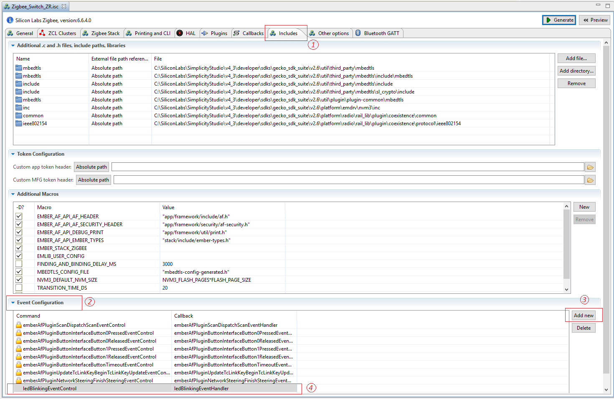

English | [中文](Zigbee-Hands-on-Using-Event-CN)

<details>
<summary><font size=5>Table of Contents</font> </summary>

- [1. Introduction](#1-introduction)
    - [1.1. Application features](#11-application-features)
    - [1.2. Purpose](#12-purpose)
- [2. Using Event](#2-using-event)
- [3. Testing your project](#3-testing-your-project)
- [4. Conclusion](#4-conclusion)

</details>

***

# 1. Introduction

## 1.1. Application features
The boot camp series hands-on workshop will cover four functionalities below, and the application development is split into four steps respectively to show how an application should be built up from the beginning.  
The exercise in this documentation is the 3rd exercise in the “Zigbee Boot Camp” series.  
-   In the 1st phase, a basic network forming by the Light, and a joining process by the Switch will be realized.  
-   The 2nd part will prepare the devices to transmit, receive, and process the On-Off commands by using APIs.  
-   **At the 3rd step the Switch will have a periodic event to execute any custom code, which will be a LED blinking in our case.**  
-   The 4th thing to do is to make the Switch to be able to store any custom data in its flash by using Non-volatile memory.  

## 1.2. Purpose
In the previous hands-on “Forming and Joining” and “Sending OnOff Command”, we learned how to form a basic centralized Zigbee network and join the network, and how to send on-off command from the Switch node to the Light node in the Zigbee mesh network.  
In this hands-on, we provide step-by-step instructions to demonstrate how to use the Zigbee Stack event mechanism to schedule events on the Switch node.  
The figure below illustrates the working flow of this hands-on.  

<div align="center">
    
</div>  
</br>  

**Note**:
Before all the individual steps would be performed, please make sure that both the hardware and software are ready for the development. Read the chapter “2 Fundamental steps” of the previous 2 hands-on for more detail about it.  

# 2. Using Event
The Zigbee application framework and it's associated cluster code use the Zigbee Stack event mechanism to schedule events to run a piece of code at the desired time interval. At a high level, the event mechanism provides a central location where all periodic actions taken by the device can be activated and deactivated based on either some user input, an over-the-air command or device initialization. It allows the Zigbee application framework to know precisely when the next action is going to occur on the device. This is extremely important for sleeping devices that need to know exactly when they must wake up to take some action, or more importantly that they can't go to sleep because some event is in progress. Another benefit of using the Zigbee event mechanism is RAM and Flash footprint reduction.  

The Zigbee application framework has two types of events: custom events and cluster events. Custom events are created by the Zigbee application framework user and can be used for any purpose within the application. Cluster events are specifically related to the cluster implementations in the Zigbee application framework's plugins.  

A custom event consists of two parts: The event function, called when the event fires, and the EmberEventControl struct, which is used to schedule the event. The Zigbee application framework and AppBuilder provide a helpful interface for creating and adding custom events to your application.  

**Step 1: Create a custom event**  
The AppBuilder provides a manner to add any custom event to the application.  
Basically, two things need for this.  
-   Event Controller – structure of the Event  
-   Event Handler – function on the Event  

Open the *AppBuilder* -> *Includes* tab. Add the custom event command ```ledBlinkingEventControl``` and callback ```ledBlinkingEventHandler``` to the *Event Configuration* window respectively. See the figure below.  
<div align="center">
    
</div>  
<div align="center">
  <b>Figure 2-1 Custom event adding in AppBuilder</b>
</div>  
</br>  

**Step 2: Enable the MainInit callback**  
An event should be started somewhere in the code, hence a function should be used which is called at the beginning of the application. The *Main Init* callback is called from the application’s main function. It gives the application a chance to do any initialization required at system startup. It can be imagined like a function at the top of the *“main()”* before the classical “*while(true)*”.  
Double click the Zigbee_Switch_ZR.isc file to open it with the AppBuilder, and then enable this callback in the AppBuilder’s Callbacks tab. See the figure below.  

<div align="center">
    
</div>  
<div align="center">
  <b>Figure 2-2 Main Init callback enabling</b>
</div>  
</br>  

Save and Generate the project.  

**Step 3: Schedule the event**  
As earlier, the callback function ```emberAfMainInitCallback()``` should be added to the *Zigbee_Switch_ZR_callbacks.c* file and schedule the event.  
The related code snippet should be like the followings. More information about how to use the APIs to schedule events, please refer to the [API documentation](https://docs.silabs.com/zigbee/latest/em35x/group-event).  

```
// Using-event: Step 3
EmberEventControl ledBlinkingEventControl;

void emberAfMainInitCallback(void)
{
  emberEventControlSetDelayMS(ledBlinkingEventControl, 5000);
}

void ledBlinkingEventHandler(void)
{
  // First thing to do inside a delay event is to disable the event till next usage
  emberEventControlSetInactive(ledBlinkingEventControl);

  halToggleLed(1);

  //Reschedule the event after a delay of 2 seconds
  emberEventControlSetDelayMS(ledBlinkingEventControl, 2000);
}
```

It's worth to mention that the event should be set to inactive right after its function starts to be executed and re-schedule after it's done.  

# 3. Testing your project
Build the applications and download the image to the Switch devices. Press the Reset button on the starter kit, you will notice that the LED1 on the board will be turned on after few seconds delay, and then blink with 2s interval.  

# 4. Conclusion
In this hands-on, you learned how to create a custom event, define the event function and event control structure, and implement the event function for scheduling the LED blinking event.  
