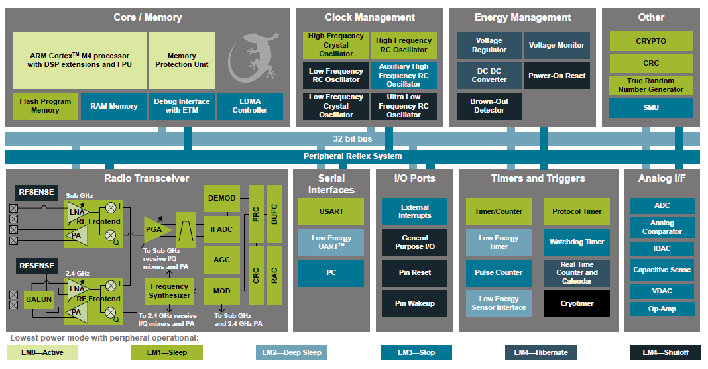
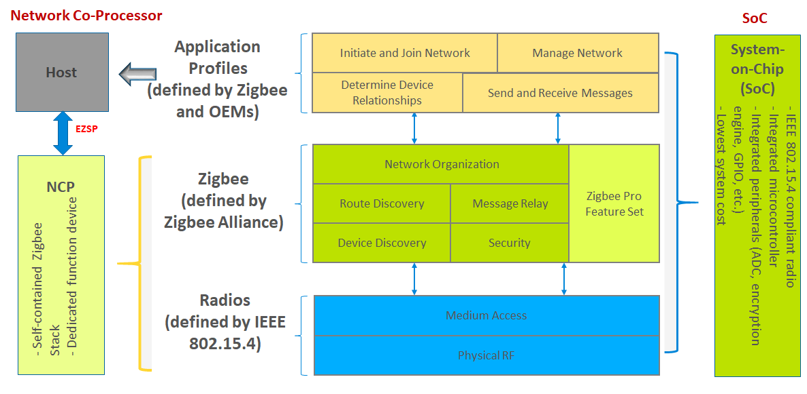
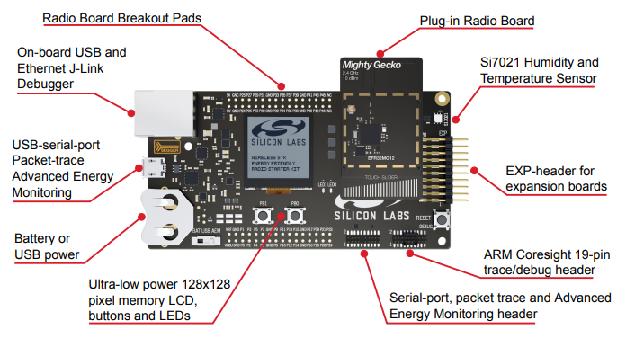

# Introduction of EmberZnet and AppBuilder

<details>
<summary><font size=5>Table of Contents</font> </summary>  
&nbsp;

- [Introduction of EmberZnet and AppBuilder](#introduction-of-emberznet-and-appbuilder)
  - [1. Overview](#1-overview)
  - [2. SoC and Modules](#2-soc-and-modules)
    - [2.1. SoCs](#21-socs)
    - [2.2. Modules](#22-modules)
    - [2.3. Block Diagram](#23-block-diagram)
  - [3. Software and SDKs](#3-software-and-sdks)
    - [3.1. Design Models](#31-design-models)
    - [3.2. Gecko Bootloader](#32-gecko-bootloader)
    - [3.3. EmberZnet SDK](#33-emberznet-sdk)
  - [4. Development Tools](#4-development-tools)
    - [4.1. Wireless Starter Kits](#41-wireless-starter-kits)
    - [4.2. Simplicity IDE](#42-simplicity-ide)
  - [5. Reference](#5-reference)
</details>

********

## 1. Overview
Silicon Labs' Zigbee solution consis of three parts:  
- Soc and Modules
- Software and SDKs
- Development Tools

## 2. SoC and Modules
As you can find from the [official website of Silicon Labs](https://www.silabs.com/wireless/zigbee), Mighty Gecko series SoC and modules are used for Zigbee applications. Mighty Gecko is the most powerful chips of the Gecko family. It supports Zigbee, Bluetooth, Thread, Proprietary technologies.  

### 2.1. SoCs

|SoC Family|MCU Core|Frequency Bands|Flash Size(KB)|RAM Size(KB)|  
|:-|:-|:-|:-|:-|
|[EFR32MG21](https://www.silabs.com/wireless/zigbee/efr32mg21-series-2-socs)|ARM Cortex-M33|2.4GHz|512/768/1024|64/96|
|[EFR32MG12](https://www.silabs.com/wireless/zigbee/efr32mg12-series-1-socs)|ARM Cortex-M4|2.4GHZ/Sub-GHz|1024|128/256|
|[EFR32MG13](https://www.silabs.com/wireless/zigbee/efr32mg13-series-1-socs)|ARM Cortex-M4|2.4GHZ/Sub-GHz|512|64|

### 2.2. Modules

The benefits of using a module is that you can save a lot of time to get the regulatory certifications, such as FCC, CE, ISED, etc.

|Module Family|MCU Core|Frequency Bands|Flash Size(KB)|RAM Size(KB)|  
|:-|:-|:-|:-|:-|:-|
|[MGM210 Series](https://www.silabs.com/wireless/zigbee/efr32mg21-series-2-modules)|ARM Cortex-M33|2.4GHz|1024|96|
|[MGM12  Series](https://www.silabs.com/wireless/zigbee/efr32mg12-series-1-modules)|ARM Cortex-M4|2.4GHz|1024|256|
|[MGM13  Series](https://www.silabs.com/wireless/zigbee/efr32mg13-series-1-modules)|ARM Cortex-M4|2.4GHz|1024|256|  

### 2.3. Block Diagram
Below is the block diagram of EFR32MG12 series SoC.  
  

The SoC can work at 6 different energy modes. From largest power consumption to lowest:  
- EM0 - Active
- EM1 - Sleep
- EM2 - Deep Sleep
- EM3 - Stop
- EM4 - Hibernate
- EM4 - Shutoff  

**Notes:**
1. In the diagram, each functional block is marked with a color indicating the lowest energy mode under which the block still works. In EmberZnet, Zigbee coordinator and router work under EM0 as they are always powered by the main power supply. Zigbee sleepy end device works under EM2 or EM4 (Hibernate) mode.  
2. There is High Frequency RCO (HFRCO) and Low Frequency RCO (LFRCO) integrated in the SoC. For Zigbee applications, there must be a HFXO clock connected as the radio needs a more accurate high frequency to work normally, but they can still use LFRCO for peripherals.  
3. There is a internal DCDC integrated. Uses can choose to use the internal DCDC or bypass the DCDC. It's recommended to use the internal DCDC for sleepy end devices, so that they can have lower power consumption. 
4. The radio transceiver is already integrated and also a PA. Users can choose to power the PA with DCDC or with the main power. If the transmitting power is more than 13dbm, it's recommended to power the PA with the main power. Otherwise, use DCDC instead. 
5. An integrated packet trace interface (PTI) can be used to capture packets over the air. It's pretty useful for debugging.
6. An integrated packet traffic arbitration (PTA) interface can be used to improve the interference between Zigbee and WiFi. It's pretty helpful for Zigbee gateways.


## 3. Software and SDKs
### 3.1. Design Models
EmberZnet provides two design models for Zigbee applications :  
- Network Co-Processor (NCP) model
- System on Chip (Soc) model



1. In the SoC model, all stack layers as well as the application are implemented on a single chip, with lower level stack functions often implemented in hardware as peripherals of the microcontroller.   
   
   Access to the stack functionality here is generally provided as library API calls.   
   There may be a certain amount of shared access to peripherals or resources of the microcontroller between the stack and application.   
   While the sharing may place more constraints on the application developer, it ultimately leads to lower material cost and more compact hardware design. 
  

2. The alternative implementation offered is a network co-processor or NCP model. In this model, the stack and low-level radio functionality all reside on one chip for best integration and efficiency where the stack features are concerned. However, the application interface to the stack is through a serial interface such as SPI or UART, rather than a library of function calls. Using a proprietary serial protocol over one of these interfaces, the host microcontroller can interact with the stack potentially abstracting the serial transactions into a library or operation system module that better accommodates the needs of the application running on the host.   
   
   This model allows for great flexibility on the application design and the host processor architecture.   
   It allows the application designer to ignore many implementation details about the stack itself.   
   Depending on the implementation of the NCP, the NCP firmware may also expose additional features or abstractions of stack behavior that accomplish higher-level application tasks tailored to the kind of application being run.   
   We provide an Application Framework to build a customizable NCP, and NCP sample applications for those who just need a standard or popular set of features.   
   
   For more detailed examination of these options, refer to application notes and training resources on customizable NCP, EZSP-SPI and EZSP-UART (such as [AN1010](https://www.silabs.com/documents/public/application-notes/an1010-customized-ncp.pdf), [AN711](https://www.silabs.com/documents/public/application-notes/an711-ezsp-spi-host-interfacing-guide.pdf), [AN706](https://www.silabs.com/documents/public/application-notes/an706-ezsp-uart-host-interfacing-guide.pdf)).  

You may want to refer to [UG103.3](https://www.silabs.com/documents/public/user-guides/ug103-03-fundamentals-design-choices.pdf) on design choices and when to choose an SoC vs. NCP model.

### 3.2. Gecko Bootloader
To support firmware upgrading, we need a bootloader.   

1. For SoC models, the upgrading scenario is that :
- Device boots up and run application
- Application receives new image over the air and store the new image into storage
- Device resets and the bootloader bootloads the new image  

2. For NCP models, the upgrading scenario is that :  
- Host receives new NCP image through internet
- Host resets the NCP and lets NCP stay at bootloader stage
- Host transfers the new NCP image to NCP through Xmodem and overwrites the current image
- Host resets the NCP and lets the new image run

Silicon Labs provides three types of bootloader.  

|Type|Comments|  
|:-|:-|
|Bootloader Xmodem UART|Also called standalone bootloader. Mainly used on NCP. Host can transfer image to NCP through Xmodem to upgrade the NCP image.|
|Internal Storage Bootloader|Used on Soc. Store new image in internal flash.|
|SPI Storage Bootloader|Used on Soc. Store new image in SPI flash.|

There are also some pre-built bootloader images for DEV-Kits. They can be found at **platform\bootloader\sample-apps** directory under the Gecko SDK Suite directory.   
e.g.  
```
The default path for Gecko SDK Suite V2.7:
C:\SiliconLabs\SimplicityStudio\v4\developer\sdks\gecko_sdk_suite\v2.7  

The path for pre-built bootloader:  
C:\SiliconLabs\SimplicityStudio\v4\developer\sdks\gecko_sdk_suite\v2.7\platform\bootloader\sample-apps
```

### 3.3. EmberZnet SDK
EmberZnet SDK is part of the Gecko SDK Suite. It can be found at **protocol\zigbee** under the Gecko SDK Suite directory. The directories hierarchy of EmberZnet SDK is as below (just some important directories are listed) :  

```
+---app
|   +---framework  -- Source code of the framework, consist of many plugins
|   |   +---plugin          -- plugins applicable for host and SoC
|   |   +---plugin-host     -- plugins applicable for host
|   |   +---plugin-soc      -- plugins applicable for SoC
|   +---gpd        -- Source code of Green Power Device SDK
+---build          -- Libraries of some component
+---documentation  -- All documents about EmberZnet SDK
+---ncp-images     -- Pre-built NCP images for DEV-Kits
\---tool
    +---image-builder  -- Tools for build Zigbee OTA files
```

## 4. Development Tools
### 4.1. Wireless Starter Kits
Silicon Labs' Wireless Starter Kit (WSTK) is consis of a mother board and a radio board. Just like below :  

  

1. The mother board is a multi-function J-Link debugger. For most case, we will use :  
- 2 buttons
- 2 LEDs
- LCD Screen
- J-Link 
- Capture the network traffic over the air
- Measure current
- UART to USB converter

2. The radio board is swappable. 

### 4.2. Simplicity IDE


## 5. Reference
- [AN1211 Simplicity Studio V4 Installation Methods](https://www.silabs.com/documents/public/application-notes/an1121-headless-builds.pdf)
- [AN1160 Project Collaboration with Simplicity Studio](https://www.silabs.com/documents/public/application-notes/an1160-project-collaboration-with-simplicity-studio.pdf)
- [AN0822 Simplicity Studio User Guide](https://www.silabs.com/documents/public/application-notes/AN0822-simplicity-studio-user-guide.pdf)
- [AN1115 32-bit Device Peripheral Configuration in Simplicity Studio](https://www.silabs.com/documents/public/application-notes/an1115-32-bit-device-peripheral-configuration-in-simplicity-studio.pdf)
- [UG391 Zigbee App Framework Dev Guide](https://www.silabs.com/documents/public/user-guides/ug391-zigbee-app-framework-dev-guide.pdf)
- [Silicon Labs: Zigbee - Application Framework API Reference Documentation](https://docs.silabs.com/zigbee/latest/)
- [Peripheral Utilization on EFR32MG by EmberZNet Stack](https://www.silabs.com/community/wireless/zigbee-and-thread/knowledge-base.entry.html/2016/07/08/peripheral_utilizati-n9VT)
********
