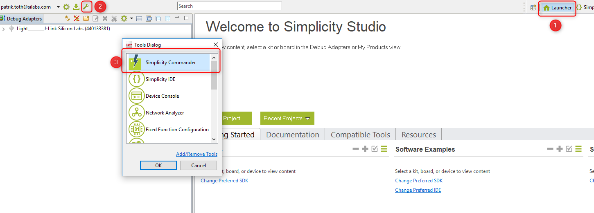

[English](Zigbee-Preparatory-Course.md) | Chinese

# 介绍
如果您是Silicon Labs开发环境和Zigbee解决方案的新手，那么这是您应该参加的准备课程。该文档描述了如何使用EmberZNet PRO SDK和Simplicity Studio以及兼容的无线入门工具包（WSTK）来进行Zigbee开发，以及在开始学习Zigbee Boot Camp系列课程之前应该了解的Zigbee基本知识。
并且提供了分步说明来演示如何创建基本的Zigbee项目，以检查开发环境是否已准备就绪。
下图说明了设置开发环境的工作流程。

<div align="center">
    
</div>  
</br>  

*** 


# 先决条件

## 硬件要求
在按照本指南中的步骤进行操作之前，您应该已经购买了一个网状网络开发套件，新手训练营系列动手使用的套件是[EFR32 Mighty Gecko无线入门套件](https://www.silabs.com/products/development-tools/wireless/mesh-networking/mighty-gecko-starter-kit)。然后，您需要在[支持门户](https://siliconlabs.force.com/)上创建一个帐户，并在[KitRegistration](https://siliconlabs.force.com/KitRegistration)上注册开发套件的序列号，以授予Zigbee SDK访问权限。有关更多信息，请参考[KBA关于访问Silicon Labs无线网状网络堆栈](https://www.silabs.com/community/wireless/zigbee-and-thread/knowledge-base.entry.html/2017/11/22/access_to_siliconla-jk1S)。
以下是EFR32 Mighty Gecko无线入门套件的套件内容。
　3 x无线入门套件主板
　3 x EFR32MG12 2.4 GHz 19 dBm无线板
　3 x EFR32MG12 2.4 GHz 10 dBm无线板
　AA电池板（支持电池运行+19）
　电缆
　EFR32MG入门卡

注意：如果您要参加Zigbee培训，则所有硬件将由组织者提供。请直接与培训活动的组织者联系，他们将为您提供一个授予Zigbee SDK访问权限的临时帐户。

## 软件需求
要开发Zigbee应用程序，您将需要通过安装Simplicity Studio，EmberZNet PRO堆栈和兼容的工具链来设置软件开发环境。

### Simplicity Studio
Simplicity Studio是一个免费的基于Eclipse的集成开发环境（IDE），并且是Silicon Labs提供的一组增值工具。开发人员可以使用Simplicity Studio来开发，调试和分析其应用程序。
如果未安装Simplicity Studio V4，请连接到[Simplicity Studio 4](http://www.silabs.com/products/mcu/Pages/simplicity-studio-v4.aspx) 以下载安装包，然后运行Simplicity Studio安装应用程序。
**注意**：为获得更好的无线协议开发经验，请确保您的PC具有8 GB或更多的RAM内存以及超过7 GB的可用磁盘空间。如果使用Windows（建议使用Windows 10），则强烈建议将Simplicity Studio安装到C：驱动器。
首次启动Simplicity Studio时，它将显示一个许可协议对话框。接受协议的条款，然后单击[下一步]。

<div align="center">
    
</div>  
</br>  

选择目标位置，单击[下一步]>，然后单击[安装]。

应用程序启动时，将邀请您登录。请使用上面创建的支持帐户（或培训活动组织者提供的临时帐户）登录。尽管您可以在此处跳过登录，但是必须登录才能访问某些受保护的内容，例如EmberZNet PRO SDK。
<div align="center">
    
</div>  
</br>  

**注意**：如果您还没有任何WSTK，请随时忽略下面的两段。
登录后，Simplicity Studio将检查连接的硬件。如果您通过USB电缆连接了WSTK，Simplicity Studio将检测USB电缆并提示您下载设备检查器。点击[是]。

<div align="center">
    
</div>  
</br>  

如果已连接WSTK，则将启动Launcher透视图，如下所示。连接的设备将被标识为J-Link设备，并在“调试适配器”选项卡中列出，如图所示。
<div align="center">
    
</div>  
</br>  

### EmberZNet PRO堆栈
Zigbee解决方案需要实现Zigbee无线电和相关的微处理器（一起在单个芯片中或分开地），以及在Zigbee堆栈之上实现应用程序。EmberZNet PRO是Zigbee PRO堆栈的Silicon Labs实现。借助Zigbee PRO堆栈，Silicon Labs既提供了基于Zigbee规范的标准网络API，又提供了应用程序框架，从而为客户提供了一种基于Zigbee应用程序配置文件和Zigbee群集库（ZCL）来快速开发其应用程序的方法。
为了加快客户产品的上市速度，Silicon Labs提供了许多内置的演示和示例，涵盖了EmberZNet SDK中最常见的用例。

假设您已经购买了网状网络开发套件，并且还使用您自己的帐户注册了序列号。使用相同的帐户登录Simplicity Studio，然后即可通过Simplicity Studio下载EmberZNet PRO堆栈。
**注意**：如果您还没有开发工具包，也没有注册自己的帐户，请使用培训活动组织者提供的临时帐户登录Simplicity Studio。

如果您尚未安装EmberZNet SDK，请运行以下程序包管理器以安装最新的EmberZNet SDK。
<div align="center">
    
</div>  
</br>

成功安装SDK后，单击[是]以重新启动Simplicity Studio，以使更改生效。
而且，如果您安装了旧版本的EmberZNet SDK，则强烈建议将其更新为最新版本。该方法与上述类似。

如果已连接WSTK，请在launcher左侧的[Debug Adapters]选项卡中单击设备，然后Launcher视图将展示您的硬件和与堆栈相关的软件组件和功能。

<div align="center">
    
</div>  
</br>

**注意**：如果还没有WSTK，则只需在启动器透视图左下角的“我的产品”选项卡中键入WSTK名称“ BRD4162A”。如果列出了多板信息，则选择“ Rev A01”。
<div align="center">
    
</div>  
</br>  

* Demos  
Demos是预构建的应用程序示例，可以直接下载到您的设备。  

* Software Examples  
软件示例提供了堆栈所需的默认配置以及可以构建的基本应用程序结构。Silicon Labs建议您以基于用例的示例开始自己的开发，并根据需要对其进行修改。
如果没有一个基于用例的示例满足您的需求，则可以从**ZigbeeMinimal**示例开始。我们还将使用**ZigbeeMinimal**作为Zigbee新手训练营系列动手学习的起点。

* SDK Documentation  
SDK文档列出了有关堆栈的文档，其中包括SDK发行说明，API参考等。

### 编译器工具链：
#### GCC
Simplicity Studio提供了GCC（GNU编译器集合），它将在首次安装EmberZNet SDK时自动安装。
您可以通过从Launcher视图单击[帮助]> [关于Simplicity Studio]> [链和SDK]，检查已安装的GCC工具链（以及SDK）的版本信息。

<div align="center">
    
</div>  

#### IAR (非必需)
建议在新手训练营系列培训中使用GCC，当然您也可以使用IAR来编译项目。请参阅EmberZNet SDK发行说明，了解兼容的IAR版本。
对于Silicon Labs客户，您可以获得30天的IAR评估许可证：
•转到Silicon Labs支持门户，网址为https://www.silabs.com/support。
•向下滚动到页面底部，然后单击“联系支持”。
•如果尚未登录，请登录。
•单击“软件版本”选项卡。在视图列表中，选择开发工具。单击执行。结果是指向发行说明中命名的IAR-EWARM版本的链接。
•下载IAR软件包（大约需要1个小时）。
•安装IAR。
•在“ IAR许可证向导”中，单击“向IAR Systems注册”以获取评估许可证。
•完成注册，IAR将提供30天的评估许可证。
•一旦安装了IAR-EWARM，下次Simplicity Studio启动时，它将自动检测并配置IDE以使用IAREWARM。

## Github 帐户  
由于[IoT-Developer-Boot-Camp](https://github.com/MarkDing/IoT-Developer-Boot-Camp)是一个开源项目，因此我们使用github维护所有源代码和文档，参与其中的每个人都可以提供关于它的注释，提交请求的bug修复，新功能实施或文档改进。
有效的github帐户是加入此项目的前提，如果没有，请[创建您的github帐户](https://github.com/join?source=header-home)。然后```Fork```[IoT-Developer-Boot-Camp](https://github.com/MarkDing/IoT-Developer-Boot-Camp)存储库并将其添加到您的监视列表中。

[Gitter](https://gitter.im/)是面向GitHub存储库的开发人员和用户的开源即时消息和聊天室系统。我们创建了一个公共聊天室[ZMGC-Training](https://gitter.im/Silabs-IoT/ZMGC-Training#) ，用于共享和讨论有关Zigbee新手训练营的一切。请使用您的GitHub帐户登录Gitter，然后加入此聊天室。

*** 

# Zigbee应用程序开发入门
作为准备课程，本节的目的是提供逐步说明，以演示如何开始使用**ZigbeeMinimal**示例项目，以验证您的开发环境是否已完成。

## 连接您的硬件
**注意**: 如果您还没有开发套件，请在启动器视图左下角的“我的产品”标签中键入板名“ BRD4162A”。并跳至“ [创建并构建Zigbee项目](#create-and-build-the-zigbee-project)”部分。

使用USB电缆将WSTK连接到已安装Simplicity Studio的PC。为了在Simplicity Studio中获得最佳性能，请确保WSTK左下方的电源开关位于“ AEM”（高级能量监控）位置。

<div align="center">
    
</div>

## 使用Gecko Bootloader
引导加载程序是存储在保留的闪存中的程序，可以初始化设备，更新固件映像并可能执行某些完整性检查。如果应用程序似乎没有运行，请始终检查引导加载程序，因为缺少引导加载程序会导致程序崩溃。
有两种可能方法建立一个引导加载程序的应用程序。 
*	使用Silicon Labs的预制映像（不适用于所有电路板）。 
*	创建自己的引导程序项目。 

第一种选择是最简单的解决方案。每个Gecko SDK都包含用于不同板的预构建的引导加载程序映像。最适合Zigbee应用程序的是“内部存储启动加载程序（1MB设备上的单个映像）”。它适合设备的闪存大小，此外还可以促进OTA固件更新。如果对引导加载程序没有任何特殊要求，我建议您使用它。
可以在下面找到
```c:\SiliconLabs\SimplicityStudio\v4\developer\sdks\gecko_sdk_suite\v2.6\platform\bootloader\sample-apps\bootloader-storage-internal-single\efr32mg12p332f1024gl125-brd4162a\ ```

打开Simplicity Commander，以将预构建的引导加载程序映像编程到设备。
<div align="center">
    
</div>
</br>

单击[连接]按钮连接到J-Link适配器，然后单击[连接]连接到目标设备，然后Simplicity Commander将检测到该设备的部件号为EFR32MG12xxx。浏览预构建的镜像，然后单击[Flash]按钮开始闪烁过程。
<div align="center">
    
</div>
</br>  

**注意**: 如果已成功将预构建的引导加载程序映像编程到入门工具包，则**不需要**以下第二种方法。您可以直接跳至“ [创建和构建Zigbee项目](#create-and-build-the-zigbee-project)”部分。
第二种方法是使用AppBuilder创建，生成和构建自己的应用程序。可以自定义和添加新功能，但是当前实验室没有详细介绍这种方法。
1.	转到文件->新建->项目。这将显示“新建项目向导”
2.	选择“ Silicon Labs AppBuilder项目”。点击下一步。
3.	选择“ Gecko Bootloader”。点击下一步。 
4.	选择最新版本。（Gecko Bootloader 1.9.2）。点击下一步。
5.	选择“内部存储引导程序（1MB设备上的单个映像）”。点击下一步。 
6.	为您的项目命名（任意名称）。点击下一步。
7.	选择开发板和编译器。然后完成。
8.	现在应该已经创建了新项目，并且已打开项目配置文件（.isc文件）。
9.	点击“生成”。注意项目文件出现在Project Explorer中。将会出现一个窗口，显示“生成成功”。参见下图。

<div align="center">
    
</div>

10.	在“项目资源管理器”窗口中选择项目，然后单击[Build] 编译项目。确保构建完成没有任何错误。
输出```bootloader-storage-internal-single-combined.s37```文件应下载到目标设备。我建议使用.s37或.hex，因为这些文件已经包含要刷新的地址。
像上面一样使用Simplicity Commander下载输出文件。

## 创建和构建Zigbee项目
通过连接WSTK，Simplicity Studio将在启动器透视图中自动列出可用的示例应用程序，单击一个示例项目，Simplicity Studio将基于所选示例新建一个项目。

**注意**: 如果还没有WSTK，也可以只在启动器透视图左下角的“我的产品”选项卡中键入WSTK名称“ BRD4162A”。Simplicity Studio还将在启动器透视图中自动列出可用的示例应用程序。

以下是分步说明。
1. 在左侧的“调试适配器”或“我的产品”选项卡中选择设备。 
2. 展开软件示例，找到并单击“ EmberZNet 6.6.xx GA SoC示例”组下的“ ZigbeeMinimal”。
3. 询问您是否要切换到Simplicity IDE，单击[是]。 
4. Simplicity IDE随即在AppBuilder视图中打开新项目。 
5. 在Simplicity IDE中，单击视图右上方的[Generate]。 
6. 如果收到任何警告“ AppBuilder已确定...，所有选定文件将被覆盖”，请单击[确定]。
7. 生成成功后，单击[确定]。
8. 通过单击顶部工具栏中的[Build]来构建项目。
9. 构建应该没有错误地完成。
10. 右键单击生成的十六进制文件，转到[Flash to Device ...]，然后选择要编程的设备。

<div align="center">
    
</div>  
</br>  

**注意**: 作为确保完成预备课程的小测验，请将ZigbeeMinimal项目的构建日志提交到[Zigbee预备课程反馈](https://forms.office.com/Pages/ResponsePage.aspx?id=ItjbVDFSIEuUTW9KvNVB-xO90oXNwwFJgomf3rxz4l1URjE3UzdSWFRFQlRZS05aMlBYWUNTTUJEUy4u)的第5项。
由于反馈表单的大小限制，请在构建控制台的构建日志末尾捕获如下所示的片段，然后提交。

```
Running size tool
arm-none-eabi-size "ZigbeeMinimalSoc.axf"
   text	   data	    bss	    dec	    hex	filename
 195504	   1324	  50240	 247068	  3c51c	ZigbeeMinimalSoc.axf
 
make --no-print-directory post-build
cmd //c 'C:\Users\xxxxxx\SIMPLI~1\V4B9FD~1\ZIGBEE~1/ZigbeeMinimalSoc-postbuild.bat' 'ZigbeeMinimalSoc' 'C:/Users/xxxxxx/SimplicityStudio/v4_workspace/ZigbeeMinimalSoc' '' 'C:\SiliconLabs\SimplicityStudio\v4'

```
<div align="center">
    
</div>  
</br>  

## 测试你的项目
将映像下载到开发工具包后，就可以与设备进行通讯了。为此，请打开启动控制台，该控制台是Studio中的内置串行端口终端。
<div align="center">
    
</div>
</br>  

如果打开了串行控制台，则切换到“ Serial 1”并按“ Enter”，控制台将输出类似于“ ZigbeeMinimalSoc”的项目名称。
<div align="center">
    
</div>

*** 

# Zigbee基础知识
Zigbee新手训练营系列培训将涵盖Zigbee基本知识，EmberZNet SDK和WSTK简介，如何形成和加入Zigbee网状网络，如何通过网络发送onoff命令，如何使用事件机制以及如何访问非电压数据存储对象。
尽管本系列培训是针对Silicon Labs Zigbee解决方案的新手而设计的，但强烈建议您在参加本系列课程之前先阅读以下文档。
[UG103.2: Zigbee Fundamentals](https://www.silabs.com/documents/public/user-guides/ug103-02-fundamentals-zigbee.pdf)  

***

# 结论
我们希望您已经顺利完成了预备课程，并设置了开发环境为即将到来的新兵训练营系列培训课程做准备。完成本课程后，请填写[Zigbee预备课程的反馈意见](https://forms.office.com/Pages/ResponsePage.aspx?id=ItjbVDFSIEuUTW9KvNVB-xO90oXNwwFJgomf3rxz4l1URjE3UzdSWFRFQlRZS05aMlBYWUNTTUJEUy4u)，我们将对您的反馈意见表示赞赏，我们将根据调查结果采取改进措施。
