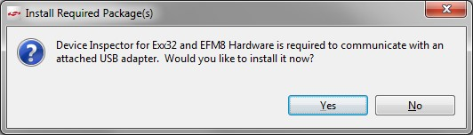

[English](Zigbee-Preparatory-Course) | 中文

<details>
<summary><font size=5>Table of Contents</font> </summary>

- [1. 介绍](#1-介绍)
- [2. 先决条件](#2-先决条件)
  - [2.1. 硬件要求](#21-硬件要求)
    - [2.1.1 无线开发套件](#211-无线开发套件)
    - [2.1.2 工作电脑](#212-工作电脑)
  - [2.2. 软件需求](#22-软件需求)
    - [2.2.1. Simplicity Studio](#221-simplicity-studio)
    - [2.2.2. EmberZNet PRO Stack](#222-emberznet-pro-stack)
    - [2.2.3. 编译器工具链：](#223-编译器工具链)
      - [2.2.3.1. GCC](#2231-gcc)
      - [2.2.3.2. IAR (非必需)](#2232-iar-非必需)
  - [2.3. Github 帐户](#23-github-帐户)
- [3. Zigbee应用程序开发入门](#3-zigbee应用程序开发入门)
  - [3.1. 连接您的硬件](#31-连接您的硬件)
  - [3.2. 使用Gecko Bootloader](#32-使用gecko-bootloader)
  - [3.3. 创建并编译Zigbee项目](#33-创建并编译zigbee项目)
  - [3.4. 测试你的项目](#34-测试你的项目)
- [4. Zigbee基础知识](#4-zigbee基础知识)
- [5. 常见问题及解答](#5-常见问题及解答)
- [6. 结论](#6-结论)

</details>

***

# 1. 介绍
如果您是Silicon Labs开发环境和Zigbee解决方案的新手，那么我们建议您仔细阅读并完成此预备课程。该文档描述了如何使用EmberZNet PRO SDK和Simplicity Studio以及兼容的无线入门套件（WSTK）来进行Zigbee开发，以及在开始学习Zigbee Boot Camp系列课程之前应该了解的Zigbee基本知识。  
并且提供了分步说明来演示如何创建基本的Zigbee项目，以检查开发环境是否已准备就绪。  
下图说明了设置开发环境的工作流程。

<div align="center">
    
</div>  
</br>  

*** 

# 2. 先决条件

## 2.1. 硬件要求
### 2.1.1 无线开发套件
在按照本指南中的步骤进行操作之前，您需要购买一套Zigbee开发套件。在Zigbee快速入门——新兵训练营系列实验中，你可以使用[EFR32MG无线入门套件](https://www.silabs.com/development-tools/wireless/zigbee/efr32mg-zigbee-thread-starter-kit), [EFR32xG21无线入门套件](https://www.silabs.com/development-tools/wireless/efr32xg21-wireless-starter-kit) 或者 [EFR32xG22无线入门套件](https://www.silabs.com/development-tools/wireless/efr32xg22-wireless-starter-kit)。  
然后，您需要在[客户支持平台](https://siliconlabs.force.com/)上创建一个帐户，并在[KitRegistration](https://siliconlabs.force.com/KitRegistration)上注册开发套件的序列号，以获取Zigbee SDK访问权限。有关更多信息，请参考[KBA关于访问Silicon Labs无线网状网络协议栈](https://www.silabs.com/community/wireless/zigbee-and-thread/knowledge-base.entry.html/2017/11/22/access_to_siliconla-jk1S)。  
以下是EFR32 Mighty Gecko无线入门套件的套件器件。   
　3 x无线入门套件 (WSTK) 主板  
　3 x EFR32MG12 2.4 GHz 19 dBm无线板  
　3 x EFR32MG12 2.4 GHz 10 dBm无线板  
　AA电池板（支持电池运行+19）  
　USB线缆  
　EFR32MG入门卡  

你也可以使用[Thunderboard Sense 2 套件](https://www.silabs.com/development-tools/thunderboard/thunderboard-sense-two-kit)，这个套件是一个相对精简的开发板. 需要注意的是这个套件不提供Zigbee SDK的下载权限， 如果您需使用Thunderboard Sense 2 套件，请确保您能通过其他方式下载Zigbee SDK。

注意：不同的无线入门套件包含有不同的器件，请确保你有至少两片无线入门套件主板，以及相应的无线板来完成我们的实验。  

注意：如果您要参加Zigbee培训，所有硬件将由组织者提供。请直接与培训活动的组织者联系，他们将为您提供一个授予Zigbee SDK访问权限的临时帐户。

### 2.1.2 工作电脑
以下是Simplicity Studio v4对于工作电脑的要求，在进行无线项目开发时，我们强烈建议你准备一台至少具有8GB RAM内存的工作电脑。  

|操作系统 | 版本|
|- |:---|
|Windows | Windows 10 (x64)|
|macOS | 10.14 Mojave|
|Linux | x64 Kernel 3.13 and above tested with Ubuntu 18.04 LTS|

|硬件配置 | 要求|
|- |:---|
|CPU | 1 GHz或更高|
|内存 | 无线项目开发要求至少8 GB RAM|
|磁盘空间 | 无线项目开发要求至少7 GB可用磁盘空间|

## 2.2. 软件需求
要开发Zigbee应用程序，您将需要通过安装Simplicity Studio，EmberZNet PRO协议栈软件和兼容的工具链来配置软件开发环境。

### 2.2.1. Simplicity Studio
Simplicity Studio是一个免费的基于Eclipse的集成开发环境（IDE），Silicon Labs在此基础提供了一系列的非常有用的工具。开发人员可以使用Simplicity Studio来开发，调试并分析其应用程序。  
如果尚未安装Simplicity Studio V4，请连接到[Simplicity Studio 4](http://www.silabs.com/products/mcu/Pages/simplicity-studio-v4.aspx) 以下载安装包，并运行Simplicity Studio安装程序。  
**注意**：为获得更好的无线项目开发体验，请逐条确认如下信息。  
1. 请确保您的工作电脑具有8 GB或更多的RAM内存，以及超过7 GB的可用磁盘空间。
2. 如果使用Windows（建议使用Windows 10），则强烈建议将Simplicity Studio安装到**C：** 盘。否则，你需要在Simplicity Studio v4的安装盘中，重新创建一个新的workspace，并切换到该workspace。  

首次启动Simplicity Studio时，它将显示一个许可协议对话框。接受协议的条款，然后单击[Next]。  

<div align="center">
    
</div>  
<div align="center">
  <b>图 2‑1 Simplicity Studio许可协议</b>
</div>  
</br>  

选择目标目录，单击[Next]>，然后单击[Install]。

应用程序启动时，将邀请您登录。请使用上面创建的支持帐户（或培训活动组织者提供的临时帐户）登录。尽管您可以在此处跳过登录，但是必须登录才能访问某些受保护的内容，例如EmberZNet PRO SDK。
<div align="center">
    
</div>  
<div align="center">
  <b>图 2‑2 登录Simplicity Studio</b>
</div>  
</br>  

**注意**：如果您还没有任何WSTK，请忽略下面的两段。  
登录后，Simplicity Studio将检查连接的硬件。如果您通过USB线缆连接了WSTK，Simplicity Studio将检测USB线缆并提示您下载设备检查器。点击[Yes]。

<div align="center">
    
</div>  
<div align="center">
  <b>图 2‑3 安装设备所需的软件包</b>
</div>  
</br>  

如果已连接WSTK，则将启动Launcher视图，如下所示。连接的设备将被标识为J-Link设备，并在“Debug Adapters”选项卡中列出，如图所示。
<div align="center">
    
</div>  
<div align="center">
  <b>图 2‑4 Simplicity Studio主界面</b>
</div>  
</br>  

### 2.2.2. EmberZNet PRO Stack
Zigbee解决方案的实现，需要Zigbee无线收发和相关的微处理器（同时包含在单个芯片中或分开地），以及在Zigbee协议栈之上所开发的应用程序。EmberZNet PRO是Silicon Labs对Zigbee PRO协议栈的实现。借助Zigbee PRO协议栈，Silicon Labs既提供了基于Zigbee规范的标准网络API，同时也提供了应用程序框架，从而为客户提供了一种基于Zigbee应用协议和Zigbee cluster library（ZCL）来快速开发其应用程序的方法。  
为了加快客户产品的上市速度，Silicon Labs在SDK中提供了许多演示和示例，涵盖了EmberZNet SDK中最常见的用例。  

假设您已经购买了网状网络开发套件，并且还使用您自己的帐户注册了序列号。使用相同的帐户登录Simplicity Studio，然后即可通过Simplicity Studio下载EmberZNet PRO 协议栈。  
**注意**：如果您还没有开发套件，也没有注册自己的帐户，请使用培训活动组织者提供的临时帐户登录Simplicity Studio。  

如果您尚未安装EmberZNet SDK，请运行以下程序包管理器以安装最新的EmberZNet SDK，或者培训活动组织者所指定的EmberZNet SDK版本。  
<div align="center">
    
</div>  
<div align="center">
  <b>图 2‑5 安装最新的EmberZNet SDK</b>
</div>  
</br>

请参阅下图，以了解如何安装指定版本的EmberZNet SDK. 在安装完成之后，请将首选的SDK版本设定为该指定版本。
<div align="center">
    
</div>  
<div align="center">
  <b>图 2‑6 安装指定版本的EmberZNet SDK</b>
</div>  
</br>

而且，如果您安装了旧版本的EmberZNet SDK，则强烈建议将其更新为最新版本或者培训活动组织者所指定的版本。其方法与上述类似。  
成功安装SDK后，单击[Yes]以重新启动Simplicity Studio，以使更改生效。  

如果已连接WSTK，请在launcher左侧的[Debug Adapters]选项卡中单击设备，然后Launcher视图将展示与你所选择硬件及协议栈相关的软件组件和功能。  

<div align="center">
    
</div>  
<div align="center">
  <b>图 2‑7 主界面视图</b>
</div>  
</br>

**注意**：如果还没有WSTK，则只需在Launcher视图左下角的“My Products”选项卡中键入WSTK名称“ BRD4162A”。如果列出了多个版本条目，则选择“ Rev A01”。
<div align="center">
    
</div>  
<div align="center">
  <b>图 2‑8 手动选择开发套件</b>
</div>  
</br>  

* Demos  
Demos是预编译的应用程序示例，可以直接烧录到您的设备。  

* Software Examples  
软件示例提供了协议栈所需的默认配置以及基本应用程序框架。Silicon Labs建议您以基于用例的示例开始自己的开发，并根据需要对其进行修改。  
如果没有一个基于用例的示例满足您的需求，则可以从**ZigbeeMinimal**示例开始。我们还将使用**ZigbeeMinimal**作为Zigbee快速入门——新兵训练营系列实验的起点。

* SDK Documentation  
SDK文档列出了有关协议栈的文档，其中包括SDK版本说明，API参考等。

### 2.2.3. 编译器工具链：
#### 2.2.3.1. GCC
Simplicity Studio提供了GCC（GNU编译器集合），它将在首次安装EmberZNet SDK时自动安装。  
您可以通过从Launcher视图单击[Help]> [关于Simplicity Studio]> [Toochains and SDKs]，检查已安装的GCC工具链（以及SDK）的版本信息。

<div align="center">
    
</div>  
<div align="center">
  <b>图 2‑9 检测已安装的GCC工具链</b>
</div>  
<br>  

#### 2.2.3.2. IAR (非必需)
建议在新手训练营系列培训中使用GCC，当然您也可以使用IAR来编译项目。请参阅EmberZNet SDK发行说明，了解兼容的IAR版本。  
对于Silicon Labs客户，您可以获得30天的IAR评估许可证：  
•转到Silicon Labs支持门户，网址为https://www.silabs.com/support。  
•向下滚动到页面底部，然后单击“Contact Support”。  
•如果尚未登录，请登录。  
•单击“Software Releases”选项卡。在视图列表中，选择开发工具。单击执行。结果是指向发行说明中命名的IAR-EWARM版本的链接。  
•下载IAR软件包（大约需要1个小时）。  
•安装IAR。  
•在“ IAR许可证向导”中，单击“向IAR Systems注册”以获取评估许可证。  
•完成注册，IAR将提供30天的评估许可证。  
•一旦安装了IAR-EWARM，下次Simplicity Studio启动时，它将自动检测并配置IDE以使用IAREWARM。   

## 2.3. Github 帐户  
由于[IoT-Developer-Boot-Camp](Home)是一个开源项目，因此我们使用github维护所有源代码和文档，参与其中的每个人都可以提供你自己对于它的评论（意见），提交你的bug修复，新的功能需求或改进文档请求。  
有效的github帐户是加入此项目的前提，如果没有，请[创建您的github帐户](https://github.com/join?source=header-home)。s


*** 

# 3. Zigbee应用程序开发入门
作为准备课程，本节的目的是提供逐步说明，以演示如何开始使用**ZigbeeMinimal**示例项目，以验证您的开发环境是否已搭建完成。。

## 3.1. 连接您的硬件
**注意**: 如果您还没有开发套件，请在Launcher视图左下角的“My Products”选项卡中键入开发板名“ BRD4162A”。并跳至“ [创建并编译Zigbee项目](#33-创建并编译zigbee项目)”部分。

使用USB线将WSTK连接到已安装Simplicity Studio的PC。为了在Simplicity Studio中获得最佳性能，请确保WSTK左下方的电源开关位于“ AEM”（高级能量监控）位置。

<div align="center">
    
</div>
<div align="center">
  <b>Figure 3‑1 EFR32MG12无线入门套件</b>
</div>
</br>  

## 3.2. 使用Gecko Bootloader
Bootloader是存储在保留的闪存中的一段程序，可以初始化设备，更新固件image并可能执行某些完整性检查。如果怀疑应用程序没有运行，请先检查Bootloader，因为缺少Bootloader会导致程序无法运行。  
有两种可能方法创建一个Bootloader的应用程序。   
*	使用Silicon Labs的预编译的image（不适用于所有电路板）。 
*	创建自己的Bootloader项目。 

第一种选择是最简单的解决方案。每个Gecko SDK都包含用于不同开发板的预编译的Bootloader image。在本系统实验中，最适合Zigbee应用程序的是“Internal Storage Bootloader (single image on 1MB devices)”。它适合我们所选设备的闪存大小，此外还可以用于OTA固件更新。如果对Bootloader没有其他特殊要求，我建议您使用它。  
该image可以在类似如下目录找到
```
c:\SiliconLabs\SimplicityStudio\v4\developer\sdks\gecko_sdk_suite\v2.6\platform\bootloader\sample-apps\bootloader-storage-internal-single\efr32mg12p332f1024gl125-brd4162a\ 
```  

打开Simplicity Commander，以将预编译的Bootloader image编程到设备。
<div align="center">
    
</div>
<div align="center">
  <b>图 3‑2 打开Simplicity Commander</b>
</div>
</br>

单击‘adaptor’ 旁边的[connect]按钮连接到J-Link适配器，然后单击target旁边的[connect]连接到目标设备，然后Simplicity Commander将检测到该芯片的型号为EFR32MG12xxx。浏览预编译的image，然后单击[Flash]按钮开始烧录过程。
<div align="center">
    
</div>
<div align="center">
  <b>图 3‑3 烧录预编译的Gecko Bootloader image</b>
</div>
</br>  

**注意**: 如果已成功将预编译的Bootloader image烧录到radio board，则**不需要**以下第二种方法。您可以直接跳至“ [创建和编译Zigbee项目](#33-创建并编译zigbee项目)”部分。  
第二种方法是使用AppBuilder创建，生成和编译自己的应用程序。可以自定义和添加新功能，当前实验没有详细介绍这种方法。
1.	转到File-> New ->Project。这将显示“New Project Wizard”
2.	选择“ Silicon Labs AppBuilder Project”。点击“ Next”。
3.	选择“ Gecko Bootloader”。点击“ Next”。 
4.	选择最新版本。（Gecko Bootloader 1.9.2）。点击“ Next”。
5.	选择“Internal Storage Bootloader（single image on 1MB devices）”。点击“ Next”。 
6.	为您的项目命名（任意名称）。点击“ Next”。
7.	选择开发板和编译器。然后完成。
8.	现在应该已经创建了新项目，并且已打开项目配置文件（.isc文件）。
9.	点击“Generate”。注意项目文件出现在Project Explorer中。将会出现一个窗口，显示“Generation successful”。参见下图。

<div align="center">
    
</div>
<div align="center">
  <b>图 3‑4 创建、生成并编译Gecko Bootloader项目</b>
</div>
<br>

10.	在“Project Explorer”窗口中选择您的项目，然后单击[Build] 编译项目。确保编译完成没有任何错误。  
输出```bootloader-storage-internal-single-combined.s37```文件应烧录到目标设备。我建议使用.s37或.hex，因为这些文件已经包含要烧录的地址。  
像上面一样使用Simplicity Commander烧录输出文件到目标板。  

## 3.3. 创建并编译Zigbee项目
通过连接WSTK，Simplicity Studio也将在Launcher视图中自动列出可用的示例应用程序，单击一个示例项目，Simplicity Studio将基于所选示例新建一个项目。

**注意**: 如果还没有WSTK，也可以只在Launcher视图左下角的“My Products”选项卡中键入WSTK名称“ BRD4162A”。Simplicity Studio还将在Launcher视图中自动列出可用的示例应用程序。

以下是分步说明。
1. 在左侧的“Debug Adapters”或“My Products”选项卡中选择设备。 
2. 展开软件示例，找到并单击“ EmberZNet 6.6.xx GA SoC示例” 组下的 “ZigbeeMinimal”。
3. 询问您是否要切换到Simplicity IDE，单击[Yes]。 
4. Simplicity IDE随即在AppBuilder视图中打开新项目。 
5. 在Simplicity IDE中，单击视图右上方的[Generate]。 
6. 如果收到任何警告“AppBuilder has determined..., All selected files will be overwritten”，请单击[OK]。
7. 生成成功后，单击[OK]。
8. 通过单击顶部工具栏中的[Build]来编译项目。
9. 编译成功通过。
10. 右键单击生成的hex文件，转到[Flash to Device ...]，然后选择要烧录的目标设备。

<div align="center">
    
</div>  
<div align="center">
  <b>图 3‑5 创建、生成并编译Zigbee项目</b>
</div>
</br>  

**注意**: 为了确保您已完成预备课程，我们准备了一个小测验，请将ZigbeeMinimal项目的编译日志提交到[Zigbee预备课程反馈](https://forms.office.com/Pages/ResponsePage.aspx?id=ItjbVDFSIEuUTW9KvNVB-xO90oXNwwFJgomf3rxz4l1URjE3UzdSWFRFQlRZS05aMlBYWUNTTUJEUy4u)的第5项。  
由于反馈表单的大小限制，请在编译控制台的编译日志末尾捕获如下所示的片段，然后提交。

```
Running size tool
arm-none-eabi-size "ZigbeeMinimalSoc.axf"
   text	   data	    bss	    dec	    hex	filename
 195504	   1324	  50240	 247068	  3c51c	ZigbeeMinimalSoc.axf
 
make --no-print-directory post-build
cmd //c 'C:\Users\xxxxxx\SIMPLI~1\V4B9FD~1\ZIGBEE~1/ZigbeeMinimalSoc-postbuild.bat' 'ZigbeeMinimalSoc' 'C:/Users/xxxxxx/SimplicityStudio/v4_workspace/ZigbeeMinimalSoc' '' 'C:\SiliconLabs\SimplicityStudio\v4'

```
<div align="center">
    
</div>  
<div align="center">
  <b>图 3‑6 提交编译日志</b>
</div>
</br>  

## 3.4. 测试你的项目
将image烧录到开发组件后，就可以与设备进行通讯了。为此，请打开Launch console，该控制台是Studio中的内置串行端口终端。
<div align="center">
    
</div>
<div align="center">
  <b>图 3‑7 测试你的项目</b>
</div>
</br>  

如果打开了串行控制台，则切换到“ Serial 1”并按“ Enter”，控制台将输出类似于“ ZigbeeMinimalSoc”的项目名称。
<div align="center">
    
</div>
<div align="center">
  <b>图 3‑8 串行控制台输出</b>
</div>

*** 

# 4. Zigbee基础知识
Zigbee新手训练营系列培训将涵盖Zigbee基本知识，EmberZNet SDK和WSTK简介，如何编译和加入Zigbee网状网络，如何通过网络发送onoff命令，如何使用事件机制以及如何访问非易失性存储器。  
尽管本系列培训是针对Silicon Labs Zigbee解决方案的新手而设计的，但强烈建议您在参加本系列课程之前先阅读以下文档。  
[UG103.2: Zigbee Fundamentals](https://www.silabs.com/documents/public/user-guides/ug103-02-fundamentals-zigbee.pdf)  

***

# 5. 常见问题及解答
**Simplicity Studio在我的电脑上无法运行**  
请确保你的工作电脑有至少8GB RAM内存，因为在无线项目开发时，Simplicity Studio要求至少8GB RAM。  

**为什么无法正确的创建/生成项目文件？**  
请检查在你的项目名称中是否包含有"-"或者中文字符。项目命令时，只允许使用下划线"_"来作为连字符。

**为什么无法正确编译ZigbeeMinimal项目？**  
在无线项目中有非常多的链接文件，所以请确保你当前的workspace同Simplicity Studio的安装目录处在同一个磁盘。否则在项目编译时可能会出现错误。  

**Github无法访问，或者图片无法显示**  
如果在您所在的区域，因为网络原因导致无法访问github，可以参考网络上的一些[解决方案](https://zhuanlan.zhihu.com/p/75994966)。  

***

# 6. 结论
我们希望您已经顺利完成了预备课程，并设置了开发环境为即将到来的Zigbee快速入门——新兵训练营系列培训课程做准备。完成本课程后，请填写[Zigbee预备课程反馈](https://forms.office.com/Pages/ResponsePage.aspx?id=ItjbVDFSIEuUTW9KvNVB-xO90oXNwwFJgomf3rxz4l1URjE3UzdSWFRFQlRZS05aMlBYWUNTTUJEUy4u)，我们将对您的反馈意见表示感谢，同时我们将根据调查结果采取改进措施。
