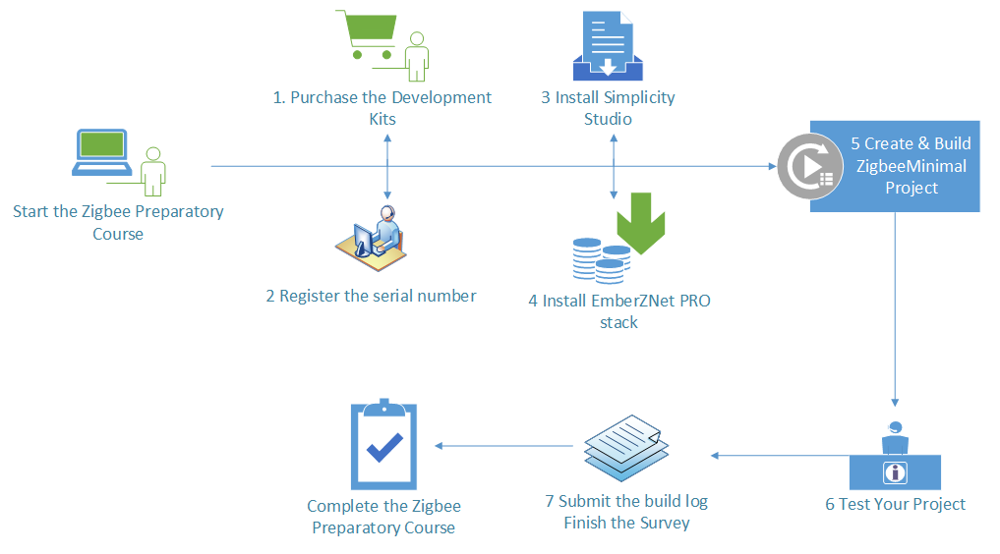
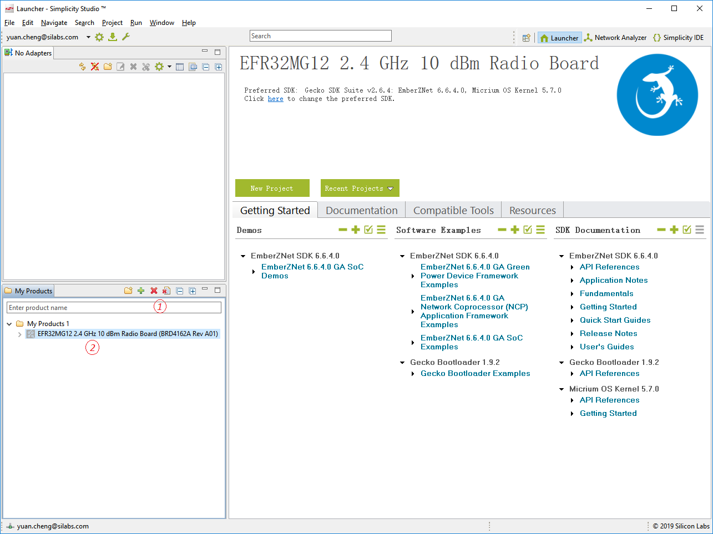

English | [中文](Zigbee-Preparatory-Course-CN)

<details>
<summary><font size=5>Table of Contents</font> </summary>

- [1. Introduction](#1-introduction)
- [2. Prerequisites](#2-prerequisites)
  - [2.1. Hardware requirements](#21-hardware-requirements)
    - [2.1.1 Wireless Starter Kit](#211-wireless-starter-kit)
    - [2.1.2 Working Computer](#212-working-computer)
  - [2.2. Software requirements](#22-software-requirements)
    - [2.2.1. Simplicity Studio](#221-simplicity-studio)
    - [2.2.2. EmberZNet PRO stack](#222-emberznet-pro-stack)
    - [2.2.3. Compiler toolchain:](#223-compiler-toolchain)
      - [2.2.3.1. GCC](#2231-gcc)
      - [2.2.3.2. IAR (non-required)](#2232-iar-non-required)
  - [2.3. Github Account](#23-github-account)
- [3. Getting started with Zigbee Application Development](#3-getting-started-with-zigbee-application-development)
  - [3.1. Connect your Hardware](#31-connect-your-hardware)
  - [3.2. Using Gecko Bootloader](#32-using-gecko-bootloader)
  - [3.3. Create and Build the Zigbee project](#33-create-and-build-the-zigbee-project)
  - [3.4. Test your project](#34-test-your-project)
- [4. Fundamental Knowledge of Zigbee](#4-fundamental-knowledge-of-zigbee)
- [5. FAQ](#5-faq)
- [6. Conclusion](#6-conclusion)

</details>

***

# 1. Introduction
This is a preparatory course that you should take if you are new to the Silicon Labs development environment and Zigbee solution. The document describes how to get started with Zigbee development using the EmberZNet PRO SDK and Simplicity Studio with a compatible wireless starter kit (WSTK), and also the fundamental Zigbee knowledge you should understand before beginning to study the Zigbee Boot Camp series courses.  
And step-by-step instructions are provided to demonstrate how to create a basic Zigbee project for checking if the development environment is ready on your end.  
The figure below illustrates the working flow for setting up the development environment.  

<div align="center">
    
</div>  
</br>  

*** 

# 2. Prerequisites

## 2.1. Hardware requirements
### 2.1.1 Wireless Starter Kit
Before following the procedures in this guide you should have purchased one of the mesh networking development kits. You can use the [EFR32MG Wireless Starter Kit](https://www.silabs.com/development-tools/wireless/zigbee/efr32mg-zigbee-thread-starter-kit), [EFR32xG21 Wireless Gecko Starter Kit](https://www.silabs.com/development-tools/wireless/efr32xg21-wireless-starter-kit) or [EFR32xG22 Wireless Gecko Starter Kit](https://www.silabs.com/development-tools/wireless/efr32xg22-wireless-starter-kit) in the boot camp series hands-on.  
And then you need to create an account on the [support portal](https://siliconlabs.force.com/), and register the serial number of your development kits on [KitRegistration](https://siliconlabs.force.com/KitRegistration) to grant Zigbee SDK access. Please refer to the [KBA on access to Silicon Labs wireless mesh networking stacks](https://www.silabs.com/community/wireless/zigbee-and-thread/knowledge-base.entry.html/2017/11/22/access_to_siliconla-jk1S) for more information.  
Below is the Kit Contents of the EFR32 Mighty Gecko Wireless Starter Kit.  
　3 x Wireless starter kit mainboard  
　3 x EFR32MG12 2.4 GHz 19 dBm radio board  
　3 x EFR32MG12 2.4 GHz 10 dBm radio board  
　AA Battery Board (supports running +19 from battery)  
　Cables  
　EFR32MG Getting Started Card  

You also can use [Thunderboard Sense 2 Kit](https://www.silabs.com/development-tools/thunderboard/thunderboard-sense-two-kit) which is a compact, featured-packed development platform. Be careful that you can NOT get Zigbee SDK through Thunderboard Sense 2 Kit, make sure you can get Zigbee SDK before trying to use Thunderboard Sense 2 Kit.

**Note**: Different Wireless Gecko Starter Kit has different contents, please make sure that you have at least two wireless starter kit mainboard with radio board mounted for finishing the hands-on.  

**Note**: If you are going to attend Zigbee training and all of the hardware will be provided by the organizer. Please just reach out to the organizer of the training event, they will help to provide you a temporary account with Zigbee SDK access granted.  

### 2.1.2 Working Computer
Below is the system requirements of the Simplicity Studio v4, and it's strongly recommended to prepare a working computer has at least 8GB RAM for wireless project development.

|Operating System | Version|
|- |:---|
|Windows | Windows 10 (x64)|
|macOS | 10.14 Mojave|
|Linux | x64 Kernel 3.13 and above tested with Ubuntu 18.04 LTS|

|Hardware Component | Item|
|- |:---|
|CPU | 1 GHz or better|
|Memory | **8 GB for Wireless Protocol development**|
|Disk Space | 7 GB for Wireless Dynamic Protocol support|

## 2.2. Software requirements
To develop Zigbee applications, you will need to setting up your software development environment by installing Simplicity Studio, EmberZNet PRO stack and the compatible toolchains.  

### 2.2.1. Simplicity Studio
Simplicity Studio is a free Eclipse-based Integrated Development Environment (IDE) and a collection of value-add tools provided by Silicon Labs. Developers can use Simplicity Studio to develop, debug and analyze their applications.  
If you do not have Simplicity Studio V4 installed, please connect to [Simplicity Studio 4](http://www.silabs.com/products/mcu/Pages/simplicity-studio-v4.aspx) to download the installation package, and run the Simplicity Studio installation application.  
**Note**: For better wireless protocol development experience, please check the items below one by one.  
1. Make sure that your PC has 8 GB or more RAM memory and more than 7 GB disk space available.  
2. If you are using the Windows (Windows 10 is recommended), it highly recommended to install the Simplicity Studio to the **C:** drive. Otherwise, you need to create another workspace locates at the same drive as your Simplicity Studio installed, and switch to that workspace.  

When Simplicity Studio first launches, it presents a License Agreement dialog. Accept the terms of the agreement and click [Next].  

<div align="center">
    
</div>  
<div align="center">
  <b>Figure 2‑1 Simplicity Studio License Agreement</b>
</div>  
</br>  

Choose a destination location, click [Next] > and then click [Install].  

When the application launches, you are invited to log in. Please Log in using your support account that created above (or the temporary account provided by the training event organizer). Although you can skip log in here, you must be logged in to access some protected content, such as EmberZNet PRO SDK.  

<div align="center">
    
</div>  
<div align="center">
  <b>Figure 2‑2 Log In Simplicity Studio</b>
</div>  
</br>  

**Note**: If you don't have any WSTK yet, please feel free to ignore the two paragraph below.  
After login, the Simplicity Studio will check for connected hardware. If you have the WSTK connected by USB cable, Simplicity Studio will detect the USB cable and prompt you to download a Device Inspector. Click [Yes].  

<div align="center">
    
</div>  
<div align="center">
  <b>Figure 2‑3 Install Required Packages</b>
</div>  
</br>  

The Launcher perspective opens as below if have the WSTK connected. The connected device will be identified as J-Link devices and listed in the "Debug Adapters" tab as shown.  

<div align="center">
    
</div>  
<div align="center">
  <b>Figure 2‑4 Simplicity Studio Launcher</b>
</div>  
</br>  

### 2.2.2. EmberZNet PRO stack
A Zigbee solution requires implementation of a Zigbee radio and associated microprocessor (together in a single chip or separately), and implementation of an application on top of a Zigbee stack. EmberZNet PRO is the Silicon Labs implementation of the Zigbee PRO stack.
With the Zigbee PRO stack, Silicon Labs provides both a standard networking API based on the Zigbee specification and an application framework, which gives customers a way to rapidly develop their applications based on Zigbee application profiles and the Zigbee cluster library (ZCL).  
For accelerating the customer's product to marketing, Silicon Labs provides a number of built-in demos and examples covering the most frequent use cases in the EmberZNet SDK.  

Supposed that you have purchased the mesh networking development kits, and also register the serial number with your own account. Log in the Simplicity Studio with the same account, and the EmberZNet PRO stack will be available for download through Simplicity Studio.  
**Note**: If you don't have development kit yet, and didn't register your own account, please log in the Simplicity Studio with the temporary account provide by the organizer of the training event.  

If you do not have EmberZNet SDK installed, please run the Package Manager as below for installing the latest EmberZNet SDKs or the SDK version specified by the training event organizer.  
<div align="center">
    
</div>  
<div align="center">
  <b>Figure 2‑5 Install the latest EmberZNet SDK</b>
</div>  
</br>

See the Figure 2.6 for how to install the specified version of EmberZNet SDK. After installing the specified SDK, please don't forget to change the preferred SDK to it.
<div align="center">
    
</div>  
<div align="center">
  <b>Figure 2‑6 Install the specified version EmberZNet SDK</b>
</div>  
</br>

And if you have an old version EmberZNet SDK installed, it's highly recommended to update it to the latest or the required version. The method is similar as above.  

After installing the SDKs successfully, click [Yes] to restart Simplicity Studio for the changes to take effect.  

If have the WSTK connected, click the device in the [Debug Adapters] tab on the left side of the launcher, then the Launcher perspective will be populated with the software components and functionality associated with your hardware and stack.  

<div align="center">
    
</div>  
<div align="center">
  <b>Figure 2‑7 Launcher perspective</b>
</div>  
</br>

**Note**: If you don't have WSTK yet, you can just type the WSTK name "BRD4162A" in the "My Products" tab on the lower-left of the launcher perspective. And select "Rev A01" if multi boards information be listed then.  
<div align="center">
    
</div>  
<div align="center">
  <b>Figure 2‑8 Select the WSTK manually</b>
</div>  
</br>  

* Demos  
Demos are prebuilt application examples that can be directly downloaded to your device.  

* Software Examples  
The software examples provide default configurations needed by the stack and a basic application structure that you can build upon. Silicon Labs recommends that you start your own development with a use case-based example and modify it according to your needs.  
If none of the use case-based examples meet your needs, you can start with the **ZigbeeMinimal** example. And we will also use the **ZigbeeMinimal** as the starting point for the Zigbee boot camp series hands-on.  

* SDK Documentation  
The SDK Documentation lists documentation about the stack, it includes SDK release note, API reference, etc.  

### 2.2.3. Compiler toolchain:
#### 2.2.3.1. GCC
GCC (The GNU Compiler Collection) is provided with Simplicity Studio, and it will be installed automatically while installing the EmberZNet SDK in the first time.  
You can check the installed GCC toolchain (as well as SDKs) version information by clicking [Help] > [About Simplicity Studio] > [Toochains and SDKs] from the launcher perspective.  

<div align="center">
    
</div>  
<div align="center">
  <b>Figure 2‑9 Check the installed GCC toolchain</b>
</div>  
</br>

#### 2.2.3.2. IAR (non-required)
GCC is recommended in the boot camp series training material, and of course you also can use IAR to compile the projects. Please see the EmberZNet SDK Release Notes for the compatible IAR version.  
For Silicon Labs customer, you can get a 30-day evaluation license for IAR:  
• Go to the Silicon Labs support portal at https://www.silabs.com/support.  
• Scroll down to the bottom of the page, and click Contact Support  
• If you are not already signed in, sign in.  
• Click the Software Releases tab. In the View list select Development Tools. Click Go. In the results is a link to the IAR-EWARM version named in the release notes.  
• Download the IAR package (takes approximately 1 hour).  
• Install IAR.  
• In the IAR License Wizard, click Register with IAR Systems to get an evaluation license.  
• Complete the registration and IAR will provide a 30-day evaluation license.  
• Once IAR-EWARM is installed, the next time Simplicity Studio starts it will automatically detect and configure the IDE to use IAREWARM.  

## 2.3. Github Account  
As the [IoT-Developer-Boot-Camp](Home) is a open source project, we use the github to maintain all of the source code and documentations, every participating in it can provide your comments on it, submit your pull request for bug fix, new feature implementation or documentation improvement.  
A valid github account is the prerequisite for joining this project, please [Create your github account](https://github.com/join?source=header-home) if you do not have that.   


*** 

# 3. Getting started with Zigbee Application Development
As a preparatory course, the purpose of this section is providing a step-by-step instructions to demonstrate how to get start with the **ZigbeeMinimal** example project to verify that the development environment is setting done on your side.  

## 3.1. Connect your Hardware
**Note**: If you don't have development kit yet, please just type the board name "BRD4162A" in the "My Products" tab on the lower-left of the launcher perspective. And jump to the section [Create and Build the Zigbee project](#33-create-and-build-the-zigbee-project).  

Connect your WSTK using a USB cable to the PC on which has Simplicity Studio installed. For best performance in Simplicity Studio, please be sure that the power switch on the lower left of the WSTK is in the "AEM" (Advanced Energy Monitoring) position.  

<div align="center">
    
</div>
<div align="center">
  <b>Figure 3‑1 EFR32MG12 Wireless Starter Kit</b>
</div>
</br>  

## 3.2. Using Gecko Bootloader
A bootloader is a program stored in reserved flash memory that can initialize a device, update firmware images, and possibly perform some integrity checks. If the application seems to do not running, always check the bootloader, because lack of it causes program crash.  
There are two possible way to have a bootloader application.  
*	Use Silicon Labs pre-built image (not for all boards).  
*	Create your own bootloader project.  

The 1st option is the easiest solution. Each Gecko SDK contain pre-built bootloader images for different boards. The most suitable for a Zigbee application is the “Internal Storage Bootloader (single image on 1MB devices)”. It fits for the flash size of the device, furthermore it can contribute in OTA firmware update. If there is no any special requirement regarding the bootloader, I recommend using this.  
It can be found at ```c:\SiliconLabs\SimplicityStudio\v4\developer\sdks\gecko_sdk_suite\v2.6\platform\bootloader\sample-apps\bootloader-storage-internal-single\efr32mg12p332f1024gl125-brd4162a\ ```

Open the Simplicity Commander for programming the pre-built bootloader image to the device.  
<div align="center">
    
</div>
<div align="center">
  <b>Figure 3‑2 Open the Simplicity Commander</b>
</div>
</br>

Click the [Connect] button to connect to the J-Link Adapter, then click [Connect] to connect to the Target device, after that the Simplicity Commander will detect the part number of the device as EFR32MG12xxx. Browse the pre-built image, and click the [Flash] button to start the flashing process.
<div align="center">
    
</div>
<div align="center">
  <b>Figure 3‑3 Program the pre-built Gecko Bootloader image</b>
</div>
</br>  

**Note**: The following 2nd way is **non-required** if you have programmed the pre-built bootloader image to your starter kit successfully. You can just jump to the section [Create and Build the Zigbee project](#33-create-and-build-the-zigbee-project).  
The 2nd way is to use the AppBuilder to create-, generate-, and build your own application. It is possible to customize and add new features to it, but the current lab doesn’t detail these possibilities.  
1.	Go to File -> New -> Project.  This will bring up the New Project Wizard  
2.	Select “Silicon Labs AppBuilder Project”. Click Next.  
3.	Select “Gecko Bootloader”. Click Next.  
4.	Select the latest version. (Gecko Bootloader 1.9.2). Click Next.  
5.	Select “Internal Storage Bootloader (single image on 1MB devices)”. Click Next.  
6.	Name your project (Whatever name you want). Click Next.  
7.	Select board and compiler. Then finish.
8.	The new project should have been created now, with the project configuration file (an .isc file) open.  
9.	Click “Generate”. Notice the project files appearing in Project Explorer. A window saying Generation successful will appear. See the figure below.  

<div align="center">
    
</div>
<div align="center">
  <b>Figure 3‑4 Create, Generate and Build Gecko Bootloader project</b>
</div>
<br>

10.	Select the project in Project Explorer window and compile your project by clicking on the [Build] . Ensure that the build completes without any errors.  

The output ```bootloader-storage-internal-single-combined.s37``` file should be downloaded to the target device. I recommend to use the .s37 or .hex, since these files already contain the address where to flash.  
Use the Simplicity Commander as what you did above to download the output file.  

## 3.3. Create and Build the Zigbee project
By having the WSTK connected, the Simplicity Studio will automatically list the available example application in the launcher perspective, click an example project, the Simplicity Studio will new a project based on the selected example.  

**Note**: If you don't have WSTK yet, you also can just type the WSTK name "BRD4162A" in the "My Products" tab on the lower-left of the launcher perspective. The Simplicity Studio will automatically list the available example application in the launcher perspective as well.  

Below is the step-by-step instructions.  
1. Select you Device in the "Debug Adapters" or "My Products" tab on the left. And check the selected SDK version is the required one.  
2. Expand the Software Examples, find and click the "ZigbeeMinimal" under the group of "EmberZNet 6.6.x.x GA SoC Examples".  
3. You are asked if you want to switch to the Simplicity IDE, click [Yes].  
4. Simplicity IDE opens with the new project in AppBuilder view.  
5. In the Simplicity IDE, click [Generate] on the upper right of the perspective.  
6. If get any warning that "AppBuilder has determined..., All selected files will be overwritten", click [OK].  
7. Once generation successfully, click [OK].  
8. Build you project by clicking [Build] in the top tool bar.  
9. The build should complete with no errors. 
10. Right-click the generated hex file, go to [Flash to Device...] and select the device for programming.  

<div align="center">
    
</div>  
<div align="center">
  <b>Figure 3‑5 Create, Generate and Build Zigbee project</b>
</div>
</br>  

**Note**: As a small quiz for ensuring that you have finished the preparatory course, please submit the build log of your ZigbeeMinimal project to the 5th item of the [Zigbee Preparatory Course feedback](https://forms.office.com/Pages/ResponsePage.aspx?id=ItjbVDFSIEuUTW9KvNVB-xO90oXNwwFJgomf3rxz4l1URjE3UzdSWFRFQlRZS05aMlBYWUNTTUJEUy4u).  
Due to the size limitation of the feedback form, please just capture the snippet similar as below at the end of the build log in the build console, and submit it.  

```
Running size tool
arm-none-eabi-size "ZigbeeMinimalSoc.axf"
   text	   data	    bss	    dec	    hex	filename
 195504	   1324	  50240	 247068	  3c51c	ZigbeeMinimalSoc.axf
 
make --no-print-directory post-build
cmd //c 'C:\Users\xxxxxx\SIMPLI~1\V4B9FD~1\ZIGBEE~1/ZigbeeMinimalSoc-postbuild.bat' 'ZigbeeMinimalSoc' 'C:/Users/xxxxxx/SimplicityStudio/v4_workspace/ZigbeeMinimalSoc' '' 'C:\SiliconLabs\SimplicityStudio\v4'

```
<div align="center">
    
</div>  
<div align="center">
  <b>Figure 3‑6 Submit the build log</b>
</div>
</br>  

## 3.4. Test your project
After the image has been downloaded to your development kit, it's possible to communicate with the device. For this purpose, open the Launch console, which is a built-in serial port terminal in the Studio.  
<div align="center">
    
</div>
<div align="center">
  <b>Figure 3‑7 Test your project</b>
</div>
</br>  

If the serial console is opened, switch to "Serial 1" and press "Enter", the console should output the project name similar as "ZigbeeMinimalSoc".  
<div align="center">
    
</div>
<div align="center">
  <b>Figure 3‑8 Console output</b>
</div>

*** 

# 4. Fundamental Knowledge of Zigbee
The Zigbee boot camp series training will cover the topics of Zigbee Basic Knowledge, EmberZNet SDK and WSTK introduction, how to form and join the Zigbee mesh network, how to send onoff command over the network, how to use event mechanism and how to access the non-voltage data storage objects.  
Although this series of training are designed for new to Silicon Labs Zigbee solution, it highly recommended to go though the documentations below before attending this series course.  
[UG103.2: Zigbee Fundamentals](https://www.silabs.com/documents/public/user-guides/ug103-02-fundamentals-zigbee.pdf)  

***

# 5. FAQ
Below are some frequently asked questions and the debug guideline.  

**Simplicity Studio cannot run on my computer.**  
Please check if your computer has 8GB or more RAM since the SSv4 requires at least 8 GB RAM for Wireless Protocol development.  

**Why cannot create/generate the project correctly?**  
Make sure that there is no "-" and no any Chinese characters in your project name. Underscore '_' is the only acceptable characteristic for separating multiple words in the project name.  

**Why can not build the example project ZigbeeMinimal successfully?**  
There are lots of linked file in the wireless project, please make sure that your working workspace is in the same drive as Simplicity Studio installed.  

**Cannot access the github, or it doesn't display the picture**  
If you are facing some network issue for accessing github in some region, there are abundant workaround solution available for your [reference](https://zhuanlan.zhihu.com/p/75994966).   

***

# 6. Conclusion
We hope that you have completed the preparatory course well, and set up the development environment as the preparation for the coming boot camp series training course. And please fill the [Zigbee Preparatory Course feedback](https://forms.office.com/Pages/ResponsePage.aspx?id=ItjbVDFSIEuUTW9KvNVB-xO90oXNwwFJgomf3rxz4l1URjE3UzdSWFRFQlRZS05aMlBYWUNTTUJEUy4u) after finishing this course, any feedback is appreciated and we will take action for improvement based on the survey result.  
