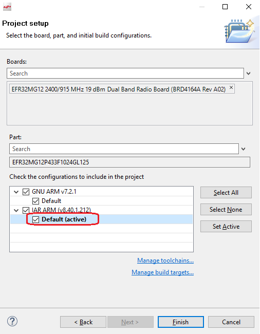
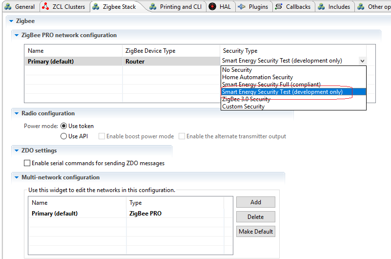
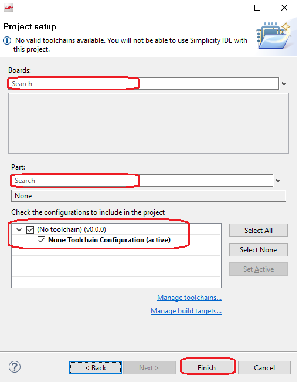
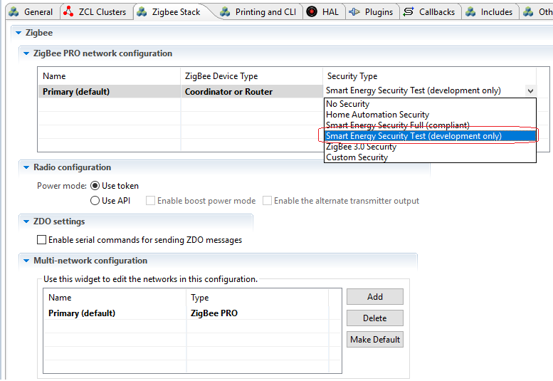
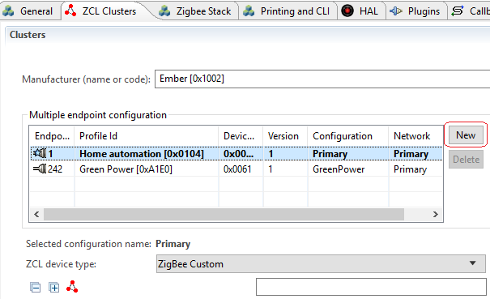
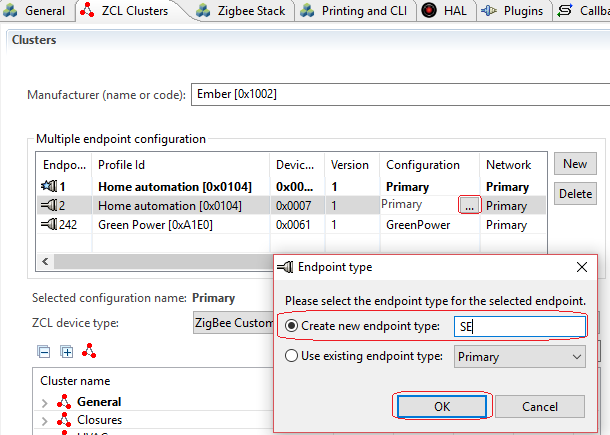
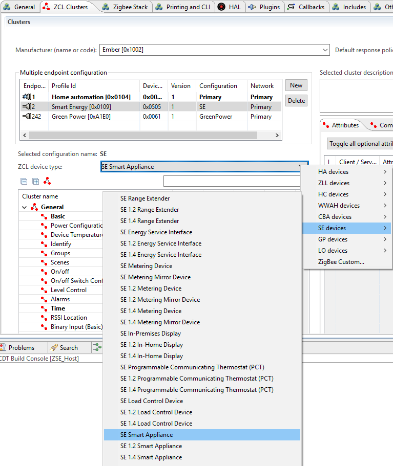

[English](Zigbee-Smart-Energy-Tutorial) | 中文

********

********

<details>
<summary><font size=5>Table of Contents</font> </summary>
&nbsp;  

- [1. 介绍](#1-介绍)
- [2. 先决条件](#2-先决条件)
  - [2.1. 安装 ECC 库文件](#21-安装-ecc-库文件)
  - [2.2. 申请 Smart Energy 证书](#22-申请-smart-energy-证书)
  - [2.3. IAR 编译器](#23-iar-编译器)
- [3. Smart Energy 工程](#3-smart-energy-工程)
  - [3.1. SoC 模式](#31-soc-模式)
  - [3.2. NCP 模式](#32-ncp-模式)
  - [3.3. Host 工程](#33-host-工程)
- [4. 运行和测试](#4-运行和测试)
  - [4.1. 烧录证书](#41-烧录证书)
  - [4.2. 烧录程序](#42-烧录程序)
  - [4.3. 检查证书状态](#43-检查证书状态)
  - [4.4. 建网并入网](#44-建网并入网)
  - [4.5. 建立 Link Key](#45-建立-link-key)
- [5. 参考资料](#5-参考资料)
</details>
&nbsp; 

## 1. 介绍
Zigbee 联盟的Smart Energy是一种安全的无线协议，旨在提高能源可用性和可靠性，使消费者能够更好地了解他们的能源消耗习惯。Zigbee 联盟的Smart Energy已成为当今市场上最重要的智能电网能源管理协议，在英国和美国安装了超过 1 亿台Smart Energy认证的电表和气表。

Zigbee 联盟的Smart Energy使公用事业和能源服务提供商能够轻松地在交付点部署住宅和商业传感器、控制装置和消费者控制设备，并将其连接到过去十年中部署的数百万台智能电表。此基础设施使能源供应商能够：
- 传达电力、燃气和水的动态定价
- 调度和控制恒温器的活动
- 管理负载控制继电器和楼宇自动化系统
- 为客户提供实时访问电力、燃气和水计量数据
- 以及更多

该应用将使用Link Key，这是ZigBee and ZigBee Pro协议栈中可选的， 但是在Smart Energy是必须的安全特性。在Smart Energy网络中所有设备之间的通信，在应用层都必须通过Link Key来加密。

Zigbee 使用公钥/私钥技术对加入Smart Energy网络的设备进行身份验证，并提供一种为之后的交互安全地建立加密密钥的方法。Smart Energy规范使用椭圆曲线加密 （ECC） 进行加密身份验证和密钥生成。Zigbee 使用 ECC 和`Key Establishment Cluster`来派生Link Key。它还使用 ECC 为Zigbee OTA 升级文件创建数字签名。

Certicom （www.certicom.com） 提供证书和 ECC 技术，用于 Zigbee Smart Energy 网络。Smart Energy 1.0 使用 ECC 163k1 和 48 字节证书。Smart Energy 1.2 引入了 ECC 283k1 的使用，并配有 74 字节证书。这些证书是独立且唯一的，不可互操作。但是，当两者都存在于同一设备上时，它们必须包含相同的 EUI64。设备可能安装了一组或两组安全数据。哪些设备必须同时具有证书或哪些设备只需要一个证书的规则受Smart Energy规范的约束。

在本教程中，我们将介绍如何使用 EmberZnet SDK 完成基于证书的密钥交换 （CBKE） 过程。
&nbsp; 

## 2. 先决条件
Zigbee Smart Energy网络具有更高的安全要求。APS 层安全性现在在Smart Energy规范中是强制性的，而在 Zigbee 3.0 规范中，它是可选的。Smart Energy规范使用椭圆曲线加密 （ECC） 进行加密身份验证和密钥生成。因此，每个Smart Energy设备必须支持椭圆曲线加密 （ECC） 算法，并且必须预先烧录证书。

要使用 EmberZnet SDK 开发 Zigbee Smart Energy应用，您必须安装Simplicity Studio，然后下载 EmberZnet SDK。这可以通过[Zigbee预习课程](Zigbee-Preparatory-Course-CN)中的步骤完成。此外，您需要在开始之前准备以下资源：
- ECC 程序库文件
- Smart Energy 证书
- IAR 编译器

### 2.1. 安装 ECC 库文件
ECC 库作为一个独立的程序包提供给 EmberZnet 的客户。它不是与 EmberZnet SDK 一起发布的。相反，您需要通过Silicon Labs公司的[用户支持系统](https://siliconlabs.force.com/s/contactsupport)申请。你只需要创建一个问题单来申请它。获得访问许可后，您将能够在主页的"软件发布"选项卡下看到 ECC 库文件的安装包。

一旦您得到这个安装包，请参阅[安装指南](https://www.silabs.com/community/wireless/zigbee-and-thread/knowledge-base.entry.html/2017/06/05/how_to_add_ecc_libra-IQL1)提取库文件。

如果您需要支持 OTA 升级，应将文件`image-builder-ecc-windows.exe`（Windows）或`image-builder-ecc-linux`（Linux）复制到 SDK 下的目录`protocol\zigbee\tool\image-builder`。
&nbsp; 

### 2.2. 申请 Smart Energy 证书
Smart Energy 1.0 采用 ECC 163k1 曲线，48 字节证书格式。所有需要认证的设备都需要支持此功能。

Smart Energy 1.2 引入了新的曲线 ECC 283k1 和 74 字节证书格式。Smart Energy 1.2 设备必须支持现有的 163k1 ECC 曲线，并且有可能需要同时支持新的 283k1 曲线。（ZigBee Smart Energy规范中阐明了哪些设备必须支持 238k1 ECC 曲线的要求。）

证书可以从[Certicom的官网](https://blackberry.certicom.com/en/products/managed-certificate-service/smart-energy-device-certificate-service)申请。有两种类型的证书：
- 测试证书：用于内部开发环境。
- 生产产品：用于真正的Smart Energy部署。  

二者不兼容。

每个证书都与特定的 EUI64 关联，并且必须在具有相同 EUI64 的设备上使用。在ECC库文件安装包中，Silicon Labs提供了两个测试证书：

- `certicom-test-cert-1.txt` -- 与 EUI64 `0022080000000001` 关联
- `certicom-test-cert-2.txt` -- 与 EUI64 `0022080000000002` 关联

在本教程中，我们将使用这两个测试证书。
&nbsp; 

### 2.3. IAR 编译器
目前，ECC 库文件是使用 IAR 编译的。因此，我们必须在所有Smart Energy应用中使用 IAR 来编译。
&nbsp; 

&nbsp; 

## 3. Smart Energy 工程
### 3.1. SoC 模式
1. 打开 Simplicity Studio 菜单`File` -> `New` -> `Project`，启动创建工程的向导；
2. 选择 `Silicon Labs AppBuilder Project`，然后点击`Next`；
3. 选择 `Silicon Labs Zigbee`， 然后点击`Next`；
4. 选择 `EmberZNet x.x.x GA SoC`， 请选择最新版本。(当前最新版本是EmberZNet 6.7.0 GA SoC)， 然后点击`Next`；
5. 在列表最下端，选择 `ZigbeeMinimal`， 然后点击`Next`；
6. 命名你的工程, 例如 `ZSEClient`， 然后点击`Next`；
7. 在接下来的窗口(`Project Setup`)中, 选择开发板型号, 并且设置编译器为`IAR ARM`，然后点击`Finish`；
  <div align="center">
    
  </div>
  </br>  

8. 至此，工程已经创建好。工程的配置文件（`.isc`）会自动打开；
9. 点击 `Zigbee Stack` 标签， 在选项 `Security Type` 这里选择 `Smart Energy Security Test (development only) `。  
  
    **注意: 对于正式发货的产品, 请选择 `Smart Energy Security Full(compliant)`。**  
  <div align="center">
    
  </div>
  </br>      

10. 点击 `ZCL clusters` 标签， 在 `ZCL device type` 这里， 设置 `ZCL device type` 为 `SE devices --> SE Metering Device`.
11. 点击 `Plugins` 标签， 选择如下plugin

    | Plugin | 说明 |  
    |:---- |:----|   
    |Key Establishment||
    |CBKE 163k Library||
    |CBKE 283k Library||
    |CBKE 283k1 DSA Verify Library||
    |CBKE Core Library||
    |ECC 163k1 Library|选择库文件<br>**ecc-library-efr32mg12p433f1024gl125.a**的绝对路径|
    |ECC 283k1 Library|选择库文件<br>**The absolute path of ecc-library-283k1-efr32mg12p433f1024gl125.a**的绝对路径|

12. 点击 `Printing and CLI` 标签，使能如下打印开关：  
    - Security
    - CBKE 163k1 Library
    - CBKE 283k1 Library
    - Key Establishment
    - ECC 163k1 Library
    - ECC 283k1 Library
    - CBKE Core Library
    - Key Establishment Cluster
13.  按`Ctrl+S`保存修改好的工程文件，然后点击`Generate`按钮来生成工程代码。 生成完毕的时候，会出现一个提示窗口`generating successfully`.
14.  开始编译.
&nbsp; 

### 3.2. NCP 模式
1. 打开 Simplicity Studio 菜单`File` -> `New` -> `Project`，启动创建工程的向导；
2. 选择 `Silicon Labs AppBuilder Project`，然后点击`Next`；
3. 选择 `Customizable network coprocessor (NCP) Applications`， 然后点击`Next`；
4. 选择 `NCP UART HW (Hardware Flow Control)`， 然后点击`Next`；
5. 命名你的工程, 例如 `zse_ncp`， 然后点击`Next`；
6. 在接下来的窗口(`Project Setup`)中, 选择开发板型号, 并且设置编译器未`IAR ARM`，然后点击`Finish`；
7. 至此，工程已经创建好。工程的配置文件（`.isc`）会自动打开；
9. 点击 `Plugins` 标签，选择如下的plugins:  

    | Plugin | Enable | Disable | Comments |  
    |:---- |:----|:----|:----|   
    |CBKE 163k Library|Yes|||
    |CBKE 163k Stub Library||Yes||
    |CBKE 283k Library|Yes|||
    |CBKE 283k Stub Library||Yes||
    |CBKE 283k1 DSA Verify Library|Yes|||
    |CBKE 283k1 DSA Verify Stub Library||Yes||
    |CBKE Core Library|Yes|||
    |CBKE Core Stub Library||Yes||
    |CBKE DSA Sign Library|Yes|||
    |CBKE DSA Sign Stub Library||Yes||
    |ECC 163k1 Library|Yes||选择库文件<br>**The absolute path of ecc-library-efr32mg12p433f1024gl125.a**的绝对路径|
    |ECC 283k1 Library|Yes||选择库文件<br>**The absolute path of ecc-library-283k1-efr32mg12p433f1024gl125.a**的绝对路径|
9. Save, generate and build.

### 3.3. Host 工程
1. 打开 Simplicity Studio 菜单`File` -> `New` -> `Project`，启动创建工程的向导；
2. 选择 `Silicon Labs AppBuilder Project`，然后点击`Next`；
3. 选择 `Silicon Labs Zigbee`， 然后点击`Next`；
4. 选择 `EmberZNet x.x.x GA SoC`， 请选择最新版本。(当前最新版本是EmberZNet 6.7.0 GA SoC)， 然后点击`Next`；
5. 选择 `Z3Gateway`， 然后点击`Next`；
6. 命名你的工程, 例如 `ZSE_Host`， 然后点击`Next`；
7. 在接下来的窗口(`Project Setup`)中, 选择开发板型号和芯片型号一栏清空，然后点击`Finish`；
  <div align="center">
    
  </div>
  </br>  

8. 点击 `Zigbee Stack` 标签， 在选项 `Security Type` 这里选择 `Smart Energy Security Test (development only) `。  

    **注意: 对于正式发货的产品, 请选择 `Smart Energy Security Full(compliant)`。**  
    <div align="center">
      
    </div>
    </br>    

9. 点击 `ZCL clusters` 标签，添加一个新的endpoint：
    <div align="center">
      
    </div>
    </br>  

    把新的endpoint的ID设置为2。选中新建的这个endpoint，修改配置，把类型描述修改为SE：  
    <div align="center">
      
    </div>
    </br>  

    保持这个endpoint处于选中状态，在下方的 `ZCL device type` 一栏，修改为 `SE devices  --> SE Smart Appliance` 。
    <div align="center">
      
    </div>
    </br>   

10.  点击 `Plugins` 标签，选择如下的plugins:  

  | Plugin | Comments |  
  |:---- |:----|   
  |Key Establishment||

11.  点击 “Printing and CLI” 标签, 使能如下调试打印：
     - Debug
     - Security
     - Key Establishment Cluster

12.  按`Ctrl+S`保存修改好的工程文件，然后点击`Generate`按钮来生成工程代码。 生成完毕的时候，会出现一个提示窗口`generating successfully`.
13.  开始编译.
&nbsp; 

## 4. 运行和测试
### 4.1. 烧录证书
在这里，我们需要用 `Simplicity Commander` 把证书烧录到设备中。

首先, 由于证书文件 certicom-test-cert-1.txt 是跟 EUI64 `0022080000000001` 关联的, 我们需要把这个Eui64也烧录到设备中。

**如果证书文件是跟你的设备的Eui64关联的，可以跳过这一步**  

编辑文件 `certicom-test-cert-1.txt`, 把如下内容加入到文件末尾 (这里的EUI64 必须是**大端序**):  
```
MFG_CUSTOM_EUI_64: 0100000000082200
```
然后保存文件，在DOS命令行窗口，运行如下命令把证书烧录到设备中 (**注意**：末尾的--serialno后的参数要修改为自己的开发板对应的序列号)：
```
commander.exe flash --tokengroup znet --tokenfile d:\certicom-test-cert-1.txt --serialno 440126081
```

然后，用同样的方法把证书"certicom-test-cert-2.txt"烧录到另一块开发板。

&nbsp; 

### 4.2. 烧录程序
参照 [烧录应用image](Introduction-of-EmberZnet-and-AppBuilder-CN##4261-烧录应用image) 这里的步骤，把SoC或者NCP的程序烧录到开发板中。

### 4.3. 检查证书状态
运行命令 `info` 来检查证书状态：

```
 MFG String:   
 AppBuilder MFG Code: 0x1002   
 node [(>)0022080000000001] chan [19] pwr [-3]   
 panID [0xCDEF] nodeID [0x0000] xpan [0x(>)F57F0B80C0D1DCDF]   
 ezsp ver 0x08 stack type 0x02 stack ver. [6.7.0 GA build 149]   
 nodeType [0x01]   
 Security level [05]   
 SE Security Info [ **Real163k1ECC Real163k1Cbke GoodCert** ]   
 SE Security 283k1 Info [ **Real283k1ECC Real283k1Cbke BadCert** ]   
 network state [02] Buffs: 243 / 255   
 Ep cnt: 2   
 ep 1 [endpoint enabled, device enabled] nwk [0] profile [0x0104] devId [0x0007] ver [0x01]   
     out(client) cluster: 0x0000 (Basic)   
     in (server) cluster: 0x0000 (Basic)   
     out(client) cluster: 0x0003 (Identify)   
     in (server) cluster: 0x0003 (Identify)   
     out(client) cluster: 0x0004 (Groups)   
     out(client) cluster: 0x0005 (Scenes)   
     out(client) cluster: 0x0006 (On/off)   
     in (server) cluster: 0x0006 (On/off)   
     out(client) cluster: 0x0008 (Level Control)   
     in (server) cluster: 0x0008 (Level Control)   
     in (server) cluster: 0x000A (Time)   
     in (server) cluster: 0x0019 (Over the Air Bootloading)   
     in (server) cluster: 0x001A (Power Profile)   
     out(client) cluster: 0x0020 (Poll Control)   
     out(client) cluster: 0x0300 (Color Control)   
     in (server) cluster: 0x0300 (Color Control)   
     out(client) cluster: 0x0400 (Illuminance Measurement)   
     out(client) cluster: 0x0402 (Temperature Measurement)   
     out(client) cluster: 0x0405 (Relative Humidity Measurement)   
     out(client) cluster: 0x0406 (Occupancy Sensing)   
     out(client) cluster: 0x0500 (IAS Zone)   
     out(client) cluster: 0x0702 (Simple Metering)   
     out(client) cluster: 0x0800 (Key Establishment)   
     in (server) cluster: 0x0800 (Key Establishment)   
     out(client) cluster: 0x0B01 (Meter Identification)   
     out(client) cluster: 0x0B03 (Appliance Statistics)   
     out(client) cluster: 0x0B04 (Electrical Measurement)   
     out(client) cluster: 0xFC01 (Configuration Cluster)   
     out(client) cluster: 0xFC02 (MFGLIB Cluster)   
 ep 242 [endpoint enabled, device enabled] nwk [0] profile [0xA1E0] devId [0x0061] ver [0x01]   
     out(client) cluster: 0x0021 (Green Power)   
 Nwk cnt: 1   
 nwk 0 [Primary (pro)]   
   nodeType [0x01]   
   securityProfile [0x03]   
```

### 4.4. 建网并入网
参照 [使用从install code派生的Link key在Light和Switch之间建立连接](Zigbee-Hands-on-Forming-and-Joining-CN#7使用从install-code派生的link-key在light和switch之间建立连接) 建网并入网.


### 4.5. 建立 Link Key
在ZSEClient上运行命令 `plugin key-establishment start 0 2` (这个命令的意思是在当前节点和节点0x0000的endpoint 2协商一个密钥) 并检查log。

```
Processing message: len=9 profile=0109 cluster=0800

T00000000:RX len 9, ep 01, clus 0x0800 (Key Establishment) FC 18 seq 07 cmd 01 payload[00 00 00 31 01 00 ]
Supported Suites 1
keyEstPartner.isInitiator emberAfPluginKeyEstablishmentReadAttributesCallback 0
Using cbke-163k1
Key Establish State Machine event:2
Current Suite 1
Processing message: len=55 profile=0109 cluster=0800

T00000000:RX len 55, ep 01, clus 0x0800 (Key Establishment) FC 09 seq 06 cmd 00 payload[01 00 0B 10 02 04 E6 48 1B A7 53 DE B0 BC 7C 2F 45 9D 13 80 1E 7F F3 20 D4 06 00 22 08 00 00 00 00 01 54 45 53 54 53 45 43 41 01 09 00 0F 00 00 00 00 00 00 ]
Key Establish State Machine event:3
Good Certificate Issuer
Checking key table for IEEE (>)0022080000000001
Responder Cert
02 04 E6 48 1B A7 53 DE
B0 BC 7C 2F 45 9D 13 80
1E 7F F3 20 D4 06 00 22
08 00 00 00 00 01 54 45
53 54 53 45 43 41 01 09
00 0F 00 00 00 00 00 00
Initiator: Key Establish Notify: Generate keys (2), keyEstPartner 0x0000
Crypto state: Operation in progress
GenerateCbkeKeysHandler() returned: 0x00
Crypto state: No operation
Key Establish State Machine event:4
Initiator: Key Establish Notify: Key generate done (4), keyEstPartner 0x0000
Processing message: len=25 profile=0109 cluster=0800

T00000000:RX len 25, ep 01, clus 0x0800 (Key Establishment) FC 09 seq 06 cmd 01 payload[03 05 8C C5 1B 5F 6E 3B 44 A9 B7 BC 45 2E 4B AD 6D 0E E3 9C 47 79 ]
Key Establish State Machine event:5
Responder public key
03 05 8C C5 1B 5F 6E 3B  44 A9 B7 BC 45 2E 4B AD
6D 0E E3 9C 47 79
Initiator: Key Establish Notify: Generate secret (3), keyEstPartner 0x0000
calculateSmacs()
Crypto state: Operation in progress
CalculateSmacsHandler() returned: 0x00
Crypto state: No operation
Initiator SMAC
50 96 29 8F 6C 3A 57 D2  28 96 07 C1 64 FC 84 67
Responder SMAC
C8 15 CD E6 52 1A D7 30  DF 26 30 E0 C9 C1 7C F3
Key Establish State Machine event:6
Initiator SMAC
50 96 29 8F 6C 3A 57 D2  28 96 07 C1 64 FC 84 67
Responder SMAC
C8 15 CD E6 52 1A D7 30  DF 26 30 E0 C9 C1 7C F3
Initiator: Key Establish Notify: Generate secret done (5), keyEstPartner 0x0000
Storing SMAC
C8 15 CD E6 52 1A D7 30  DF 26 30 E0 C9 C1 7C F3
Processing message: len=19 profile=0109 cluster=0800

T00000000:RX len 19, ep 01, clus 0x0800 (Key Establishment) FC 09 seq 06 cmd 02 payload[C8 15 CD E6 52 1A D7 30 DF 26 30 E0 C9 C1 7C F3 ]
Key Establish State Machine event:7
My local SMAC:
Calculated SMAC
C8 15 CD E6 52 1A D7 30  DF 26 30 E0 C9 C1 7C F3
Received SMAC
C8 15 CD E6 52 1A D7 30  DF 26 30 E0 C9 C1 7C F3
End Key Establishment Status: 0x06, Store Link Key Status: 0x00
Initiator: Key Establish Success: Link key verified (6), keyEstPartner 0x0000
T00000000:TX (resp) Ucast 0x00
TX buffer: [00 06 0B 02 00 ]
```

这里有一个抓包可以供参考 [sniffer](files/ZB-Zigbee-Smart-Energy-Tutorial/cbke.isd)，便于了解CBKE密钥协商的过程.
*************

## 5. 参考资料
- [AN708 Setting Manufacturing Certificates](https://www.silabs.com/documents/public/application-notes/an708-setting-manufacturing-certificates.pdf)
- [AN714 Smart Energy ECC Enabled Device Setup](https://www.silabs.com/documents/public/application-notes/AN714-Smart-EnergyECCEnabledDeviceSetupProcess.pdf)
- [KBA - How to add ECC Libraries to EmberZNet](https://www.silabs.com/community/wireless/zigbee-and-thread/knowledge-base.entry.html/2017/06/05/how_to_add_ecc_libra-IQL1)
- [UG162 Simplicity Commander Reference Guide](https://www.silabs.com/documents/public/user-guides/ug162-simplicity-commander-reference-guide.pdf)
*************
