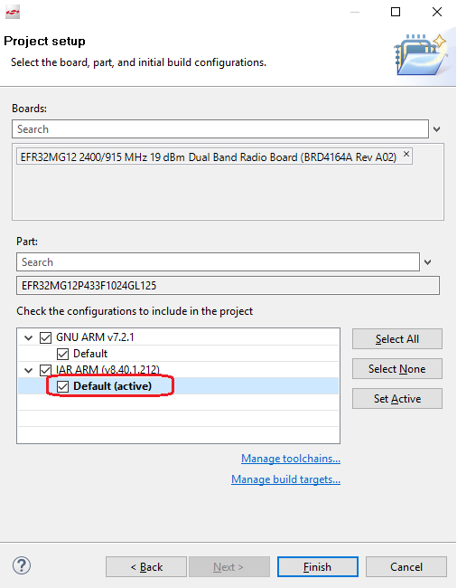
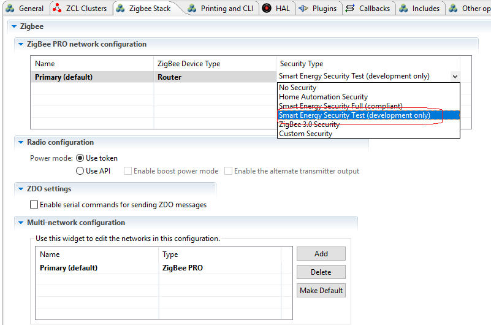
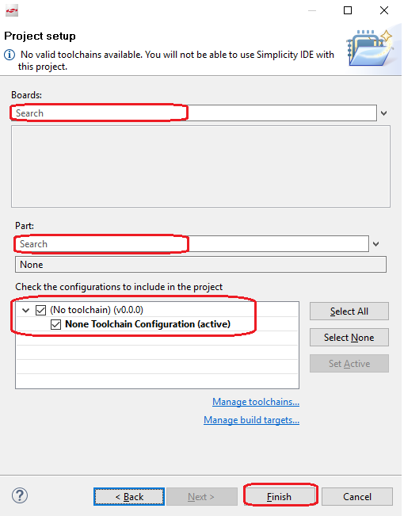
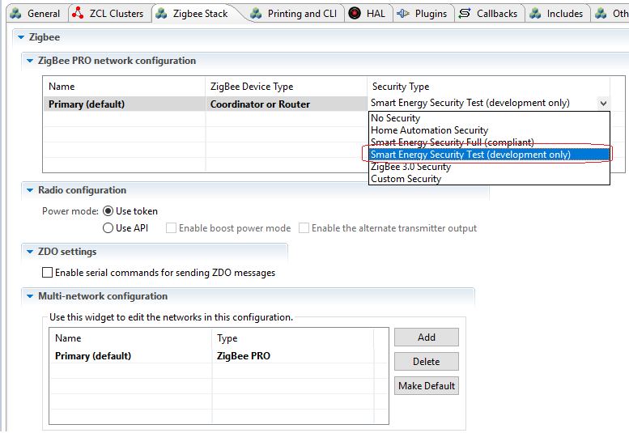
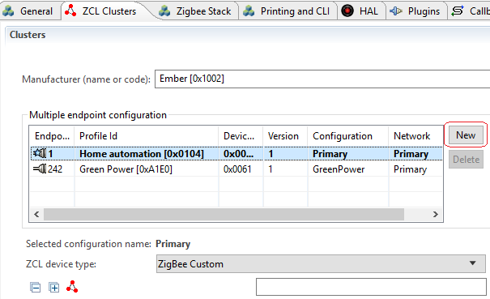
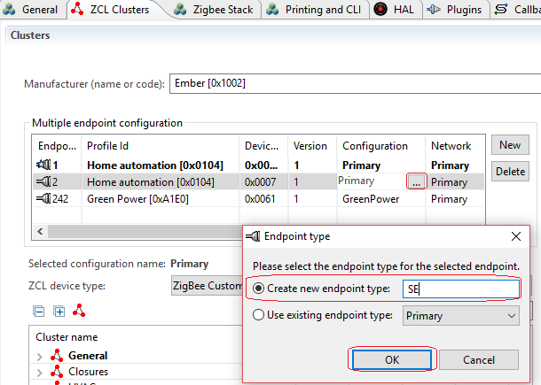
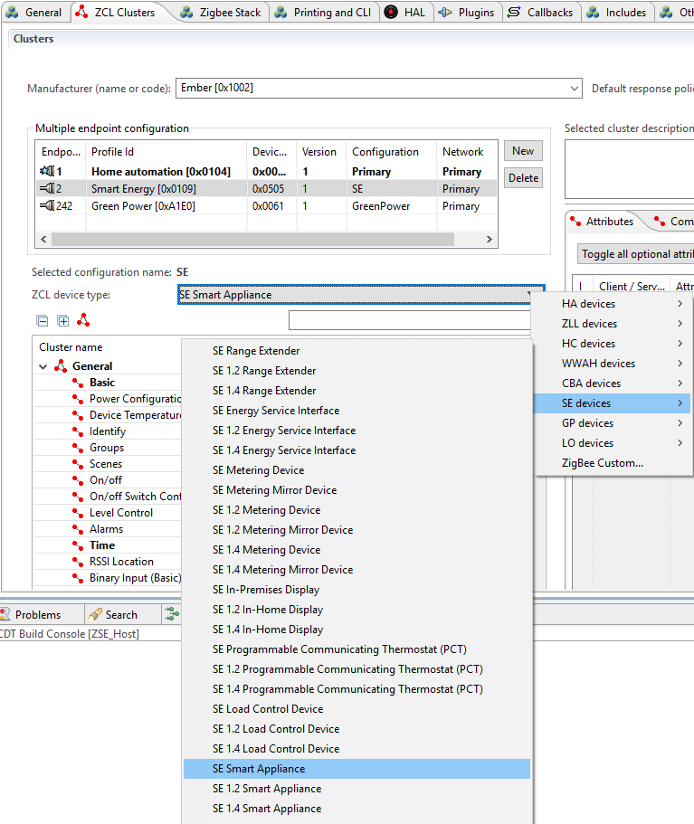

********

********
&nbsp;  

# Zigbee Smart Energy Tutorial

- [Zigbee Smart Energy Tutorial](#zigbee-smart-energy-tutorial)
  - [1. Prerequisites](#1-prerequisites)
    - [1.1. Install Side-package for ECC Library](#11-install-side-package-for-ecc-library)
    - [1.2. Apply for Smart Energy Certificates](#12-apply-for-smart-energy-certificates)
    - [1.3. IAR Toolchain](#13-iar-toolchain)
  - [2. Smart Energy Project](#2-smart-energy-project)
    - [2.1. SoC Mode](#21-soc-mode)
    - [2.2. NCP Mode](#22-ncp-mode)
    - [2.3. Host](#23-host)
  - [3. Run and Test](#3-run-and-test)
    - [3.1. Flash Certificates](#31-flash-certificates)
    - [3.2. Flash SoC image and NCP image](#32-flash-soc-image-and-ncp-image)
    - [3.3. Check Certificate State](#33-check-certificate-state)
    - [3.4. Form network and join](#34-form-network-and-join)
    - [3.5. Establish Link Key](#35-establish-link-key)
  - [4. Reference](#4-reference)

&nbsp; 

## 1. Prerequisites
Zigbee Smart Energy network has higher security requirements. The APS layer security is now mandatory in Smart Energy specification whereas it's just optional in Zigbee 3.0 specification. The Smart Energy specification uses Elliptical Curve Cryptography (ECC) for cryptographic authentication and key generation. Therefore, each Smart Energy device must support Elliptical Curve Cryptography (ECC) algorithm and must be programed with a certificate.

To develop a Zigbee Smart Energy application with EmberZnet SDK, you have to install Simplicity Studio and then download EmberZnet SDK. This can be done following the steps in [Zigbee-Preparatory-Course](Zigbee-Preparatory-Course). Besides, you need to prepare the following resources before you start:
- ECC Library
- Smart Energy Certificates
- IAR Toolchain

### 1.1. Install Side-package for ECC Library
The ECC libraries is provided as a side-package to customer of EmberZnet. It's not released together with EmberZnet SDK. Instead, you need to apply for it through Silicon Labs' [Support Portal](https://siliconlabs.force.com/s/contactsupport). You just need to create a ticket to ask for it. Once you are granted an access permit, you will be able to see the side-package under the "SOFTWARE RELEASES" tab of your home page.  

Once you get the package, please refer to the [guide](https://www.silabs.com/community/wireless/zigbee-and-thread/knowledge-base.entry.html/2017/06/05/how_to_add_ecc_libra-IQL1) to extract the package.  

If you need to support OTA, you should copy the file "image-builder-ecc-windows.exe"(Windows) or "image-builder-ecc-linux"(Linux) to directory "protocol\zigbee\tool\image-builder" under your SDK.
&nbsp; 

### 1.2. Apply for Smart Energy Certificates
Smart Energy 1.0 utilized an ECC 163k1 curve with a 48-byte certificate format. All certified devices are required to support this.   

Smart Energy 1.2 introduces a new curve ECC 283k1, and a 74-byte certificate format. Smart Energy 1.2 devices must support the existing 163k1 ECC curve and may also support the new 283k1 curve. (The requirements for what devices must support the 238k1 ECC curve is spelled out in the ZigBee Smart Energy specification.)  

Certificates can be applied from [Certicom](https://blackberry.certicom.com/en/products/managed-certificate-service/smart-energy-device-certificate-service). There are two kinds of certificates:
- Test Certificates : used in internal development environment. 
- Production Ceertificates : used in real Smart Energy deployments.  

They are not compatible.   

Each certificate is associated with a particular EUI64 and must be used on the device with the same EUI64. In the side-packages, Silicon Labs provides two test certificates:
- certicom-test-cert-1.txt -- associated with EUI64 **0022080000000001**  
- certicom-test-cert-2.txt -- associated with EUI64 **0022080000000002**  

In this tutorial, we are going to use these two test certificates.
&nbsp; 

### 1.3. IAR Toolchain
For the time being, the ECC libraries are built with IAR. Therefore, we have to use IAR in all Smart Energy applications.
&nbsp; 

&nbsp; 

## 2. Smart Energy Project
### 2.1. SoC Mode
1. Go to File -> New -> Project. This will bring up the New Project Wizard.
2. Select “Silicon Labs AppBuilder Project”. Click Next.
3. Select “Silicon Labs Zigbee”. Click Next.
4. Select our latest EmberZNet stack for SoC (in this case EmberZNet 6.7.0 GA SoC). Click Next.
5. On the bottom, select “ZigbeeMinimal”. Click Next.
6. Name your project, such as “ZSEClient”. Click Next.
7. In next window (Project Setup), select board, and compiler to “IAR ARM”. Click Finish.  

8. The new project should have been created now, with the project configuration file (an .isc file) open.
9. Click “Zigbee Stack” tab, select “Security Type” to “Smart Energy Security Test (development only)”. **Note: If you use production certificate, please select "Smart Energy Security Full(compliant)".**

10. Click “ZCL clusters” tab, in “ZCL device type” field, set “ZCL device type” to “SE devices --> SE Metering Device”.
11. Click “Plugins” tab, enable the following plugins:  

| Plugin | Comments |  
|:---- |:----|   
|Key Establishment||
|CBKE 163k Library||
|CBKE 283k Library||
|CBKE 283k1 DSA Verify Library||
|CBKE Core Library||
|ECC 163k1 Library|Select the library file: **C:\SiliconLabs\SimplicityStudio\v4\developer\sdks\gecko_sdk_suite\v2.7\protocol\zigbee\ECC\SoC-Libraries\ecc-library-efr32mg12p433f1024gl125.a**|
|ECC 283k1 Library|Select the library file: **C:\SiliconLabs\SimplicityStudio\v4\developer\sdks\gecko_sdk_suite\v2.7\protocol\zigbee\ECC\SoC-Libraries\ecc-library-283k1-efr32mg12p433f1024gl125.a**|

12. Click “Printing and CLI” tab, enable the debug print of the following items:  
- Security
- CBKE 163k1 Library
- CBKE 283k1 Library
- Key Establishment
- ECC 163k1 Library
- ECC 283k1 Library
- CBKE Core Library
- Key Establishment Cluster
13. Save the modified Project .ISC file and click “Generate”. Notice the project files appearing in Project Explorer. A window saying “generating successfully” will appear. Click OK.
14. Build.
&nbsp; 

### 2.2. NCP Mode
1. Go to File -> New -> Project. This will bring up the New Project Wizard.
2. Select “Silicon Labs AppBuilder Project”. Click Next.
3. Select “Customizable network coprocessor (NCP) Applications”. Click Next.
4. Select “NCP UART HW (Hardware Flow Control)”. Click Next.
5. Name your project, such as “zse_ncp”. Click Next.
6. In next window (Project Setup), select board, and compiler to “IAR ARM”. Click Finish.
7. The new project should have been created now, with the project configuration file (an .isc file) open.
8. Click “Plugins” tab, enable the following plugins:  

| Plugin | Enable | Disable | Comments |  
|:---- |:----|:----|:----|   
|CBKE 163k Library|Yes|||
|CBKE 163k Stub Library||Yes||
|CBKE 283k Library|Yes|||
|CBKE 283k Stub Library||Yes||
|CBKE 283k1 DSA Verify Library|Yes|||
|CBKE 283k1 DSA Verify Stub Library||Yes||
|CBKE Core Library|Yes|||
|CBKE Core Stub Library||Yes||
|CBKE DSA Sign Library|Yes|||
|CBKE DSA Sign Stub Library||Yes||
|ECC 163k1 Library|Yes||Select the library file: **C:\SiliconLabs\SimplicityStudio\v4\developer\sdks\gecko_sdk_suite\v2.7\protocol\zigbee\ECC\SoC-Libraries\ecc-library-efr32mg12p433f1024gl125.a**|
|ECC 283k1 Library|Yes||Select the library file: **C:\SiliconLabs\SimplicityStudio\v4\developer\sdks\gecko_sdk_suite\v2.7\protocol\zigbee\ECC\SoC-Libraries\ecc-library-283k1-efr32mg12p433f1024gl125.a**|
9. Save, generate and build.

### 2.3. Host
1. Go to File -> New -> Project. This will bring up the New Project Wizard.
2. Select “Silicon Labs AppBuilder Project”. Click Next.
3. Select “Silicon Labs Zigbee”. Click Next.
4. Select our latest EmberZNet stack for host (in this case EmberZNet 6.6.4 GA Host). Click Next.
5. Select “Z3Gateway”. Click Next.
6. Name your project, such as ZSE_Host. Click Next.
7. In next window (Project Setup), leave the “Boards” and “Parts” field empty, then finish.

8. Click “Zigbee Stack” tab, select “Security Type” to “Smart Energy Security Test (development only)”. **Note: If you use production certificate, please select "Smart Energy Security Full(compliant)".**

9. Click “ZCL clusters” tab, add a new endpoint.
  

The new endpoint ID should be 2. Select the new endpoint, and edit the configuration, change its type to SE.  

  

Keep the new endpoint selected, change the "ZCL device type" to "SE devices  --> SE Smart Appliance".  

  

10.  Click “Plugins” tab, enable the following plugins:  

| Plugin | Comments |  
|:---- |:----|   
|Key Establishment||
11.  Click “Printing and CLI” tab, enable the debug print of the following items:  
- Debug
- Security
- Key Establishment Cluster
12.  Save the modified Project .ISC file and click “Generate”. Notice the project files appearing in Project Explorer. A window saying “generating successfully” will appear. Click OK.
13.  Build.  
&nbsp; 

## 3. Run and Test
### 3.1. Flash Certificates
We will use Simplicity Commander flash the certificates into the devices.  

First, as the certificate certicom-test-cert-1.txt is associated with EUI64 **0022080000000001**, we have to flash this EUI64 into the device as well.   

**If the associated EUI64 matches your device, you can skip this step.**  

Edit file "certicom-test-cert-1.txt", add the following line into the end of the file (the EUI64 must be in big endian order):  
```
MFG_CUSTOM_EUI_64: 0100000000082200
```
After that, save this file, and run the following command to flash:
```
commander.exe flash --tokengroup znet --tokenfile d:\certicom-test-cert-1.txt --serialno 440126081
```

After that, flash the certificate file "certicom-test-cert-2.txt" with the same steps.  

&nbsp; 

### 3.2. Flash SoC image and NCP image
Flash the SoC image and NCP image according to the steps in [Flashing Image](Flashing-Image).

### 3.3. Check Certificate State
Run "**info**" command to check the certificate state.  

```
 MFG String:   
 AppBuilder MFG Code: 0x1002   
 node [(>)0022080000000001] chan [19] pwr [-3]   
 panID [0xCDEF] nodeID [0x0000] xpan [0x(>)F57F0B80C0D1DCDF]   
 ezsp ver 0x08 stack type 0x02 stack ver. [6.7.0 GA build 149]   
 nodeType [0x01]   
 Security level [05]   
 SE Security Info [ **Real163k1ECC Real163k1Cbke GoodCert** ]   
 SE Security 283k1 Info [ **Real283k1ECC Real283k1Cbke BadCert** ]   
 network state [02] Buffs: 243 / 255   
 Ep cnt: 2   
 ep 1 [endpoint enabled, device enabled] nwk [0] profile [0x0104] devId [0x0007] ver [0x01]   
     out(client) cluster: 0x0000 (Basic)   
     in (server) cluster: 0x0000 (Basic)   
     out(client) cluster: 0x0003 (Identify)   
     in (server) cluster: 0x0003 (Identify)   
     out(client) cluster: 0x0004 (Groups)   
     out(client) cluster: 0x0005 (Scenes)   
     out(client) cluster: 0x0006 (On/off)   
     in (server) cluster: 0x0006 (On/off)   
     out(client) cluster: 0x0008 (Level Control)   
     in (server) cluster: 0x0008 (Level Control)   
     in (server) cluster: 0x000A (Time)   
     in (server) cluster: 0x0019 (Over the Air Bootloading)   
     in (server) cluster: 0x001A (Power Profile)   
     out(client) cluster: 0x0020 (Poll Control)   
     out(client) cluster: 0x0300 (Color Control)   
     in (server) cluster: 0x0300 (Color Control)   
     out(client) cluster: 0x0400 (Illuminance Measurement)   
     out(client) cluster: 0x0402 (Temperature Measurement)   
     out(client) cluster: 0x0405 (Relative Humidity Measurement)   
     out(client) cluster: 0x0406 (Occupancy Sensing)   
     out(client) cluster: 0x0500 (IAS Zone)   
     out(client) cluster: 0x0702 (Simple Metering)   
     out(client) cluster: 0x0800 (Key Establishment)   
     in (server) cluster: 0x0800 (Key Establishment)   
     out(client) cluster: 0x0B01 (Meter Identification)   
     out(client) cluster: 0x0B03 (Appliance Statistics)   
     out(client) cluster: 0x0B04 (Electrical Measurement)   
     out(client) cluster: 0xFC01 (Configuration Cluster)   
     out(client) cluster: 0xFC02 (MFGLIB Cluster)   
 ep 242 [endpoint enabled, device enabled] nwk [0] profile [0xA1E0] devId [0x0061] ver [0x01]   
     out(client) cluster: 0x0021 (Green Power)   
 Nwk cnt: 1   
 nwk 0 [Primary (pro)]   
   nodeType [0x01]   
   securityProfile [0x03]   
```

### 3.4. Form network and join
Please refer to [Forming and Joining Hands-on Course](Zigbee-Hands-on-Forming-and-Joining#7-establish-connection-between-light-and-switch-with-an-installation-code-derived-link-key) to form network and join.


### 3.5. Establish Link Key
Run command "plugin key-establishment start 0 2" (This command means to establish link key between current node and node 0x0000 on endpoint 2) on ZSEClient and then check the log.  

```
Processing message: len=9 profile=0109 cluster=0800

T00000000:RX len 9, ep 01, clus 0x0800 (Key Establishment) FC 18 seq 07 cmd 01 payload[00 00 00 31 01 00 ]
Supported Suites 1
keyEstPartner.isInitiator emberAfPluginKeyEstablishmentReadAttributesCallback 0
Using cbke-163k1
Key Establish State Machine event:2
Current Suite 1
Processing message: len=55 profile=0109 cluster=0800

T00000000:RX len 55, ep 01, clus 0x0800 (Key Establishment) FC 09 seq 06 cmd 00 payload[01 00 0B 10 02 04 E6 48 1B A7 53 DE B0 BC 7C 2F 45 9D 13 80 1E 7F F3 20 D4 06 00 22 08 00 00 00 00 01 54 45 53 54 53 45 43 41 01 09 00 0F 00 00 00 00 00 00 ]
Key Establish State Machine event:3
Good Certificate Issuer
Checking key table for IEEE (>)0022080000000001
Responder Cert
02 04 E6 48 1B A7 53 DE
B0 BC 7C 2F 45 9D 13 80
1E 7F F3 20 D4 06 00 22
08 00 00 00 00 01 54 45
53 54 53 45 43 41 01 09
00 0F 00 00 00 00 00 00
Initiator: Key Establish Notify: Generate keys (2), keyEstPartner 0x0000
Crypto state: Operation in progress
GenerateCbkeKeysHandler() returned: 0x00
Crypto state: No operation
Key Establish State Machine event:4
Initiator: Key Establish Notify: Key generate done (4), keyEstPartner 0x0000
Processing message: len=25 profile=0109 cluster=0800

T00000000:RX len 25, ep 01, clus 0x0800 (Key Establishment) FC 09 seq 06 cmd 01 payload[03 05 8C C5 1B 5F 6E 3B 44 A9 B7 BC 45 2E 4B AD 6D 0E E3 9C 47 79 ]
Key Establish State Machine event:5
Responder public key
03 05 8C C5 1B 5F 6E 3B  44 A9 B7 BC 45 2E 4B AD
6D 0E E3 9C 47 79
Initiator: Key Establish Notify: Generate secret (3), keyEstPartner 0x0000
calculateSmacs()
Crypto state: Operation in progress
CalculateSmacsHandler() returned: 0x00
Crypto state: No operation
Initiator SMAC
50 96 29 8F 6C 3A 57 D2  28 96 07 C1 64 FC 84 67
Responder SMAC
C8 15 CD E6 52 1A D7 30  DF 26 30 E0 C9 C1 7C F3
Key Establish State Machine event:6
Initiator SMAC
50 96 29 8F 6C 3A 57 D2  28 96 07 C1 64 FC 84 67
Responder SMAC
C8 15 CD E6 52 1A D7 30  DF 26 30 E0 C9 C1 7C F3
Initiator: Key Establish Notify: Generate secret done (5), keyEstPartner 0x0000
Storing SMAC
C8 15 CD E6 52 1A D7 30  DF 26 30 E0 C9 C1 7C F3
Processing message: len=19 profile=0109 cluster=0800

T00000000:RX len 19, ep 01, clus 0x0800 (Key Establishment) FC 09 seq 06 cmd 02 payload[C8 15 CD E6 52 1A D7 30 DF 26 30 E0 C9 C1 7C F3 ]
Key Establish State Machine event:7
My local SMAC:
Calculated SMAC
C8 15 CD E6 52 1A D7 30  DF 26 30 E0 C9 C1 7C F3
Received SMAC
C8 15 CD E6 52 1A D7 30  DF 26 30 E0 C9 C1 7C F3
End Key Establishment Status: 0x06, Store Link Key Status: 0x00
Initiator: Key Establish Success: Link key verified (6), keyEstPartner 0x0000
T00000000:TX (resp) Ucast 0x00
TX buffer: [00 06 0B 02 00 ]
```

There is also a [sniffer](files/ZB-Zigbee-SmartEnergy-Tutorial/cbke.isd) about the CBKE procedure.
*************

## 4. Reference
- [AN708 Setting Manufacturing Certificates](https://www.silabs.com/documents/public/application-notes/an708-setting-manufacturing-certificates.pdf)
- [AN714 Smart Energy ECC Enabled Device Setup](https://www.silabs.com/documents/public/application-notes/AN714-SmartEnergyECCEnabledDeviceSetupProcess.pdf)
- [KBA - How to add ECC Libraries to EmberZNet](https://www.silabs.com/community/wireless/zigbee-and-thread/knowledge-base.entry.html/2017/06/05/how_to_add_ecc_libra-IQL1)
- [UG162 Simplicity Commander Reference Guide](https://www.silabs.com/documents/public/user-guides/ug162-simplicity-commander-reference-guide.pdf)
*************
